# 必须绘制它们——绘制口袋妖怪统计雷达图，灵感来自 Python 的每一代图形

> 原文：<https://levelup.gitconnected.com/gotta-plot-em-all-plotting-pokemon-stat-radar-charts-inspired-by-each-generation-graphic-800f6616d9cb>

使用 Python 绘制各代主题的雷达图

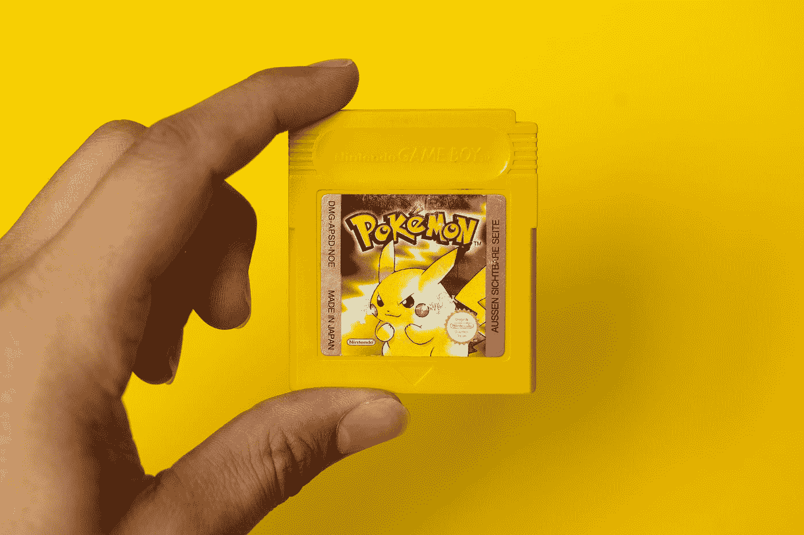

米卡·鲍梅斯特在 [Unsplash](https://unsplash.com?utm_source=medium&utm_medium=referral) 上的照片

口袋妖怪是我童年的一大部分。每次看到口袋妖怪，都会从动漫和电子游戏中带回美好的回忆。对于后者，当我玩游戏时，我花了一些时间在[统计屏幕](https://bulbapedia.bulbagarden.net/wiki/Stat#Gallery)上。它有助于检查状态和计划团队。

最近，我访问了 [Bulbapedia](https://bulbapedia.bulbagarden.net/wiki/Stat) 网站，注意到一些游戏版本应用了[雷达图](https://en.wikipedia.org/wiki/Radar_chart)来显示口袋妖怪的统计数据。通过快速研究，第六代[口袋妖怪 X/Y](https://bulbapedia.bulbagarden.net/wiki/Pok%C3%A9mon_X_and_Y) 是第一个显示图表的版本。在此之前，没有官方的雷达图。

这让我想知道，如果上一代人可以有雷达图，他们会是什么？能不能以每一代为主题制作一个雷达图？

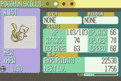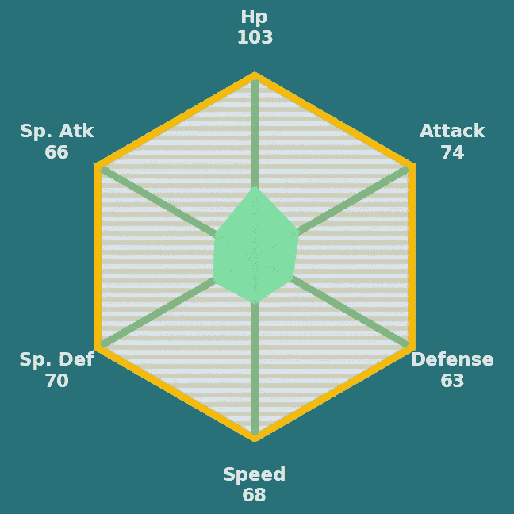

第一张图片是来自 [Bulbapedia](https://bulbapedia.bulbagarden.net/wiki/Stat) 的参考。第二个图像是一个雷达图的例子，显示了第三代主题的基础统计，而不是官方的雷达图。图片作者。

如上图所示，本文将展示一些绘制雷达图的思路，灵感来自每一代的颜色和图形。这里提出的想法不仅仅限于绘制口袋妖怪的统计数据，还可以应用于其他分类数据集。

让我们开始吧。

## **概念**

> 本文的雷达图概念由 3 层组成:设置背景和文本、绘制六边形和绘制数据。

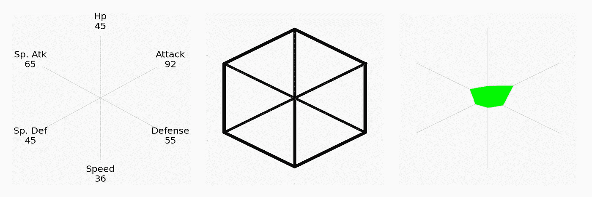

这个概念由 3 层组成:设置背景和文本，绘制六边形，绘制数据。图片由作者提供。

## 准备数据

快速研究[口袋妖怪的 stat](https://pokemondb.net/pokedex/all) ，每个 stat 变量的最大值都在 260 以下。因此，我们可以用这个数字作为图表的范围。从导入库开始。

```
import numpy as np
import pandas as pd
import matplotlib.pyplot as plt
import matplotlib as mpl
import seaborn as sns
import math
import cv2%matplotlib inline
```

设置变量并计算它们在雷达图上的位置。

```
categories = ['Attack', 'Hp', 'Sp. Atk',
              'Sp. Def', 'Speed', 'Defense']
bg = [260, 260, 260, 260, 260, 260, 260]
N = len(categories)
pi = math.pi
angles = [((n+0.5)/N)*(2*pi) for n in range(N)]
angles += angles[:1]
```

# 数据可视化

## **第一代人**

口袋妖怪红色、蓝色和黄色的第一代图形非常简单。带有统计信息的普通雷达图适用于第一代主题。例如，本文将使用手工创建的模型数据。如果你想使用你最喜欢的口袋妖怪的属性，请随意修改下面的代码。

```
#['Attack', 'Hp', 'Sp. Atk', 'Sp. Def', 'Speed', 'Defense','Attack']
val = [92, 45, 65, 45, 36, 55, 92]
text = [i+'\n'+str(int(j)) for i,j in zip(categories, val)]
```

现在一切都准备好了，让我们使用 [Matplotlib](https://matplotlib.org/) ，一个有用的 Python 数据可视化库。请注意，结果将保存到您的计算机上，以便在下一步中导入。

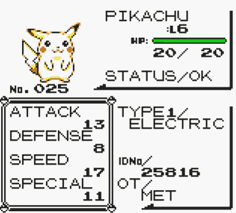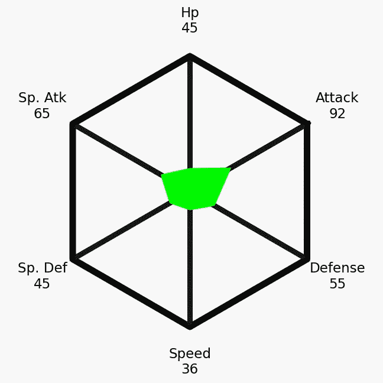

第一张图片是来自[口袋妖怪社区](https://www.pokecommunity.com/showthread.php?t=357260)的引用。第二个图像是一个雷达图，显示了第一代主题的基础统计，而不是官方的雷达图。图片作者。

第一代是在 [Game Boy](https://en.wikipedia.org/wiki/Game_Boy) 时代，有[像素](https://en.wikipedia.org/wiki/Pixel_art)图形。为了获得外观，我们可以通过使用 [OpenCV](https://pypi.org/project/opencv-python/) 库调整雷达图的大小来修改它。

```
name = 'radar_gen1.png'
img = cv2.imread(name)
dim = (240, 240)
resized = cv2.resize(img, dim, interpolation=cv2.INTER_LINEAR)
output = cv2.resize(resized, dim, interpolation=cv2.INTER_NEAREST)
cv2.imwrite('pixel_'+name, output)
```

哒哒…

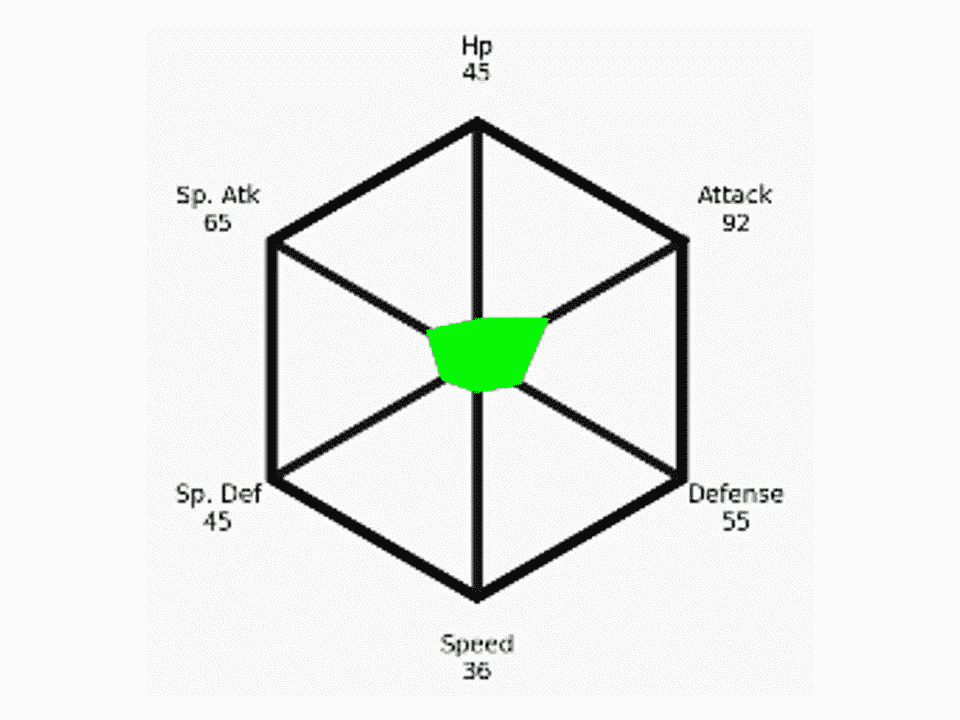

调整大小后的结果。不是官方雷达图。图片作者。

## 第二代

这一代主要的电子游戏是[口袋妖怪金银](https://bulbapedia.bulbagarden.net/wiki/Pok%C3%A9mon_Gold_and_Silver_Versions)。根据 stat 屏幕，如下图所示，可以注意到屏幕的下半部分填充了充满活力的蓝色。我们可以在六边形区域用鲜艳的颜色做一个雷达图。

从设置值和文本开始。

```
#['Attack', 'Hp', 'Sp. Atk', 'Sp. Def', 'Speed', 'Defense','Attack']
val = [176, 105, 143, 195, 126, 120, 176]
text = [i+'\n'+str(int(j)) for i,j in zip(categories, val)]
```

绘制雷达图，并用鲜艳的蓝色填充六边形区域。

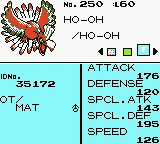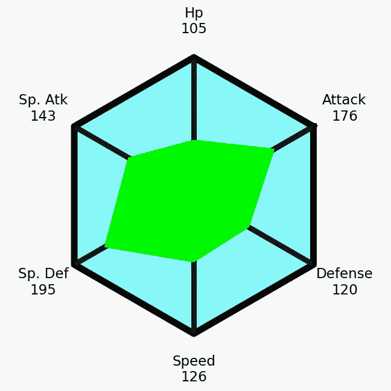

第一张图片是来自 [Bulbapedia](https://bulbapedia.bulbagarden.net/wiki/Stat) 的引用。第二张图片是显示第二代主题的基础统计的雷达图，而不是官方的雷达图。图片作者。

调整结果大小以获得复古视频游戏的外观

```
name = 'radar_gen2.png'
img = cv2.imread(name)
dim = (240, 240)
resized = cv2.resize(img, dim, interpolation=cv2.INTER_LINEAR)
output = cv2.resize(resized, dim, interpolation=cv2.INTER_NEAREST)
cv2.imwrite('pixel_'+name, output)
```

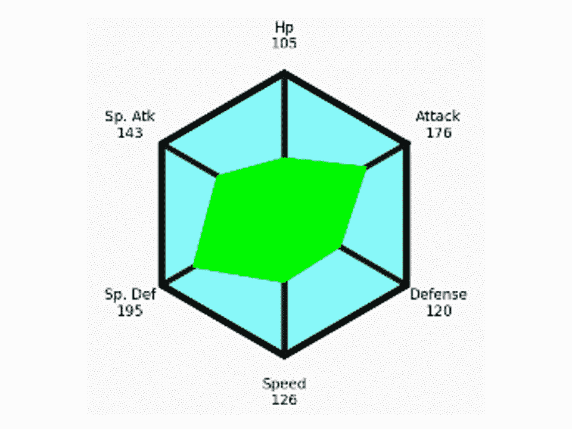

调整大小后的结果。不是官方雷达图。图片作者。

## 第三代

这一代的主要电子游戏是 [Game Boy Advance](https://bulbapedia.bulbagarden.net/wiki/Game_Boy_Advance) 上的[口袋妖怪红宝石和蓝宝石](https://bulbapedia.bulbagarden.net/wiki/Pok%C3%A9mon_Ruby_and_Sapphire_Versions)，可以显示比上一代更好的图形。可以注意到，如下图所示的 stat 屏幕更加丰富多彩，包含了更多细节。

```
#['Attack', 'Hp', 'Sp. Atk', 'Sp. Def', 'Speed', 'Defense','Attack']
val = [74, 103, 66, 70, 68, 63, 74]
text = [i+'\n'+str(int(j)) for i,j in zip(categories, val)]
```

对于绘图，更多的颜色和细节应该添加到雷达图。可以在背景中添加[阴影样式](https://matplotlib.org/stable/gallery/shapes_and_collections/hatch_style_reference.html)来展示细节。


第一张图片是来自 [Bulbapedia](https://bulbapedia.bulbagarden.net/wiki/Stat) 的引用。第二张图片是显示第三代主题的基础统计的雷达图，而不是官方的雷达图。图片作者。

像第一代和第二代一样，我们将调整结果的大小，以获得复古视频游戏的外观。

```
name = 'radar_gen3.png'
img = cv2.imread(name)
dim = (260, 240)
resized = cv2.resize(img, dim, interpolation=cv2.INTER_LINEAR)
output = cv2.resize(resized, dim, interpolation=cv2.INTER_NEAREST)
cv2.imwrite('pixel_'+name, output)
```

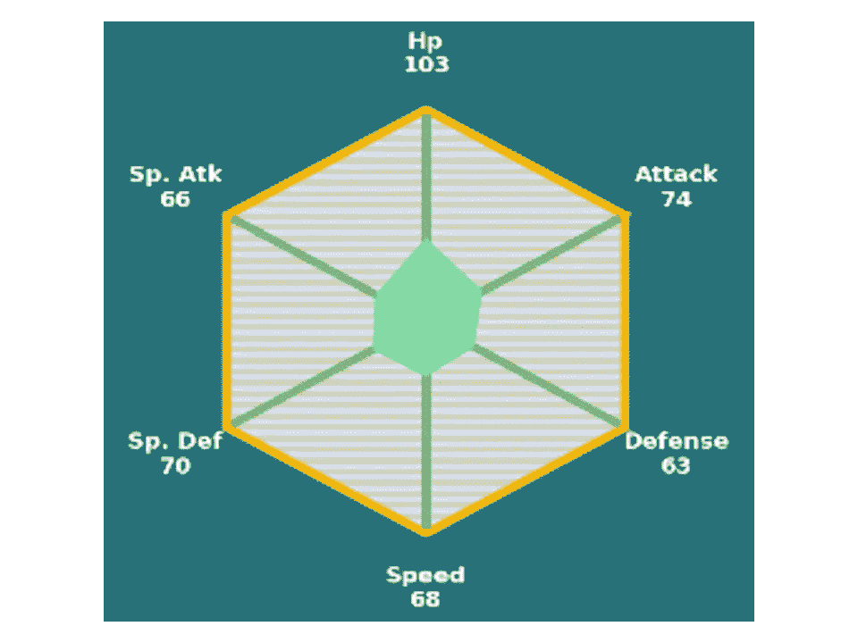

调整大小后的结果。不是官方雷达图。图片作者。

## 第四代

这一代的主要电子游戏是[任天堂 DS](https://bulbapedia.bulbagarden.net/wiki/Nintendo_DS) 上的[精灵宝可梦钻石和珍珠](https://bulbapedia.bulbagarden.net/wiki/Pok%C3%A9mon_Diamond_and_Pearl_Versions)。总的来说，统计屏幕与第三代具有相同的外观。这一代对我来说很特别，因为波加曼是我最喜欢的口袋妖怪。

```
#['Attack', 'Hp', 'Sp. Atk', 'Sp. Def', 'Speed', 'Defense','Attack']
val = [92, 45, 65, 45, 36, 55, 92]
text = [i+'\n'+str(int(j)) for i,j in zip(categories, val)]
```

我们可以应用与上一代相同的过程，改变颜色以适应第四代的主题，然后调整大小以获得具有许多像素的外观。

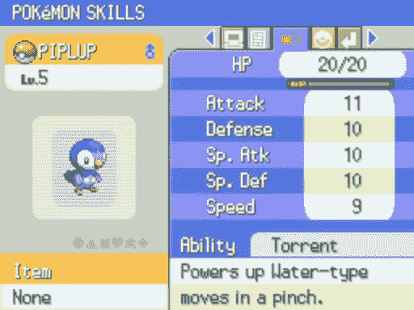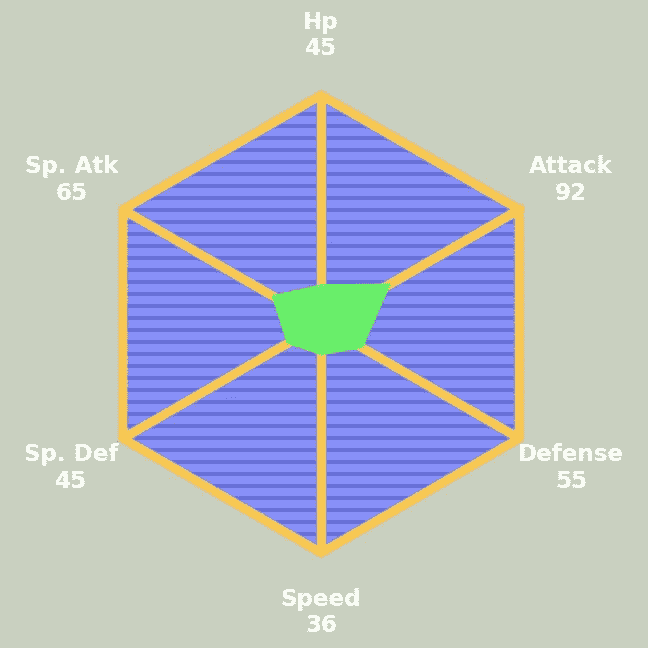

第一张图片是来自 [Bulbapedia](https://bulbapedia.bulbagarden.net/wiki/Stat) 的引用。第二个图像是一个雷达图，显示了第四代主题的基础统计，而不是官方的雷达图。图片作者。

```
name = 'radar_gen4.png'
img = cv2.imread(name)
dim = (260, 240)
resized = cv2.resize(img, dim, interpolation=cv2.INTER_LINEAR)
output = cv2.resize(resized, dim, interpolation=cv2.INTER_NEAREST)
cv2.imwrite('pixel_'+name, output)
```

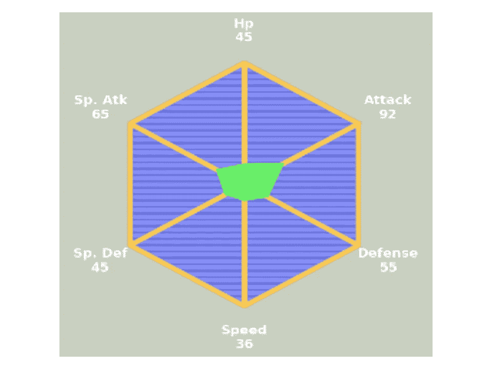

调整大小后的结果。不是官方雷达图。图片作者。

## 第五代

这一代人的主要视频游戏是[任天堂 DS](https://bulbapedia.bulbagarden.net/wiki/Nintendo_DS) 上的[神奇宝贝黑白](https://bulbapedia.bulbagarden.net/wiki/Pok%C3%A9mon_Black_and_White_Versions)。stat 屏幕的主要颜色与系列名称一致，即黑色、白色和灰色。而且在下图中可以注意到，它还包含了一条绿色的条纹。

```
#['Attack', 'Hp', 'Sp. Atk', 'Sp. Def', 'Speed', 'Defense','Attack']
val = [92, 45, 65, 45, 36, 55, 92]
text = [i+'\n'+str(int(j)) for i,j in zip(categories, val)]
```

接下来，我们将应用第五代主题，并调整雷达图的大小，使其具有许多像素。

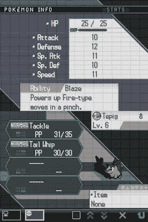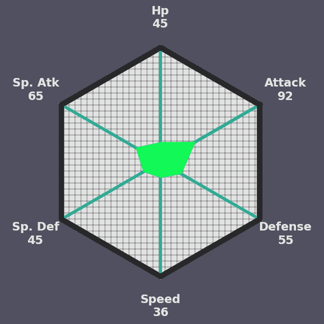

第一张图片来自 [Bulbapedia](https://bulbapedia.bulbagarden.net/wiki/Stat) 。第二个图像是一个雷达图，显示了第五代主题的基础统计，而不是官方的雷达图。图片作者。

```
name = 'radar_gen5.png'
img = cv2.imread(name)
dim = (260, 240)
resized = cv2.resize(img, dim, interpolation=cv2.INTER_LINEAR)
output = cv2.resize(resized, dim, interpolation=cv2.INTER_NEAREST)
cv2.imwrite('pixel_'+name, output)
```

瞧…

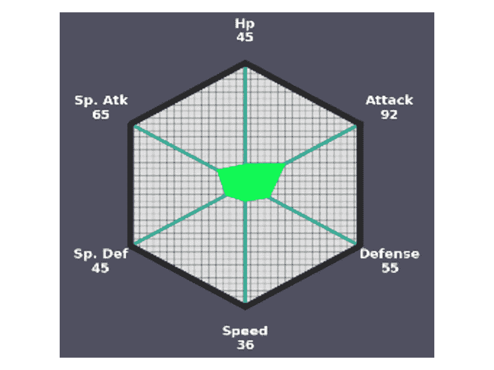

调整大小后的结果。不是官方雷达图。图片作者。

仅供参考，一些口袋妖怪数据集可在 [Kaggle](https://www.kaggle.com/datasets) 上获得。您可以使用 CSV 文件获取数据，然后按照本文中的过程绘制雷达图。最后，你可以使用 [Python For Loops](https://www.w3schools.com/python/python_for_loops.asp) 来显示每个口袋妖怪的统计数据。

## 放弃

本文中的结果不是官方图表。所有媒体都用作参考。神奇宝贝和所有相应的名称是任天堂公司的版权和商标。

## 关键要点

Python 上的 Matplotlib 是一个灵活而有用的数据可视化库。它是免费的，每个人都可以使用。这篇文章可以被认为是如何制作雷达图的教程。这里显示的图表更像是粉丝为口袋妖怪一代 I-V 游戏制作的雷达图。如果结果不令人满意，可以随意修改上面的代码。

第六代之后有官方的雷达图，所以我没有在这里展示如何制作。

最后，当我写这篇文章时，2022 年 11 月，[口袋妖怪猩红与紫罗兰](https://bulbapedia.bulbagarden.net/wiki/Pok%C3%A9mon_Scarlet_and_Violet)，第九代，正在发行的路上。作为一个口袋妖怪粉丝，我很兴奋看到新的口袋妖怪和故事。作为一个数据可视化爱好者，我很高兴看到新的雷达图设计，我希望他们会在视频游戏中引入其他数据可视化。

感谢阅读

这些是我的数据可视化文章，您可能会感兴趣:

*   处理超长时间序列数据的 6 个可视化技巧([链接](https://towardsdatascience.com/6-visualization-tricks-to-handle-ultra-long-time-series-data-57dad97e0fc2))
*   8 用 Python 处理多个时序数据的可视化([链接](https://towardsdatascience.com/8-visualizations-with-python-to-handle-multiple-time-series-data-19b5b2e66dd0))
*   9 用 Python 可视化显示比例，而不是饼状图([链接](https://medium.com/p/4e8d81617451/))
*   用 Python 实现的 9 个可视化比条形图更引人注目([链接](https://towardsdatascience.com/9-visualizations-that-catch-more-attention-than-a-bar-chart-72d3aeb2e091)

## 参考

*   *统计*。Stat — Bulbapedia，社区驱动的神奇宝贝百科全书。(未注明)。检索于 2022 年 11 月 5 日，来自[https://bulbapedia.bulbagarden.net/wiki/Stat](https://bulbapedia.bulbagarden.net/wiki/Stat)