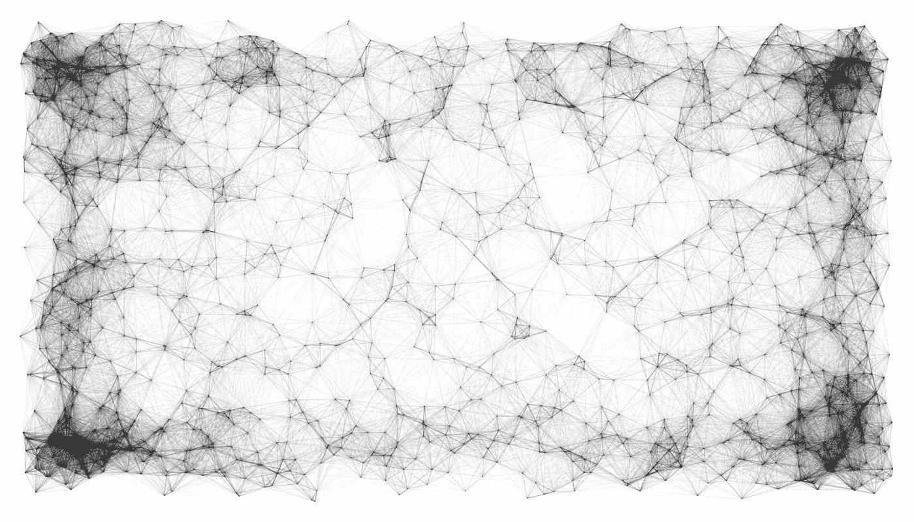

# GPT-3 强有力的新开端

> 原文：<https://levelup.gitconnected.com/gpt-3-a-powerful-new-beginning-d809d21586>

## 一个文本生成神经网络，具有迄今为止最大的训练模型



李萨如神经网络，作者图片

OpenAI 的 GPT-3 是一个强大的文本生成神经网络，在迄今为止最大的文本语料库上进行了预训练，能够基于其输入做出不可思议的预测文本响应，是目前为止最强大的语言模型。

GPT 是“再生”、“再培训”、“再培训”、“再培训”、“再培训”、“再培训”的缩写。OpenAI 于 2019 年 2 月宣布的 GPT-2 在 [WebText](https://skylion007.github.io/OpenWebTextCorpus/) 数据集上进行训练，该数据集包含从 Reddit 提交的内容中提取的超过 800 万个文档或 38GB 的文本数据。2019 年 11 月，GPT-2 的最终版本发布，包含 15 亿个参数的预训练。

客观地说，GPT-3 已经在 1750 亿个参数和不到 1 万亿个单词上进行了训练，使其具有 15 亿个参数的前任 GPT-2 看起来只有百分之一大小。请注意，GPT-2 在不到一年前的 2019 年 11 月正式发布。下一个最大的模型是谷歌的 T5 T9，它只有 110 亿个参数。

# 它擅长什么？

GPT-3 预测文本和语言的能力是不可思议的。它能够编写功能性的[代码](https://gpt-tailwind.com/)，能够以人类声音对话做出响应，生成[图像](https://openai.com/blog/image-gpt/)，撰写文章、虚构故事、书籍，甚至是写电子邮件这样的平凡任务。

预测并不总是完美的，因为一个 GPT-3 实际上并不理解这些话的意思。阅读— **任何限制？**

# 简单地说

最简单的，GPT-3 采用输入文本的短语，并预测下一个文本输出应该是什么。这种类型的机器学习不会“思考”，它会根据之前训练的数据和运行时翻译器来处理文本输入。

预训练在大规模数据集上进行，包括公共互联网、图书语料库和维基百科。通过大量增加训练样本，它提高了反应的质量和表现。由于体积如此之大，GPT-3 的训练成本估计高达 500 万美元，这给未来 GPT-3 的下一个版本带来了成本可伸缩性的问题。

用于训练 GPT-3 的主要训练数据集之一来自 [CommonCrawl](https://commoncrawl.org/) [，](https://commoncrawl.org/,)，这是一个免费可用的公共数据集，由包含近万亿个单词的公共网络的抓取组成。CommonCrawl 在训练中占了 60%的权重，输入了超过 4000 亿个令牌。

## 数据集细分和训练分布

```
dataset       tokens        weight in training
-----------   -----------   ------------------
CommonCrawl   410 billion   60% 
WebText2      19 billion    22%
Books1        12 billion    8%
Books2        55 billion    8%
Wikipedia     3 billion     3%
```

# 为什么数据集越大越好？

> 最近的工作表明，通过对大量文本进行预训练，然后对特定任务进行微调，在许多 NLP 任务和基准上取得了实质性的进展。虽然这种方法在体系结构上通常是任务不可知的，但它仍然需要特定于任务的数千或数万个示例的微调数据集。**相比之下，人类通常可以通过几个例子或简单的指令来完成一项新的语言任务——这是当前的自然语言处理系统仍然很难做到的。在这里，我们表明，扩大语言模型大大提高了任务无关的，少数镜头的性能，有时甚至达到了与现有的最先进的微调方法的竞争力。**具体来说，我们训练 GPT-3，这是一个具有 1750 亿个参数的自回归语言模型，比任何先前的非稀疏语言模型多 10 倍，并在少数镜头设置中测试其性能。

来源 [arvix 2005.14165v4](https://arxiv.org/pdf/2005.14165.pdf) 。

# 有什么限制吗？

是的，GPT 3 号的[创造者](https://arxiv.org/pdf/2005.14165.pdf)认识到了局限性。在文本合成领域:

> 在文本合成方面，虽然总体质量较高，但 GPT-3 样本有时仍会在文档级别重复语义，在足够长的段落中开始失去连贯性，自相矛盾，偶尔包含不符合逻辑的句子或段落。

相比之下，人类能够保持一种持久的精神观点，而 GPT-3 可能会在较长的段落中失去焦点并“忘记”。

在离散的语言任务中，如“常识物理学”:

> 在离散语言任务领域，我们非正式地注意到，GPT-3 似乎在“常识物理学”方面有特殊困难，尽管在测试该领域的一些数据集(如 PIQA [BZB+19])上表现良好。**具体来说，GPT-3 对“如果我把奶酪放进冰箱，它会融化吗？”这类问题有困难。**

从这篇文章中不清楚“常识物理学”是否可以在未来通过物理数据集的训练来减轻。

对于大多数深度学习系统中的偏见，这是一个普遍而重要的问题:

> 最后，GPT-3 具有大多数深度学习系统共有的一些限制——它的决定不容易解释，它对新输入的预测不一定校准良好，这可以通过在标准基准上比人类高得多的表现方差来观察，并且它保留了它已经训练过的数据的偏差。

# 结论

GPT-3 是一个重大的飞跃，但更多的是在规模上，因为它与 GPT-2 有许多相同的架构。它真正要做的，是测试语言模型的缩放假设，以大幅提高性能。

一些更有前景的领域是作为增强创造力工具的 GPT 3，一般写作，代码生成，或代码合作试点。这不是将接管世界的人工智能，但应该作为一个重要时刻被记住。