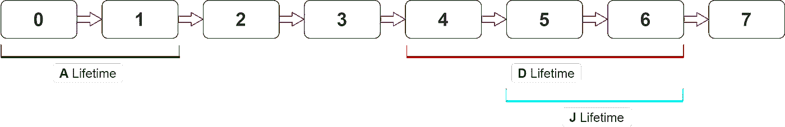
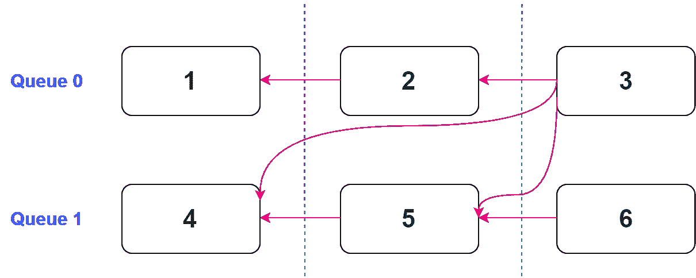

# GPU 内存别名

> 原文：<https://levelup.gitconnected.com/gpu-memory-aliasing-45933681a15e>

DirectX 12 或 Vulkan 等现代图形 API 能够将分配的 GPU 资源放入手动创建的堆中用户定义的内存位置。它允许我们创建纹理和缓冲区，它们的内存部分甚至完全重叠。

## 那什么时候有用？

渲染引擎通常被称为管道是有原因的。它们通常被组织为具有多个渲染工作阶段的传送带，其中每个阶段都消耗和产生 GPU 资源。

以一个游戏引擎中的典型帧为例:栅格化一些几何图形，执行着色，可能计算一些体积，然后运行一系列后处理阶段。这里的每个阶段将通过写入纹理和/或缓冲区来产生其输出，这些输出将由帧中稍后的某个其他阶段读取。

这里的观察是，某个阶段产生的资源可能只被少数其他阶段使用。后期处理渲染过程是一个很好的例子:bloom 过程可以产生其输出，该输出仅由下一阶段使用，即色调映射，而不需要在帧中的任何其他地方使用。我们可以看到，一个资源可以有一个很短的有效寿命，但最有可能是事先分配的，并在整个帧中占用其内存。一个大的管道可以有许多生产的资源，这些资源将全部位于它们永久占用的内存区域中，并消耗大量的 VRAM。除非我们做点什么。

起初，我们可能会认为，如果资源在短时间内被使用，我们可能会在第一次使用时当场分配它，并在不需要时取消分配，而不是预先分配，以减少整体 VRAM 消耗。当然，这有助于节省内存，但是频繁的内存重新分配带来的性能损失将超过任何潜在的好处，所以这不是一个可行的解决方案。

解决这个问题的一个常见方法是使用具有兼容属性的资源池:在需要时取出一个未使用的资源，并在工作完成后将其放回，以供其他人使用，并通过这样做跳过分配。这适用于后期处理阶段，例如，因为它们通常被实现为全屏渲染过程，所有这些过程都读写具有相同属性的纹理。我们基本上只能为整个后处理流水线分配两个纹理。本质上，这是一种高级内存混淆。但是高级别名不是很灵活，它可能很适合后处理，但是在引擎的其他部分不太有用，因为我们必须考虑不能放在同一个池中的各种不兼容的资源，这使得内存重用没有它应有的效率。

这就是通过图形 API 本身实现的低级别名开始有意义的地方。当我们使用 API 来别名内存时，我们不再关心资源类型，而只关心它们的大小和内存地址。我们仍然可以预先分配一次资源，以避免性能受到影响，但是我们也可以将它们打包到内存中，这比在池示例中更有效，方法是将在不相交的时间段中使用的资源放置在同一内存区域中的彼此“顶部”,而不管资源类型如何，因为在低级别上，它们只是 VRAM 中的一串字节。

## 算法

所以我们认为别名是有用的，但是我们如何实现它来有效地压缩内存呢？

让我们不要一开始就给自己增加太多负担，考虑一个连续执行工作的渲染管道，不要考虑异步工作执行或类似的事情。

随机举一个串行执行的渲染过程的例子，它读取各种大小的资源。

任意渲染管道

我们需要做的第一件事是确定每个资源的有效生存期(EL ),因为只有当它们在时间上不相交时，我们才能给它们起别名，否则我们会遇到内存崩溃。由于渲染过程是连续执行的，我们可以为每个渲染过程分配一个执行索引，并使用这些索引来构建生命周期。

对于每个资源，我们取第一次使用资源的渲染过程的索引，并将其视为 EL 范围的开始，最后一次使用资源的索引成为该范围的结束。

这是我们给每个资源分配一个 EL 后得到的结果:

资源有效寿命

现在回到记忆包装。我们想要尽可能少的内存占用，但是我们能做到多低呢？如果我们看一下示例资源，我们会看到最大的一个是大小为 15 MB 的 D，因此即使我们将每个资源放置在彼此之上而不考虑生存期，我们也会使用 15mb 的内存，这意味着在最好的情况下，内存总量至少是最大资源所需的量。

这给了我们一个提示，重叠内存的一个好方法是从最大的资源开始，然后像一个嵌套的洋娃娃一样在那个内存区域中打包较小的资源。

这将引导我们进入算法的下一步:按照大小降序排列资源。

分类资源

现在让我们浏览这个有序列表，并实际尝试紧密安排没有 EL 冲突的资源的内存。

我们取列表中的第一个资源，也是最大的(D)，并把它放在一个新的内存桶中。

从 15 MB 大小的最大资源创建的内存桶

第一个资源总是被接受到一个存储桶中，因为它只是第一个，但是后面的资源更棘手。

以第二个资源(A)为例，看看我们是否可以通过检查 EL 冲突将其放在与(D)相同的桶中。

A 和 D 的有效寿命不重叠

因为生命周期彼此不冲突(即不重叠)，所以我们将(A)放入同一个桶中。

但是等一下，(A)的大小只有 10 MB，所以它可以放在 15 MB 桶内的许多不同的地址。我们应该把它放在哪里？地址 0 似乎是一个自然的选择，所以我们就把(A)放在那里吧。

a 和 D 在同一个内存桶中有别名

下一个资源是(J ),但是现在我们在一个桶中有两个别名资源，那么我们应该如何继续呢？我们现在必须取(J ),看看它的 EL 如何适合桶中已有的其他资源。

j 和 D 寿命相互冲突

我们看到，尽管(J)与(A)没有生命周期冲突，但它与(D)冲突，不幸的是，在这个桶中没有地方可以放置(J)而不与(D)在内存方面重叠，所以我们跳过将(J)添加到桶中。

然后我们取(K ),但是它也有与(D)冲突的问题，所以它也被跳过了。

下一个是(E ),更有趣一点。

e 与 A 冲突

现在我们在(A)和(E)之间有一个不同的冲突，它是不同的，因为(A)没有完全占据桶，只有 2/3，这意味着我们还有 5 MB 的内存。我们应该尝试将(E)放在 10 MB 的偏移量处(在(A)结束的地方)，但是由于 E 的大小是 8 MB，桶中没有足够的可用空间，因此(E)也必须被跳过。

你可能已经猜到我们要去哪里了，但是让我们去列表的末尾。

(I)、(L)、(B)、(H)因与(D)冲突而被跳过。

接下来是与(D)不冲突但与(A)冲突的(F)，但它的大小也足够小(3 MB)以适合(A)之后的桶。在(F)的情况下，我们可以放置它的唯一内存区域是 10 到 15 MB 之间的范围，这就是我们要放置它的地方。

f 与 A 冲突，但仍然可以放入桶中

Next)与(D)冲突，所以跳过。

然后我们有(G ),用它我们可以看到一个歧义。因为在所有别名资源中(G)只与(F)冲突，并且具有足够小的大小(2 MB)，所以它能够适合多个内存区域。

可以放入多个存储区域 G

(G)适合 0–10 和 13–15 范围，那么哪一个更好呢？我们应该选择一个更小的区域，因为如果我们把(G)放在更大的区域中，我们可以减少这个桶中仍然有别名的资源的潜在数量。

最后一个资源是(C ),由于与帧中的几乎所有内容都有冲突，所以被跳过。

因此，我们最终混淆了四个资源:D，A，F 和 g。不多，但肯定比没有好。我们如何处理被跳过的其余部分？我们使用剩余的最大资源创建一个新的存储桶，并重复该算法。重复此操作，直到所有资源都被分派到内存桶。

所有资源都有别名

在对上述示例中的所有资源进行别名化后，我们可以看到，如果不进行别名化，所需的总内存是 52 MB，而不是 82 MB，因此我们减少了大约 37%。这当然是一个抽象的例子，每个真实的渲染管道将实现不同的压缩量。

因此，到现在为止，我们已经有了将资源放入桶中的直觉。现在是我们概括和形式化这个过程的时候了。

一般来说，当我们试图向桶中添加资源时，我们需要找到这样的内存区域，如果我们将新资源放入其中的任何一个，它都不会与桶中已经存在的任何资源发生有效的生命周期冲突。

我们首先通过遍历桶中所有已经别名化的资源并检查生存期是否相交来收集所有与新资源冲突的区域，从而找到这样的空闲区域。如果他们这样做，一个内存区域变得不可混叠。

一个资源的抽象例子，一个新的资源与它发生了生命周期冲突，只剩下几个可容纳新资源的内存区域。

让我们看另一个抽象的例子，这次是不可混淆的内存区域。我们可以知道自由区域在哪里，但是实际上是什么泄露了它们，模式是什么？

为了定位空闲区域，我们应该将不可分配的内存偏移量视为两种类型的点序列:起点和终点。

从上面的示例中收集偏移量，分配开始/结束标记，按升序排序，然后在列表的开头插入带有“结束”标记的桶开始地址，在列表的结尾插入带有“开始”标记的桶结束地址(需要排序，因为资源不一定按照它们在内存中的顺序列出)。

有序和标记的内存区域偏移量

我们现在可以定义一个自由区域。它位于两个相邻的终点和起点之间，例如 0–2 或 10–11。但是，有一个问题:由于重叠(如 6–7 示例中的重叠),并不是所有的结束-开始对都代表空闲内存补丁，因为 6–7 对被范围 5–8 中的资源重叠。

所以完整的定义如下:

一个空闲的可分配内存区域是两个相邻的末端-起始偏移量之间的空间，它不被任何起始-末端对重叠。

现在，我们如何检测重叠？我们引入一个*重叠计数器*，当遇到起点时增加，当遇到终点时减少。这样，当我们到达一个可能指示可用内存区域的结束-开始对时，我们将检查计数器值，如果它为零，则没有重叠。

重叠计数器帮助检测自由可分区域:0–2，10–11，14–15，18–20

现在，最后一步是挑选最小的合适的空闲区域，并在其中放置新的资源。

我们总结一下。

> 要为资源设置别名，请按照资源大小的降序对其进行排序。取第一个也是最大的资源，并将其放入一个相同大小的新内存桶中。遍历列表的其余部分，通过检查有效的生存期冲突，为每个资源构建一个不可混淆的内存区域的有序列表。通过遍历不可分配的内存列表，确定可以容纳该资源的最小空闲可分配内存区域。如果它不存在，则跳过向存储桶添加资源。
> 
> 如果所有资源都不能放入一个桶中，则从原始列表中移除别名资源，并重复该算法，直到所有资源都被别名化到 N 个桶中，其中 N ≤ TotalResourceCount。

## 复杂性

这种算法占用的内存很紧，但是它很贪婪。我们应该检查它的时间复杂度，以理解它对真实世界渲染管道的适用性。

我们有 N 个在循环中迭代的资源(外部循环)。在每一次外部循环迭代中，我们可能会在一个已经别名化的资源列表中进行线性搜索，以找到不可别名化的区域偏移量，然后进行排序，然后进行另一次线性搜索，以找到最佳的空闲区域。

内环在时间上最坏的情况是什么？当所有资源都放在单个内存桶中时，这实际上是内存方面的最佳情况。在内部循环中，我们可以操作的最大资源量是多少？它是 ***i*** —当前的外循环迭代索引，因为我们无法在内循环中处理比在外循环中已经处理的更多的资源。

因此，如果我们只考虑在外循环中迭代资源，并在内循环中搜索不可混淆的区域，我们会得到以下最坏情况的复杂性:

搜索复杂性

因为对于每个迭代的资源 ***i*** 我们最多只能有 ***i-1*** 资源已经存在于桶中，所以我们的总复杂度看起来像一个序列: **1 + 2 + 3 + 4 + 5 + … + N** 。

我们现在添加偏移排序。假设我们使用某种日志时间排序算法。复杂性公式增长了一点:

搜索和排序复杂性

添加自由区域搜索，公式变为:

不断的工作，搜索，排序和另一个搜索的复杂性

因为偏移量是已经别名化的资源数量的两倍，所以我们添加了 **2i** 。然后我们加上 2 来说明桶的开始和结束偏移。

我们还应该在这里添加初始资源排序，以及在每次外部循环迭代中执行的恒定工作:

总复杂性

我们现在可以通过抛弃除了随着 n 增加增长最快的部分之外的所有东西来估计渐近复杂度。

渐近复杂性

这比二次复杂度差一点，但差不了太多。

那么我们能在产品渲染器中使用它吗？

如果我们考虑输入数据的大小，答案是*是的*。一个现代的渲染流水线真正分配了多少 GPU 资源？几十个，几百个？即使是 100 或 200，结合资源分配(以及别名)在初始化阶段或当用户请求资源属性更改时很少发生的事实，以及由于无法将所有资源放在同一个桶中，平均起来会更快，我们可以得出结论，这是完全可行的。

## 并行工作执行

有一件事我们留到以后再做:在图形 API 公开的并发队列上执行渲染工作。

我们可能会遇到这样一种情况:资源可以被多个并发执行的渲染过程读取。考虑到并行作业具有不同的执行索引，并且我们无法知道哪一个将最后完成，我们如何正确地为资源分配有效的生命周期范围？

跨队列资源读取

为了解决这个问题，我们应该以更低的粒度分配生存期范围:不使用渲染过程执行索引，而是使用过程依赖级别索引。参见[用有向无环图组织 GPU 工作](https://medium.com/@pavlo.muratov/organizing-gpu-work-with-directed-acyclic-graphs-f3fd5f2c2af3)。

## 密码

完整实现见[探路者](https://github.com/man-in-black382/PathFinder)。

完整实现摘录