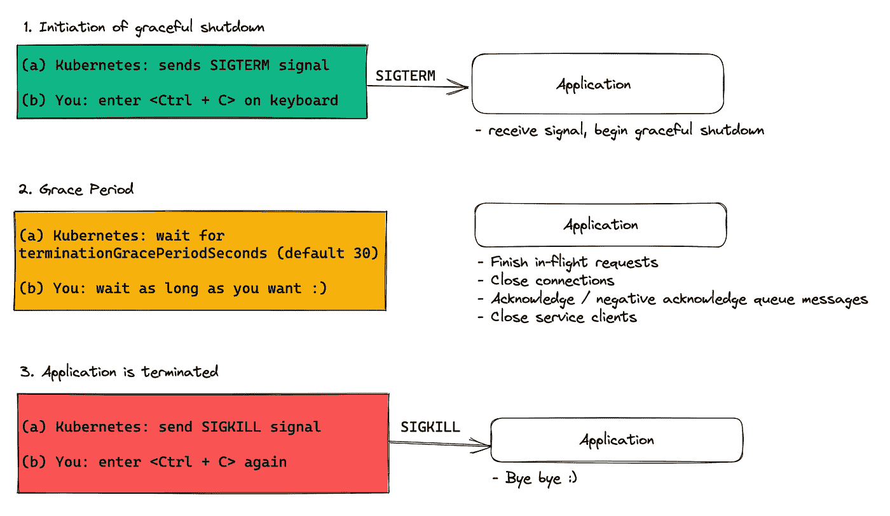
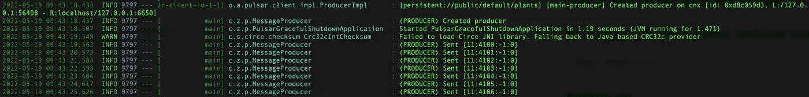
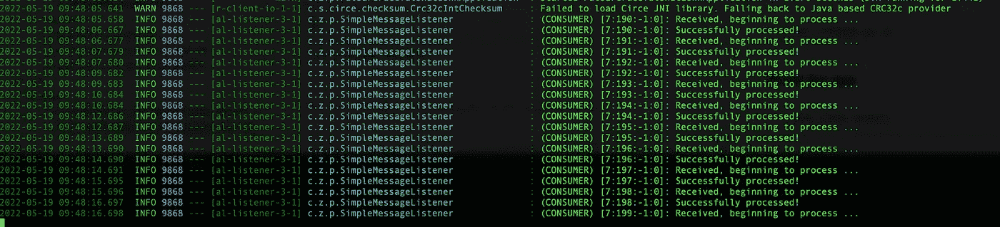
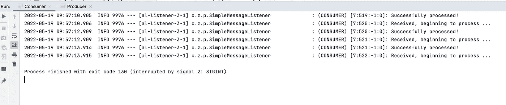
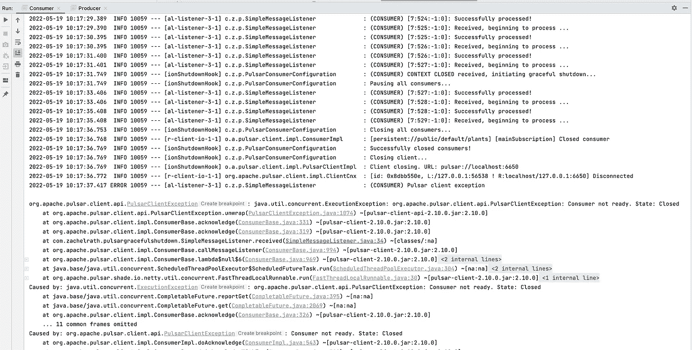
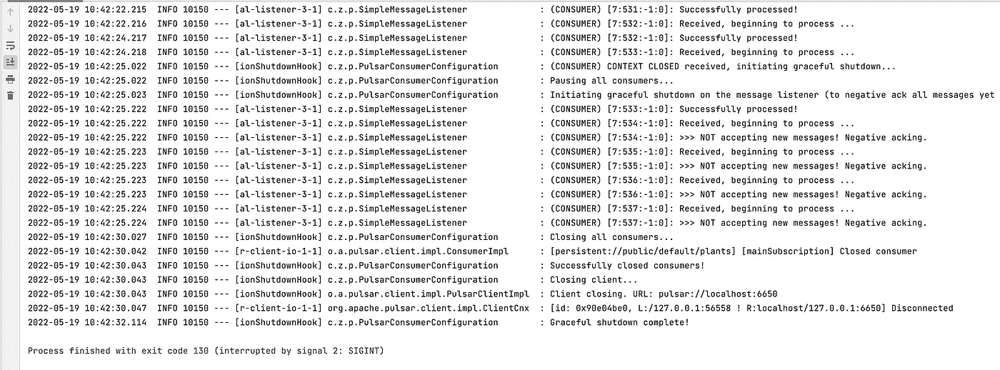
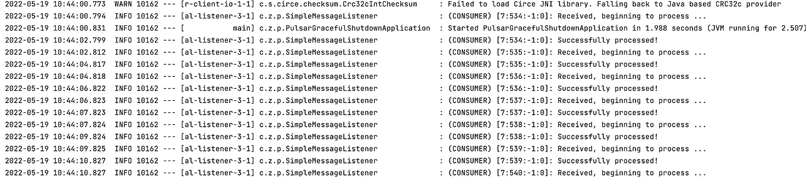

# Java 和 Spring Boot 中 Pulsar 队列消费者的正常关闭

> 原文：<https://levelup.gitconnected.com/graceful-shutdown-of-pulsar-queue-consumers-in-java-and-spring-boot-f93645a92b2b>

在软件工程中，系统的边缘/边界通常是有趣问题发生的地方，不仅是在*系统间*的通信中——这里有所有经典的分布式系统问题——而且在单个系统中也有*。许多困扰系统的问题与该服务与另一个服务的通信无关，这些问题不是在正常运行期间发生的*，而是在应用程序启动和关闭期间发生的*。*

正确的应用程序关闭程序是文档中一个非常容易被忽视的领域，并且，通过扩展，也是许多应用程序问题容易出现的领域。你上一次阅读应用程序或框架的教程，提到如何正确关闭应用程序是什么时候？当然，这不是启动和运行的必要条件，但也许正因为如此，正确的关闭处理常常是一个被忽视的领域，直到生产问题开始出现，开发人员不得不试图找出可能出错的地方。

许多 web 框架至少会有一些内置功能来启动 web 流量的正常关闭——允许正在进行的请求完成，但拒绝任何新的请求——但其他过程，如队列消费者或生产者，通常不会在文档中提及(对 Quarkus 的大喊[就是一个很好的反例](https://quarkus.io/guides/lifecycle))。

# 那么，什么是正常关机呢？

有很多优秀的资源可以帮助理解优雅关机——为了理解 Kubernetes 中的优雅关机，我推荐[这个简单的教程](https://cloud.google.com/blog/products/containers-kubernetes/kubernetes-best-practices-terminating-with-grace)和[这个深入的教程](https://learnk8s.io/graceful-shutdown)——所以我在这里不会涉及太多。

但是作为一个快速的总结——交通灯的类比对我很有帮助。假设您的应用程序是一组快乐行驶的汽车(容器的部署)——灯是绿色的。现在，您需要停止您的应用程序，以便您可以部署一个新版本。你可以告诉应用程序它需要立即停止*(立即红灯)———但是，就像汽车接近十字路口一样，这可能会导致事故。*

*那么我们该怎么做才能给汽车一个安全通过十字路口的机会呢？*

**我们有黄灯— —它给汽车一个* ***宽限期*** *，让它们有足够的时间减速，在到达十字路口之前停下来(或者完成穿过十字路口——这是这个类比失效的地方:)**

*对于我们的应用程序容器/服务器，我们希望做同样的事情——如果它们当前正在工作(正在写入数据库，发出出站 API 请求，等等)。)，无论是处理 API 请求还是使用队列消息，*通常希望让这些正在进行的工作完成，但不要再做新的工作。**

*然而，要做到这一点，我们需要一种方法向计算机进程发送两种不同的*信号*，它们相当于黄灯和红灯。幸运的是，这些信号是存在的，并且是标准化的— *然而，实现业务逻辑，以对应用程序正在做的工作有意义的方式适当地处理这些信号，这取决于应用程序。**

*标准信号是:*

*   *SIGTERM(黄灯)—指示应用程序启动正常关机*
*   *SIGINT / SIGKILL(红灯)—强制中断/终止进程*

**

*理想化的优雅关机流程*

*在容器世界中，像 Kubernetes 这样的编排者利用这些信号作为应用程序新部署的一部分。在新的应用程序单元启动并运行之后(在负载平衡器开始将请求路由到新的单元之后)，Kubernetes 开始清理旧的单元。上图描述了这一过程的简化版本。首先，一个 SIGTERM 被发送到所有旧的 pod(黄灯信号)，这启动了“终止宽限期”。您可以在笔记本电脑上通过按 Ctrl + C(如果通过命令行运行您的应用程序)来模拟这种行为，或者如果您使用 IntelliJ 之类的 IDE，则通过停止您的应用程序来模拟这种行为。*

***理解这个信号实际上并不*做任何事情*是很重要的，这取决于应用*处理*SIGTERM 信号。***

*许多 web 框架将有一些 SIGTERM 的内置处理，其中它们将拒绝任何带有 503 的全新传入的 *web* 请求，但允许进行中的请求完成。在 Java 中，Spring Boot 2.3+会通过在你的 application.properties 文件中设置`server.shutdown=graceful`属性(默认为`immediate`)来自动做到这一点，类似的属性也存在于 Quarkus ( `quarkus.shutdown.timeout`)等框架中。*

***但是，如果您的应用程序正在做*非 web* 工作，比如使用队列消息——则由应用程序决定以下事项:***

1.  ***我们是立即停止处理正在进行的队列消息，还是等待它们完成？***
2.  *我们停止接受新的队列消息了吗？*
3.  *我们如何处理本地排队的消息？*

*在本文中，我们将介绍在 Spring Boot 环境中使用 Java 客户端时如何为 [Apache Pulsar](https://pulsar.apache.org/) 处理这个问题——但是这里讨论的原则和模式适用于任何框架中的任何队列消费者。*

# *如何优雅地关闭 Spring Boot 的 Pulsar 消费者*

*我创建了一个示例应用程序来帮助演示我将要介绍的原则，因此如果您想继续学习，请[查看这个 repo](https://github.com/zachelrath/pulsar-graceful-shutdown-java) ,并按照自述文件中的步骤执行以下操作:*

1.  *用 Docker Compose 启动一个本地脉冲星簇*
2.  *在生产者模式下运行应用程序，以产生 Pulsar 主题的消息*
3.  *在消费者模式下运行应用程序，以消费来自主题的消息*

*[](https://github.com/zachelrath/pulsar-graceful-shutdown-java) [## GitHub-zachelrath/Pulsar-Graceful-shut down-Java:Apache Pulsar Java 的优雅关机…

### Spring 中 Apache Pulsar Java 消费者的优雅关闭-GitHub-zachelrath/Pulsar-优雅关闭-java…

github.com](https://github.com/zachelrath/pulsar-graceful-shutdown-java) 

一旦运行了生成器，您应该会在控制台中看到如下所示的日志:



针对该主题生成一些消息

如果您启动消费者，您应该会看到如下消息:



使用队列中的消息

基本队列使用者配置如下所示:

处理队列消息的实际逻辑委托给 MessageListener 实现，如下所示:

为了模拟真实的队列工作，我们只是让消息监听器休眠 0-2 秒的随机间隔，然后确认消息，告诉 Pulsar 工作已经完成，此时它记录“成功处理！”

那么——当我们试图关闭应用程序时会发生什么？

我们来按 Ctrl + C，一探究竟！



这真的很简单——应用程序在运行中停止，不允许现有的请求完成。请注意，最后一个日志是“已收到，开始处理…”。在现实世界中，您的队列消费者可能会发出 API 请求，写入数据库，谁知道呢。

你可能会问，那又怎样？Pulsar 不会重新传递这条消息吗，因为队列消费者从未确认过它？

是的，这是真的——Pulsar 将等待消费者特定的`ackTimeout`(在我们的配置中设置为 10 秒)之后，再尝试重新发送从未被确认的消息。这很好，只要请求处理是等幂的——如果您正在做的工作可以一遍又一遍地重做，那么让消息处理失败也没什么坏处。

然而，在现实世界的应用程序中，并不是所有的请求都是幂等的——仅仅允许请求在运行中失败也不是有效的。

如果我们想确保我们的消息被允许完成，我们需要实现对正常关闭的支持。

# 如何在 Spring 应用程序中监听 SIGTERM

我们需要做的第一件事是挂钩 Spring 的应用程序生命周期事件，这样当 SIGTERM 信号发送到应用程序时，我们就会得到通知。

这是通过添加一个`@EventListener`注释来实现的，该注释与`ContextClosedEvent`挂钩:

```
@EventListener(ContextClosedEvent.class)
public void onContextClosed() {
    *log*.info("(CONSUMER) CONTEXT CLOSED received, initiating graceful shutdown...");
```

太好了——现在我们该怎么办？

让我们从我们必须回答的三个问题中的第一个开始:

(1) *我们是立即停止处理进行中的请求，还是让它们完成？*

因为我们知道我们的请求最多需要 2 秒钟才能完成，所以我们可以轻松地休眠 2 秒钟以上，并确保我们现有的请求已经成功完成:

```
*// Wait for a time to allow messages to finish being processed* try {
    TimeUnit.*SECONDS*.sleep(shutdownGracePeriodSeconds);
} catch (InterruptedException e) {
    *log*.error("THREAD INTERRUPTED");
}
```

这很简单！但是，如果我们运行消费者，我们会看到我们继续看到消息被处理。那是因为我们*仍在接受来自脉冲星经纪人的新消息。*

现在让我们来回答问题 *(2)我们是否停止接受新的队列消息？*

Pulsar 提供了一种简单的方法来停止接受新消息:[简单地调用](https://pulsar.apache.org/api/client/org/apache/pulsar/client/api/Consumer.html#pause) `[consumer.pause()](https://pulsar.apache.org/api/client/org/apache/pulsar/client/api/Consumer.html#pause)`:

```
*// Stop accepting new messages from Broker by pausing all consumers
log*.info("Pausing all consumers...");
consumers.forEach(Consumer::pause);
```

从逻辑上来说，我们应该在为`shutdownGracePeriodSeconds`睡觉之前先做这个*。*

*休眠之后，我们可以更进一步，明确关闭 Pulsar `Consumer`实例，最后关闭`Client`:*

```
**log*.info("Closing all consumers...");
consumers.forEach(consumer -> {
    try {
        consumer.close();
    } catch (PulsarClientException e) {
        *log*.error("UNABLE TO close consumer", e);
    }
});
*log*.info("Successfully closed consumers!");
*log*.info("Closing client...");
try {
    client.close();
} catch (PulsarClientException e) {
    *log*.error("UNABLE to close client...", e);
}

*log*.info("Graceful shutdown complete!");*
```

*这应该能解决所有问题，对吧？让我们来看看:*

**

*优雅关机不太顺利:(*

*呀…真是一团糟，哪里出错了？*

*让我们来分解一下:*

1.  *我们开始处理消息 7:527(“收到，开始处理…”)*
2.  *我们点击 Ctrl + C，启动正常关机(“收到上下文关闭”)*
3.  ***我们暂停消费者。***
4.  *消息 7:527 完成处理。*
5.  *我们在 7:528 收到一条新消息，并开始处理它。这也成功了。*
6.  ***我们在 7:529 收到一条新消息，并开始处理它。***
7.  *3 秒钟的正常关机睡眠结束。*
8.  *我们关闭了所有的消费者和 Pulsar 客户端。*
9.  *线程 processing 7:529 试图向 Pulsar 发送一个确认，告知它的工作已经完成——但是客户端已经关闭，所以失败了，并出现了一个令人讨厌的异常。*

*最大的问题是--为什么会出现(5)和(6)？？为什么我们调用`consumer.pause()`后 Pulsar 会给我们发新消息？*

# *接收者队列*

*答:Pulsar broker *没有*向我们发送任何新消息——消费者已经将消息在本地的“接收者队列”中排队。*

***接收方队列**是一种在高容量队列中特别有用的机制，在这种情况下，为了最大化吞吐量，我们希望确保消费者在完成一条消息的处理后，总是有一些消息准备好开始工作——这样就不会浪费任何时间返回给代理说“嘿，我准备好了，给我更多的工作！”如果消息处理时间与消费者从代理请求和接收新消息的时间相当，这将大大降低吞吐量。*

*请注意，在我们的示例配置中，我们将接收方队列大小设置为 5:*

```
*Consumer<byte[]> consumer = client.newConsumer()
        .subscriptionName(subscriptionName)
        .subscriptionType(SubscriptionType.*Key_Shared*)
        .topic(topicName)
 **.receiverQueueSize(5)*** 
```

*这意味着，即使在我们暂停消费者接收来自代理的新消息之后，*其本地接收者队列中仍有多达 5 条消息需要处理*。如果任其自生自灭，消费者将继续尝试处理这些信息。不幸的是，我们已经关闭了客户端，因此消费者无法确认这些消息。*

*对此我们应该做些什么？*

*在这里，我们有几个选择:*

1.  *增加正常关机睡眠持续时间，不仅允许*进行中的*消息完成处理*，还允许处理接收器队列中的所有消息*。*
2.  *通过否定确认来防止消费者处理其接收者队列中的更多消息。*
3.  *将接收方队列大小设置为 0。*

*如果我们这样做(1 ),这将需要额外等待 5 * 2 秒。如果我们在 Kubernetes，这应该没问题，那里的终止宽限期是 30 秒——我们将在下面的方式。但是如果这里有更多的可变性呢？如果我们的接收方队列大小为 10，并且每条消息可能需要 3 秒钟才能处理完，该怎么办？同样，所有这些都取决于现实世界中队列的实际动态，但是作为最佳实践，最好遵循以下规则:*

*   *如果一个应用程序被赋予了一个 SIGTERM，它应该*尽可能快地停止做更多的工作。**

*遵循这个原则，(1)就 out 了。(3)如果我们想确保对我们的消费者有更高的吞吐量，也是不可能的。这给我们留下了(2)。*

*为了实现(2)，我们基本上只需要设置一个标志，该标志将指示`MessageListener`否定确认它接收到的任何全新消息——其中*应该只是留在接收者队列中的消息。**

*在监听器中，我们将添加一个名为`initiateGracefulShutdown`的新钩子(这可能是所有`MessageListener`实现所需的接口方法)，它只是将一个布尔值转换为假，然后我们在我们的`received`方法中添加一个分支，该分支否定确认所有 net-new 消息:*

```
*public void initiateGracefulShutdown() {
    this.isAcceptingNewMessages = false;
}

@Override
public void received(Consumer<byte[]> consumer, Message<byte[]> msg) {
    *log*.info(*CONSUMER_PREFIX* + "Received, beginning to process ...", msg.getMessageId());

    if (!isAcceptingNewMessages) {
        *log*.info(*CONSUMER_PREFIX* + ">>> NOT accepting new messages! Negative acking.", msg.getMessageId());
        consumer.negativeAcknowledge(msg);
        return;
    }*
```

*回到消费者配置，我们只需要在暂停消费者后立即调用`initiateGracefulShutdown`:*

```
*consumers.forEach(Consumer::pause);
**msgListener.initiateGracefulShutdown();**try {
    TimeUnit.*SECONDS*.sleep(shutdownGracePeriodSeconds);
} catch (InterruptedException e) { ... }*
```

*让我们看看会怎样…*

**

*接收方队列否定确认的正常关机*

*完美！*

*我们可以看到传输中的消息得到了处理，但是接收者队列中的所有剩余消息都得到了否定确认，将它们发送回代理。现在，如果我们重新启动消费者，我们可以看到这些消息(533–537)都被成功处理:*

**

# *结论*

*在其他排队系统中，细节当然会稍有不同，但是作为为队列使用者实现健壮的正常关闭策略的一部分，您将始终需要回答以下问题:*

1.  ***我们是立即停止处理正在处理的队列消息，还是等待它们完成？***
2.  ***我们是否停止接受新的队列消息？***
3.  ***我们如何处理本地排队的消息？***

*如果你只是想自己通读代码，这里是回购的链接:*

*[https://github.com/zachelrath/pulsar-graceful-shutdown-java](https://github.com/zachelrath/pulsar-graceful-shutdown-java)**