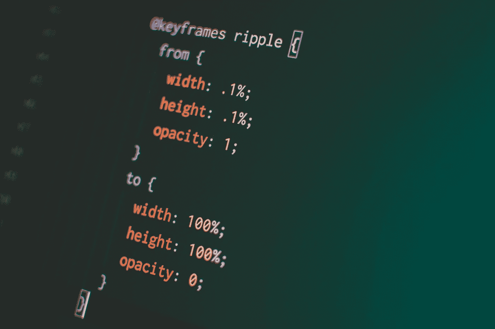

# CSS 渐变过渡

> 原文：<https://levelup.gitconnected.com/gradient-transitions-with-css-f7004b89892>



潘卡杰·帕特尔在 [Unsplash](https://unsplash.com/s/photos/css-transition?utm_source=unsplash&utm_medium=referral&utm_content=creditCopyText) 上的照片

我最近在做一个个人项目，并试图在这个过程中提高我的 CSS。我对 CSS 的魔力非常陌生，最近我一直在玩转换和过渡。我认为当你悬停在一个元素上时，把它的背景转换成渐变会很酷。但令我惊讶的是，我的梯度不会过渡！它会突然出现又消失。我认为这是一个打字错误，但我的代码看起来很好。我所有的其他转换也仍然正常工作。所以我在谷歌上发现，你瞧，渐变不会过渡！Womp womp！幸运的是，有很多关于如何解决这个问题的信息。

秘诀是在原始元素的顶部放置一个新元素，新元素的不透明度设置为 0。然后悬停时，将新元素不透明度转换为 1。这样你可以在不可见的元素上设置渐变，当鼠标悬停在上面时，它会“神奇地”出现。听起来很简单，但对于像我这样的新手来说，这并不是世界上最直观的过程。

在我的示例代码中，我将使用一个保存餐馆列表的 div 作为示例。

我以前学过一个创建渐变元素的好方法就是用 CSS 伪元素 creator::了。这会将一个伪子元素添加到它所调用的父元素中。这个孩子将保持我们的梯度。要设置这两个元素的关系，您需要将父元素的位置设置为相对，并将新子元素的位置设置为绝对。这样，您可以将子元素直接放在父元素上。这还允许您通过简单地将 top、left、bottom 和 right 设置为 0，使子元素与父元素大小相同。

```
**.restaurant-listing** {
  position: relative;
  z-index: 1; /* We'll come back to this */
}**.restaurant-listing::before**{
  position: absolute;
  content: **""**;
  top: 0;
  right: 0;
  bottom: 0;
  left: 0;
}
```

在子元素上，像平常一样添加渐变。您还必须将内容设置为“”。这是因为伪元素(如::before 或::after)的内容默认为 none，在这种情况下不会生成元素。然后将不透明度过渡属性添加到子对象中，添加渐变，并将子对象的不透明度设置为 0。

```
**.restaurant-listing::before**{
  position: absolute;
  content: **""**;
  top: 0;
  right: 0;
  bottom: 0;
  left: 0;
  background: ***rgb***(172,80,242);
  background: ***linear-gradient***(20deg, ***rgba***(172,80,242,1) 15%,        ***rgba***(43,171,197,1) 87%);
  transition: opacity 0.5s linear;
  z-index: -1; /* We'll come back to this */
  opacity: 0;
}
```

然后，您需要为您的子元素创建一个悬停选择器，这将设置不透明度为 1。

```
**.restaurant-listing:hover::before** {
  opacity: 1;
}
```

最后，也是最令人困惑的部分。你需要孩子的背景出现在家长的背景前面，但是在家长的内容后面。这可以通过 z-索引来实现。如果将父对象的 z 索引设置为 1，子对象的 z 索引设置为-1，将会显示正确的效果。这似乎有点违背直觉，具有较低 z 指数的背景将显示在具有较高指数的背景之前。事实上，这可能会让你陷入 z-index 和 stack context 博客帖子的泥潭。别问我怎么知道的。由于我仍在试图弄清楚这到底是为什么，所以要等到以后的博客文章才能给出解释。长话短说，它与为定位元素、具有 z-index 属性的元素和具有设置的不透明度的元素创建的堆栈上下文直接相关。

总的来说，您的类可能如下所示:

```
**.restaurant-listing** {
  position: relative;
  width: 41%;
  height: min-content;
  background: ***rgb***(43,171,197);
  border-style: ridge;
  border-width: 5px;
  border-color: #860cf5;
  border-radius: 5px;
  margin: 2%;
  padding-left: 2%;
  transition: box-shadow 1s;
  z-index: 1;
}**.restaurant-listing:hover**{
  box-shadow: 5px 5px 5px 1px #0000007a;
}**.restaurant-listing::before**{
  position: absolute;
  content: **""**;
  top: 0;
  right: 0;
  bottom: 0;
  left: 0;
  background: ***rgb***(172,80,242);
  background: ***linear-gradient***(20deg, ***rgba***(172,80,242,1) 15%, ***rgba***(43,171,197,1) 87%);
  transition: opacity 0.5s linear;
  z-index: -1;
  opacity: 0;
}**.restaurant-listing:hover::before** {
  opacity: 1;
}
```

所有这些结合在一起，创建一个平滑的过渡到，从或之间的梯度。

来源:

Keith J. Grant 著

[什么属性创造了堆叠环境？](https://stackoverflow.com/questions/16148007/which-css-properties-create-a-stacking-context/16148341#16148341)

[你可能不知道的 Z-Index 房产作者史蒂文·布拉德利](https://webdesign.tutsplus.com/articles/what-you-may-not-know-about-the-z-index-property--webdesign-16892)