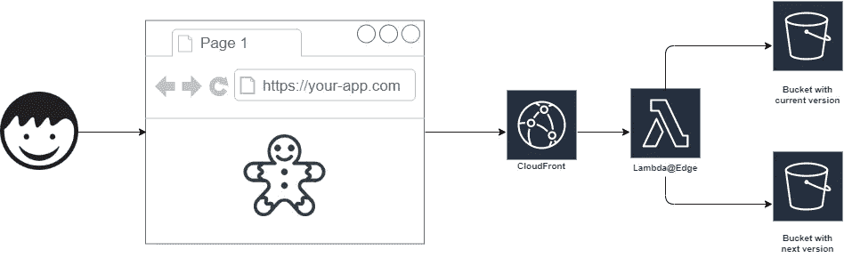
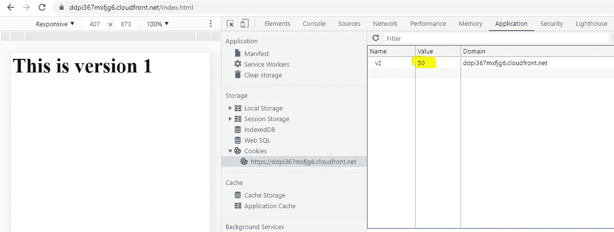
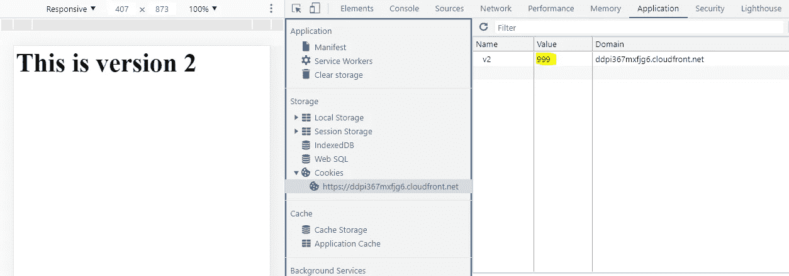
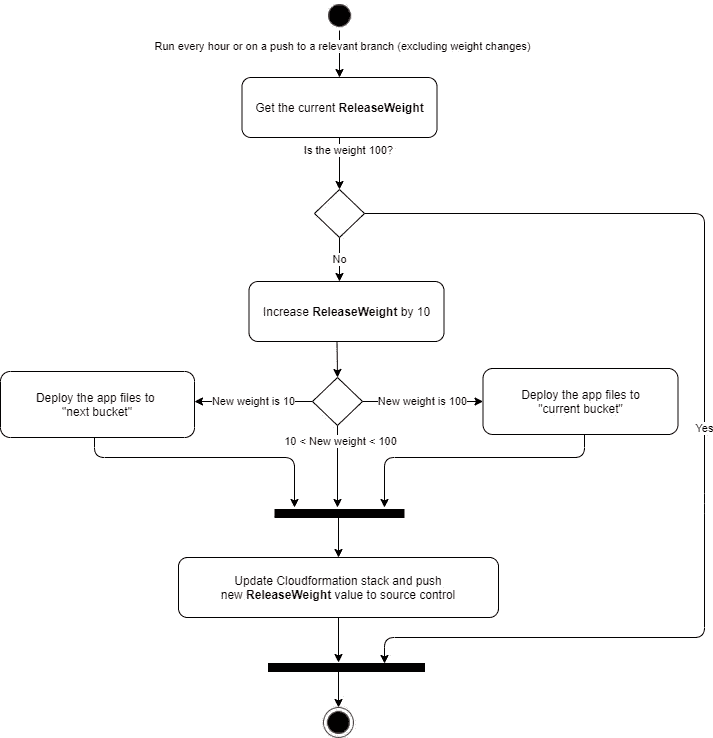

# 使用 CloudFront、S3、Lambda 和 Cookies 部署 Web 应用程序

> 原文：<https://levelup.gitconnected.com/gradual-deployment-of-web-apps-with-cloudfront-s3-lambda-and-cookies-ce17473afabe>

如果你在 AWS 上托管应用，有托管服务帮助你逐步发布变更，避免危险的“大爆炸”部署。对于无服务器应用程序，您可以使用 [lambda 版本别名](https://docs.aws.amazon.com/serverless-application-model/latest/developerguide/automating-updates-to-serverless-apps.html)实现金丝雀关系，对于 ECS/EC2/Beanstalk，您可以使用 [CodeDeploy](https://docs.aws.amazon.com/AWSCloudFormation/latest/UserGuide/blue-green.html) 实现蓝绿色部署。

但是这些工具只能解决后端部署。
如果你想在 **S3** 上发布**静态网站**会怎么样？以下是实现这一目标的秘诀！

# 成分:

*   1 CloudFront 分布
*   2 个 Lambda 函数(请求+响应)
*   2 个 S3 桶(当前版本+下一版本)
*   1 块饼干

最终结果看起来会很美味:

一开始看起来可能很复杂，但这只是用 Cloudformation 创建的一些资源。事实上，您只需点击下面的按钮，就可以在您的 AWS 帐户中设置此基础架构:

CF 模板有两个参数:

*   **发布名称**。我们当前发布的版本的唯一标识符，例如“v2”
*   **释放重量**。介于 1 和 100 之间的数字，指定我们要向多少百分比的用户推出当前版本。这些用户将被随机选择，用户版本状态将保存在 cookie 中。

# 方向

在一个简单直接的 web 设置中，CloudFront 发行版将一个 S3 bucket 配置为 origin。这是我们的起点。

接下来，我们在 Lambda@Edge 中实现我们的魔术。与“通常的”lambdas 不同，这些功能被复制到所有 AWS 边缘位置，这允许与 CloudFront 事件集成。
如果我们决定用户应该获得新版本的应用程序，我们将以下 lambda 附加到 origin 请求事件，并将 Origin 重写到我们的第二个存储桶。

最后，我们将决策的结果保存在一个 cookie 中。由于我们无法从上面的请求 lambda 访问响应对象，我们需要创建一个额外的 lambda 并将其附加到原始响应事件。

# 品尝

要查看结果，将 2 个不同的 index.html 文件上传到 buckets 并导航到 CloudFront 域。使用开发工具检查 cookies。有 50%的可能性会是这样的:

尝试刷新页面几次。您应该始终看到相同的版本，cookie 值应该保持不变。
接下来，清除你的 cookies，刷新页面。您有 50%的机会看到第二个版本，cookie 值现在将是 999:

最后，让我们增加 v2 用户组。用新的权重值 75 更新堆栈，并在 cookie 值为 50 时刷新页面。cookie 要么切换到 75，您将继续使用旧版本，要么切换到 999，您将看到新版本。

# 通过部署管道提供服务

如何使用这种方法取决于你，但假设我们希望我们所有的发布都是渐进的，我们希望每小时增加 10%的权重，直到达到 100%。显然，这个过程需要自动化。在这种情况下，我们需要在部署流程中实施以下逻辑:

这样，当引入一个新版本时，你需要做的就是推一个新的 **ReleaseName** 并将 **ReleaseWeight** 设置为 0。

# **重要注意事项**

*   **缓存** 在这个例子中，我们完全禁用了 CloudFront 的缓存。只是为了简单起见。您需要决定什么适合您的用例。如果您正在构建一个现代的(React/Angular/VueJs)单页面应用程序，您可能有一个引用唯一命名的 JS/CSS 文件的 HTML 文件。在这种情况下，明智的做法是将这些资产放在其他地方，甚至可能放在另一个域下，并积极地缓存它们。这样，我们的 lambdas 将只处理对 index.html 的请求，我们不需要担心缓存
*   **该解决方案并非 100%准确** 因为该解决方案基于 cookies 和实际用户行为(他们返回您网站的频率、高峰交通时段等)。)您无法保证按预期路由的流量的确切百分比。
*   **路由 53 加权路由作为替代方案** 如果您的解决方案不需要“粘性”，即您不介意用户被随机从新版本切换回旧版本，这可能是一种更简单的方法。您为两个版本创建了两个独立的堆栈，并使用 Route53 在 DNS 级别分配权重。但是要注意以下限制:多个 CloudFront 发行版不能监听同一个域。然后可以监听重叠的别名，比如*.example.com 和 app.example.com，但还有一个问题:重叠只可能发生在同一个 AWS 帐户中。如果你有一个分布在另一个帐户听 sales.example.com 这个选项将不会工作。此外，DNS 的传播速度也不是 100%可靠。

上面的所有代码都已经过成功测试，并在我们的所有 web 应用程序上愉快地运行了一年多，网址是 https://eatella.app 。

祝你好运，造出令人惊叹的东西并超级安全地发布它！