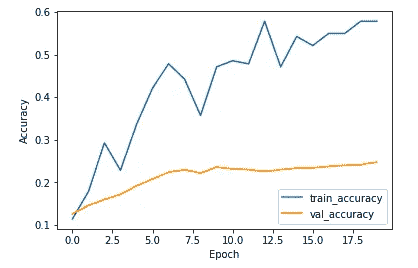
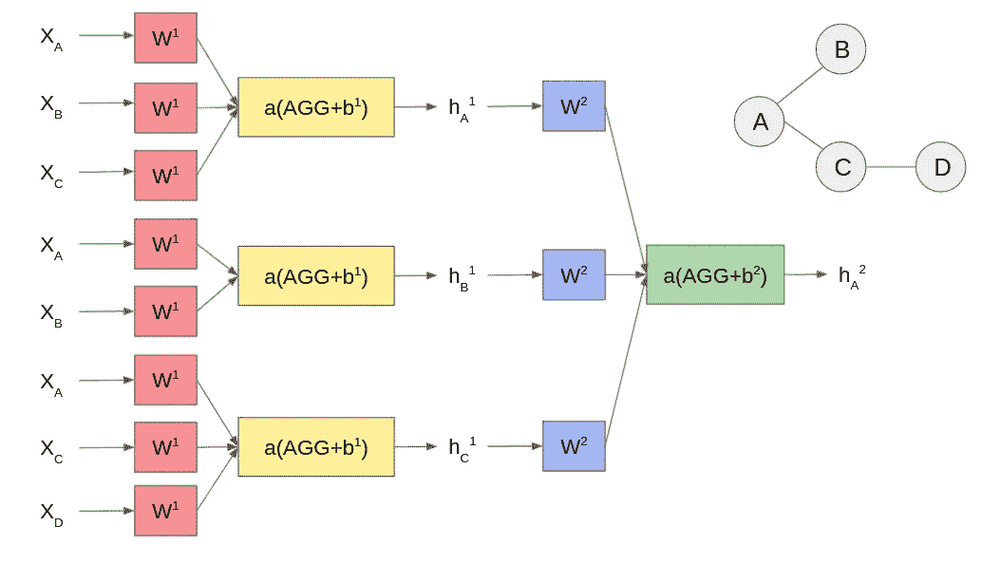
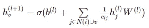
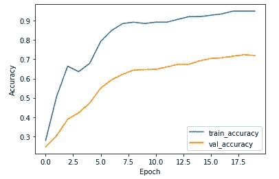

# 基于张量流的图卷积网络节点分类

> 原文：<https://levelup.gitconnected.com/graph-convolutional-network-node-classification-with-tensorflow-49d3e091ea15>

图形神经网络实践教程入门

在这篇博文中，我们将通过一个完整的教程来训练一个图卷积网络(GCN)。本教程包含对 GCN 背后思想的简要解释，以及在 Tensorflow 中的逐行训练实现。

让我们先来看看我们今天要用的数据集。我们使用 [Cora](https://graphsandnetworks.com/the-cora-dataset/) 数据集。这类似于图形神经网络中的 MNIST。Cora 数据集包含一个引用网络图。图中的每个节点是一篇论文，每条边是一篇引文。有`2708`个节点和`10556`条边。这些论文属于`7`科学类。每篇论文都有一个相关的特征向量。特征向量是一个由`1433`个元素组成的布尔数组，每个元素表示一个相应的词典单词是否出现在论文中。Cora 数据集还包含训练、验证和测试掩码(每个掩码都包含`2708`布尔元素),用于表示哪些节点在各自的分裂中。

该任务可以被设计为给定一小组已知的标签(Cora 案例中的`140`论文的类别)，我们想要预测引用网络中其他论文的标签。在诸如欺诈检测的图节点分类任务中，相同类型的方案是常见的。直观上，节点的标签可以从节点特征本身及其与其他节点的连接(标签已知或未知)中导出。

为了比较，让我们首先训练一个完全基于节点特征的模型。我们知道它不会执行得很好，因为它没有考虑节点之间的连接。尽管如此，我们还是会以第一个为基线。

我们使用 [DGL](https://docs.dgl.ai/install/index.html) 库加载数据集。DGL 库是一组规范的图形神经网络构建块，我们稍后会用到。然后，我们使用整个数据集的要素和标签上的相应掩膜来准备训练、验证和测试数据集。

我们创建一个具有两个完全连接的层和一个断开层的简单模型，并针对`20`时期训练该模型。

图 1 简单模型训练精度

从上面的图 1 中可以看出，训练和验证的准确性很差。我们在测试数据集上评估模型。精度更差，只有`17%`。

现在，是时候探索图卷积网络了。这个想法最初是在这篇[论文](https://arxiv.org/abs/1609.02907)中形成的。**简而言之，模型被学习以利用节点特征及其邻居来完成节点分类任务。**参见下图-2 中的插图。

图 2 GCN 插图

这是一个两层图卷积神经网络。节点`A`的最终潜在表示取决于节点`B`、`C`和节点 A `itself`的先前潜在表示，其来自模型中的第一个隐藏层。这些依次依赖于层`0`，这是原始的节点特征。参数`W`和`b`在层内是相同的，而在层之间是不同的。聚集机制可以是简单的平均或一些其他更复杂的方案。聚合通常基于源和目的节点的传出和传入边的数量进行归一化。这具有直观的意义，因为节点对接收节点的“影响”应该取决于该节点有多少出站连接以及接收节点有多少入站连接。公式如下。

一级方程式 GCN 模型

`N(i)`是节点`i`的邻居集合。`cij`是归一化项。它通常是节点`i`的入站连接数乘以节点`j`的出站连接数的平方根。

我们添加的层越多，模型就越能聚合信息。例如，如果模型中只有一层，就不会考虑节点`D`。但是，要小心添加过多的层。[论文](https://arxiv.org/abs/1609.02907)显示，当添加太多层时，模型性能会急剧下降，因为在这种情况下，我们实际上是在平滑整个图形的标签信息。

我们使用来自 DGL 图书馆的 GraphConv 构件来构建我们的模型。

我们也为`20`时代训练它。

图-3 GCN 训练精确度

从上面的图 3 来看，精确度看起来好了很多，尽管有点过拟合。测试精度为`71%`，远高于之前的`17%`。所以正如所料，网络中的连接确实具有很强的预测能力，尤其是考虑到训练集中实际上只有`140`节点。