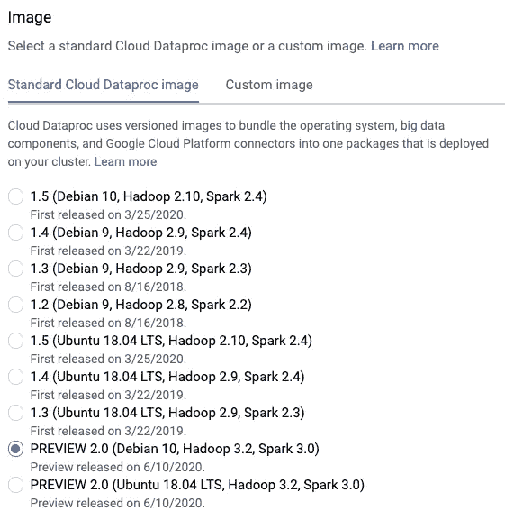
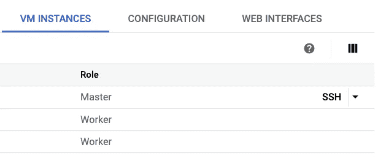
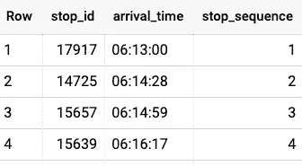
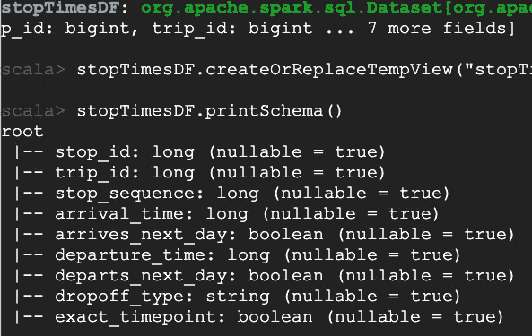
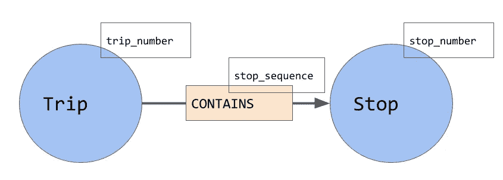
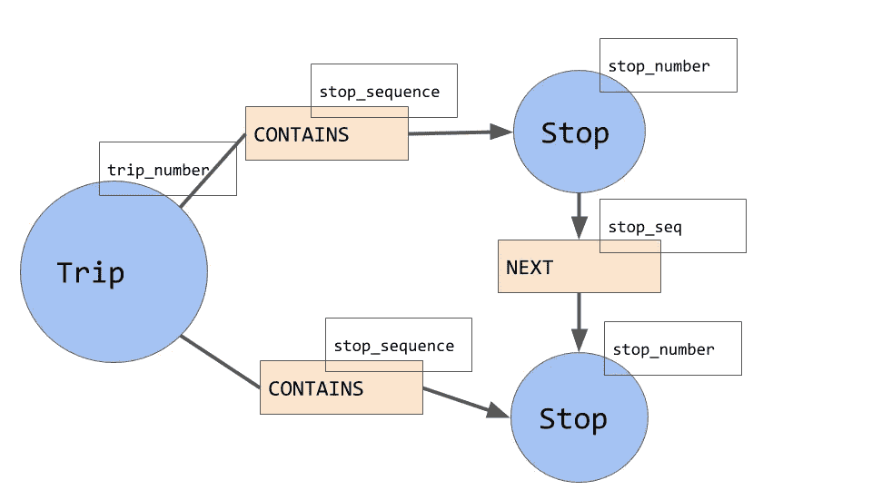

# Cloud Dataproc 上基于 Cypher 和 Spark SQL 的图形数据分析

> 原文：<https://levelup.gitconnected.com/graph-data-analysis-with-cypher-and-spark-sql-on-cloud-dataproc-861ba6b7b648>

## 如何读入 BigQuery 数据并使用 Spark SQL 和 Morpheus 库进行图形数据分析

现在 Morpheus 库为 Spark 3 中的图形数据分析提供了插件 Cypher 支持，您可以使用 Cloud data proc(Google Cloud 上的托管 Hadoop 和 Spark 服务)以可扩展的分布式方式进行图形数据分析。因为 Dataproc 有一个 Spark 连接器，所以您可以从 BigQuery 数据开始进行图形数据分析。

## Cloud Dataproc 上的 Spark 3 和 Scala

[Cypher](https://neo4j.com/developer/cypher-query-language/) 是一种图形查询语言。如果您想以事务方式进行图形处理，可以在 Neo4J 上使用它；如果您想进行图形数据分析，可以在 Spark 上使用它。允许你使用 Cypher 的 Spark 库叫做 [Morpheus](https://github.com/opencypher/morpheus) 。Morpheus 非常新，它在 Scala 中工作得最好(要使用 PySpark，您必须不断调用 JVM 包装器，这很快就会过时)。

要跟随我，请到 https://console.cloud.google.com/dataproc[创建一个新的集群，但一定要打开“高级”选项并选择一个 Spark 3.0 映像:](https://console.cloud.google.com/dataproc)



确保启动 Spark 3.0 Dataproc 集群

一旦集群启动并运行，转到集群详细信息并找到 SSH 按钮。使用它通过 SSH 进入集群的主节点:



这将允许我们交互式地运行代码。一旦代码开始工作，就可以简单地将整个 Scala 文件作为一个作业提交。

***注意:使用 GitHub 上的这个文件(***[***find _ routes . Scala***](https://github.com/GoogleCloudPlatform/bigquery-oreilly-book/blob/master/blogs/graphdb/find_routes.scala)***)来复制粘贴代码片段——这将帮助您确保换行正确，并且在滚动时不会遗漏一两行...***

在 SSH 窗口中，启动一个 Scala 会话，如下所示:

```
spark-shell --jars=gs://spark-lib/bigquery/spark-bigquery-latest_2.12.jar --packages=org.opencypher:morpheus-spark-cypher:0.4.2
```

这将启动 Spark interactive shell(“REPL”)并告诉它加载两个包:BigQuery 连接器和 Morpheus Maven 包。

一旦得到 spark 提示，您就可以开始尝试图形数据分析了！

## BigQuery 数据集

为了说明这一点，我将采用旧金山公共公交出行数据集。您可以通过在 BigQuery 控制台中运行该查询来快速浏览一下:

```
SELECT
  stop_id, arrival_time, stop_sequence
FROM `bigquery-public-data.san_francisco_transit_muni.stop_times`
WHERE trip_id = 8951406
ORDER BY stop_sequence ASC
```



行程#8951406 的旧金山巴士站

## 在 Scala 中读取 BigQuery 数据集

在 Scala 提示符下，键入:

```
val BUCKET = "ai-analytics-solutions-kfpdemo"     // CHANGE as needed
spark.conf.set("temporaryGcsBucket", BUCKET)
spark.conf.set("spark.sql.legacy.allowUntypedScalaUDF", true) // https://github.com/opencypher/morpheus/issues/948

val stopTimesDF = (spark.read.format("bigquery")
  .option("table", "bigquery-public-data:san_francisco_transit_muni.stop_times")
  .option("filter", "arrives_next_day = false AND dropoff_type = 'regular'")
  .load().cache())
stopTimesDF.createOrReplaceTempView("stopTimes")
stopTimesDF.printSchema()
```

上面的代码将公交车停靠时间的 BigQuery 表读入 Spark 数据帧(当然是延迟的)，在 Spark SQL 中将其注册为视图 stopTimes，然后打印模式。您将获得以下内容:



## 构建图表

让我们使用这个数据集来构建一个相当简单的图表。行程包含停靠站。每个行程都有行程编号，每个站点都有站点编号。Trip 包含多个站点，因此，我们向 contains 关系添加一个名为 stop_sequence 的属性。



创建此图的一种方法是创建两个节点表(一个用于行程，另一个用于停靠点)和一个包含关系的关系表。每个表的每一行都必须有一个惟一的 id，称为“id”。

让我们从使用 Spark SQL 构建三个数据框架开始，这三个数据框架将用于创建节点和关系:

```
val stopsDF = spark.sql("SELECT DISTINCT stop_id AS id, stop_id AS stop_number FROM stopTimes")
val tripsDF = spark.sql("SELECT DISTINCT trip_id AS id, trip_id AS trip_number FROM stopTimes")
val containsDF = spark.sql("SELECT DISTINCT trip_id AS source, stop_id AS target, stop_sequence, " +
   "CONCAT(trip_id, stop_id) AS id FROM stopTimes")
```

令人恼火的是，你必须为每一行提供一个 id。我使用了 stop_id、trip_id，并将这两者连接起来用于 contains 关系。

准备好数据帧后，我们可以在 Morpheus 中构建节点和关系表:

```
import org.opencypher.morpheus.api.MorpheusSession
import org.opencypher.morpheus.api.io.{MorpheusNodeTable, MorpheusRelationshipTable}
import spark.sqlContext.implicits._val stopTable = MorpheusNodeTable(Set("Stop"), stopsDF)
val tripTable = MorpheusNodeTable(Set("Trip"), tripsDF)
val containsTable = MorpheusRelationshipTable("CONTAINS", containsDF)
```

现在，表已经准备好了，我们可以创建图表了:

```
implicit val morpheus: MorpheusSession = MorpheusSession.local()
val graph = morpheus.readFrom(stopTable, tripTable, containsTable)
```

现在它有了行程节点、停止节点和包含边。让我们看看如何查询图形。

## 简单密码查询

作为一个简单的查询，让我们找出哪些行程包含特定的停靠站编号。这是一个密码查询，可以让我们做到这一点:

```
MATCH
  (s1:Stop {stop_number: 15104})<-[c1:CONTAINS]-(t1:Trip)
RETURN t1.trip_number AS trip, c1.stop_sequence AS seq
```

我们要求 Cypher 匹配一个 Stop (s1)包含在(注意 GitHub 上箭头

Here’s the code to call that query, convert the result back into a Spark Data Frame and show it:

```
// Query: which trips include stop number 15104?
val result = graph.cypher("""
  |MATCH
  | (s1:Stop {stop_number: 15104})<-[c1:CONTAINS]-(t1:Trip)
  |RETURN t1.trip_number AS trip, c1.stop_sequence AS seq
""".stripMargin)
result.records.table.df.toDF("trip", "seq").createOrReplaceTempView("results")
val resultsTable = spark.sql("SELECT * FROM results")
resultsTable.show()
```

The result looks like this:

```
+-------+---+
|   trip|seq|
+-------+---+
|8962068| 59|
|8962069| 59|
|8962074| 59|
|8962075| 59|
```

As you can see, there are multiple trips (at different times), but this stop seems to always be stop #59\. It’s quite obvious that San Francisco buses follow fixed routes.

## More complex queries

Let’s find the route that trip 8962069 takes (Complete code is in [***find _ routes . Scala***](https://github.com/GoogleCloudPlatform/bigquery-oreilly-book/blob/master/blogs/graphdb/find_routes.scala)*的方向):*

```
 |MATCH
  | (s1:Stop)<-[c1:CONTAINS]-(t1:Trip)
  **|WHERE t1.trip_number = 8962069**
  |RETURN s1.stop_number AS stop, c1.stop_sequence AS seq
  |ORDER BY c1.stop_sequence ASC
```

这里我没有使用属性匹配语法，而是使用了显式的 WHERE 子句和 ORDER BY。这对于 SQL 人员来说应该很熟悉。这将返回:

```
+-----+---+
| stop|seq|
+-----+---+
|13093|  1|
|15992|  2|
|15988|  3|
|15990|  4|
|16004|  5|
```

让我们用上面的思路来寻找“下一站”。现在，我们需要进行两场比赛:

```
 |MATCH
  | (s1:Stop)<-[c1:CONTAINS]-(t1:Trip)
  |MATCH
  | (s2:Stop)<-[c2:CONTAINS]-(t1)
  |WHERE t1.trip_number = 8962069 AND
  |      **c2.stop_sequence = c1.stop_sequence+1**
  |RETURN s1.stop_number AS stop, s2.stop_number AS next, c1.stop_sequence AS seq
  |ORDER BY c1.stop_sequence ASC
```

这里，我们说同一行程(t1)必须包含两个停靠点 s1 和 s2，这样 c2 的停靠点序列(包含关系)比 c1 的停靠点序列多一个。这将返回:

```
+-----+-----+---+
| stop| next|seq|
+-----+-----+---+
|13093|15992|  1|
|15992|15988|  2|
|15988|15990|  3|
|15990|16004|  4|
|16004|15984|  5|
|15984|16007|  6|
```

这很好，但是图形处理的要点是发现和创建新的关系。

## 创造新的关系

让我们使用上面的想法为每个站点添加一个“下一个”节点，这样我们的图就变成了:



方法是首先注册我们的图表:

```
morpheus.catalog.store("stopsGraph", graph)
```

然后在图上构造新边:

```
 |MATCH
  | (s1:Stop)<-[c1:CONTAINS]-(t1:Trip)
  |MATCH
  | (s2:Stop)<-[c2:CONTAINS]-(t1)
  |WHERE c2.stop_sequence = c1.stop_sequence+1
  |**CONSTRUCT on stopsGraph
  |  CREATE (s1)-[:NEXT {trip_number: t1.trip_number, stop_seq: c2.stop_sequence}]-> (s2)**
  |RETURN GRAPH. 
```

因为这条语句返回一个图形，所以 Scala 代码略有不同:

```
**val routeGraph** = graph.cypher("""
  |MATCH
  | (s1:Stop)<-[c1:CONTAINS]-(t1:Trip)
  |MATCH
  | (s2:Stop)<-[c2:CONTAINS]-(t1)
  |WHERE c2.stop_sequence = c1.stop_sequence+1
  |CONSTRUCT
  |  CREATE (s1)-[:NEXT {trip_number: t1.trip_number, stop_seq: c2.stop_sequence}]-> (s2)
  |RETURN GRAPH
""".stripMargin)**.graph**
```

我们可以向这个 routeGraph 发送 Cypher 查询，就像我们从 Spark 数据帧创建的图表一样:

```
 |MATCH
  | **(s1:Stop)<-[n1:NEXT]-(s2:Stop)**
  |MATCH
  | **(s2)-[n2:NEXT]->(s3:Stop)**
  |WHERE n1.trip_number = 8962069 AND n2.trip_number = n1.trip_number
  |RETURN s1.stop_number AS prev, s2.stop_number AS curr, s3.stop_number AS next, n1.stop_seq AS seq
  |ORDER BY n1.stop_seq ASC
```

在这里，我们寻找上一站和下一站，结果是:

```
+-----+-----+-----+---+
| prev| curr| next|seq|
+-----+-----+-----+---+
|15992|13093|15992|  2|
|15988|15992|15988|  3|
|15990|15988|15990|  4|
|16004|15990|16004|  5|
|15984|16004|15984|  6|
```

## 摘要

在本文中，您看到了如何使用 Morpheus 和 Spark 3 在 Cloud Dataproc 上对 BigQuery 数据进行图形数据分析:

1.  将 BigQuery 表读入 Scala 数据帧
2.  使用 Spark SQL 创建一个初始图形
3.  使用密码查询图表
4.  在图形中创建新边
5.  使用密码查询丰富的图形

尽情享受吧！

## 后续步骤

1.  在 GitHub 上看我的完整代码( [find_routes.scala](https://github.com/GoogleCloudPlatform/bigquery-oreilly-book/blob/master/blogs/graphdb/find_routes.scala) )。
2.  阅读 [BigQuery:权威指南](https://www.oreilly.com/library/view/google-bigquery-the/9781492044451/)。每隔六个月左右，我会把这些博文折叠成书。
3.  Morpheus 还是很新的，所以关于 Morpheus 的文档并不多。我发现这个[幻灯片](https://www.slideshare.net/databricks/neo4j-morpheus-interweaving-table-and-graph-data-with-sql-and-cypher-in-apache-spark)和这些[例子](https://github.com/opencypher/morpheus/tree/master/morpheus-examples/src/main/scala/org/opencypher/morpheus/examples)非常有帮助。