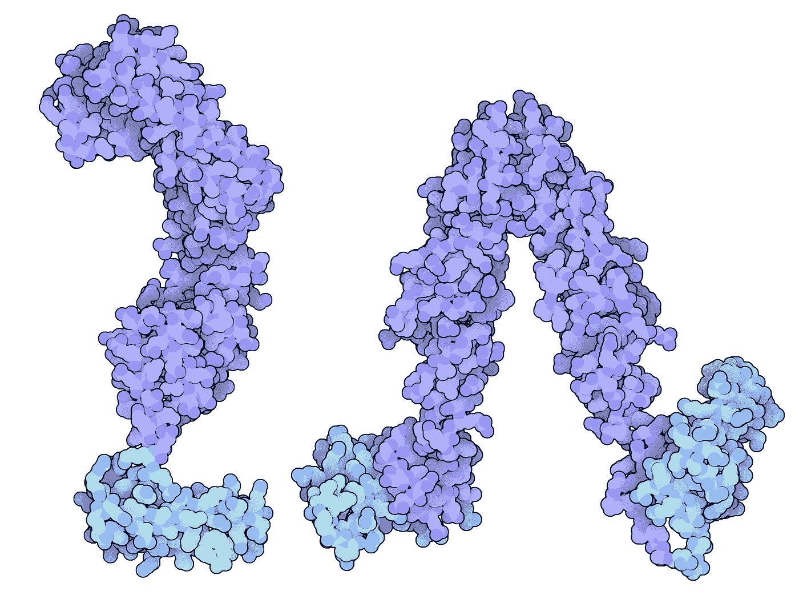
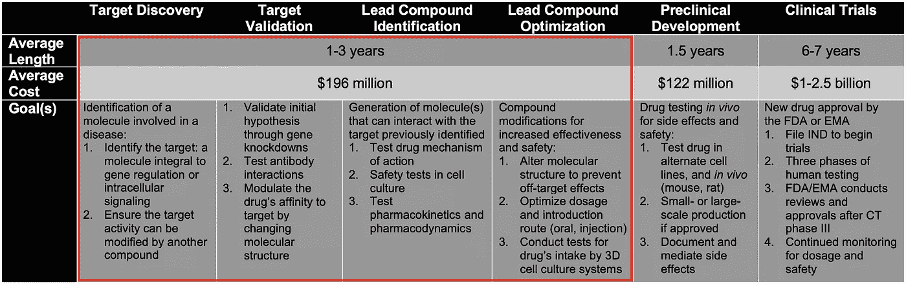
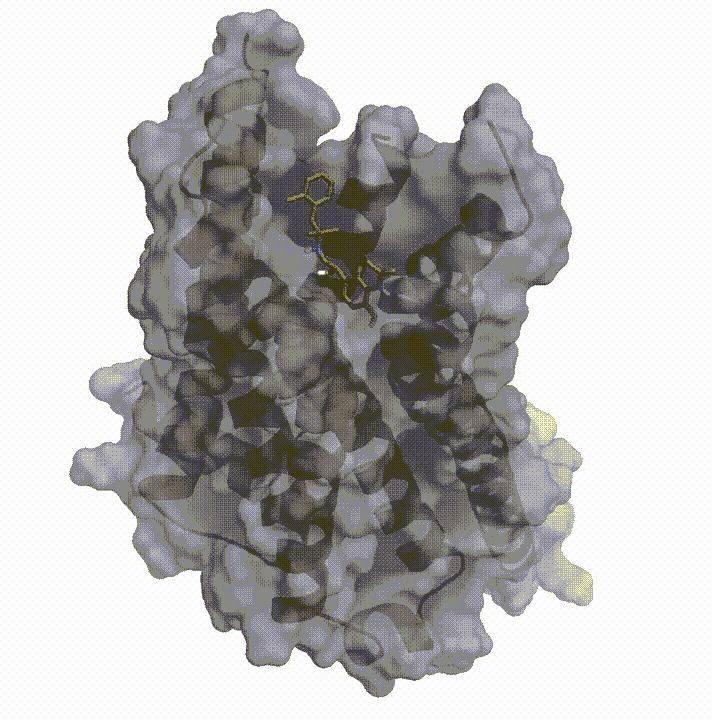
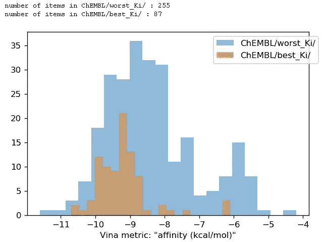
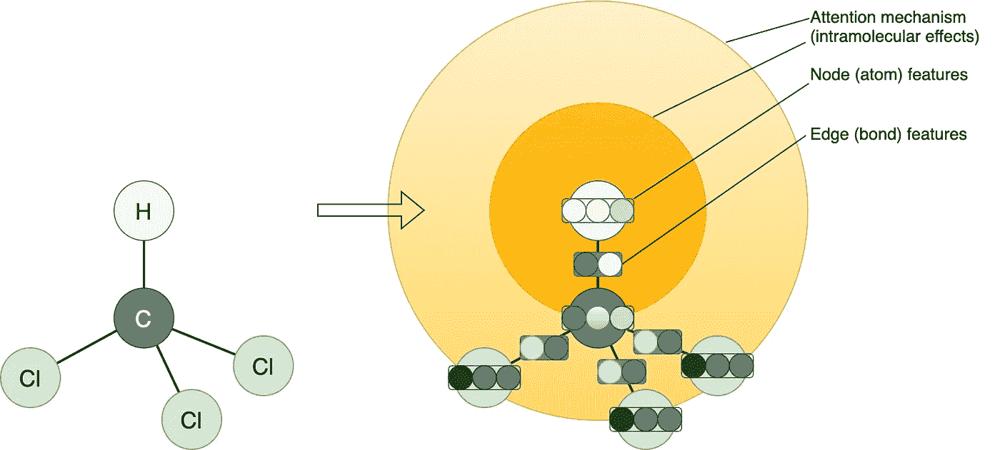
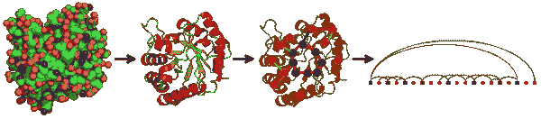
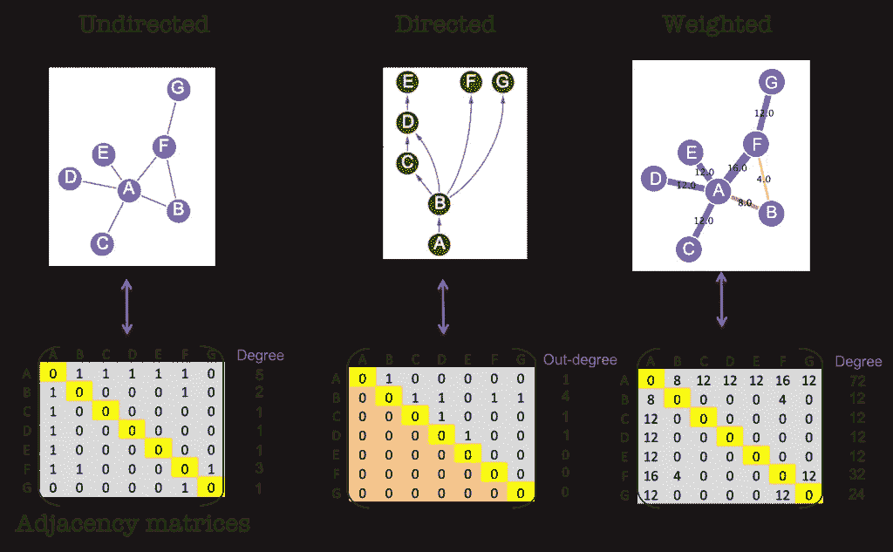
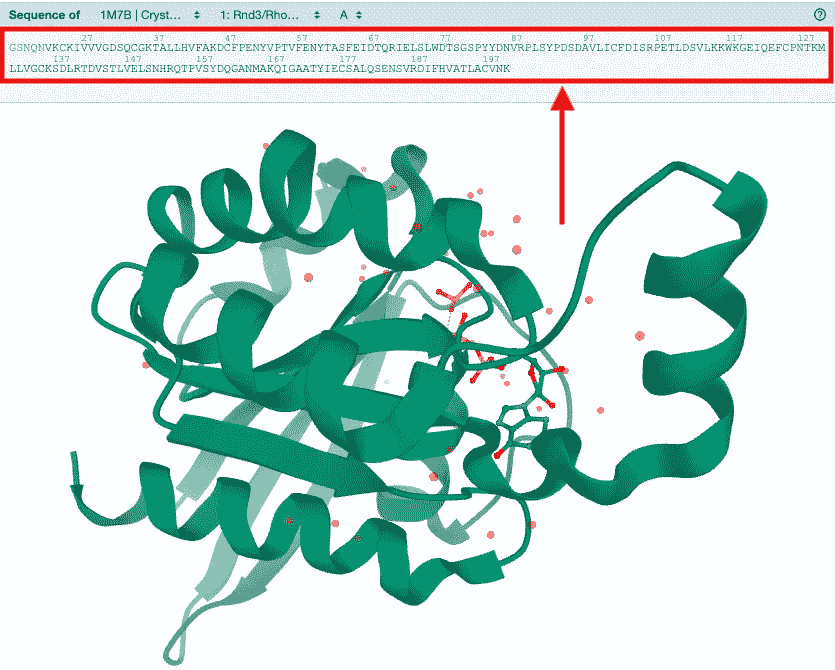
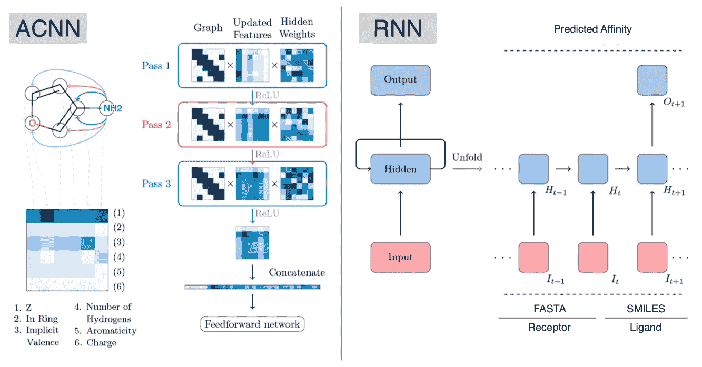
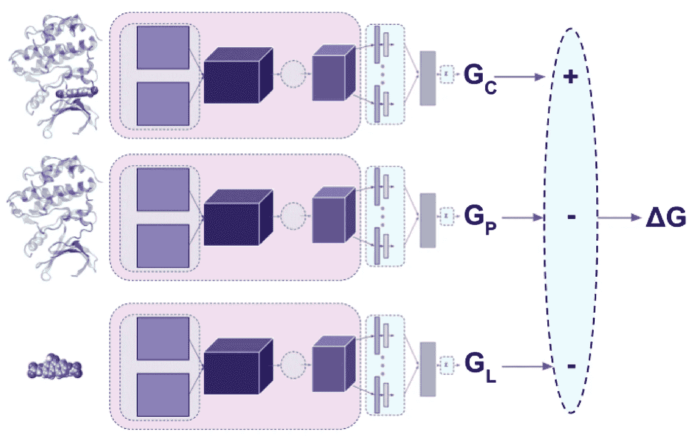

# 用于结合亲和力预测的图形神经网络

> 原文：<https://levelup.gitconnected.com/graph-neural-networks-for-binding-affinity-prediction-6e7d9ab9c58b>

药物发现中的 AI |[black thorn . AI](https://blackthorn.ai/)



DNAJA1 蛋白，胰腺癌的潜在靶点。

> ***警告*** *:* 此内容受版权保护。
> 版权归 Oleksandr Gurbych 所有(联系人: [LinkedIn](https://www.linkedin.com/in/ogurbych/) ， [Gmail](mailto:gurbycholeksandr@gmail.com) )
> 在我们的网站查看更多相关案例: [blackthorn.ai](https://blackthorn.ai/)

可以看相应的 YouTube 视频:

作者绑定亲和力预测 YouTube 视频

# 内容

1.  介绍
2.  亲合力
3.  虚拟放映
4.  配体参数化
5.  受体参数化
6.  图形神经网络
7.  实施示例
8.  摘要

> **作者注**:读者可能不熟悉一些单词和定义。请随意点击并跟随链接——您将进入适当的维基页面，在那里您可以找到更多信息。

# 1.介绍

*主题*涉及人工智能和[生物信息学](https://en.wikipedia.org/wiki/Bioinformatics)在[药物发现](https://en.wikipedia.org/wiki/Drug_discovery)中的应用。提议的人工智能技术[1]的核心 T24 目的 T25 是:

1.  削减早期药物发现阶段(目标发现和验证、先导化合物识别和优化)的费用和持续时间。在下图中，这些阶段用红色标记。
2.  通过拒绝可疑的分子坐标并过渡到更有效的(生物)分子参数化，扩展虚拟筛选能力和准确性。



药物发现过程。文章中描述的人工智能技术应用于以红色突出显示的阶段

为了获得问题和解决方案的背景，让我们首先考虑主要概念。

# 2.亲合力

## 2.1 什么是结合亲和力？

> 结合亲和力是单个生物分子(例如蛋白质或 DNA)与其配体/结合配偶体(例如药物或抑制剂)之间结合相互作用的强度。

结合亲和力通常通过平衡抑制常数(Ki)来测量和报告，该常数用于评估和排列生物分子相互作用的有序强度。Ki 值越小，配体与其靶的结合亲和力越大。Ki 值越大，靶分子和配体相互吸引和结合越弱。

结合亲和力受非共价分子间相互作用的影响，例如两个分子之间的氢键、静电相互作用、疏水和范德华力。此外，配体与其靶分子之间的结合亲和力可能会受到其他分子存在的影响。

## 2.2 为什么重要？

无论何时表征蛋白质、核酸和任何生物分子，理解对底物、抑制剂和辅因子的结合亲和力是理解驱动生物过程、结构生物学和结构-功能关系的分子间相互作用的关键。

> 在药物发现中，结合亲和力用于排列与靶标结合的命中，并设计选择性结合其靶标的药物。

“选择性地”是指药物必须对选定的靶具有高亲和力，对其他靶具有尽可能低的亲和力，以避免脱靶结合和引起副作用。

## 2.3 如何衡量？

有许多测量结合亲和力和抑制常数的实验方法，如 ELISAs、凝胶移位测定、下拉测定、平衡透析、分析超速离心、表面等离子体共振和光谱测定。

就所需的人力、时间和资源而言，实验方法是昂贵的。由于化合物数量巨大，[实验生物活性筛选](https://en.wikipedia.org/wiki/High-throughput_screening)工作需要借助计算方法。一组这样的方法被称为*虚拟筛选*。

# 3.虚拟放映

让我们给这个概念下一个定义和一个简单的分类:

> [虚拟筛选](https://en.wikipedia.org/wiki/Virtual_screening)是一套计算技术，用于选择最有可能与药物靶标(蛋白质或多核苷酸)结合的分子。

虚拟筛选有两个主要分支:

## 3.1 基于配体

目标的 3D 结构是 ***未知*** 。通过 [QSAR](https://en.wikipedia.org/wiki/Quantitative_structure%E2%80%93activity_relationship) 研究获得的一套几何规则和/或理化性质(称为[药效团](https://en.wikipedia.org/wiki/Pharmacophore)模型)用于筛选。

## 3.2 基于结构

目标的三维结构是已知的*。目标坐标和[评分函数](https://en.wikipedia.org/wiki/Scoring_functions_for_docking)用于计算目标对配体的亲和力。又称[分子对接](https://en.wikipedia.org/wiki/Docking_(molecular))(见下面 gif)。*

**

*一个小分子(绿色)与[β-2 肾上腺素能](https://en.wikipedia.org/wiki/Beta-2_adrenergic_receptor) [G 蛋白偶联受体](https://en.wikipedia.org/wiki/G_protein%E2%80%93coupled_receptor)([PDB](https://en.wikipedia.org/wiki/Protein_Data_Bank):[3sn 6](https://www.rcsb.org/structure/3SN6))的[晶体结构](https://en.wikipedia.org/wiki/Crystal_structure)对接*

## ***亲和力评估失败的传统虚拟筛选方法示例***

*传统的*基于结构的*虚拟筛选方法有 AutoDock，AutoDock Vina，Vina，带有 RF 等现代评分功能【4】。*

*最近，我们小组尝试使用 AutoDock、AutoDock Vina 和 Vina with RF Score 分离已知的 *凝血酶*活性和非活性配体。选定的活性和非活性分子是通过实验确定的(即，它们的活性是预先知道的；我们更愿意测试与现实相符的虚拟筛选方法)。所有配体均可在 [DUDE 数据库网络界面](http://dude.docking.org/targets/thrb)获得。*

*因此，AutoDock、AutoDock Vina 和 Vina RF *无法分离*活性(蓝色条)和非活性(红色条)配体，即使正确设置了结合位点。*

**

*AutoDock、AutoDock Vina 和 AutoDock Vina with RF Score 不能分离活性和非活性凝血酶配体*

## *图形神经网络作为虚拟筛选工具*

*在当前的背景下，提出的人工智能技术被归类为一种虚拟筛选。让我们回顾一下图形神经网络如何用于分子的参数化。*

# *4.配体参数化*

*配体通常是小分子。因此，原子/化学键标度是合适的。对于大分子，如肽，请参考下一章。*

## *4.1 原子参数化*

*配体的每个原子都有质量、总电荷和部分电荷、自由基电子数(整数)；原子类型、化合价、杂化、芳香性、手性类型(一键编码)等。原子坐标可以用作特征，也可以不用作特征(尤其是在未知的情况下)。在下图中，原子特征显示为带有三个圆圈的矢量。*

## *4.2 键参数化*

*配体的每个键都以类型(单键、双键、三键、芳香键)、环归属、键是否共轭(0/1)、立体构型(顺式/反式、E/Z、S/R、无)、键的方向(直立/直向)等为特征。在下图中，焊接特征显示为一个带有两个圆的矢量。*

## *4.3 分子内力*

*分子内=分子内部。通过注意机制学习。设计的机制*应该*捕获分子内的电子密度分布效应。递归训练的注意力上下文向量聚集关于局部邻域的信息，以提供小分子的表达性表示。在更高的时间步长中，目标节点嵌入将递归地包括来自其他节点的信息。更强烈(更小)的黄色圆圈意味着邻居节点的关注级别更高。*

**

*氯仿分子(CHCl3)参数化为具有注意机制的图形*

# *5.受体参数化*

*受体通常是生物大分子:多核苷酸(DNA、RNA)或蛋白质。图形神经网络有不同的受体参数化技术。让我们回顾其中的一些。*

## *5.1 作为线性图形*

*受体可以用氨基酸(蛋白质和肽)或核苷酸(DNA 和 RNA)的链表(线性图)来表示。一个**节点**，在这种情况下，是一个氨基酸或一个核苷酸。节点可以用诸如电荷、柔性(Smith)、氢键供体/受体、疏水性、极性(Zimmerman)、范德华体积等特征来参数化。**边缘**几乎相同(蛋白质/肽的肽键和沿多核苷酸链交替的糖-磷酸骨架)，不需要参数化。我只能希望这种注意力机制能够模拟/学习这些生物分子的二级/三级结构。不需要笛卡尔坐标*。**

## **5.2 作为分子间界面的图表**

**蛋白质-配体图是根据 PDB 文件中的原子坐标计算出来的。在该图中，*顶点*代表二级结构元件(通常是α螺旋和β链)或配体分子，而*边*代表它们之间的接触和相对取向。对于这种情况，原子坐标是必须的。**

****

**从三维原子数据计算蛋白质图谱**

## **5.3 作为邻接矩阵**

**原子间(或氨基酸间，或核酸间)距离矩阵由笛卡尔原子坐标构建。在这些矩阵中，行和列被分配给网络中的节点，边的存在用数值来表示。**

****

**边类型图及其邻接矩阵**

**可以在没有笛卡尔坐标的情况下构建*无向*和*有向*邻居矩阵，但是必须创建*加权*邻接矩阵，其中考虑了节点之间的距离。对于*加权*分子邻接矩阵，径向相互作用截止值(通常为 12 埃)用于截断不相互作用的节点。**

## **5.4 作为原始 FASTA 字符串**

**仅适用于 NLP 模型，如变形金刚、GRU、LSTM 等。在这种情况下，使用 raw receptor FASTA 字符串，例如，通过学习嵌入，由模型隐式地进行参数化。*这种情况下不需要坐标*。**

****

**Rnd3/RhoE ( [1M7B](https://www.rcsb.org/3d-view/1M7B/1) )的晶体结构。法斯塔用红色标出**

> **节点和边特征定义了接收器图形神经网络的类型和架构。**

# **6.图形神经网络**

**本节简要介绍了用于分子性质预测的图形神经网络(GNN ),并概述了它们的分类。**

## **6.1 卷积图神经网络(Conv-GNN)**

**卷积神经网络(CNN)是专门用于与网格状数据(如 2D 图像)交互的网络。由于分子通常不表示为 2D 网格，化学家们将注意力集中在这种方法的一种变体上:分子图上的 Conv-GNN。**

**分子图具有关键优势:它们绕过了使用 3D 表示的构象挑战，同时由于它们的成对定义而保持了旋转和平移不变性。MoleculeNet 论文(Wu 等人，2017 年)提供了六种主要变体的简明概念比较。为了便于下面的解释，使用了提出的神经信息传递网络的框架(Gilmer 等人，2017)。**

**神经信息传递网络利用卷积层，简单地说是标量权重矩阵，在分子内的原子或键之间交换信息，并产生嵌入分子信息的固定长度的实值向量。首先，他们为分子中的每个原子生成或计算一个特征向量。这些特征向量然后被收集到一个矩阵中。此外，它们生成一个图形拓扑矩阵，指定图形的连通性。在前向卷积传递中，这三个矩阵相乘。这允许根据拓扑矩阵指定的连接性，在每个原子与其直接邻居的特征向量之间交换信息。这将更新每个原子的特征向量，以包括关于其本地环境的信息。该更新的特征向量矩阵然后通过激活函数(即 ReLU)传递，然后可以通过在另一次卷积传递中将其用作特征矩阵来迭代更新。这在整个分子中传播信息。最后，将这些原子特征向量相加或连接起来，以一个实值向量的形式给出该分子的唯一的、已知的表示(见下图)。**

**向量形式的学习表示被称为潜在空间中的表示，然后被用作传统全连接 DNN 的输入，以最终进行分类或预测。通过向后传播梯度并确定如何改变卷积矩阵权重和 DNN 中的参数，再次使用反向传播来训练这些网络。**

****举例** : [盖特](https://arxiv.org/abs/1710.10903)、 [GCN](https://arxiv.org/abs/1609.02907) 、 [AGNN](https://arxiv.org/abs/1703.10603) 、 [SchNet](https://arxiv.org/abs/1706.08566) 、 [MPNN](https://arxiv.org/abs/1704.01212)**

## **6.2 递归图神经网络(Rec-GNN)**

**Hopfield 于 1982 年提出的递归神经网络专门用于处理任意长度的序列。这使得它们非常适合处理化学信息的文本表示，比如 FASTA 和 SMILES。关键区别在于，在以前的架构中，每个数据输入都是不同的，而在 RNN 中，每个输入都会影响下一个输入。一个说明性的例子是将任何特定的输入(如微笑字符串)作为时间序列数据来查看。某一时刻碳原子的存在会影响下一个字符可能是什么。这在架构中通过将该碳的隐藏层的输出馈送到下一个原子的隐藏层来表达。一个隐藏状态到下一个隐藏状态的反馈使系统在隐藏层中具有递归关系，但是通过“展开”网络以形成一个展开的、非循环的网络图，它可以被看作是有方向的。通过这样做，它保持了所有先前输入的历史，并且它们在以后影响它的预测。然后，可以使用递归形式的反向传播来训练网络。**

****例子** : [AttentiveFP](https://pubs.acs.org/doi/abs/10.1021/acs.jmedchem.9b00959) ， [MGCN](https://arxiv.org/abs/1906.11081) ， [GPNN](https://ieeexplore.ieee.org/document/9040723)**

****

**化学应用的 ACNN 和 RNN 架构图解。源自胺基(ACNN)的彩色箭头表示从氮到其他重原子的信息转移，颜色对应于卷积通过。浅灰色箭头表示矩阵中每个原子的特征向量。重要的是，诸如原子序数(Z)之类的属性通常使用一键向量进行编码，该向量是二进制的，但是为了提高空间效率，在其位置上使用了整数。RNN 模型显示了简化的“多对一”循环网络，虚线上方和下方的文本表示风格化的相似性预测系统。该系统接收受体 FASTA 和配体 SMILES 字符串，并预测亲和力值。**

> **基于递归(Rec-GNN)和卷积(Conv-GNN)的图形神经网络之间的差异:Rec-gnn 应用相同的一组权重(W1=W2)直到满足收敛标准，而 conv-gnn 在每次迭代时应用不同的权重。**

## **6.3 特殊**

**这些 GNN 架构对基本 GNNs (Conv-GNN 和 Rec-GNN)有一些补充，如不同的池策略、跳过连接、注意机制、超级节点、同构图形。**

****举例** : [魏斯费勒-雷曼](https://arxiv.org/pdf/1810.02244.pdf)，[图-注意力变形金刚](https://papers.nips.cc/paper/2019/file/9d63484abb477c97640154d40595a3bb-Paper.pdf)**

# **7.实施示例**

**作为一个例子，我们将训练 Gomes et al .，2017 的原子卷积神经网络(ACNN)。*数据集*是 PDBBind 2015 —它包含三个子集:核心(195 个结构)、细化(3706 个结构)和完整(14260 个)。*的目标*是预测 G——受体-配体复合的自由能，这是一个结合亲和力指标。**

****

**蛋白质-配体系统的原子回旋图。G(复合物)= G(复合物)G(蛋白质)G(配体)**

## **7.1 选择配置**

**点击查看可用配置的完整列表[。](https://github.com/ogurbych/medium-acnn/blob/main/configure.py)**

```
**idx = 0
choices=[...]
args.update(get_exp_configure(choices[idx]))**
```

## **7.2 准备训练和测试数据集**

```
**dataset, train_set, test_set = load_dataset(args)args['train_mean'] = train_set.labels_mean.to(args['device'])
args['train_std'] = train_set.labels_std.to(args['device'])train_loader = DataLoader(dataset=train_set,
                          batch_size=args['batch_size'],
                          shuffle=False,
                          collate_fn=collate)test_loader = DataLoader(dataset=test_set,
                         batch_size=args['batch_size'],
                         shuffle=True,
                         collate_fn=collate)**
```

## **7.3 加载 ACNN 模型、初始化损失函数、优化器和提前停止回调**

```
**model = load_model(args)
loss_fn = nn.MSELoss()
optimizer = torch.optim.Adam(model.parameters(), lr=args['lr'])
stopper = EarlyStopping(mode=args['mode'],
                        patience=args['patience'],
                        filename=choices[idx]+'_model.h5')**
```

## **7.4 训练到提前停车**

```
**for epoch in range(args['num_epochs']):
    run_a_train_epoch(args, epoch, model, train_loader, loss_fn, optimizer)
    test_scores = run_an_eval_epoch(args, model, test_loader)
    test_msg = update_msg_from_scores('test results', test_scores)
    early_stop = stopper.step(test_scores['mae'], model)

    if early_stop:
        print('Early stopping')
        break**
```

## **7.5 结果和讨论**

**在默认(`ACNN_PDBBind_core_pocket_random`)配置下， **ACNN 达到 1.5006 MAE，0.1461 R2** 。**

```
**epoch 12/500, training | loss 0.7162, r2 0.2815, mae 1.6027
test results, r2 0.1461, mae 1.5006**
```

***就任务而言，****1.5006 MAE****意味着模型的平均平均误差为~1.5 kcal/mol 的* [吉布斯自由能](https://en.wikipedia.org/wiki/Gibbs_free_energy) *结合亲和力。相对于水-水* [氢键](https://en.wikipedia.org/wiki/Hydrogen_bond)*O H:O(21 kJ/mol 或 5.0 kcal/mol)的能量，已经足够精确了。***

**参见 GitHub 上的[完整实现](https://github.com/ogurbych/medium-acnn)。**

# **8.摘要**

**1.**挑战**。预测药物-靶标相互作用对于新药发现、药物再利用和发现非靶标效应至关重要。[实验性生物活性筛选](https://en.wikipedia.org/wiki/High-throughput_screening)花费大量时间(1-3 年)和费用(平均每种新药上市超过 1 亿美元)，但效率低下。生物测定通常由计算方法支持，但传统模拟无法提供足够的精度(如 AutoDock Vina 与现代 RF Score 的例子，该分数无法分离活性和非活性凝血酶配体)或足够的速度(如分子动力学或第一原理量子力学模拟的例子)。结果，超过 90%的提议销售线索被拒绝(he 等人，2017)。**

**2.**解**。*对计算机模拟*方法的需求很高，因为它们可以通过迅速系统地建议一组新的候选分子来加快药物开发过程，从而节省时间并将整个过程的成本降低高达 43% (DiMasi 等人，2016 年)。图形神经网络为每个受体-配体对在几毫秒内完成任务提供了卓越的准确性，并通过接受没有坐标的结构扩展了对接能力。**

**3.**结果**。ACNN 模型很容易达到约 1.5 千卡/摩尔 MAE，预测结合亲和力的吉布斯自由能。[这个库](https://github.com/ogurbych/medium-acnn)包含了完整的实现。**

**4.**哲学**。在深度学习模型 AlexNet 赢得 2012 年 ImageNet 竞赛之前，生物/化学信息学现在正处于与计算机视觉类似的范式转变的边缘。整合特征不是为分子选择手工制作的特征，而是通过优化方法学习的。**

# **参考**

1.  **Gurbych O .、Druchok M .、Yarish D .、Garkot S .,“使用机器学习进行高通量筛选[”，发表于 NeurIPS 2020](https://arxiv.org/abs/2012.08275)**