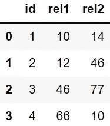
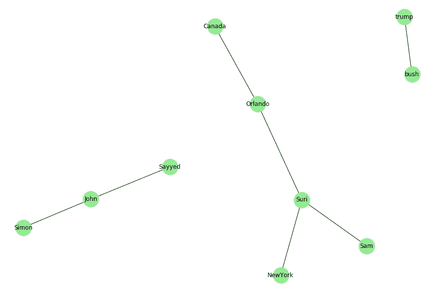
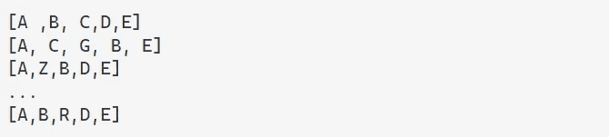
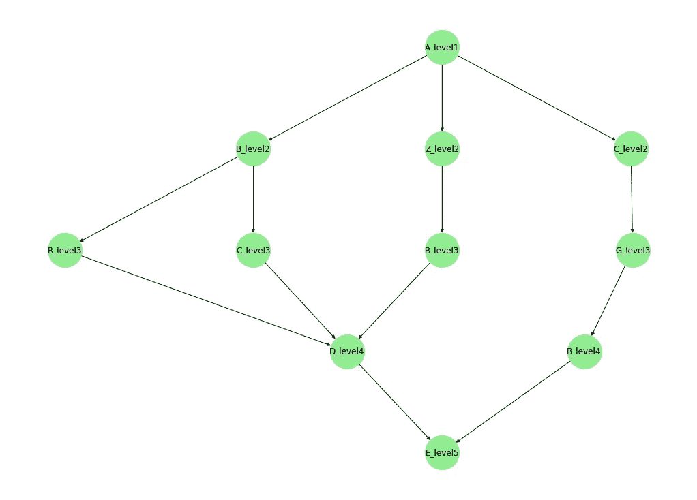

# 在基本数据操作问题中应用图论概念

> 原文：<https://levelup.gitconnected.com/graph-theory-in-everyday-coding-problems-d4a5cbe1db15>

## 了解如何在常见的数据操作问题中检测和应用图论概念

我自己的照片，摄于巴塞罗那的马斯努

了解一些[图论](https://en.wikipedia.org/wiki/Graph_theory#:~:text=In%20mathematics%2C%20graph%20theory%20is,also%20called%20links%20or%20lines).)的基础知识的一个有趣的方面是，我经常发现自己将领域中的基本问题转化为日常的编码问题。这不仅是一个迷人的领域，而且在掌握了一些基本知识和经验之后，你可以将它应用于更一般的问题。

在这篇文章中，我想展示一些我发现自己过去的案例，我们利用图论的概念极大地简化了我正在处理的问题。还从我自己回答的堆栈溢出问题中摘录了一些例子，我认为也可以作为很好的用例。

请注意，这些例子可能看起来有点做作，但它们是我看到的实际的具体问题，可能会帮助您看到我们可以利用图论分析的想法的不同方式。

## #示例 1

我想到的最明显的例子，可能与我正在从事的一个金融相关项目有关，在这个项目中，我必须将一些遗留代码迁移到 *python* 上，如果可能的话，还要优化其实现和性能。在前面的实现中，有一个特别低效的部分，其中包含一个嵌套的 for 循环。为了更好地理解，让我们将下面的数据帧作为一个玩具示例:

数据集包含来自某个客户端的 [ERP](https://en.wikipedia.org/wiki/Enterprise_resource_planning) 的交易数据，以及与其他客户端一起执行的操作(用 **id** 标识)和两个名为 **rel1** 和 **rel2** 的字段。这两列将事务相互链接，表明它们是与同一产品相关的操作。举例来说，我们可以把每一项操作看作是债务的分期付款。

为了使算法工作，第一步是识别所有与**链接的**行，即在最后两列中具有公共值的行。例如，在第一行中，我们有一个为 10 的 **rel1** ，它将链接到最后一行，其 **rel2** 为 10。

我们如何着手为这些相关的组生成一个标识符呢？

## 连接的组件

这被证明是一个常见图论问题的完美用例:找到 [**连接的组件**](https://en.wikipedia.org/wiki/Connected_component) 。

图来自[我自己的回答](https://stackoverflow.com/questions/53886120/combine-lists-with-common-elements/53886179#53886179)在 SO

上图是一个由 3 个部分组成的示例图。您可能已经猜到，一个组件是一个[连接的](https://en.wikipedia.org/wiki/Connected_graph) [子图](https://en.wikipedia.org/wiki/Glossary_of_graph_theory#subgraph)，它不是任何更大的连接子图的一部分。在这种情况下，由 Simon、John 和 Sayyed 构成的左侧部分构成了图的连通部分之一。这 3 个节点都没有连接到图中其他组件的任何其他节点。

有几个库可以用来解决图论问题。最常见的，也是我最喜欢的，是 python 的 [**NetworkX**](https://networkx.org/) 。

因此，回到手头的问题， **rel1** 和 **rel2** 将表示图中的边，即两个节点之间的链接。为了找到这些边形成的连通分量，我们可以使用 NetworkX 的`[nx.connected_components](https://networkx.org/documentation/stable/reference/algorithms/generated/networkx.algorithms.components.connected_components.html)`。首先，我们需要用两列形成的边创建一个列表:

形成*边列表*后，我们现在可以找到连接的组件，如下所示:

现在已经确定了组件，将每一行分配给其中一个就是将其中一列中的每个节点映射到一个组件，例如， **rel1** 。

我们可以看到行`1`和`2`是如何连接的，因为它们共享节点`46`。如你所见，只需几行代码，这个问题就能以比生产中更有效的方式解决，减少计算时间和相关成本。

## #示例 2

下一个例子直接取自[我自己回答的堆栈溢出](https://stackoverflow.com/questions/62307239/obtain-path-from-unordered-list-of-edges/62307352#62307352)中的一个问题，代表了图论算法的一个有趣的用例。要解决的问题是从无序的元组列表`(origin, destination)`中找到完整的路线。问题中的位置是:

注意，这里我们有一个[节点](https://en.wikipedia.org/wiki/Vertex_(graph_theory))之间的连接列表，我们希望找到这些节点生成的完整路径。

所以为了解决这个问题，我们想要的是连接所有这些边的[路径](https://en.wikipedia.org/wiki/Path_(graph_theory))，这也是图中最长的可能路径[。在这种情况下，它恰好是连接图中仅有的两个极端的路径，但是实现](https://en.wikipedia.org/wiki/Longest_path_problem) [**最长路径**算法](https://en.wikipedia.org/wiki/Longest_path_problem#:~:text=In%20graph%20theory%20and%20theoretical,length%20in%20a%20given%20graph.)将是解决这个问题的简单方法。为此，我们可以使用 NetworkX 的`nx.dag_longest_path`:

如您所见，我们可以使用上述函数轻松获得元组列表的有序版本，并找到路径的开始和结束节点，`Madrid`和`New York JFK`。

## #示例 3

这是本文的第三个也是最后一个例子。我认为这个很有趣，因为它也展示了 NetworkX 可视化图形的潜力。[这是问题的链接](https://stackoverflow.com/questions/61870686/construct-a-tree-out-of-list-of-strings/61876102#61876102)。总而言之，最初的发帖人碰巧处理了一个包含嵌套列表的问题:

现在的问题是如何生成一个树状的有向图，以及如何将它可视化。这将是查看这些字符串序列所遵循的所有可能组合或[路径](https://en.wikipedia.org/wiki/Path_(graph_theory))的简单方法。

在这种情况下，我们只需要从嵌套列表中创建一个[有向图](https://en.wikipedia.org/wiki/Directed_graph)，并将每个列表添加为图的[路径](https://en.wikipedia.org/wiki/Path_(graph_theory)):

从这里开始，利用库支持的多种布局，我们可以用`[graphviz_layout](https://networkx.org/documentation/stable/reference/generated/networkx.drawing.nx_agraph.graphviz_layout.html)` 以树状结构表示图形:

它产生:

生成自[我自己的答案在 SO](https://stackoverflow.com/questions/61870686/construct-a-tree-out-of-list-of-strings/61876102#61876102)

请注意，为了清楚起见，之前已经添加了级别 *n* 后缀。通过这个例子，我们可以看到这个库对于表示这样的问题是多么的有用。

感谢你阅读这篇文章。我希望您觉得它有用，如果您有兴趣了解更多关于这个库或其他用例的信息，请告诉我！

最好，lex