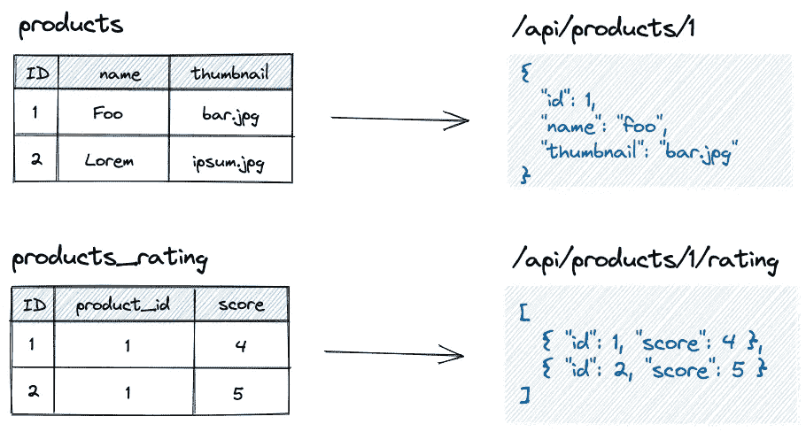
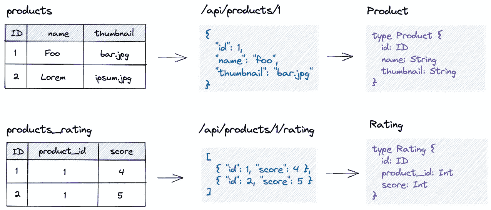
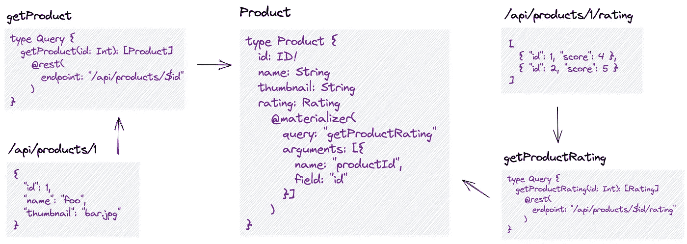
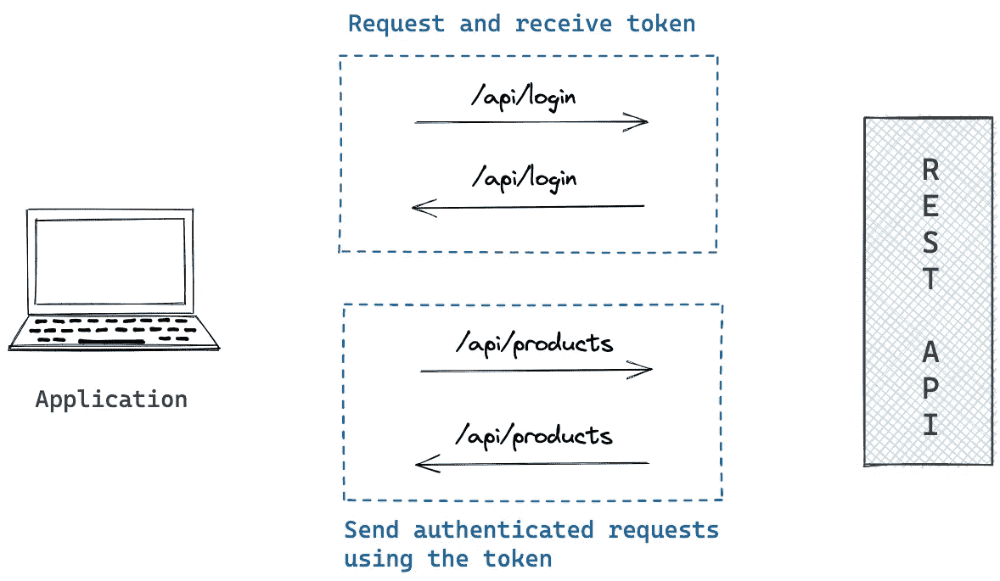

# GraphQL 作为 REST APIs 的迁移策略

> 原文：<https://levelup.gitconnected.com/graphql-as-a-migration-strategy-for-rest-apis-d847ef357cdb>

像 SOAP 和 REST 这样的传统 API 架构已经驱动 web 很长时间了。但是在过去的五年中，使用 GraphQL，API 协议开始向更灵活和前端驱动的方法转变。在 StepZen，我们相信这是一个重要的变化，它将在很长一段时间内决定我们通过 API 处理数据的方式。但是从像 REST 这样的传统 API 架构转移到 GraphQL 是一个挑战。不仅您的团队需要适应 GraphQL，而且这也意味着您可能会失去对当前 API 架构的投资。

幸运的是，您可以使用 StepZen 创建一条从 REST 到 GraphQL 的清晰的迁移路径。将 GraphQL 添加到堆栈中的好处是，您仍然可以利用所有当前的 API。在本文中，我将展示如何在迁移到 GraphQL 时使用现有的 REST API 端点。

# 将 REST API 端点映射到 GraphQL

REST APIs 传统上要求您为每个实体请求数据。如果您有一个电子商务 API，并且想要检索一个特定的产品，这个产品的数据来自一个名为`/API/products/[id]`的端点。该端点的数据可能来自同名的数据库表。

但是，如果您还想获得该产品的评级，并且数据是不同的数据库表，则应该从另一个端点请求评级。因为 REST APIs 有这种基于实体的方法，所以地址将在端点`/API/products/[id]/rating`可用。



将数据库表映射到 REST 端点

当迁移到 GraphQL 时，您可以利用这种基于实体的设置。您可以将每个 REST API 端点映射到一个 GraphQL 类型。这个 GraphQL 类型是 GraphQL 操作的响应，通常是在 REST API 端点支持 GET 请求时的查询。请求对`/API/products/[id]`的响应是一个 JSON 对象，带有字段`id`、`name`和`thumbnail`。这个响应可以被翻译成一个名为`Product`的 GraphQL 类型。您可以对该请求执行同样的操作，以获得该产品的评级。



从数据库表到 GraphQL 类型

通常，当您创建一个 GraphQL 服务器时，您需要编写解析器代码来从数据源获取数据，并根据您的 GraphQL 模式返回数据。每个解析器都会从一个端点(有时是多个端点)请求数据，该请求的响应会与 GraphQL 模式中的一个类型相关联。

当使用 StepZen 时，您不再需要编写解析器，而是为每个 GraphQL 操作定义 REST API 端点。使用 StepZen，您可以使用 StepZen 支持的名为`@rest`的自定义指令将 GraphQL 操作解析到 REST API 端点。该指令接受您想要转换成 GraphQL 操作的 REST API 端点的端点。在端点旁边，您还可以指定参数和头信息来处理身份验证和缓存。

如果你想把 REST API 对`/API/products/[id]`和`/API/products/[id]/rating`的请求转换成 GraphQL，你需要用 StepZen 编写下面的 GraphQL SDL 来实现:

```
type Product {
  id: ID!
  name: String
  thumbnail: String
}type Rating {
  id: ID!
  productId: ID!
  score: Float
}type Query {
  getProduct(id: ID!): Product @rest(endpoint: "/api/products/$id")
  getProductRating(productId: ID!): Rating
    @rest(endpoint: "/api/products/$productId/rating")
}
```

在上面的例子中，查询`getProduct`和`getProductRating`使用了`@rest`指令。使用这个指令，您可以创建 REST API 端点到 GraphQL 操作的一对一映射，这仍然是基于实体的。但是现在您可以完全控制 GraphQL 查询返回的数据，而不是接收 REST API 端点的整个数据结构。如果您只想接收产品的名称，您可以在查询`getProduct`中指定:

```
query {
  getProduct(id: 1) {
    name
  }
}
```

这个查询只返回 REST API 端点`/API/products/1`的 JSON 响应中的字段`name`。所有未指定的字段都无法从 GraphqL 中查询。它不止于此，因为 StepZen 可以做得更多。通过将`@rest`指令与其他 StepZen 指令相结合，您还可以在一个 GraphQL 查询中组合 REST API 端点。

# 组合 REST API 端点

将 REST API 端点映射到一个 GraphQL 查询只是开始，因为真正强大的是将多个端点组合到一个 GraphQL 操作中。这允许您删除处理基于实体的请求的 REST API 约束。再加上 GraphQL 响应的灵活数据结构，这使您能够更好地控制 REST API 端点的输出。组合这些端点是在 GraphQL 类型上完成的，而不是在操作上。



将 REST 端点映射到 GraphQL

您之前映射到 GraphQL 类型和操作的 REST API 端点可以与`@materializer`指令结合使用。上图中的类型`Product`是查询`getProduct`和`getProductRating`的组合响应类型。大多数场来自`getProduct`，只有场`rating`来自`getProductRating`。

可以在用 StepZen 构建的任何 GraphQL 模式中实现`@materializer`指令。在下面的例子中，字段`rating`从查询`getProductRating`中获取数据，字段`id`作为参数传递给该查询。

```
type Product {
  id: ID!
  name: String
  thumbnail: String
  rating: Rating
    @materializer(
      query: "getProductRating"
      arguments: [{ name: "productId", field: "id" }]
    )
}
```

当您使用 StepZen 构建 GraphQL API 时，您现在可以将产品的评级作为一个关系来查询。您不需要编写任何额外的解析器，并且获取产品独立评级的逻辑是可重用的。

这个查询从`/api/products/[id]`和`/api/products/[id]/rating`获得数据:

```
query {
  getProduct(id: 1) {
    name
    rating {
      score
    }
  }
}
```

当您不请求字段`rating`时，`@materializer`指令不会查询`getProductRating`查询。因此，StepZen 不会调用 REST API 端点`/API/products/[id]/rating`。这有助于解决许多 REST API 端点面临的 N+1 约束。

# 带身份验证的迁移路径

当将 REST 迁移到 GraphQL 时，您可以使用 REST API 通常是如何设置的，方法是将 REST API 端点的响应映射到 GraphQL 类型。将端点映射到 GraphQL 是通过`@rest`指令完成的，而 REST API 端点响应是通过`@materializer`完成的。简而言之，我们讨论的迁移路径如下:

1.  将 REST API 端点响应映射到 GraphQL 类型
2.  为每个 REST API 端点创建操作
3.  使用运算组合 GraphQL 类型

但是这个迁移路径并不完整，因为没有提到认证的解决方案。如何将身份验证迁移到 GraphQL 取决于在 REST API 中如何实现身份验证。一个流行的认证标准是 [OAuth2](https://oauth.net/) 。使用 OAuth2，您可以访问应用程序，而不必担心泄露用户凭证，如密码。此外，通过 OAuth，你可以建立与第三方 API 的通信，正如你在[这篇文章](https://stepzen.com/blog/spotify-oauth-2-tokens-in-3-steps)中读到的关于结合 StepZen 和 Spotify 的内容。

当您的 REST API 实现了 OAuth2 时，它有一个端点来请求带有用户凭证的令牌。当凭证有效时，将返回一个令牌。您的应用程序可以使用这个令牌向需要身份验证的 REST API 端点发送请求。先前请求的令牌被添加到 HTTP 头的请求中。该过程将遵循以下流程:



处理 GraphQL APIs 的身份验证

相同的流程可以应用于 GraphQL API。您可以使用 GraphQL 查询或变体，而不是向端点发送 HTTP 请求来请求和接收令牌。这些操作将获取用户凭证作为参数，并在这些凭证有效时返回令牌。当您调用 GraphQL API 时，可以将返回的令牌附加在头中，或者作为需要身份验证的操作的参数。

使用 StepZen 将现有的 OAuth2 流迁移到 GraphQL，意味着您不必重新实现这个流。您的应用程序可以继续使用相同的流程；只有它需要使用 GraphQL 操作，而不是对 REST API 的 HTTP 请求:

```
type Auth {
  id: Int!
  token: String!
}type Query {
  login(username: String, password: String): Auth
    @rest(
      endpoint: "/api/login?username=$username&password=$password"
      configuration: "auth"
    )
}
```

`login`查询获取用户凭证`username`和`password`。这些将被追加到对 REST API 端点`/API/login`的调用中。此外，额外的配置被传递到端点，这可能是 OAuth2 服务的客户端凭证。

`login`查询将返回的令牌可以作为参数传递给任何其他 GraphQL 操作。通过使用`@rest`指令选项将头设置为 REST API 端点，您可以将这个令牌传递给底层 REST API:

```
type Query {
  getProduct(id: ID!, token: String!): [Product]
    @rest(
      endpoint: "/API/products/$id"
      headers: [{ name: "Authorization", value: "Bearer $token" }]
    )
}
```

在上面的代码块中，GraphQL 查询`getProduct`现在将令牌传递给 REST API 端点`/API/products/[id]`。这样，在迁移到 GraphQL 时，您不必设置新的认证服务，因为您可以利用您已经为现有的 REST API 所做的投资。

# 摘要

阅读完这篇文章后，您已经了解了如何使用 StepZen 将现有的 REST API 迁移到 graph QL——您无需编写任何解析器就可以创建一个 GraphQL API。该实现仅通过 GraphQL SDL 使用指令来完成。

您将 REST API 端点映射到 GraphQL 类型和操作。这些类型和操作可以一次组合多个 REST API 端点的响应。如果您已经对应用程序的身份验证流程进行了投资，那么您可以通过将该流程添加到 GraphQL 模式中来利用这些投资。