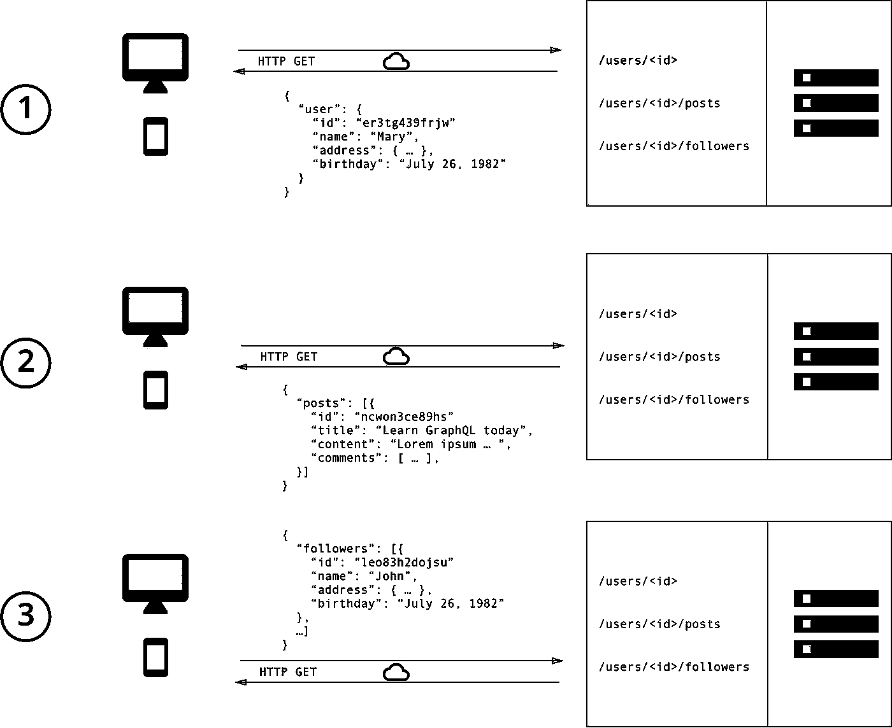

# GraphQL:基础和概述

> 原文：<https://levelup.gitconnected.com/graphql-basics-469c7d8db1a6>


[GraphQL](https://graphql.org/) 是一项新技术，正在迅速获得关注和采用，自从脸书在 2016 年开源以来，它一直在挑战 REST API 的当前惯例。它是最激动人心的技术之一，有机会改变我们构建 web 应用程序的方式。本文是 GraphQL 系列教程的一部分，带领您从基础走向专家。

# GraphQL 是什么？

GraphQL 是一种用于 API 的查询语言，也是一种用现有数据完成查询的运行时语言。GraphQL 通过模式提供了 API 中数据的完整描述。它使客户能够准确地要求他们需要的数据，仅此而已，使 API 更容易随着时间的推移而发展，并支持强大的开发工具。

API 的核心目的是定义客户端可以从服务器加载的数据，但不幸的是，REST 没有提供足够的解决方案。

另一方面，GraphQL 提供了一个以更加直观的方式查询 API 的接口。这句话可以总结为:

> GraphQL 支持声明性数据获取，客户端可以准确地指定他需要从 API 获取什么数据。除此之外，GraphQL 服务器只公开单个端点，并精确地用客户端请求的数据进行响应，这与 REST API 公开返回固定数据结构的多个端点不同。这本身就提高了你的应用性能！

在 REST API 中，您调用不同的端点来收集页面所需的数据。在 GraphQL 中，信息只是通过`key/value`对进行传输。您只需对一个端点进行一次调用，并发送您需要的数据的键，服务器就会用相应的值进行响应。您可以准确地获得您需要的数据。GraphQL 的一个例子是:

```
POST /graphql{
  user(id: 1) {
    email,
    username,
    posts {
      title,
      content   
    }
  }
}
```

服务器会用相应的 JSON 对象进行响应:

```
{
  user: {
    email: "test@test.com",
    username: "testuser",
    posts: [
      { title: 'post1', content: 'hello'},
      { title: 'post2', content: 'world'}
    ]
  }
}
```

它很直观，允许客户准确地声明他们需要的数据。

# 为什么应该使用 GraphQL

我们已经讨论了 GraphQL 作为 REST 的替代方案，但是为什么它更好呢？

## 1.GraphQL APIs 有一个强类型模式

REST API 没有为您的 API 提供合适的模式，正因为如此，在不同的客户端平台(移动平台、web 平台和服务器平台)之间总是存在沟通不畅的情况。此外，许多开发人员被迫使用废弃的 API 及其文档。这些问题背后的主要原因是 REST API 缺少 GraphQL 提供的强类型模式。

GraphQL 模式是 GraphQL API 的核心特性。它清楚地定义了 API 支持的操作(*查询*、*突变、*和*订阅*)，包括输入参数和确切的预期响应。这些字段使用常见的约定进行强类型化，如`string`、`boolean`等。所以我们确切地知道从我们的 API 中可以期待什么。GraphQL 模式是用简单而富于表现力的 GraphQL 模式定义语言(SDL)编写的。这提供了两件事:

1.  构建工具可用于验证 API 请求，并检查编译时与 API 通信中可能出现的任何错误。因此，你的编辑是你最好的向导！
2.  开发人员不需要编写 API 文档。GraphQL 会处理好它，因为它会根据 API 的模式自动生成文档——惊喜吧！

**2。告别不必要的抓取**

考虑一个您想要获取用户配置文件的公共位置。让我们假设这个用户配置文件有三个元素:

1.  用户详细信息—用户名、个人资料图像。
2.  博客帖子—用户的最后三篇博客。
3.  追随者——追随者和用户追随者的数量。

使用 REST API，您可能需要查询三个独立的端点来检索这些字段，并且您可能不需要来自每个端点的页面内容的全部数据。



你想象力的图示

在 GraphQL 中，您需要的只是一个查询。不存在蚀刻不足或蚀刻过度的问题，您会得到您所需要的东西。


一个简单的 GraphQL 请求。

**3。GraphQL 支持快速产品开发**

GraphQL 让开发者的生活变得简单。GraphQL 允许快速开发前端。由于响应只有一个具有明确数据结构的端点，因此消除了前端 UI 更改的风险。这也确保后端不需要随着频繁的变化而调整，最终提高生产率。

**4。后端的深入分析**

GraphQL 有助于保持系统的分析，因为我们可以准确地看到客户选择从我们的 API 查询什么数据。跟踪不同用户发出的请求有助于监控系统流量。通过监控流量，我们可以决定哪些领域应该集中时间进行优化，哪些领域可以弃用。

GraphQL 的优点还有很多，我只过滤掉了主要原因。在下一篇文章中，我们将研究 GraphQL 的核心概念。

*如果你喜欢这篇文章，请鼓掌欣赏，你可以关注我的* [*【中】*](https://medium.com/@bhavikbamania)*[*推特*](https://twitter.com/bhavikbamania)*[*insta gram*](https://www.instagram.com/bhavikbamania/)*，你的欣赏会激励你写更多！谢谢你的时间，下次再见！***

**[](https://levelup.gitconnected.com)****[](https://gitconnected.com/learn/graphql) [## 学习 GraphQL -最佳 GraphQL 教程(2019) | gitconnected

### 11 大 GraphQL 教程-免费学习 GraphQL。课程由开发人员提交和投票，使您能够…

gitconnected.com](https://gitconnected.com/learn/graphql)**