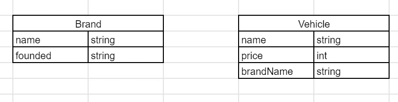
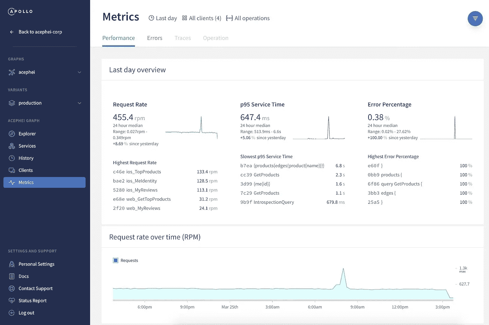

# graph QL——REST 的常见缺点以及克服这些缺点的解决方案

> 原文：<https://levelup.gitconnected.com/graphql-common-disadvantages-over-rest-and-solutions-to-overcome-them-70cbaca42a44>


蒂姆·莫斯霍尔德在 [Unsplash](https://unsplash.com/s/photos/question?utm_source=unsplash&utm_medium=referral&utm_content=creditCopyText) 上的照片

在 2015 年推出之后， **GraphQL** 已经走了很长一段路，被视为在 **REST** API 架构上实现 API 的替代或更好的方式。一开始，开发人员看到了 GraphQL 相对于 REST 的优点和许多缺点。现在，GraphQL 在过去的六年里变得更加成熟，对于这些缺点，可以通过 GraphQL 生态系统本身找到解决方案。在本文中，我将介绍 GraphQL 中最常见的一些缺点，以及在当前的 GraphQL 生态系统中有哪些解决方案。

本文按以下顺序描述了以下缺点和解决方案。

*   **N+1 问题**
*   **HTTP 缓存**
*   **模式复制**
*   **API 监控**
*   **速率限制**

# N+1 问题

大多数 GraphQL API 开发人员面临的最常见问题之一是 **N+1** 问题。 **N+1** 当 GraphQL 解析器向底层数据源发出一个初始查询以及 **N** 个后续查询以获取与解析器相关的所有数据时，会出现问题。下面是一个简单的模式，写的是车辆品牌和车辆。我将使用这个模式解释 N+1 问题。

从上面的模式可以看出，我们可以假设在我们的底层数据库模式中有两个表/集合，分别代表**品牌**和**车辆**。



因此，如果我们想获得单个品牌的信息，下面的操作将在我们的服务器上完成。

*   使用过滤器( **name** )查询品牌表/集合
*   使用过滤器查询 Vehicle 表，以获取与该品牌相关的所有车辆。(**品牌名称**)

因此，正如我们所看到的，我们需要发出两个查询，以便获得一个品牌数据和车辆数据。现在让我们看看有哪些方法可以从我们的 GraphQL API 中获取这些信息。正如我们从模式中看到的，有一个查询可以用来查询所有可用的品牌。

根据我们的模式，这个查询是一个完全有效的查询。但是让我们尝试分析这个查询将如何在我们的 GraphQL API 服务器中执行。正如我们所知，GraphQL 解析器按照准确的顺序遍历所有字段，从底层数据库中获取数据。由于这种行为，我们不希望在解析器中发生的事情。

*   首先，它将查询所有品牌的品牌表/集合。
*   接下来，它将从查询中获得第一个品牌结果，并从车辆表/集合中获得该品牌的车辆。
*   接下来，它会对下一个品牌做同样的事情。
*   下一个品牌的下一个…

我想你现在可能能够确定我们面临的问题是什么。因此，它不是查询底层的车辆表/集合一次，而是查询在品牌表/集合中找到的 **N** 项的数量。所以现在我们有 **N+1** 个查询被发送到数据库进行我们的简单查询。

## 休息方式

在其余情况下，这将主要是两个不同的端点。

```
GET /Brands
GET /Vehicles?filterBy={}
```

即使现在我们需要在服务器中发出两个 API 请求，这也只是发送到底层数据库的两个查询，当 N 变大时，这可能比 N+1 个数据库查询更快。

## GraphQL 解决方案

解决方案应该是，应该有某种方法来获取所有品牌名称，并向车辆表/集合发送一个过滤查询。这可以在 GarphQL 中使用 [**数据加载器**](https://github.com/graphql/dataloader) 来实现。

数据加载器所做的是，它提供了一个批处理/缓存机制，因此我们可以针对这个问题实现一个单一的查询场景。因此，我们可以缓存从第一个查询中获得的所有品牌名称，并在最后使用它发出一个包含所有品牌名称的查询，而不是一个接一个地查询。

从上面的数据加载器中我们可以看到，只有一个针对车辆表/集合的查询，因为所有的品牌名称都由数据加载器本身缓存。到目前为止，它只会发出 2 个查询，而不是 N+！查询。下面是展示如何在 GraphQL API 项目中实现这一点的完整实现。

# HTTP 缓存

GraphQL 开发人员将面临的另一个问题是无法实现 HTTP 缓存。不要混淆，我们可以在客户机上实现客户端缓存，在服务器上实现数据库级捕获。但是因为我们的 GraphQL 请求是通过 POST 请求中的主体发送的，所以我们不能使用标准的 HTTP 缓存。

## 休息方式

Rest 没有这个问题，因为根据功能，我们有 HTTP 标准方法，可以用于 REST。例如，如果我们只想获取信息，我们可以使用 HTTP 缓存支持的 **GET** HTTP 方法。

## GraphQL 解决方案

这里的主要问题是 HTTP 缓存不可用于 **POST** HTTP 方法。对于突变，这不是问题，因为我们不需要缓存突变。但是在 GraphQL 中，查询也作为 POST 请求发送。因此，解决方案是将查询作为 **GET** 请求发送。

因此，解决方案似乎很简单。但这有一个问题。现在，因为我们使用 GET for 查询，所以我们之前通过主体发送的所有查询参数都应该作为 URL 参数在请求本身上发送。更严重的问题是，这些查询跨越多行。

但是，GET URL 参数不支持这些多行。这意味着我们需要对这些参数进行编码，以获得类似这样的多行。

现在我们有两个问题。首先，这不容易理解我们发送的查询，另一个是当查询变得更加复杂时，我们可能会达到 GET 参数的范围。如果我们可以为一个查询发送某种 ID，而不是发送整个查询，那会怎么样？这就是我们可以使用**持久查询的地方。**

通过使用持久查询，我们可以发送一个查询的 ID，它也将存储在我们的服务器上。目前，有许多支持 GraphQL 持久查询的库。阿波罗就是这样一个图书馆。下面是我们如何使用 Apollo 实现持久查询。

通过使用 Apollo，它将首先尝试使用散列 Id 查询服务器，如果服务器已经存储了散列 Id，它将简单地返回数据。如果散列 Id 在服务器中不可用，那么 Apollo 将发送查询和散列 Id，这样它可以为后续查询存储散列 Id。

下一个挑战将是如何控制这些缓存值。为此，我们可以使用 **@cacheControl** 指令来提供字段级缓存控制。现在，基于最小缓存年龄，Apollo 将自动检索缓存值或将缓存值发送给客户端。

# 模式复制

当您开发 GraphQL APIs 时，您会很快发现，每当我们对模式进行修改时，总有两个地方需要进行更改。第一个位置是我们的模式本身，第二个位置是我们的数据库模式。这将很快成为一个问题，因为在大多数情况下，两个位置都有相同的重复数据。

## 休息方式

在 REST 中我们不会有这个问题，因为我们只有一个数据库模式而没有一个图表模式。

## GraphQL 解决方案

这可以通过使用像 **TypeGraphQL + TypeORM** 或 **TypeGraphQL + typegoose** 这样的库很容易地解决。下面是一个使用 TypeGraphQL + typegoose 实现的解决方案。

使用两个库提供的修饰，我们可以在一个位置定义两个模式，而不是在不同的位置复制它们。如果您想了解更多相关信息，您可以关注这篇[文章](https://towardsdatascience.com/graphql-code-first-resolver-first-using-typegraphql-and-typegoose-747616223786)，其中我有一个如何实现该解决方案的分步指南。

# API 监控

大多数 API 监控都是基于 API 返回的 HTTP 状态代码。但是在 GraphQL API 中，GraphQL 本身只会返回 200 个状态代码，即使我们有来自解析器的错误。只有当底层 HTTP 服务出错时，它才会返回其他 HTTP 状态代码。(500、401 等……)这是基于 HTTP 代码的 API 监控的问题。

## 休息方式

REST 已经可以根据它面临的每个问题优化不同的 HTTP 状态代码。

## GraphQL 解决方案

监控背后的主要思想是快速识别错误和性能问题。尽管使用 HTTP 代码不容易识别错误，但 GraphQL 本身有一种标准的方法来指定 API 中的错误。我们可以使用这些错误对 GraphQL API 本身进行监控。幸运的是，GraphQL 生态系统中已经有了这样的监控工具，其中一个就是 Apollo Studio。



抄送—阿波罗[文件](https://www.apollographql.com/docs/studio/getting-started/)

通过使用 Apollo Studio，它已经可以根据标准的 GraphQL 错误标准计算错误，除此之外，我们还可以根据其他标准添加自定义指标。

# 限速

想象一个具有以下模式的 GraphQL API。

在这里我们可以看到，用户可以针对该模式发出以下有效查询。

我想你可能会明白为什么这对我们的 GraphQL API 不好。当这个查询被提供给我们的 API 时，它很可能必须处理大量的计算数据，这对其他请求来说也是一个问题。或者在最坏的情况下，一个人可以故意发送一个无限的查询来使我们的整个 API 服务器崩溃。我们需要引入速率限制来避免这些场景，这在 GraphQL 中是很困难的。

## 休息方式

在 REST 端点中，输出的结构和生成输出所需的查询数量不会改变。因此，我们可以根据调用该端点时会产生多少成本来限制每个特定时间段的请求数，作为速率限制器。

## GraphQL 解决方案

我们不能使用 REST 中使用的解决方案，因为我们只使用了一个端点。即使我们在解析器级别考虑，基于每次查询请求的字段，查询输出也不会与 REST 输出相同，因为客户端可以为同一个解析器请求不同的字段。因此，解决方案是在生成输出之前，计算输出的成本，并在此基础上应用一个限制。

这可以使用 [graphql-cost-analysis](https://github.com/pa-bru/graphql-cost-analysis) 库来实现。通过使用这个，我们可以使用 **@cost** decorator 将成本附加到查询的每个字段。

通过使用 [graphql-cost-analysis](https://github.com/pa-bru/graphql-cost-analysis) ，现在我们可以定义什么是成本以及如何基于其他字段计算成本，并定义在执行查询之前将被验证的最大成本。