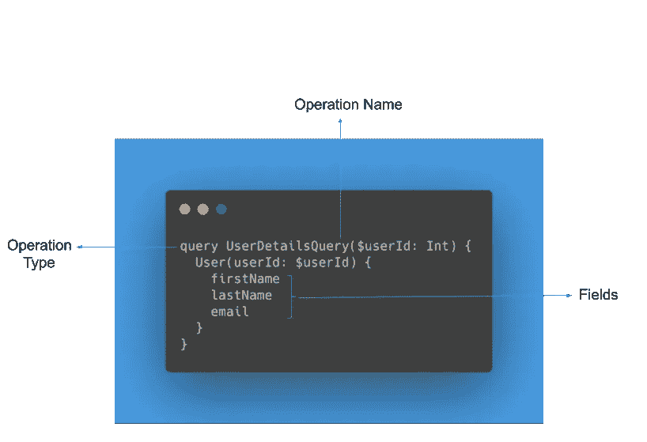
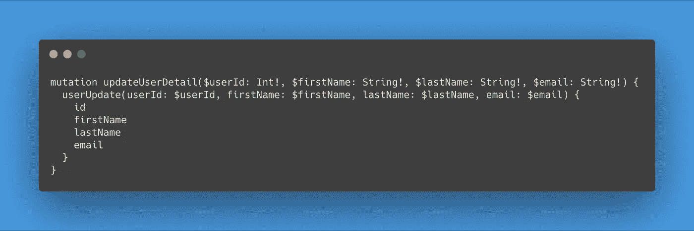
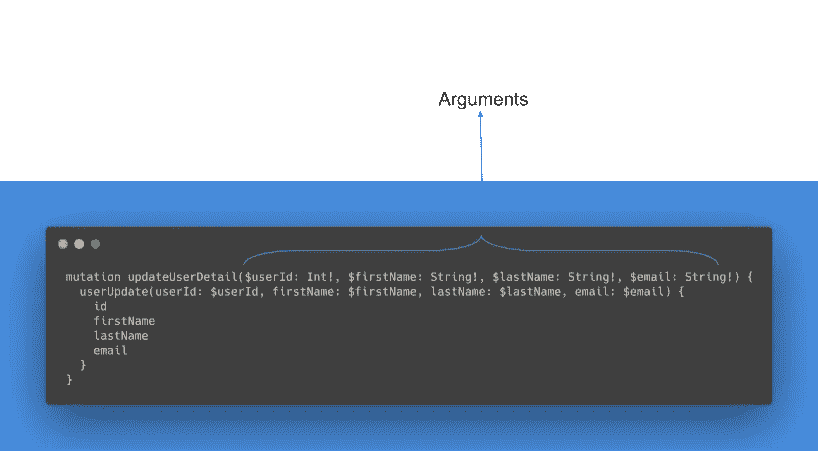
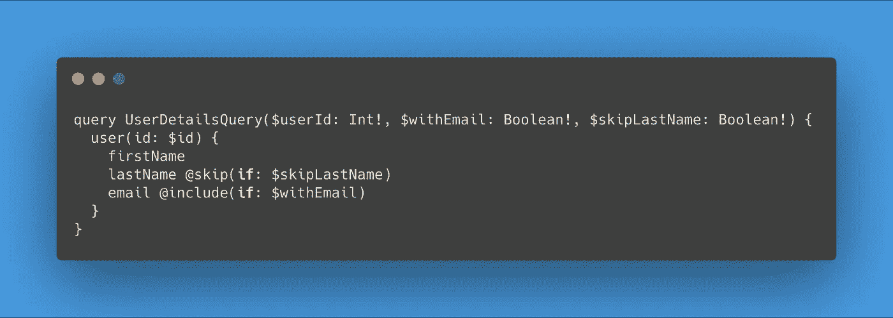
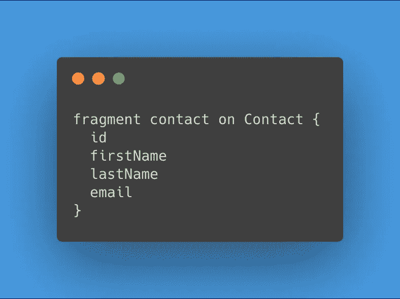
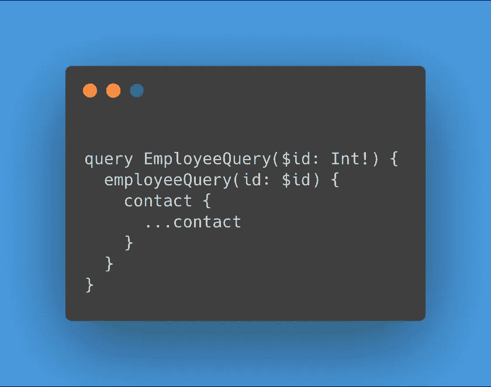

# Android 中的 GraphQL

> 原文：<https://levelup.gitconnected.com/graphql-in-android-563c9cea705e>

# 介绍

GraphQL

我们编写的大多数 Android 应用程序都遵循这个循环:从远程服务器获取/发送数据，处理数据，将数据保存在本地，然后以有意义的方式显示数据。

如果您一直通过 API 从远程服务器请求数据，那么您很可能使用的是 REST API。然而，鉴于 GraphQL API 相对于 REST API 的优势——最佳的数据提取，没有数据提取过量或不足——它正越来越多地被采用。

在本文中，您将了解在您的 Android 应用程序中开始利用 GraphQL 的能力所需的基础知识。

# GraphQL 是什么？

GraphQL 是一种用于 API 的查询语言。作为 API 的查询语言，它定义了如何对 API 进行查询的规范。与其他查询语言类似，它有不同的操作类型，这些操作类型定义了可以执行的查询类型。

# 询问

GraphQL 中的客户端请求可以是查询，也可以是变异。如果请求从服务器获取数据，那么它就是查询。这类似于 REST 中的 HTTP GET 请求。

示例查询

示例查询包含以下重要内容:

1.  定义请求是查询的操作类型。
2.  便于跟踪查询的操作名称。
3.  字段:GraphQL 查询归结为选择所需的字段。与使用 REST API 相比，这是一个优势，因为可以只获取所需的字段。因此，不存在数据的过度提取。在本例中，查询将只获取名字、姓氏和电子邮件。

# 变化

另一方面，如果客户端请求在 API 上发布数据、更新或删除数据，那么它就是一个变异。

样本突变

在这个例子中，要更新的字段作为参数传递给了 mutation。此外，变异还会返回新的字段值。

# 自变量和变量

有时候只需要查询或改变特定的数据。一个例子是当我们对查询具有特定 ID 的用户数据感兴趣时。GraphQL 使这变得更容易，并通过允许查询和变异接收参数来避免像 REST API 中那样多次调用 API。

参数是通过说明其名称和类型来指定的。

带参数的样本变异

请注意，如果参数类型的末尾有感叹号，则该参数不可为空。在本例中，参数 firstName 的类型为 String，并且不可为 null。

# 指令

这些用于在条件为真时包含或跳过 GraphQL 查询中的特定字段。

样本指令

在本例中，如果$skipLastName 为 true，查询将跳过提取 lastName。此外，如果$withEmail 为真，它将只包括电子邮件字段。

# 碎片

这些是可重复使用的单元。假设您有一个应用程序，您请求客户和员工数据，并在两者中重复联系数据。GraphQL 片段通过使联系人数据成为一个片段，使得重用它成为可能。

片段的定义是以“fragment”关键字开始，后跟片段名称，如下所示:

样本片段

然后如下所示使用该片段:

使用片段的示例查询

# (计划或理论的)纲要

与 SQL 中的模式类似，graphQL 模式描述了客户端可以请求的数据、字段和类型。

这是 API 和客户端之间的契约。无论何时发出请求，在执行之前都会首先根据模式进行验证。

# 结论

在本文中，您已经学习了在 Android 应用程序中开始使用 GraphQL 所需的概念。在下一篇文章中，您将通过构建一个向 GraphQL API 发出请求的示例应用程序，学习如何在您的 Android 应用程序中应用这些概念。

感谢莫伊诺卢瓦·阿德耶米和 T2 的安妮丝·戴维斯

 [## 学习 Android -最佳 Android 教程(2019) | gitconnected

### 29 大安卓教程-免费学习安卓。课程由开发人员提交和投票，使您能够…

gitconnected.com](https://gitconnected.com/learn/android-development)