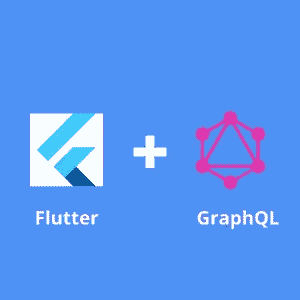

# 颤振中的图 QL

> 原文：<https://levelup.gitconnected.com/graphql-in-flutter-666026cd961>

GraphQL 是一种用于 API 的查询语言。GraphQL 为您的 API 中的数据提供了一个可理解的、完整的描述，并为客户端提供了请求和获得他们所需要的数据的能力，仅此而已。



颤振中的图 QL

> GraphQL 就像一顿自助晚餐，用户可以根据自己的需要选择任何一项，而将其他的排除在外。

使用 GraphQL 的应用程序非常快速和稳定，因为它们控制它们获得的数据，而不是服务器。

使用 GraphQL，我们可以在一个请求中获得许多资源。GraphQL 查询不仅可以访问一个资源的属性，还可以平滑地跟踪属性之间的引用。使用 GraphQL 的应用程序甚至可以在慢速移动网络连接上运行得更快。


颤振中的图 QL

使用 GraphQL，我们可以在不影响现有查询的情况下添加新的字段和类型。通过使用一个不断发展的版本，GraphQL 为应用程序提供了对新鲜和新特性的持续访问，并鼓励更干净和更易维护的服务器代码。

例如，我们的数据库中有以下表格。

```
Continents {
    name
   code
    countries{
      name
    }
  }
```

我们有一个`continents`的模型。这些字段表示大陆的属性。

*   `name`是该大陆的名称
*   `code`是欧洲大陆的代码
*   `countries`各大洲的国家列表
*   `name`是国家的名称

使用 REST API，我们可以将大陆作为

```
{ "data": {
   "continents":[
      {
         "name":"Africa",
         "code":"AF",
         "countries":[
            {
               "name":"Angola"
            }
         ]
      },
      {
         "name":"Asia",
         "code":"AS",
         "countries":[
            {
               "name":"Nepal"
            }
         ]
      }
   ]
 }
}
```

正如我们所看到的，使用 ***REST*** 返回每个大陆和国家的所有属性，即使我们不需要它们。我们可能只需要`continents`和`code`,但我们也会得到国家。

GraphQL 有助于消除这种冗余。使用 GraphQL，我们可以获得我们希望返回的属性，如下所示:

```
query {
  continents {
    name
   code
  }
}
```

这里我们告诉服务器我们只需要来自`Continent`表的`name`和`code`。

这正是我们所需要的。

```
{
  "data": {
    "continents": [
      {
        "name": "Africa",
        "code": "AF"
      },
      {
        "name": "Antarctica",
        "code": "AN"
      },
      {
        "name": "Asia",
        "code": "AS"
      },
      {
        "name": "Europe",
        "code": "EU"
      },
      {
        "name": "North America",
        "code": "NA"
      },
      {
        "name": "Oceania",
        "code": "OC"
      },
      {
        "name": "South America",
        "code": "SA"
      }
    ]
  }
}
```

在深入编码之前，让我们先讨论一下在 Flutter 中使用 GraphQL 时要用到的主题。

*   `HttpLink` - >用于**设置****端点**或后端服务器的 URL。
*   `GraphQLClient` - >用于从 GraphQL 的端点**获取**查询/变异**并连接到 GraphQL 服务器。**
*   `GraphQLCache` - >用于缓存我们的**突变**和**查询**。它由一个参数`options`组成，我们在缓存操作中传递存储类型。
*   `GraphQLProvider` - >这是包装小部件以便进行查询/变异的小部件。
*   `GraphQLClient` - >传递给`GraphQLProvider`。GraphQLProvider 使这个客户机对树中的所有小部件都可用。
*   `Query` - >是用来查询 GraphQL 服务器的小部件。
*   `Mutation` - >这个小部件用于对 GraphQL 服务器进行突变。
*   `ValueNotifier` - >它是保存单个值的更改通知程序。当旧值被新值更改时，它会通知侦听器

# 让我们开始吧


GraphQL 颤振中的深潜

首先，我们需要在`pubsec.yaml`文件中添加依赖项[、graphql_flutter](https://pub.dev/packages/graphql_flutter) 。

```
dependencies:
  graphql_flutter: ^5.1.0
```

为了使用这个小部件，我们需要导入它。

```
import 'package:graphql_flutter/graphql_flutter.dart';
```

然后我们为`GraphQLProvider`定义`HttpLink`和`client`。

```
final HttpLink httpLink = HttpLink("[https://countries.trevorblades.com/](https://countries.trevorblades.com/)");final ValueNotifier<GraphQLClient> client = ValueNotifier<GraphQLClient>(
      GraphQLClient(
        link: httpLink,
        cache: GraphQLCache(store: HiveStore()),
      ),
    );
```

GraphQL 的 URL 是使用`HttpLink`创建的，它定义了 GraphQL 端点的 URL。

`cache`被传递给`GraphQLClient`以告知使用缓存机制。

`GraphQLClient`的实例被传递给一个`ValueNotifier`。这个`ValueNotifier`用于保存单个值，当单个值改变时，它由监听器组成。`graphql_flutter`当来自 GraphQL 端点的数据发生变化时，使用它来通知它的树部件，使 graphql_flutter 更具反应性。

然后，在进行 GraphQL 查询和变异之前，我们必须用`GraphQLProvider`包装我们的根小部件。必须向其`client`属性提供`GraphQLClient`实例。

```
GraphQLProvider(
      client: client,
      child: MaterialApp(
          title: 'GraphQL Demo',
          theme: ThemeData(
            primarySwatch: Colors.blue,
          ),
          home: const HomePage()),
    )
```

# 问题

为了进行查询，我们使用了`Query`小部件。

在这里，`ListView`小部件被`Query`小部件包装，我们从 GraphQL 服务器呈现与非洲相关的国家列表，代码为`AS`。因此，我们必须用`Query`包装这个小部件，以显示它获取的数据。

查询小部件不能是树中最顶层的小部件。它可以放在任何其他地方，只要将使用其数据的小部件在它下面或被它包装。

此外，查询小部件传递了两个属性:options 和 builder。

`**options**`

```
final String query = r"""
                    query GetContinent($code : ID!){
                      continent(code:$code){
                        name
                        countries{
                          name
                          code
                        }
                      }
                    }
                  """;options: QueryOptions(
         document: gql(query),
         variables: const <String, dynamic>{"code": "AF"}),
```

查询的配置被传递给小部件`Query`。参数`options`是`QueryOptions`的一个实例，它公开了我们用来为`Query`小部件设置选项的属性。

`document`属性用于设置或传递我们希望`Query`小部件执行的查询。这里我们传递了`query`字符串:

```
final String query = r"""
                    query GetContinent($code : ID!){
                      continent(code:$code){
                        name
                        countries{
                          name
                          code
                        }
                      }
                    }
                  """;
```

`**builder**`

它是函数属性。当查询小部件向服务器发出请求时，就会调用它。使用来自查询的数据调用它，并用于获取更多数据以进行分页和重新获取数据。

# 让我们连接起来

我们可以成为朋友。在[脸书](https://www.facebook.com/nabin.dhakal.714/)、 [Linkedin](https://www.linkedin.com/in/nabindhakal/) 、 [Github](https://github.com/nbnD) 、 [Youtube](https://www.youtube.com/channel/UCW6oYt_3QSl7J2HSHNqwXWw) 、 [BuyMeACoffee](https://www.buymeacoffee.com/nabindhakal) 和 [Instagram](https://www.instagram.com/nbn_d_/) 上查找。

探访:[颤振路口](https://flutterjunction.com/)

**投稿:** [BuyMeACoffee](https://www.buymeacoffee.com/nabindhakal)

# 结论

我们在这篇文章中已经讨论了很多。在这里，我们学习了如何使用 GraphQL 和 Flutter。

如果你学到了新的东西或者想提出一些建议，请在评论中告诉我。

如果你喜欢这篇文章，请点击👏图标，它为您提供了传递所有新事物的动力。

此外，关注令人兴奋的文章和项目的更新。

通过分享学习对学习过程产生了巨大的影响，并使社区越来越大。

分享是吸引其他爱好者的磁石。

因此，让我们朝着扩大我们的学习社区迈出一小步。

与你的朋友分享这篇文章，或者如果你喜欢这篇文章，就在推特上发表评论。

# 在以下时间吃饱:

[](https://github.com/nbnD/flutter_graphql_demo) [## GitHub-nbnD/flutter _ graphql _ demo:在 flutter 中使用 graph QL 的简单例子。

### 此时您不能执行该操作。您已使用另一个标签页或窗口登录。您已在另一个选项卡中注销，或者…

github.com](https://github.com/nbnD/flutter_graphql_demo) 

# 分级编码

感谢您成为我们社区的一员！在你离开之前:

*   👏为故事鼓掌，跟着作者走👉
*   📰查看[级编码出版物](https://levelup.gitconnected.com/?utm_source=pub&utm_medium=post)中的更多内容
*   🔔关注我们:[推特](https://twitter.com/gitconnected) | [LinkedIn](https://www.linkedin.com/company/gitconnected) | [时事通讯](https://newsletter.levelup.dev)

🚀👉 [**加入升级人才集体，找到一份惊艳的工作**](https://jobs.levelup.dev/talent/welcome?referral=true)