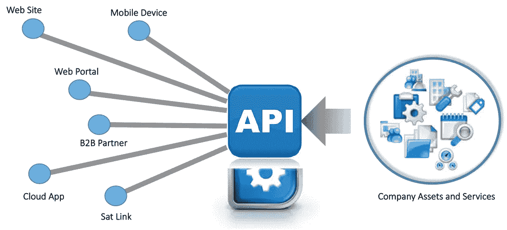
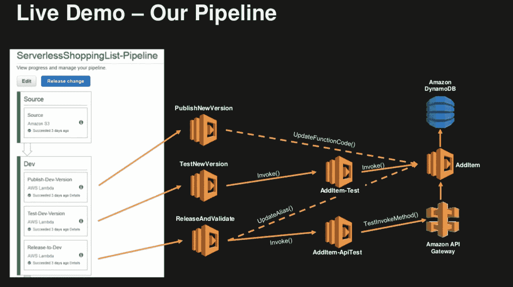
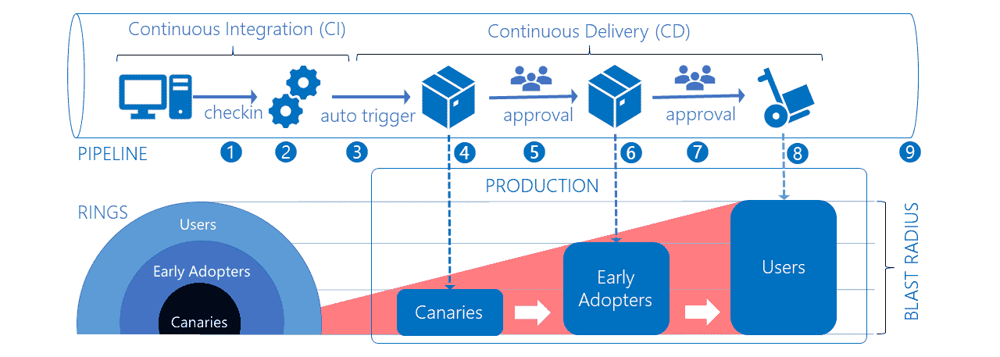
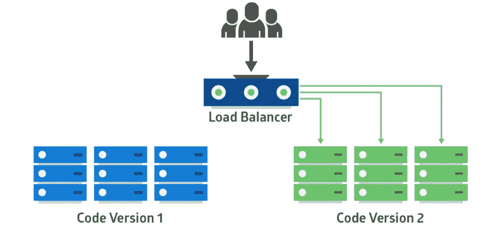

# GraphQL 是新的 API 网关

> 原文：<https://levelup.gitconnected.com/graphql-is-the-new-api-gateway-383edeed4bcd>

## 利用 GraphQL 保护您的外部 API 并减少攻击面



来源:https://www.forumsys.com/wp-content/uploads/APISM.png

我最近参与的许多项目之一就是从头开始设计一个新的应用程序。这是一个大型企业业务应用程序，将有许多前端用户。所需的逻辑和功能数量将在架构中的大约 50 个微服务中结束，一些部署到云，一些需要在 OpenShift 集群中本地托管，这将是我们与遗留数据系统的连接。

这家公司以前从未构建过如此多的微服务，也没有在云中使用过。棘手的问题之一是如何协调服务网格，以确保前端的变化不会破坏应用程序，后端服务的变化也不会破坏前端。

> 我推荐的解决方案是:利用 GraphQL 作为一个**企业 API 网关**。

## **简化部署流程**

所有这些 API 的一个问题是，对其中任何一个 API 的更改都可能会破坏另一个 API。虽然“微服务”应该是独立的，但实际上这仍然意味着在响应中丢失数据。

当我们有两个部署了不同服务的平台时，这变得更加复杂。对于本地 OpenShift 和云原生 lambda 服务，将使用不同的 CI/CD 管道。

用 GraphQL 作为我们所有服务的前端简化了协调这些平台部署的需要。你怎么问？现在，我的前端应用程序将只与一个端点对话。这是一个用于查询和发布数据的无版本模式，所以我不需要对前端进行更改，因为后端的一些内容已经发生了变化。GraphQL 端点保持不变，即使我的后端发生变化也能继续工作。



Lambda 的 CI/CD 管道示例([来源](https://blog.h4.nz/media/Serverless-my-micro/Lambda%20Pipeline%20Example.png))

## 简化安全性

这个架构带来的另一个话题是如何保护我们所有的服务？我们是否构建了一个在访问其他服务之前必须被称为 sure 的安全令牌服务？我们是否为每个服务添加逻辑，以确保令牌在报头中，并且在任何地方都得到验证？

再说一次，我的答案是不！让 API 网关位于所有服务的前端，可以让您将安全检查/验证提升一个层次。这使得开发人员可以专注于开发具有商业价值的功能。它还减少了膨胀和到处重复的额外代码。

我们可以用 GraphQL 实现几件事来提高安全性:

**深度限制**

```
import depthLimit from 'graphql-depth-limit'
import express from 'express'
import graphqlHTTP from 'express-graphql'
import schema from './schema'

const app = express()

app.use('/graphql', graphqlHTTP((req, res) => ({
  schema,
  validationRules: [ depthLimit(10) ]
})))
```

**速率限制**

这个 [GraphQL 速率限制](https://github.com/teamplanes/graphql-rate-limit)插件允许你以三种不同的方式指定查询和变异的限制，自定义指令 graphql-shield，或者使用基本速率限制器函数。

该插件允许您设置时间窗口和限制。对高度易受攻击的突变和查询(如登录)设置较大的时间窗口，对不太易受攻击的查询设置较短的限制，这将有助于您为合法用户保持良好的体验，同时也是攻击者的噩梦。

**查询费用限制**

```
app.use(  
  '/graphql',  
  graphqlExpress(req => {    
    return {      
      schema,      
      rootValue: null,      
      validationRules: [        
        costAnalysis({          
          variables: req.body.variables,          
          maximumCost: 1000,        
        }),      
       ],    
     }  
   })
)
```

## 新的部署选项



来源:[https://docs . Microsoft . com/en-us/azure/devo PS/migrate/media/phase-rollout-with-rings/phase-rollout-with-rings-pipeline . png？view=azure-devops](https://docs.microsoft.com/en-us/azure/devops/migrate/media/phase-rollout-with-rings/phase-rollout-with-rings-pipeline.png?view=azure-devops)

如果没有 GraphQL，我将不得不非常小心地对 API 进行版本化和更新。我可以运行多个版本的 API，如`/v1`和`/v2`，但我必须确保上游 API 和前端应用程序对 `/v2` 进行更新，以便淘汰`/v1`。此外，我将不得不在同一个代码库或容器中同时支持这两者，这使它变得更脆弱，更容易发生重大变化。有了充当代理的 GraphQL 服务，我可以推出一个 T4 容器，让两者并行运行。我可以修改 GraphQL 解析器来指向`/v2`，而不需要修改前端代码。这使得部署新功能变得更加容易！

我还可以为任何服务选择任何部署策略，例如:

*   蓝色/绿色
*   金丝雀释放
*   特征标记



蓝/绿部署示例([来源](https://res.cloudinary.com/practicaldev/image/fetch/s--HW_8_gYS--/c_imagga_scale,f_auto,fl_progressive,h_500,q_auto,w_1000/https://thepracticaldev.s3.amazonaws.com/i/m664yyotixnqncprryf0.png))

## 摘要

如今，开发新的应用程序架构的首选当然是查看微服务模式。所有这些小服务一起工作，并暴露在 API 网关之后，以便我的前端 SPA 应用程序可以使用它们向您的最终用户显示信息。

GraphQL 减少了攻击面，简化了应用程序开发以及服务的实际部署。

# 顺便说一下，👏🏻*鼓掌*👏🏻如果你喜欢这篇文章，请举手(高达 50 倍)。它鼓励我继续写作，并帮助其他人找到它:)

请跟随👉 [Tj 博客](https://medium.com/u/97d099c3810d?source=post_page-----383edeed4bcd--------------------------------)了解更多精彩的 DevOps 故事！