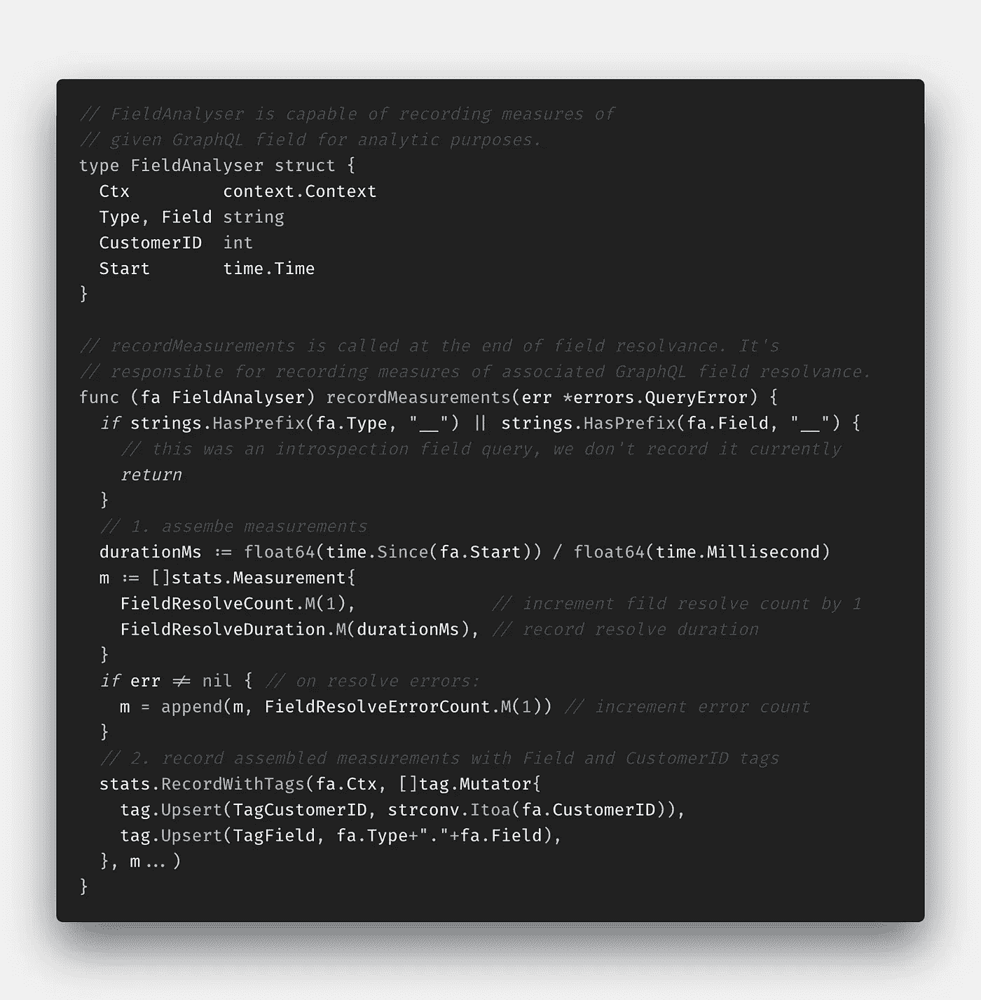

# 使用开源工具实现 GraphQL 的可观察性

> 原文：<https://levelup.gitconnected.com/graphql-observability-with-go-using-open-source-tools-4caaf8f13237>

我和我的团队正在 IBM Watson Media 用 Golang 开发一个 GraphQL API。由于 GraphQL 是独立于传输的，并且大多数传统的监控解决方案依赖于特定于传输的特征(如 HTTP 状态代码和方法)，因此它们并不完全适合监控这种用例。因此，我使用开源工具寻找开箱即用的解决方案，但没有找到任何解决方案，所以我决定为我们自己构建一个堆栈。本文将涵盖整个堆栈，而不仅仅是监控。

我们使用[graph-gophers/graphql-go](https://github.com/graph-gophers/graphql-go)作为 graph QL 服务器，使用[graph-gophers/data loader](https://github.com/graph-gophers/dataloader)作为我们的核心数据获取组件(以解决 N+1 问题)。两者都有对 OpenTracing 的现成支持，所以让我们从它开始。

# OpenTracing

我们所要做的就是初始化一个 OpenTracing tracer(我选择了 Jaeger)并在 Dataloader 中启用 OpenTracing(默认情况下在 GraphQL 服务器中启用)。

为 OpenTracing 初始化 Jaeger 和数据加载器

GraphQL 服务器和数据加载器现在都在报告跟踪。虽然没有它解析器仍然可以工作，但是我们为它们的每个方法添加了`context.Context`参数。GraphQL 服务器通过`context.Context`传播 OpenTracing spans，因此如果解析器不接受它作为参数，它的子树不会在跟踪中显示为一个单独的 span。

具有上下文的 Location.name 的解析方法。上下文参数，即使它不使用它

给定的 Jaeger 环境已经启动并运行，执行以下 GraphQL 查询:

所有服务器的查询 id 和位置

检查耶格用户界面，我们发现如下痕迹。GraphQL 服务器记录精确的 GraphQL 查询(在根区域作为`graphql.query`标签)以及每个解析的字段(接受`context.Context`参数)。Dataloader 记录每个数据加载请求以及批处理请求的执行。两个`Server.location`解析器都调用了`Dataloader.load`，但只有第二个执行了一个`Dataloader.batch`。在`load`和`batch`之间有一个 *10ms* 的间隙，这很好地展示了 Dataloader 的 Golang 实现是如何工作的。在第一次`load`请求时，一个 *10ms* 定时器启动。在此期间，每个后续的`load`请求将被附加到第一个请求上。定时器到期后，收集的请求作为一个*批处理*查询执行。

在 Jaeger UI 上跟踪成功的 GraphQL 查询

# 将 HTTP 响应链接到 OpenTracing

我们的大多数客户在遇到我们系统中的错误时都会开罚单。如果问题是永久性的，我们很容易找到根本原因，但如果是暂时性的，就很难找到了(仅持续 5-10 分钟)。

我们的跟踪已经非常有用了，所以让我们开始在此基础上构建。假设周一早上有一张 bug 票等着我，是关于周末发生的一个临时错误。我有两天的跟踪和日志，我可以缩小范围找到根本原因，但我不想为此浪费时间。我希望立即看到确切的跟踪和相应的日志，而不要浪费任何时间去寻找它们。

在 Jaeger UI 的上图中，跟踪 ID 显示为标题 *3cb8ca2* 。如果出现错误，我们应该将其作为 HTTP 响应头返回，并显示在 ui 上。如果客户提供了跟踪 ID，那么通过这种方式为我们的 bug 单找到相应的跟踪是很容易的。

traceHeader HTTP 中间件在 HTTP 响应头中返回跟踪 ID

# 链接错误日志

大多数时候，我首先读取日志，而不是检查请求的跟踪。我们有一个`Logger`类型，可以在代码中传递，并提供一致的日志格式。我用一个`TracedError`方法对它进行了扩展，该方法记录了所提供的错误消息，并标记了所提供的`context.Context`的跟踪 ID。

一致的错误日志记录，包括上下文的跟踪 ID

现在很容易找到给定请求的日志及其踪迹。在没有显式日志语句的情况下记录所有解析器错误也非常有用。

Server.location 字段的解析程序返回错误，但不记录它

GraphQL 服务器的默认跟踪器是我们已经使用的 OpenTracing tracer，但是我们可以用任何符合`Tracer`接口的东西来替换它。它必须既有`TraceQuery`又有`TraceField`方法(它有一堆参数，所以我截掉了我们不需要的)。`TraceQuery`将在 GraphQL 查询开始时被调用，并且必须返回一个回调函数，该函数将在查询结束时被调用(将查询执行期间发生的所有错误作为参数)。`TraceField`是相同的，但是它将被查询的每个 GraphQL 字段调用。

GraphQL 服务器接受任何作为实现 tracer 接口的跟踪器的东西

因此我实现了`LoggingTracer`。在每个查询开始时，返回回调函数`logErrors`,在出现所有错误的查询结束时调用该函数。它按错误消息聚合日志，以避免在多个解析器中出现相同错误时泛滥，并调用日志消息，包括跟踪 id。

LoggingTracer 使用跟踪 ID 在查询执行结束时聚合并记录错误

# 支持多个跟踪器

现在，我们可以使用默认的`OpenTracing`跟踪器或我们的`LoggingTracer`，但不能同时使用两者(任何数量的跟踪器都可以传递给 GraphQL 服务器，但它只会按顺序使用最后一个)。让我们实施`ChainingTracer`救援吧！

`TraceQuery`和`TraceField`都要依次调用被传递的 tracer 的对应方法，将前一个 tracer 返回的`context.Context`传递给下一个 tracer。它还应该返回一个回调函数，该函数按照提供的顺序调用链式跟踪器的回调函数。

ChainingTracer 可以链接提供的跟踪器(TraceField 方法类似于 TraceQuery)

现在可以同时使用`OpenTracingTracer`和`LoggingTracer`:

链接 OpenTracingTracer 和 LoggingTracer

让我们回顾一下目前我们所掌握的情况。每个 HTTP 响应都返回一个`trace`头，它具有给定请求的跟踪 ID 的值:

跟踪 2b6bfdcc6e856c0b 的响应跟踪标头示例

在 Jaeger UI 上可以很容易地找到 *2b6bfdcc6e856c0b* 的相应踪迹。如果发生解析器错误，则显示解析器错误(聚合在请求范围中，并单独显示在解析器范围的`graphql.error`标记中):

Jaeger UI 中跟踪到 2b6bfdc 有解析器错误

也可以很容易地找到 *2b6bfdcc6e856c0b* 的日志；

聚集 *2b6bfdcc6e856c0b* 的错误，并记录跟踪 ID

# 监视

我开始抱怨传统的监控工具不能很好地用于 GraphQL，但是我们实现了除监控之外的所有东西。这是有原因的。我认为整个堆栈对许多人来说都是有价值的，我们将在现有的基础上建立监控。我们将使用 tracers、 [OpenCensus](https://opencensus.io) 和 [Prometheus](https://prometheus.io/) 作为核心构件。

OpenCensus 提供了一种声明性的方法来构建指标(或 OpenCensus 中所谓的视图)。每个视图的工作流程如下:

1.  定义所需的标签。指标可以缩小到标记值(例如:在下面的例子中，我们可以查看每个客户的每个 GraphQL 字段的指标)。这些标签最终将成为 Prometheus 标签，它建议不要使用任何基数大/取值范围不受限制的标签(每个标签组合都会在 Prometheus 中创建一个新系列)。我们使用 GraphQL 字段和客户 id，这似乎是一个完美的反例。我们的模式实际上非常紧凑，我们的客户范围有限(它不是一个注册后任何人都可以使用的公共 API)，并且我们对这些详细的监控场景有很短的数据保留期。
2.  定义一个度量单位。度量代表可以度量的东西(字面上可以是任何东西)。在下面的例子中，我们测量一个字段的错误计数。计数没有单位，因此，我们将其定义为*无量纲*(即:对于时间，我们给*毫秒*单位)。
3.  使用标签、度量和聚合函数定义视图。下面我们定义了一个视图，它使用我们的标签和度量来表示每个客户的字段错误计数。通过 *Count* 方法聚合测量值(即:对于延迟，我们将使用 *Distribution* 方法，该方法将测量值公开为预定义存储桶中的分布)。
4.  注册曝光视图。

定义 OpenCensus 标签、字段、视图，并注册它们以公开

我们必须用数据填充这些视图(实际上是它们的度量)，因此我们实现了另一个 tracer: `AnalyticsTracer`。`TraceQuery`方法使用`QueryAnalyser`，而`TraceField`方法使用`FieldAnalyser`来记录测量值。`AnalyticsTracer`的唯一职责是初始化`Analysers`(记录解析器的开始时间，存储被分析的查询/字段的相关属性)并将它们的`recordMeasurements`注册为结束回调函数。

AnalyticsTracer 初始化 QueryAnalyser 和 FieldAnalyser 以记录测量值(TraceQuery 方法类似于 TraceField)

由`QueryAnalyser`和`FieldAnalyser`实际测量相关数据并通过定义的 OpenCensus 测量记录它们。让我们回顾一下`FieldAnalyser`的实现(`QueryAnalyser`也差不多):

1.  解析的 *GraphQL* *类型*和*字段*存储为结构字段，以及字段解析器的*客户 ID* 和*开始时间*。
2.  *记录测量值*在现场分解器结束时调用 get。自省查询以 __ 开始。我们跳过这些记录，因为它们对我们的目的不感兴趣。
3.  构建测量值(解析器持续时间、计数和错误计数)并使用适当的标签进行记录。

FieldAnalyser 记录给定类型的测量值

OpenCensus 视图现在已经定义并填充了测量值，但是我们需要一个具体的监控解决方案来暴露它们，我选择了 Prometheus。我们这样初始化它:

1.  使用默认的 Prometheus 注册表创建一个新的 OpenCensus 视图导出器。Go process 的内部度量(即:打开文件描述符的数量， *goroutines* )已经注册到默认注册表中，因此我发现继续使用它比创建一个新的更方便。
2.  为视图曝光注册创建的导出器。现在每个视图都通过*视图注册。寄存器*将通过这个曝光。
3.  注册默认 OpenCensus 服务器视图。这些是普通的 HTTP 指标(即:延迟、HTTP 方法、状态代码)。
4.  在 */metrics* HTTP 端点下公开导出器。Prometheus 服务器将收集此端点的度量。

从 prometheus 注册表创建度量导出器，并将其作为 HTTP 处理程序附加到/metrics

现在转到流程内部，普通的 HTTP 和 GraphQL 特定的指标在 */metrics* 处公开，并准备好被抓取！我还制作了一些精美的 Grafana 仪表盘，这是其中的一部分，它使用了 *FieldAnalyser* 的测量值:

使用 FieldAnalyser 测量值的 Grafana 仪表板

# 结论

GraphQL 只有几年的历史，可能没有适合所有事情的工具。我认为大部分基本构件都已经存在，因此我们应该开始为这种令人惊叹的语言构建堆栈。

有问题吗？请在评论中告诉我！如果你喜欢这篇文章，请考虑分享它。

## 编辑:

你可以在这里找到示例源代码:[https://github.com/IBM/graphql-observability-example](https://github.com/IBM/graphql-observability-example)。