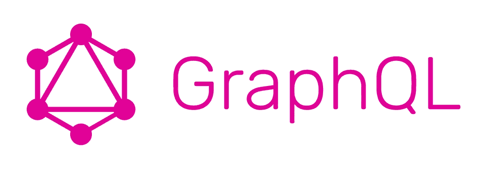

# GraphQL 或无 GraphQL

> 原文：<https://levelup.gitconnected.com/graphql-or-no-graphql-395c80edc3d>

在过去的几个月里，我一直致力于 REST API 性能的改进。这个 API 不拥有任何数据库，基本上依赖于其他服务来为它提供所需的信息。因此，我们必须探索尽可能快地处理或收集信息的方法。

在这个分析过程中，我探索了 GraphQL 帮助我们完成任务的可能性。有很多关于 GraphQL 解决所有问题的流行词，但我不想仅仅因为它如此流行和受欢迎就接受它。所以我围绕它做了一些研究和原型制作，并将其与我的 rest 端点实现进行了比较，以找出一些优缺点。

# **为什么选择 GraphQL**

## **赋予客户更多权力**

这是 GraphQL 最重要的好处，客户端或前端可以完全控制数据需求。GraphQL 允许客户端请求数据，而不是后端将数据推送到客户端。因此，服务器将只处理需要的内容，并且只返回需要的内容。它节省了 CPU，网络呼叫，网络带宽。

例如，我正在开发的 permission API 对于每个视图都有不同的权限集。根据视图的复杂程度，权限从 1 到 10 不等。所以 GraphQL 完全符合这里的要求。而不是服务器评估所有的权限，并让用户从中选择。GQL 将允许查看者请求它所需要的任何权限，服务器将只评估和提供那些权限。超过 50%的视图是简单的，所以它们会变得更快。

## **降低 Rest 端点爆炸/复杂性**

处理上述场景的另一种方式是基于每个视图提供多个端点。或者，您可以向客户端提供过滤器，以便在查询参数中传递权限名称。老实说，我不喜欢在 API 中实现这些条件检查，在我看到这个之后，你可以在 GraphQL 中得到它，因为它使你的代码有条件和混乱。

## **模式让你的领域模型非常清晰**

当您创建一个 GraphQL 模式时，您需要在实体之间建立一个非常清晰的关系，因为您需要遍历这个图。而在 rest API 中，将所有东西放在同一个 API 中是如此容易。我见过很多 API 里面有不合适的东西，为了节省客户的额外调用。很难从 API 中理解它。GraphQL 模式让客户很清楚在哪里可以找到他们想要的东西。

## **共享模式可以帮助大家**

多少次我们努力寻找为我们提供所有正确数据的端点。可能一直都是。使用 GraphQL 模式，任何人都可以很容易地查看模式并弄清楚它。

## **启用并行处理**

在 GraphQL 中，每个类型/字段都有一个获取数据的提供者。同一级别的字段可以并行提取。例如，如果一个用户对象和您想要获取他们的工作细节和健康历史，GraphQL 可以并行执行数据获取器来优化它。在我的例子中，我必须提取十个权限，我可以通过我自己的线程执行器来完成，但是使用 GraphQL，它是现成的。

# 为什么没有-GRAPHQL

## **剩余端点是简单的积垢**

REST 端点非常简单。例如，通过 Id 获取用户，而不需要过滤数据。那么 GQL 可能是一个负担，因为 rest APIs 启动和运行起来更快。当您的客户需要多种形状的数据时，GraphQL 非常有用。

## **失败的影响很大。**

随着越来越多的人开始使用 GraphQL，schema 会扩展以便人们可以轻松地找到数据是非常自然的。有这么多人在一个模式下工作，任何一个人的改变都会影响到很多其他人。

您需要非常小心使用 GraphQL。对于 REST API，只有 API 和它的最终用户会受到影响。

## **复杂到处理性能为 n+1 的情况。**

使用 GraphQL，如果您需要查找关于记录列表或记录集合的信息，那么处理它就变得很棘手。例如，如果您需要用户列表及其地址的详细信息，那么它将执行 n+1 个查询。一个用于用户列表，然后 n 个查询用于每个用户的地址。

> 现在，它可能会严重影响性能，因此必须小心处理。

## 绝对控制你做什么和你如何做事

虽然 GraphQL 为您提供了许多我们在上面看到的现成的东西，但是使用 REST API，您确实可以对请求的处理进行更多的控制。无论是批量数据库请求、并行化、利用线程局部变量，Rest API 都更易于管理。

# 摘要

我认为随着现代应用程序的复杂性和需求，GraphQL 的使用为后端和前端的开发人员提供了相当大的灵活性。虽然学习和开始使用 GraphQL 可能需要一点时间，但这似乎是值得的。

.