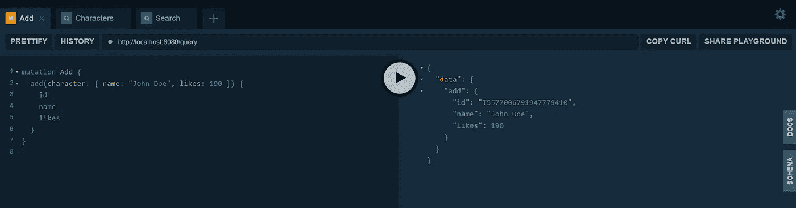

# Golang 中的 GraphQL 服务器/API

> 原文：<https://levelup.gitconnected.com/graphql-server-api-in-golang-601e41408d03>

GraphQL 是一种用于 API 的**开源查询语言**，也是一个用现有数据完成这些查询的运行时。自 2012 年以来，脸书的移动应用一直由 GraphQL **提供支持。**


使用 GraphQL，您可以根据客户需求定义数据的结构。因此**服务器声明什么资源是可用的，而客户机询问它需要什么。**您可以在一个请求或查询中访问多个资源。还有一点**它只有一个端点，不像 REST API。**如果你想了解更多关于 Golang 的 REST API，请点击这里:

[](https://ankithans1947.medium.com/your-first-rest-api-in-golang-with-mux-b87a84746d00) [## Golang 中的第一个 REST API(使用 mux)

### Go 由两名谷歌软件工程师创建。这是一种相当新的语言，在某种意义上是新的(与其他语言相比)

ankithans1947.medium.com](https://ankithans1947.medium.com/your-first-rest-api-in-golang-with-mux-b87a84746d00) 

好了，让我们完成初始设置吧！

# 创建 Github 存储库

来存储我们的代码，这也有助于初始化 Go 模块。为`**.gitignore**`文件选择语言为`**Go**`。如果需要，您可以添加许可证或自述文件。

在您的本地系统中克隆 repo，并在您喜欢的代码编辑器中打开它。


所以在这里我们开始编写我们的 GraphQL API。

# 第一步

现在**在你的项目目录中初始化 Go 模块**，在终端中打开文件夹。你必须打字

```
go mod init github.com/<YOUR_GITHUB_USERNAME>/<REPOSITORY_NAME>
```

我的情况是这样的


# 第二步

我们使用`**gqlgen**` 来设置我们的 GraphQL 服务器。因此，将 gqlgen 安装到您的项目中，并初始化 GraphQL 服务器。

```
go get github.com/99designs/gqlgen
go run github.com/99designs/gqlgen init
```


上述步骤将为您生成一些代码，这些代码将包含以下文件和文件夹。


`**go.mod**`和`**go.sum**`将包含你所有的安装包。`**gqlgen.yml**`文件将具有自动生成的 GraphQL 配置。`**server.go**`是我们服务器的入口点。

对于本教程，您不必弄乱`graph`文件夹之外的任何文件😀。

我们将创建一个**字符 API** ，其中用户可以**添加一个字符，搜索一个字符，并获得所有字符**。

现在进入`**graph/schema.graphqls**` 文件。清理文件，现在我们将为 API 定义 GraphQL 模式。下面是为 Characters API 定义的模式。我们将进行查询和突变。

**常规:**

*   `Query` —用于查询数据(`SELECT`操作)
*   `Mutation` —用于新建和更新/删除现有数据(`INSERT`、`UPDATE`、`DELETE`)

现在删除`**graph/schema.resolvers.go**` **。在`**resolver.go**`文件中，在**解析器**结构上方添加以下注释:**

```
**//go:generate go run github.com/99designs/gqlgen**
type Resolver struct{}
```


这将为我们在`schema.graphqls`中编写的模式自动生成代码。下一步是删除`**schema.resolvers.go**` **、**，以便 **gqlgen** 可以为我们最新的模式生成代码。

要生成代码，请进入终端中的图形文件夹并键入:

```
$ cd graph
$ go generate
```


您将能够看到一些文件中的更改。你的`**models_gen.go**`看起来会像这样。


在`**schema.resolvers.go**` 中，您将看到三个未实现的功能。这些只是我们在编写 GraphQL 模式时指定的函数。

1.  **添加**(添加字符)
2.  **字符**(获取所有字符)
3.  **搜索**(按名称搜索角色)


现在我们需要实现这些功能，我们的 API 将准备好测试！

我们将使用一个**假数据库(切片)**作为我们的数据库。Slice 是 Go 中动态调整大小的数组。

要使用它，我们必须在我们的**解析器结构**中添加字符片:

```
**type Resolver struct {** **characters []*model.Character****}**
```

`**resolver.go**`文件应该是这样的


然后我们必须编写 API 的**业务逻辑，我们就完成了。下面是对`**schema.resolvers.go**` 文件功能的修改。**

是的，我们已经正式写完代码了。现在让我们测试我们的 GraphQL API 吧！要运行服务器，你必须进入项目所在的根目录并键入`**go run server.go**`


在你的浏览器中打开`**http://localhost:8080/**`，你会看到一个漂亮的用户界面与 GraphQL API 交互。**下面是如何在 GraphQL 中写出查询和变异来测试它！**



至此，您终于成功创建了第一个 GraphQL API。希望你能从中吸取教训。有疑问吗？请在评论中给我留言。**如果你已经做到这一步，那么请为这篇文章鼓掌吧！**

如果你想和我联系，这是我的联系方式

[](https://github.com/ankithans) [## ankithans -概述

### const { Node，Golang，Python，React，Flutter，DSA } = @ ankithans 这个项目是在 2021 年 Treehacks 期间建造的…

github.com](https://github.com/ankithans) [](https://linkedin.com/in/ankithans) [## Ankit Hans -开源开发者- LibreHealth | LinkedIn

### 经验丰富的全栈工程师，具有开发领域的工作经历。熟练的 MERN…

linkedin.com](https://linkedin.com/in/ankithans)