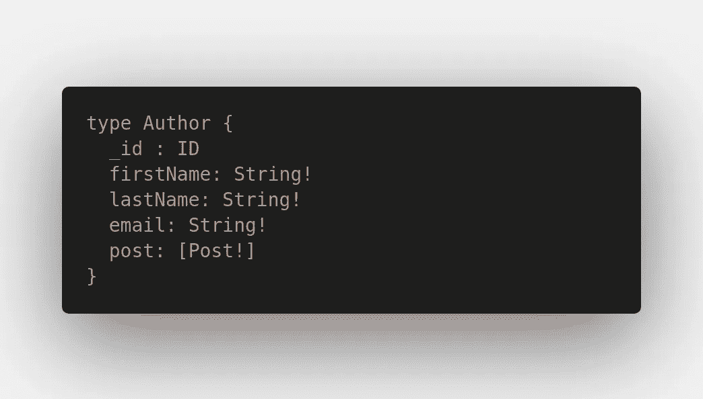
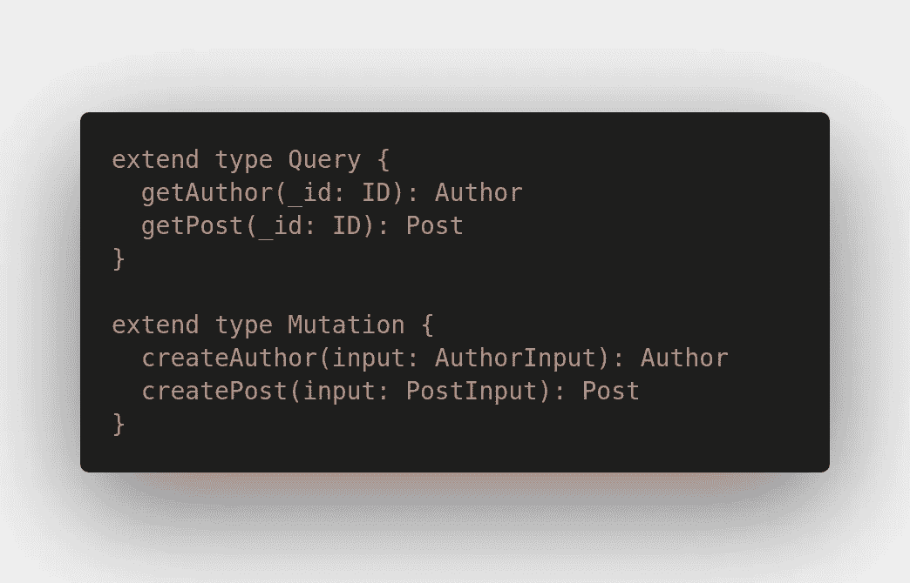
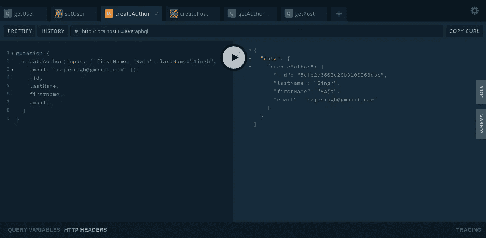
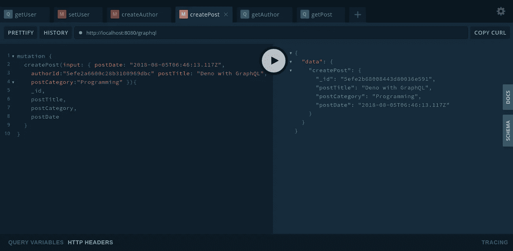
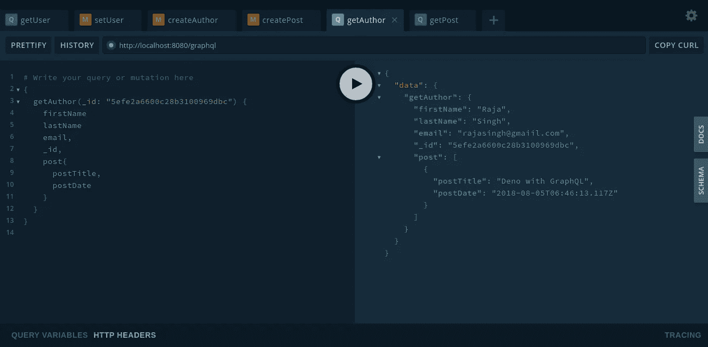
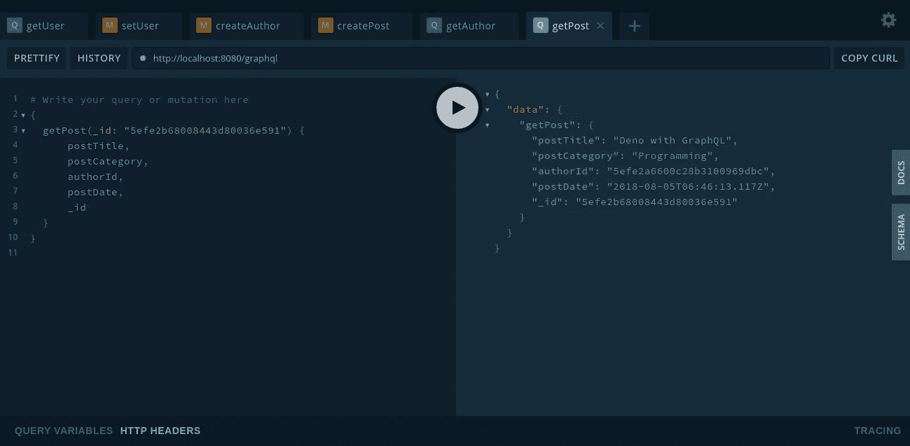

# 使用 Deno 和 Oak 框架的 GraphQL 服务器

> 原文：<https://levelup.gitconnected.com/graphql-server-with-deno-and-oak-framwork-953a74e97aa3>

[在我之前的话题](https://medium.com/@singhcoolish/deno-with-graphql-e1f192259984)中，我已经解释了以下事情

1.  GraphQL 是什么？
2.  比较 REST API 和 GraphQL
3.  GraphQL 术语

# 用 Deno 创建 GraphQL 服务器

**我们的德诺属地**

[***Oak***](https://deno.land/x/oak)***:***Deno 的 [http](https://doc.deno.land/https/deno.land/std/http/mod.ts) 服务器的一个中间件框架，包括一个路由器中间件。

[***Oak-GraphQL***](https://deno.land/x/oak_graphql)***:***一个简单的用于 oak deno 框架的 graph QL 中间件。

[***graph QL-Deno:***](https://deno.land/x/graphql_deno)**这是 graphql-js 到 Deno 的一对一端口。它正在工作，完全适应 Deno 并导出 ts 类型和 JS 代码。**

***首先我们用****oak****框架和****oak _ graph QL****制作基本的 deno 服务器。我们正在为导入包创建一个公共依赖文件。***

# ****GraphQL 模式****

**GraphQL 模式是客户端可以从 GraphQL API 请求的数据的描述。**它还定义了客户端可以用来从 GraphQL 服务器读取和写入数据的查询和变异函数。**换句话说，您在 GraphQL 模式中指定您的客户端或应用程序 UI 数据需求。**

**模式是使用 GraphQL 模式语言(也称为**模式定义语言**，SDL)编写的。**

**使用它，您可以定义对象类型和字段来表示可以从 API 检索的数据，以及定义 API 允许的操作组的根类型。**

****对象类型****

****

**对象类型**

****根类型****

**根类型是查询类型、变异类型和订阅类型，这是您可以从 GraphQL 服务器运行请求的三种类型的操作。**

****

**根类型**

**让我们继续创建一个模式。添加一个新文件`src/schema/author.ts`，内容如下:**

**上面是 GraphQL 模式。在其中，我们定义了一个具有四个字段的 **Author** 类型、一个具有五个字段的 **Post** 类型和一个具有两个字段的根查询类型。**

## ****GraphQL 查询****

**根查询类型中的两个字段定义了服务器可以执行的查询/操作。 **getAuthor** 根据作为参数传递给查询的 id 返回一个**作者。 **getPost** 基于作为查询参数传递的 id 返回一个 **Post。******

## ****GraphQL 突变****

**GraphQL 变异用于执行**创建、更新和删除**操作。 **createAuthor** ， **createPost** 根据输入对象执行插入操作。**

# ****解析器****

**我们的 API 能够运行两个查询操作**

**一个基于 id 用作者文章数组检索**作者，另一个基于 id** 检索**文章。我们的下一步是定义如何解析这些查询，以便将正确的字段返回给客户端。****

> ****GraphQL 有一个执行算法。**这个执行算法的实现就是**通过遍历模式中的每个字段，并执行它们的“解析器”功能来确定结果，从而将来自客户端的查询转换成实际结果。****

**将以下代码添加到 src/resolver/author.ts 中**

**每个解析器函数都接收以下四个参数**

1.  ****parent** :包含调用链中之前执行的解析器的结果。**
2.  ****args** :这些是提供给 GraphQL 查询中的字段的参数。按照我们的例子，这将是 getAuthor 查询的 id 参数 **getAuthor(_id: ID): Author。****
3.  ****上下文** : 这是每个解析器都可以读取或写入的对象。您可以将允许访问数据库或包含 HTTP 请求头信息的对象保留在这里。上下文对象在各个解析器中是相同的，您可以根据需要向其中写入上下文信息。**
4.  ****info** :它保存与当前查询相关的特定于字段的信息以及模式细节。**

# ****GraphQL 查询语言****

**打开命令行并运行以下命令**

**`denon run --allow-net --allow-env --allow-write --allow-read --allow-plugin --unstable server.ts`**

**现在服务器运行在[**http://localhost:8080/graph QL**](http://localhost:8080/graphql)上**

****

**创建作者**

****

**创建帖子**

****

**获取作者**

****

**区别详解**

# **结论**

**如果你有建议，请在评论区告诉我🙋‍♂️**

**谢谢大家！🖤**

**这里是 [**GitHub 仓库**](https://github.com/singhcool/deno-server-graphQL) 的全部源代码。**

**在下一节中，我们将介绍以下内容**

1.  **GraphQL 订阅**
2.  **客户端集成了 React JS 的 GraphQL**