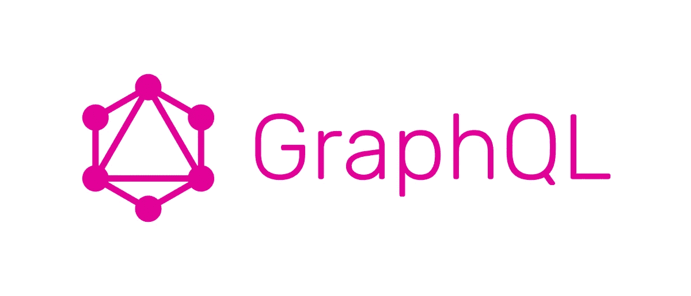
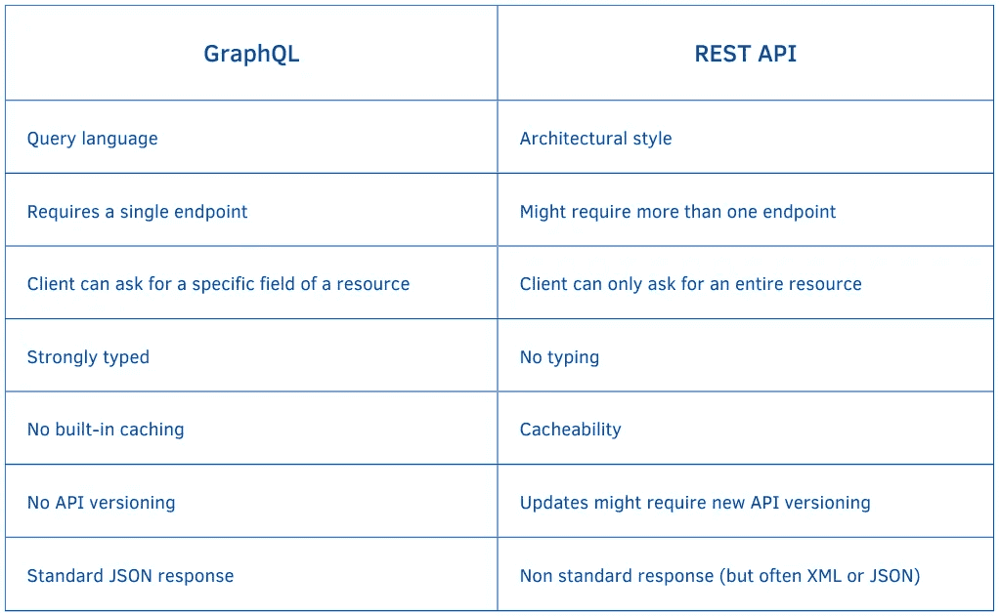

# GraphQL 与 REST API

> 原文：<https://levelup.gitconnected.com/graphql-vs-rest-api-daddb5a5dee5>

## GraphQL 与 REST API 的比较

GraphQL 和 REST APIs 都是通过 web 提供数据和功能访问的方式，它们有一些相似的特性。



GraphQL 徽标

然而，这两种方法之间存在一些关键的差异，这些差异会影响每种方法的优点和缺点。

这篇文章探讨了两个关键的区别，并试图概述 GraphQL 优于传统 REST APIs 的地方。

先来介绍两者。

# REST API

REST(表述性状态转移)是一种软件架构风格，它描述了两个系统可以用来交换信息的统一接口。

对我们来说，有必要知道 REST APIs 有四个特点:

*   **统一接口** —服务器以 JSON 等标准格式发送信息。然而，信息可以以不同的格式存储。
*   **无状态** —客户端可以以任何顺序请求数据，每个请求都是相互独立的。
*   **分层系统** —允许客户端连接到客户端和服务器之间的授权中介，如其他服务器
*   **可缓存性** —允许在客户端存储一些数据以提高性能

# GraphQL

正如在[文档](https://graphql.org/)中所报道的，“GraphQL 是一种用于 API 的查询语言，也是一种用现有数据完成这些查询的运行时。”

我们可以把它分解成 GraphQL 的双重性质:

*   **GraphQL 是一种用于 API 的查询语言** —它不像 REST 那样是一种软件架构风格。
*   **GraphQL 是用于执行查询的运行时**——作为服务器端应用程序的一部分实现的中介，它使用您的数据模式来理解传入查询的结构，并根据您的数据验证它们。

GraphQL 的其他一些特征包括:

*   通过一次呼叫请求特定数据
*   GraphQL 使用类型来确保客户“只询问可能的情况，并提供清晰有用的错误。”

# 主要差异

虽然 GraphQl 和 REST 都提供了对数据的访问，但是它们访问数据的方式有很大的不同，尤其是在两个方面:

1.  **特异性**
2.  **类型的使用**

这些尺寸产生了一些相应的优点和缺点。

# 1)特异性

特异性是 GraphQL 和 REST API 的第一个关键区别。

GraphQL 允许客户机精确地指定它需要从服务器获得哪些数据。

这带来了几个好处:

*   客户端可以在一次调用中访问它需要的特定数据，
*   它可以减少需要通过网络发送的数据量，从而减少带宽使用，
*   最终，它可以通过避免过度提取和提取不足来提高性能。例如，如果您对某个用户名感兴趣，您可以请求该值，并且只能请求该值，这样您就不会得到她的姓氏、年龄、地址和其他可能与数据库中的用户相关联的字段。

另一方面，REST APIs 更加简单。

然而，REST APIs 的简单性是以使用一组固定的端点为代价的，这些端点返回预定义的数据结构，这带来了过量提取和不足提取。

在某些情况下，REST APIs 需要瀑布请求。

## REST 示例

假设您想以编程方式检查我在 Medium 上的一篇文章。对于 REST API(取决于它的结构)，您可能需要

1.  执行一个 HTTP 请求来获取作者的数据，这可能会返回作者文章的 id
2.  执行第二个 HTTP 请求来获取特定的文章 id

此外，您必须等待初始请求完成，以便了解可能用于获取文章的作者信息。

只有在您收到第一个响应后，您才能使用此信息第二次请求检索作者的文章。

```
// First call to users endpoint gets users data including articles id 
GET /users/123 

// Second call to articles endpoint gets the specific user's article
GET /articles/xwz 
```

## GraphQL 示例

在同一个例子中，`query`关键字用于表示客户机正在向服务器请求数据。

`user`字段指定客户端想要访问哪个资源，而`id`参数用于指定客户端想要检索的用户的 ID。

`user`字段还包括一组子字段，指示客户端希望为用户接收的特定数据。在这种情况下，客户端请求用户的 ID 和文章。

```
query {
  user(id: "123") {
    id
    article {
      id
      title
    }
  }
}
```

这些虚构的例子展示了 GraphQL 和 REST APIs 之间访问特定资源的语法是如何不同的。

在 GraphQL 中，客户端指定它想要接收的特定数据，而在 REST 中，服务器定义它返回的数据的结构。

# 2)类型的使用

GraphQL 和 REST API 的第二个关键区别是类型的使用。

GraphQL 是强类型的，这意味着 GrapgQL 运行时可以验证查询，以确保它们是格式良好的，并且它们请求的数据实际上是可用的。

这有助于防止错误，并使使用 API 变得更容易。

## GraphQL 示例

下面是一个典型的例子，其中`UserType`类型定义了一个代表系统中用户的数据结构。

`id`、`name`、`email`和`age`字段都分别与特定类型`ID`、`String`、`String`和`Number`相关联。`!`符号表示这些字段是必填的，不能为空。

```
type UserType {
  id: ID!
  name: String!
  email: String!
  age: Number!
}

type Query {
  user(id: ID!): UserType
}
```

## REST APIs 和 JSON 模式

相比之下，REST APIs 通常更灵活，也更容易使用，因为它们不要求客户端确切地指定它需要哪些数据。

这可以使 REST API 更容易上手，但是如果客户机请求不可用的数据或者服务器以客户机不期望的格式返回数据，也会导致问题。

REST APIs 的一个很好的变通方法是 JSON Schema。

通过使用 JSON 模式，REST API 可以提供一种方法来指定服务器返回的数据的结构，这有助于确保数据以可预测和一致的格式返回。这可以提供强类型的一些好处，例如改进的数据验证和更容易与客户端应用程序集成。

但是，JSON Schema 不是 REST 的内置特性，也不是所有的 REST APIs 都会使用它。

# 总结 GraphQL 与 REST API



GraphQL 和 REST API 之间主要差异的总结

# 谁在使用 GraphQL？

尽管脸书主要参与 GraphQL 定义和参考 JavaScript 实现，但其他知名公司也在使用它并为之做出贡献。GraphQL 现在是一个开源项目。

这里是一些在他们的环境中使用 GraphQL 的公司。


一些使用 GraphQL 的公司

虽然 GraphQL 生态系统正在成长，但采纳者和非采纳者之间并没有明显的界限。

这似乎表明 GraphQL 可以在各行业表现得一样好。

# 结论

总的来说，GraphQL 和 REST APIs 之间的选择取决于应用程序的特定需求和用例。

这两种方法都有各自的优点和缺点，您的正确选择将取决于项目的需要。

如果你有兴趣阅读更多内容，我建议你阅读罗宾·威鲁奇的 [Why GraphQL:优缺点](https://www.robinwieruch.de/why-graphql-advantages-disadvantages-alternatives/#a-growing-graphql-ecosystem)。尽管只有几年的历史，他的文章还是对这个话题进行了详细的概述。