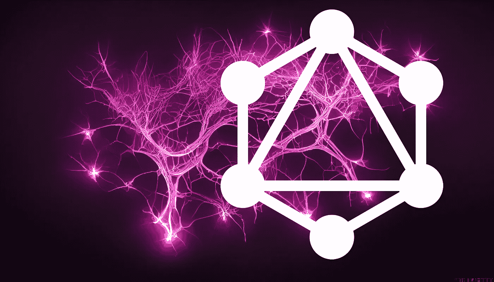

# GraphQL 与 REST

> 原文：<https://levelup.gitconnected.com/graphql-vs-rest-e918d9e0e271>

## 何时选择一个或另一个



中途“想象”出来的神经网络

是时候一起探索 GraphQL 和 REST 的奇妙世界了！

让我们看看什么是 GraphQL，什么是 REST，以及什么时候应该选择一个而不是另一个。他们存在服务的需求是什么？它们是用来做什么的？为什么以及如何使用它们？这么多问题！

我们将看到 GraphQL 相对于 REST-ful 风格的 API 的四个优势。

然后是在 GraphQL 中使用或创建 API 时必须注意的 **2 主要缺点**。

但在此之前，让我们从头说起:

# GraphQL 是什么？

GraphQL 是创建 web APIs 的一种方式。我已经写了关于 API 的文章[，特别是 REST web APIs】。](https://medium.com/gitconnected/what-is-a-rest-api-6471b08eb575)

虽然 REST 标准是组织 API 的标准方式，但 GraphQL 正在稳步挑战这种主导地位。为了理解 GraphQL，以及它的用途，我们将把它与 REST APIs 的组织方式进行比较。

我希望你喜欢最终的结果…

说实话，你几乎可以说 GraphQL 存在*是因为*的“喜欢”。GraphQL 出生在脸书。它的建立是为了满足社交网络的特殊需求。“喜欢按钮”本身体现的一个问题。

因为 GraphQL 的主要目的是**导航一个关系网络**。

# 1.GraphQL 更适合关系数据

我这么说是什么意思？REST 特别适合经典的基于表的数据库设置，其中每一行代表一个对象。毕竟，REST 代表代表性的状态转移。

简单来说，REST 的目的是传递数据库中集合或表的一个或几个项目。在 REST 术语中，这些分别被称为“资源”和“资源集合”。例如，我们请求服务器向我们提供给定书籍或书籍集的数据。

但是社交网络是关于不同类型的物品之间的关系。谁是我朋友的朋友？他们喜欢什么内容？他们看什么？他们对什么类型的内容作出回应？

从概念上讲，友谊、关注和喜欢是链接。它们是事物之间的关系。

这些链接组合在一起，形成一个图表，其中节点(用户、页面)链接在一起(通过喜欢、关注、查看和访问……)。

GraphQL 提供了创建遍历这个图的**查询的方法，跨越不同种类的对象。与 REST 不同，在 REST 中，一个请求通常只能获得一种“类型”的项目。**

这就是 GraphQL 这个名字的含义，它代表“**图形查询语言**”。

与 REST 不同，GraphQL 真正是一种查询语言，例如结构化查询语言(也称为 SQL)。

在 REST 中，入口点(调用的 URL 和使用的 HTTP 动词)决定服务器的响应。在 GraphQL 中，你只能与一个入口点对话。怎么会？

我们发送一个 HTTP 请求，其中包含一页用 GraphQL 编写的描述我们的查询的文本。

这些请求主要有两种类型。您可以发送一个读请求，称为“查询”，或者一个写请求，称为“变异”。

现在，我是边做边学的忠实粉丝，我们将使用《星球大战》的 GraphQL API，如果你喜欢，你可以[跟随。你所需要做的就是 git 克隆一个 yarn 安装和 yarn 开发！](https://github.com/apollographql/starwars-server)

现在，让我们尝试一个简单的查询。在 read 查询中，我们列出了我们想要返回的所有字段。例如，在上面刚刚安装的 StarWars API 中，我们可以:

```
query {
  hero {
    id
    name
  }
}
```

我们要求主要英雄的日期，特别是他的身份证和他的名字。众所周知，这部电影的主角是… R2-D2，很明显

# 2.GraphQL 允许客户端日期整形

这里我们看到了 GraphQL 的**第二个优势**:客户端定义了它希望数据呈现的形状。那有什么意义？

特别是对于移动用户，但一般来说在网络上，要传输的数据量是有成本的，从时间、带宽和交互性来衡量。现在让我们更进一步。

正如我前面提到的，我们可以在同一个查询中浏览关系图的链接。在本例中，我们可以检索英雄的朋友，再次指定我们希望返回的字段:

```
{ hero {
    id name
      friends { id name }
   }
 }
```

这里我们得到了英雄的朋友，以及他们的 id 和名字。

当我在编辑器(GraphQL playground)中键入代码时，它会给我一些建议。更重要的是，游乐场提供文档

这之所以可能是因为*自省*，这是 GraphQL 的第三个优势。

# 3.GraphQL 是自文档化的

什么是自省？GraphQL 有一个内置的特殊特性(建立在处理 REST 的挫败感上)。

它有内置的查询，允许您通过 GraphQL 本身记录哪些字段和查询是可能的。

playground 运行这些查询来显示它的建议。

例如，如果我发送以下查询

```
query { 
  __schema {
    queryType {
      fields {
        name
        type { kind name }
      }
    }
  }
}
```

该查询返回根节点上可能的查询列表。包括上面看到的英雄请求。

这个特性是对 REST 的一个最大缺陷的回应:你需要外部文档来使用它。外部文档容易出错、不完整且过时。

已经有*尝试在 REST 中创建自文档格式。因为没有标准化的实现，所以它们都没有被接受。休息是一个准则。在 GraphQL 中，自文档是规范的一部分，并融入到协议中。*

现在我们来谈谈类型。

# 4.GraphQL 是一种类型化语言

如果我们回到前面的查询，我们会看到自省文档以及文档选项卡显示返回值。

在 GraphQL 中，事物有一个类型。而**强打字是 GraphQ 的第四个优势**。

现在，我们的 API 中有哪些不同的类型？这些类型是如何工作的？

嗯，这种强类型与 GraphQL 的自省结合得很好，它将能够回答我们。

如果我们运行以下查询:

```
query { 
    __schema {
    types { kind name }
  }
}
```

我们看到几个标量类型的字段。这些是基本类型。他们有五个人:

*   字符串，
*   布尔代数学体系的
*   Int(整数)，
*   浮动(浮动)
*   和 ID(可以是字符串或整数)

如果您浏览 GraphQL 文档，您还会看到另外两种符号:感叹号和方括号。

方括号表示返回的是一个列表或数组。

感叹号表示返回的内容不能为空

然后，我们还可以看到特定的类型，如(在星球大战 API 的情况下)人类或机器人，同样，我们可以使用内省来查看这些更复杂对象的类型。

这允许我们同时看到如何在查询中传递参数。

因此，如果我们在寻找名为 Human 的类型，我们查询对象的字段并获取类型。

```
query {
  __type(name: "Human") {
    fields { 
	name 
	description 
	type {
        	kind
        	name
        	ofType { 
			name 
		}
      	}

    }
}}
```

我们可以看到，我们可以直接从 GraphQL API 中检索对象类型。因此，GraphQL 的强类型特别适用于一般的类型脚本和类型语言(比如 Flutter)。

我们已经看到了 GraphQL 相对于 RESTfull 风格的 4 个主要优势:

*   关系图查询，
*   自省，
*   打字，
*   和客户端数据整形

但并非一切都是美好的。GraphQL 的长处 GraphQL 也有弱点。

# GraphQL 的问题是

客户端定义数据形状的事实使得缓存查询(和优化)更加困难。

但是第二个缺陷更麻烦。这就是所谓的 N+1 问题，这是由于让客户端决定查询有多重。

如果客户机愿意的话(如果服务器没有任何额外的配置)，它可以在一个请求中运行所有的查询。

就其本身而言，虽然不算大，但也不一定是戏剧性的，复杂性仍然是相当线性的。

真正的问题是，通过搜索孩子的孩子，你最终会得到一个成倍增长的复杂性。

默认情况下，没有什么可以阻止我，在 GraphQL 中，寻找我朋友的朋友的朋友，等等。没什么，除了我冒着让数据库崩溃的风险。

然后，前端开发人员就有责任确保数据库不会过载。

这是一个潜在的可怕前景。

# 我个人的看法

幸运的是，*一些*实现可以阻止这种级别的嵌套，GraphQL 的优势——特别是通过检查的类型化和自文档化——带来了更好的开发人员体验。

这种更流畅、更流畅的体验让 GraphQL 变得更有趣。

如果你是这里的常客，你会知道我热衷于理解是什么让代码变得有趣。

如果您还不是一个常客，但是您已经做到了这一步，那么这是您创建一个由图形组成的链接的机会，请为本文鼓掌，或者，恕我直言，请关注我以获得更多与代码相关的内容！

无论如何，回头见！