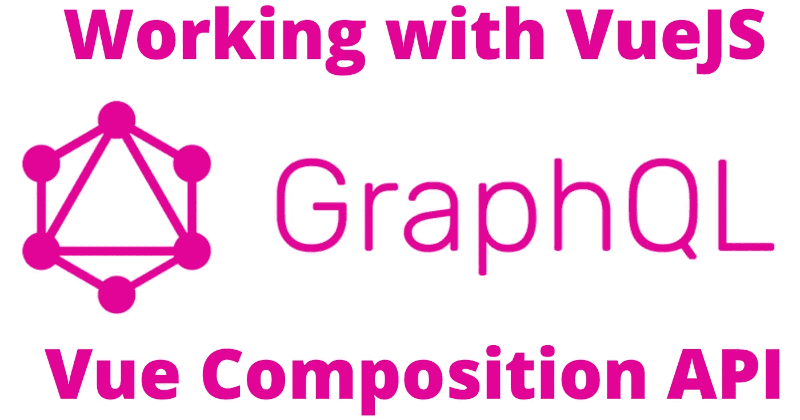
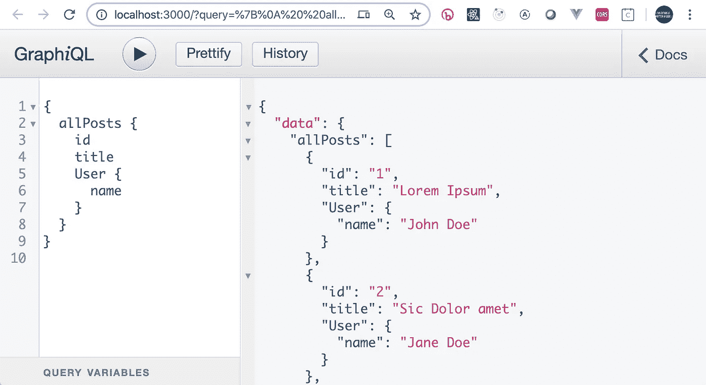
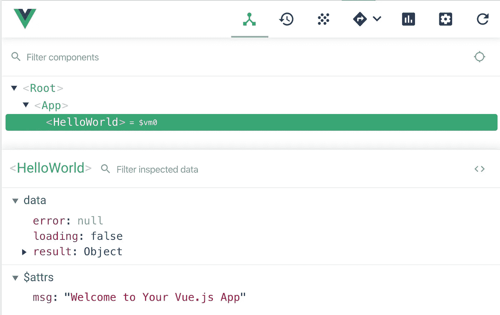

# GraphQL &带有 Apollo-Composable 的 Vue 组合 API

> 原文：<https://levelup.gitconnected.com/graphql-vue-composition-api-with-apollo-composable-131374ec70fb>



在这篇文章中，我假设你理解 GraphQL 的基础，但是对如何在 VueJS 中使用带有 [GraphQL](https://graphql.org/) 的 [Vue 组合 API](https://github.com/vuejs/composition-api) 感兴趣

> **关于 GraphQL:** 这是全面了解 GraphQL 的最佳起点之一[graph QL 的 Fullstack 教程](https://www.howtographql.com/)。

# 快速启动 GraphQL 服务器

为了有所帮助，您需要一个 graphql 服务器。在过去，这一直是一个挑战，直到我发现了一个很棒的包，它可以用基于 json 文件的数据快速启动本地服务器:

> [参见 json-graphql-server 的文档](https://github.com/marmelab/json-graphql-server)

```
npm install -g json-graphql-server
```

接下来创建您的样本数据`db.js`

```
// db.js - in project root directory
module.exports = {
    posts: [
        { id: 1, title: "Lorem Ipsum", views: 254, user_id: 123 },
        { id: 2, title: "Sic Dolor amet", views: 65, user_id: 456 },
    ],
    users: [
        { id: 123, name: "John Doe" },
        { id: 456, name: "Jane Doe" }
    ],
    comments: [
        { id: 987, post_id: 1, body: "Consectetur adipiscing elit", date: new Date('2017-07-03') },
        { id: 995, post_id: 1, body: "Nam molestie pellentesque dui", date: new Date('2017-08-17') }
    ]
}
```

启动服务器

```
$ json-graphql-server db.js
GraphQL server running with your data at http://localhost:3000/
```

现在，您可以将浏览器指向服务器，并获得 GraphiQL 界面来检查您的数据。



# 获取 VueJS 应用程序的设置

> [参见 apollo-composable 文档](https://v4.apollo.vuejs.org/guide-composable)

在使用 vue-cli 设置好您的基础项目之后，我们需要为`apollo-composable`和 graphql 添加所需的包。

(它们位于单独的行上，仅用于文档目的)

```
npm install @vue/apollo-composable
npm install @vue/composition-api
npm install apollo-boost
npm install graphql
npm install vue-apollo
```

接下来打开`main.js` t，为 graphql 支持添加客户机信息。

添加 API 集成的导入并创建 Apollo 客户机:

```
// GRAPHQL STUFF
import VueCompositionApi, { provide } from '@vue/composition-api'
import { DefaultApolloClient } from '@vue/apollo-composable'
import ApolloClient from 'apollo-boost'
```

接下来，让我们创建 apollo 客户机。该 URL 来自我们启动`json-graphql-server`时的输出。

```
// client apollo client
const apolloClient = new ApolloClient({
  connectToDevTools: true,
    uri: "http://localhost:3000"
})
```

最后，我们需要添加`VueCompositionApi`插件，因为我们还没有运行 vue3。

现在，我们使用组合 API 提供的函数，使应用程序中的其他组件可以使用 apollo 功能。

```
new Vue({
  // add the client to vue object
  setup () {
    provide(DefaultApolloClient, apolloClient)
  },
  render: h => h(App),
}).$mount('#app')
```

# 从查询开始—获取所有帖子

我们没有深入研究 GraphQL，所以我将简单解释一下查询和预期的输出。

*   [graph QL 简介](https://graphql.org/learn/)

该查询将返回所有帖子的列表，并包含相关用户的 id。

```
// QUERY
const ALL_POST_QUERY = gql`
  {
    allPosts {
      id
      title
      user_id
    }
  }
`;
```

查询响应对象看起来与此类似，因此当访问应用程序中的数据时，它将是`data.allPost[]`

```
{
  "data": {
    "allPosts": [
      {
        "id": "1",
        "title": "Lorem Ipsum",
        "user_id": "123"
      },
      {
        "id": "2",
        "title": "Sic Dolor amet",
        "user_id": "456"
      },
      {
        "id": "10",
        "title": "test",
        "user_id": "10"
      },
    ]
  }
}
```

现在我们已经有了查询集，让我们开始组件设置。

在`HelloWorld.vue`组件中，我们需要添加我们的查询并搭建脚本部分来支持新的组合 API。

首先添加导入和查询作为常量。

```
<script>
import { gql } from "apollo-boost";
import { useQuery } from "@vue/apollo-composable";// QUERY
const ALL_POST_QUERY = gql`
  {
    allPosts {
      id
      title
    }
  }
`;
```

接下来，我们将添加`setup`部分并包含`useQuery`函数，在我们想要运行的查询中传递它。

您可以看到,`useQuery` composable 返回以下内容

*   `result` -来自查询的数据响应
*   `loading` - true | false 表示查询的加载状态，可用于提供查询的可视化状态
*   `error` -错误信息(如适用)

```
export default {
  name: "HelloWorld",
  setup() {
    // QUERY
    const { result, loading, error } = useQuery(
      ALL_POST_QUERY
    ); return {
      result,
      loading,
      error
    };
  },
  methods: { }
};
</script>
```

如果您现在运行应用程序并查看 [vue-dev-tools](https://github.com/vuejs/vue-devtools) ，您将看到从绑定到组件的`setup`函数返回的属性作为数据属性。



快速组合一些 UI 来显示查询结果。我们利用从`useQuery`返回的`loading`属性来确定我们是否应该显示加载消息，并在查询完成时使用`result.allPosts`来呈现对象，最后如果有`error`我们将显示错误消息。

```
<template>
  <div>
    <button @click="addPost">ADD POST</button>
    <div v-if="loading">
      <h2>Loading</h2>
    </div>
     <div v-else-if="error">
      <h2>{{error}}</h2>
    </div>
    <div v-else>
      <h2>Query Results</h2>
      <div v-for="p in result.allPosts" :key="p.id">{{p}}</div>
    </div>
  </div>
</template>
```

# 现在是一个突变——添加一个帖子

这种变异将向数据集添加一个帖子。其构造方式要求查询参数的格式如下:

```
{ title: "New Post Title", id : 100, userId : 10 }// MUTATION
const ADD_POST_MUTATION = gql`
  mutation createPost($title: String!, $id: ID!, $userId: ID!) {
    createPost(title: $title, views: 0, user_id: $userId, id: $id) {
      id
      title
    }
  }
`;
```

接下来，我们将在现有的`setup`部分中包含`useMutation`函数，将它传递给我们想要运行的变异。

我们对此进行了构造，这样我们就可以访问为我们公开的函数`createPost`,调用它来执行将被绑定到组件的查询。

请注意，因为我们已经从`useQuery`返回了`loading` & `error`，所以我们需要以稍微不同的方式构造我们返回的对象。

```
// QUERY
const { result, loading, error } = useQuery(
  ALL_POST_QUERY
);// MUTATION <== NEW
const {
  loading: mLoading,
  error: mError,
  mutate: createPost
} = useMutation(ADD_POST_MUTATION);return {
  result,
  loading: loading || mLoading, <== NEW
  error: error || mError,       <== NEW
  createPost                    <== NEW
};
//
```

在组件的模板部分，我们将为用户提供一个输入字段和一个按钮来输入`title`，然后执行与`useMutation`组件相关联的`createPost`方法。

```
<template>
  <div>
    <input type="text" v-model="title" placeholder="enter the title" />
    <button @click="addPost">ADD POST</button>... </div>
</template>
```

# 更新缓存

将该项目添加到列表后，您会注意到它没有显示在列表中。客户端将“更新”已经存在的项目，但不会自动向缓存中添加新项目…您需要这样做。

在`useQuery`上有一个`update`选项，我们可以用它来更新本地 apollo 缓存，然后更新 UI。

当更新函数被调用时，我们得到的数据被整形为我们在变异中定义的响应

```
data: {
  createPost: {
    id: "1586711727281"
    title: "adssad"
    views: 0
    user_id: "200"
    __typename: "Post"
  }
}
```

然后，我们使用这些数据更新 apollo 缓存，代码如下。

```
// MUTATION
const {
  loading: mLoading,
  error: mError,
  mutate: createPost
} = useMutation(ADD_POST_MUTATION, {
  update: (cache, { data: { createPost } }) => {
    // get the posts from the cache...
    const data = cache.readQuery({ query: ALL_POST_QUERY });
    // add the new post to the cache
    data.allPosts.push(createPost);
    // write results back to cache
    cache.writeQuery({ query: ALL_POST_QUERY, data });
  }
});
```

# 结论

这就是这篇文章的全部内容，在下一部分我将添加更新和删除，然后稍微清理一下用户界面，使它看起来更像样。

**JSON-graph QL-server:**[https://github.com/marmelab/json-graphql-server](https://github.com/marmelab/json-graphql-server)
**@ vue/Apollo-composable:**[https://v4.apollo.vuejs.org/guide-composable](https://v4.apollo.vuejs.org/guide-composable)

# 录像