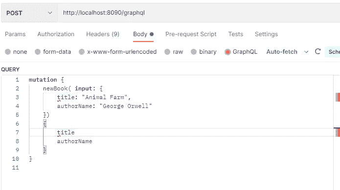
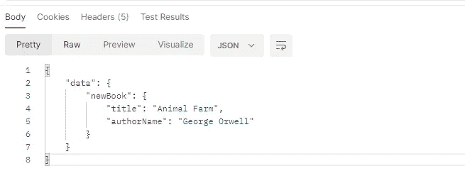
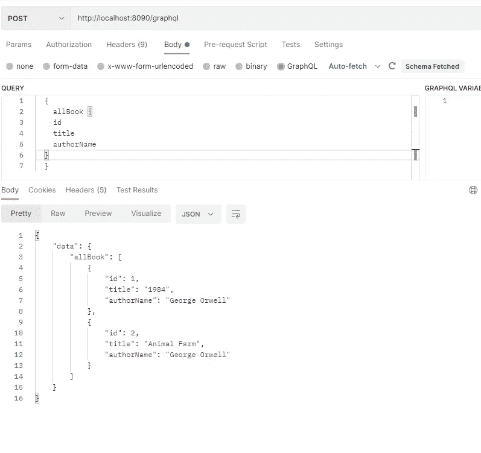

# 带 Java 的 GraphQL

> 原文：<https://levelup.gitconnected.com/graphql-with-java-afee21e205ef>

图片来源:https://graphql.org/

另一种同步方法是 GraphQL。像往常一样，我想更多地关注实现或提供代码。因此，我将提供一个简短的信息。然而，如果你想深入研究，在页面底部有很好的参考链接。

# 这是什么？

## 概观

GraphQL 是一种用于 API 的查询语言和服务器端运行时，它为 API 中的数据提供了完整且可理解的描述，使客户能够准确地要求他们所需要的东西，并使 API 随着时间的推移而发展变得更加容易，并支持强大的开发工具。与 SQL 或其他查询语言不同，您不使用 GraphQL 来查询特定的数据存储。它可以用于不同的源。

GraphQL 旨在使 API 快速、灵活。它甚至可以部署在一个叫做 GraphiQL 的 IDE 中。作为 REST 的替代方案，GraphQL 允许开发人员在一个 API 调用中构造从多个数据源提取数据的请求。

此外，GraphQL 为 API 维护人员提供了在不影响现有查询的情况下添加或删除字段的灵活性。

## GraphQL 术语

开发人员使用 GraphQL 创建一个**模式**来描述客户端可以通过该服务查询的所有可能的数据。GraphQL 模式由对象类型组成，对象类型定义了您可以请求哪种对象以及它拥有哪些字段。

随着**查询**的到来，GraphQL 根据模式验证查询。然后，GraphQL 执行经过验证的查询。

开发人员将模式中的每个字段附加到一个名为**解析器**的函数上。在执行过程中，会调用解析程序来产生值。

最常见的 GraphQL 操作可能是**查询**和**突变**。如果我们从 CRUD 模型的角度来考虑它们，查询将等同于 *read* 。所有其他的(*创建、更新、*和*删除*)由突变处理。

## 优势

*   减少终点。
*   GraphQL 模式在 GraphQL 应用程序中设置了单一的真实来源。许多不同的人可以访问同一个资源。
*   GraphQL 调用在一次往返中处理。
*   强定义的数据类型减少了客户机和服务器之间的错误通信。
*   GraphQL 是自省的。客户端可以请求可用数据类型的列表。这是自动生成文档的理想选择。
*   GraphQL 允许应用程序 API 在不破坏现有查询的情况下发展。
*   GraphQL 是独立于应用程序架构的。它没有规定任何特定的体系结构。它可以与 REST APIs 一起工作。

## 不足之处

*   踏步机学习曲线比 REST APIs。
*   增加了服务器端的复杂性。
*   缓存比 REST 更复杂，因为它的结构更动态。

## 履行

现在我想提供一些代码部分来展示实现部分。

## 概观

该项目由以下人员开发:

*   Java 17
*   带有嵌入式 H2 数据库的 Spring Boot
*   一个 GraphQL Java 实现
*   龙目岛
*   专家

## GraphQL 结构

我在资源文件夹下创建了 graphql 文件夹，并添加了两个类，分别是 *book.graphqls* 和 *query.graphqls* 。

**book.graphqls** :我定义了我的实体，输入和输出模型。

query.graphqls :我定义了查询和突变方法。这些操作之前都提到过。

我给两者都添加了两个方法。

*   用于查询；allBook(检索所有书籍)和 getBookByTitle()
*   对于突变:newBook(用于创建新书)和 deleteBook

*注意:请注意正确使用结构。否则，您将得到一个错误。*

我在*域*文件夹下开发了*图书*实体如下。因为我在这里使用了 Jpa 和 H2 数据库。

然后，我创建了三个 DTO 类，分别是 *BookInput* 、 *BookOutput* 和 *NewBook* 。谨记在心。DTO 或者你的实体类应该和你在 graphls 中的定义一致(比如我的是 **book.graphqls)** 定义。

*BookInput* 、 *BookOutput* 和 *NewBook* 类相同。所以，我只是在这里加了*BookInput**。*

完成定义后，我创建了一个存储库类。

最后，我在*解析器*文件夹下创建了两个类。实际上，这些是我们从 REST 中熟知的经典控制器类。只是，我需要在这里为 graphql 使用一些注释，比如 **@QueryMapping** ， **@MutationMapping** 和 **@Argument**

**@QueryMapping:** 批注查询将一个 handler 方法映射到 GraphQL 中的一个字段。

**@Argument:** 用于访问绑定到更高级别类型化对象的命名字段参数

**@MutationMapping:** 注释变异将一个 handler 方法映射到 GraphQL 中的一个字段。

## 邮递员测试

开发完应用程序后，我用 Postman 进行了测试。

我的应用程序运行在 8090 端口上。

创作一本新书；

结果看起来像这样；

然后我调用了获取所有书籍的查询。它成功地返回了我之前创建的数据。

最后，我今天试图通过给出一些代码来讨论 graphQL。

希望对了解 graphQL 是什么，是如何开发的有所帮助。

完整的代码可以在我的 [Github](https://github.com/atesibrahim/graphql/tree/master/graphql) 页面上找到。

感谢阅读。

**参考文献:**

 [## GraphQL 与 REST 的比较

### 在过去的十年中，已经成为设计 web APIs 的标准(尽管还很模糊)。它提供了一些很棒的想法…

www.howtographql.com](https://www.howtographql.com/basics/1-graphql-is-the-better-rest/)  [## GraphQL 与 REST——全面的比较

### REST 一直是设计 API(应用程序编程接口)的流行架构风格，但最近…

blog.api.rakuten.net](https://blog.api.rakuten.net/graphql-vs-rest/)  [## GitHub-swathisprasad/graphql-with-spring-boot:带有 graph QL 和 Spring Boot 的示例应用程序

### 此时您不能执行该操作。您已使用另一个标签页或窗口登录。您已在另一个选项卡中注销，或者…

github.com](https://github.com/swathisprasad/graphql-with-spring-boot)  [## GraphQL 四年的经验教训

### 自从 GraphQL 四年前在脸书诞生，并于一年前公开发布以来，GraphQL 社区已经…

www.graphql.com](https://www.graphql.com/articles/4-years-of-graphql-lee-byron)  [## GraphQL 是什么？

### GraphQL 是一种应用程序编程接口(API)的查询语言和服务器端运行时

www.redhat.com](https://www.redhat.com/en/topics/api/what-is-graphql)