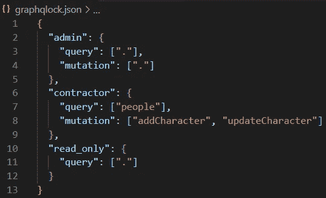
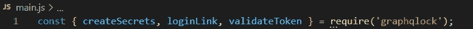
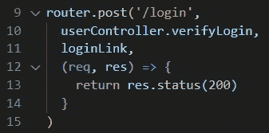
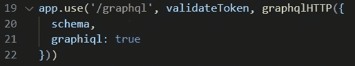

# GraphQLock:轻松保护您的 GraphQL 应用程序

> 原文：<https://levelup.gitconnected.com/graphqlock-secure-your-graphql-application-with-ease-e7bc3b85baaa>

开发产品时，时间既宝贵又有限，这意味着开发人员希望能够专注于实际构建他们的应用程序，而不是担心如何保护它。

为了帮助开发人员专注于他们*希望*关注的事情，我们与 OSLabs 合作构建了 GraphQLock，这是一个 npm 安全包，允许开发人员将基于角色的授权无缝集成到他们的 GraphQL 应用程序中。

# 授权和图表 QL

虽然 GraphQL 整合查询和端点的能力肯定有其优势，但它也带来了开发人员必须牢记的安全问题。其中最大的问题之一是授权——验证用户有权访问哪些特定数据的过程。GraphQL 的单一端点很难实现有效的授权，这种授权足够灵活，可以处理前端可能抛出的每个查询。即使开发人员设法建立了完美的授权，向数据库中添加新表或修改现有的授权可能会既费时又容易出错。对于那些只想回到应用程序功能上的工程师来说，这是一件非常令人沮丧的事情。

# 解决方案:GraphQLock

GraphQLock 将所有这些繁琐的实现抽象为三个函数和一个 JSON 文件。

**创建角色和权限**

graphqlock.json

设置 graph lock 的第一步(在您的终端中运行“*NPM I graph lock”*之后)是定义您的角色及其各自的权限。您可以在应用程序根目录下的一个名为 *graphqlock.json* 的文件中这样做。角色被分配给他们可以执行的查询和变异，用“.”以表示对所有字段的访问。任何由在这个 json 文件中没有被授予该权限的角色执行的查询都将从服务器收到一个 403 状态。参考上面的例子，试图查询 *"animals"* 的*承包商*或试图执行 *addCharacter* 变异的*只读*角色都将返回 *403 禁止。*

**设置图表锁功能**

在 GraphQLock 的三个函数中需要

接下来，将这三个函数导入/要求到您的应用程序中。根据应用程序的体系结构，可能需要将这些功能放在单独的文件中。

对于第一个函数，只需在应用程序的主文件中调用 *createSecrets()* 。

对于第二个函数 *loginLink* ，您需要将它作为中间件插入您的服务器登录路径。函数 *loginLink* 要求前面的中间件函数分配 *res.locals.username* 和 *res.locals.role* (在下面的例子中，这将是*user controller . verify log in*)。

loginLink 作为服务器登录路由中的中间件

对于第三个函数 *validateToken* ，只需将其插入到 GraphQL 端点的中间件中。

验证 GraphQL 端点中作为中间件的令牌

最后，在应用程序的根目录下创建一个 *process.env* 文件。在这个文件中把*蒙戈 _URI* 分配给你的蒙戈 URI。

应用程序现在配备了全功能授权。开发人员不必担心授权问题，除非他们希望添加新的角色或更改权限，但即使这样，GraphQLock 也会自动适应对 *graphqlock.json* 文件所做的任何更改！

# 它是如何工作的？

GraphQLock 利用存储在 cookies 中的 JSON Web 令牌(jwt)进行授权。jwt 需要秘密，这由 *createSecrets* 函数*处理。*这个函数为 *graphqlock.json* 文件中定义的每个角色在 *process.env* 文件中写入一个秘密，如果还没有的话。

然后 loginLink 中间件为每次登录创建两个 jwt(一个访问令牌和一个刷新令牌)。然后，刷新令牌存储在 Mongo DB 中(GraphQLock 仅通过 URI 将您连接到该数据库)，然后令牌存储在 cookies 中并发送回客户端。这些令牌是用生成到 *process.env* 文件中的对应于其角色的随机秘密构建的。

最后，validateToken 中间件检查访问令牌。如果不存在，它将检查有效的刷新令牌。如果存在有效的刷新令牌，则给予客户端新的刷新令牌以及新的访问令牌。然后在数据库中更新刷新令牌。如果这些步骤中的任何一步失败，请求将被拒绝，并返回 403 状态。如果没有抛出 403 状态，令牌将通过验证，然后从 JSON 文件中检查权限，以确定是否允许用户完成请求。

# 为什么要使用存储在 cookies 中的 jwt？

jwt 简化了一些授权措施，同时也提供了可靠的安全性。因为我们可以在 jwt 上存储信息，所以服务器不需要保存任何关于分发给用户的令牌的信息(除了一个简单的刷新令牌数据库)。此外，jwt 有很少的弱点，这些弱点主要源于不良实践，而不是内部的不安全感。JWTs 最大的问题是保护您的秘密，这样令牌就不会被泄露。 *createSecrets* 函数通过写入*来处理这个问题。env* 文件，这将使它变得非常困难，因为一个恶意的参与者将不得不访问主机(如*)。env* 文件应该在你的 *gitignore* 上。

与存储在本地存储相比，利用 cookies 来存储 jwt 给我们带来了一些好处。从可用性的角度来看，cookies 是由浏览器自动管理的，维护跨站点子域的会话，并且大到足以舒适地存储 jwt。从安全角度来看，这些令牌不受 XSS 攻击的影响，因为客户端 JS 无法读取仅支持 HTTP 的 cookies。通过确保仅当请求来自发出它们的相同站点时 cookies 才被验证，CSRF 攻击也变得无用。此外，没有服务器的秘密，MITM 攻击是无害的。作为额外的保护层，GraphQLock 甚至为每个角色提供了秘密，这使得授权更加强大。

# 介入

我在哪里可以拿到这个包裹？随着技术的不断发展，我们一直在寻求不断改进，并希望收到您的反馈！在 Github 上 Fork GraphQLock，提交任何问题，或者为开源项目做贡献。请访问网站了解更多信息。

GraphQLock 工程师:

*   德雷克·威廉姆斯[Github](https://github.com/DRWilliams527)|[Linkedin](http://www.linkedin.com/in/williamsdrake)
*   查理·黄，[Github](https://github.com/huangcharlie)|[Linkedin](https://www.linkedin.com/in/huangcharlie)
*   Github | [Linkedin](https://www.linkedin.com/in/jchung07/)
*   凤凰纽曼，[Github](https://github.com/phoeN24)|[Linkedin](https://www.linkedin.com/in/phoenixnewman/)