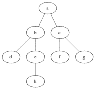

# 图表 101

> 原文：<https://levelup.gitconnected.com/graphs-101-67581c17178d>

## 用 Python 实现

图是节点和连接的集合。如果我们为这些节点和它们的连接定义一些属性，我们就可以模拟许多现实世界的问题。图形对于表示网络特别有用。社交网络、电话线和路线图是现实世界网络的几个例子，它们的问题可以通过图形建模和解决。

在图形词典中，节点和连接分别被称为**顶点**和**边**。接下来，我将使用这两个术语，而不是节点和连接。下面，我举例说明了一个简单的图表。圆是顶点，线是边。

一般图形的一个例子

## 图表类型:

通过定义顶点和边的规则，我们可以创建不同类型的图形。例如，如果您为边定义了一个方向，您可以创建一种新类型的图，称为**有向图**。另一个例子是自行车。一般来说，循环可以出现在一个图中，但是如果你强加一个规则，你的图不能有循环，那么你可以创建一个新类型的图，称为**非循环图**。将两者结合起来，我们可以得到另一种类型的图，称为**有向无环图(DAGs)** 。除了方向，我们还可以给边赋予权重，并创建**加权图**。

这些不同的图形类型对于模拟真实世界网络中的不同行为是有用的。比如在社交网络中， ***友情*** 用无向图建模，而 之后的 ***用有向图建模。***

## 内存中的图形表示:

一个图有两种常见的内存表示。一个是**邻接矩阵**，一个是**邻接表**。我试着用下图所示的例子来解释这两个问题。在这个上下文中，邻接意味着直接连接。例如，在示例图中，`V₁`和`V₅`的两个顶点是`V₀`的相邻顶点，因为从`V₀`到它们有一条直接路径。

示例图表

**邻接矩阵:**

这是在内存中表示图形的最简单的方法。但是它占用了很多空间。如果你有 **V** 个顶点，它会占用 **O(V )** 个空间，只有当你更接近一个全连通图时，它才会变得有效。在实际应用中，大多数矩阵是**稀疏的**(即空的)，并且这种实现不是空间有效的。

邻接矩阵

**邻接表:**

这是邻接矩阵的节省空间的替代方案。这也是表示中大型图表的首选方式。

如下图所示，在邻接表中，我们创建了一个包含图形对象中所有顶点的主列表，图形对象中的每一项都连接到一个包含相邻顶点和边权重的顶点对象。

邻接表

## Python 中的图形实现:

下面是一个简单的邻接表图的实现。这种实现可以针对不同的图形问题进行定制。

## 图形遍历:

图遍历指的是我们可以在网络中导航和访问每个顶点的方法。有两种常见的遍历图的方法:

*   **广度优先搜索(BFS):** 逐层导航一个图形(或者有层次时逐层导航)。换句话说，从一个节点开始。拜访**所有**它的孩子。然后移动到孙辈，继续这个过程，直到没有未访问的顶点。

动画 BFS(来源:维基百科)

这种搜索方法需要一个**队列**数据结构来实现。使用队列保证了我们将在移动到其他层之前探索顶点的宽度。这种行为保证了两个顶点之间的第一条路径是它们之间的最短路径。

*   **深度优先搜索(DFS):** 通过深入挖掘从起点分支的路径来导航一个图，直到它到达一个点，在该点处不再有向前的边或者遇到先前访问过的顶点。

动画 DFS(来源:维基百科)

这个搜索方法需要一个**栈**数据结构来实现。您可以以迭代的方式显式使用 stack，或者使用隐式使用 stack 的**递归**。

**BFS 实施代码:**

**DFS 实现代码:**

# 图形世界中的常见问题:

随着时间的推移，计算机科学家已经为一小组图形问题找到了一些有趣的解决方案。这里我试着讨论其中的一些。在现实世界中，网络问题很复杂，听起来也很复杂，但我们的工作是找出如何重新构建问题，使其与现有的解决方案相匹配。与其说是科学，不如说是艺术。

1.  寻找两个顶点之间的最短路径
2.  检测图中的循环
3.  最小生成树
4.  拓扑排序

## **1。寻找两个顶点之间的最短路径:**

只有当我们有一个加权图时，这个问题才具有挑战性。对于未加权的图，BFS 毫不费力地给了我们答案。对于一个加权无向图，我们可以使用 **Dijkstra 算法**来寻找两个顶点之间的最短路径。Dijkstra 是 BFS 的一个更聪明的版本。一个很好的详细介绍 Dijkstra 算法的是[这里](https://medium.com/basecs/finding-the-shortest-path-with-a-little-help-from-dijkstra-613149fbdc8e)。Dijkstra 算法的另一个可视化来源可以在[这里](https://www.cs.usfca.edu/~galles/visualization/Dijkstra.html)找到。在本节的最后，我提供了 Dijkstra 在我们的玩具示例上测试的代码。Dijkstra 的时间复杂度大致为 **O(V)。**

Dijkstra 算法动画(来源:维基百科)

使用 Dijkstra 算法时，需要考虑两件重要的事情:1 .它不能处理负权重，2 .它是单源最短路径算法。

当我们有负权重边缘和负周期的可能性时，替代方案是**贝尔曼-福特算法**。当图内部出现负循环时，最短路径是没有意义的，算法唯一的工作就是检测它并报告给用户。就是这样。贝尔曼-福特的优势在于它有一个内部机制，允许检测到负循环并报告给用户。这种额外的能力是以更高的时间复杂度为代价的。贝尔曼-福特的时间复杂度为 **O(VE)** ，高于 Dijkstra。

贝尔曼-福特算法并不是那么直观，如果你想对算法有一个直观的理解，不如一步一步解决一个简单的问题。为此一个不错的短视频就是[这里](https://www.youtube.com/watch?v=obWXjtg0L64)。在本节的最后，我在我们的玩具示例中提供了 Bellman-Ford 的代码。

当我们对所有对最短路径感兴趣时，一种方法是对所有顶点重复 Dijkstra 算法。然而，更聪明的方法是使用 **Floyd-Warshall 算法**，它利用了邻接矩阵的强大功能和简单性。

Floyed-warshall 算法非常简单明了。它由三个循环组成。两个循环用于扫描邻接矩阵，另一个循环用于检查是否有另一个顶点可以放在两个顶点之间，使它们的间接路径更短。由于这三个循环，算法的时间复杂度为 **O(V )** 。在本节的最后，我在我们的玩具示例中提供了 Floyd-Warshall 的代码。算法的输入和输出如下所示。该算法以距离矩阵作为输入开始，然后在上述三个循环中对其进行更新，并提供具有所有对最短路径距离的输出距离矩阵。

距离矩阵作为 Floyd-Warshall 算法的输入

Floyd-Warshall 输出，所有对最短路径

**我们玩具的 Dijkstra 代码示例:**

**玩具示例的贝尔曼-福特代码:**

**Floyd-Warshall 代码为我们的玩具示例:**

## **2。检测图形中的循环:**

检测周期的一个简单方法是使用 DFS。跟踪访问过的顶点，如果你看到它们两次，那么一定有一个循环。另一种方法是使用联合查找算法。用友比较好的视频教程是[这里](https://www.youtube.com/watch?v=0jNmHPfA_yE&t=119s)(把视频播放速度改成 1.5x)。你可以在后面我讲解克鲁斯卡尔算法的时候找到用友的实现。

**针对我们的玩具示例，通过 DFS 代码进行循环检测:**

## 3.最小生成树:

生成树是加权无向图中连接所有顶点而没有任何圈的边的子集。最小生成树(MST)是具有最小总边权重的生成树。请记住，它之所以被称为树，是因为它没有循环。

有两种主要的算法来解决这个问题。普里姆和克鲁斯卡尔算法。我尝试简单地解释它们并提供代码。

MST 示例(来源:维基百科)

## **普里姆的算法:**

这是一个简单的贪婪算法。它随机地从一个顶点开始，并试图通过将具有最低权重的边附加到树上来构建 MST 树，直到它到达所有顶点。树边数为`|V|-1`。

**MST 使用 Prim 的算法为我们的玩具举例:**

## **克鲁斯卡尔的算法:**

这个算法在概念上非常简单。您可以按权重对边进行排序，并从最短到最长逐一检查以构建 MST。如果每条边没有与树的现有边形成一个循环，那么将它们包含在 MST 中；否则，丢弃。继续操作，直到 MST 中有`|V|-1`条边。就这么简单。

克鲁斯卡尔算法的一个简单例子(来源:维基百科)

这个算法最重要的一步是检测一个周期。有几种算法来检测周期。最简单的一个就是我前面提到的使用 DFS。然而，为了使用 DFS，我们必须为每个 MST 创建一个图，这并不方便。因此，常见的替代方法是 Union-Find 算法，它可以用更少的代码行完成这项工作。

**MST 使用克鲁斯卡尔算法为我们的玩具举例:**

## 4.拓扑排序

这是一种排序形式，仅与 Dag 相关。简而言之，它是顶点的线性排序，对于每个有向边`uv`，`u`在排序中必须在`v` 之前。

求解拓扑排序有两种常用算法，一种是基于 DFS 的递归算法。另一种是被称为卡恩算法的迭代方法。

在递归方法中，对于所有顶点，该算法深入搜索以找到叶顶点，并将它们推送到堆栈。

Kahn 方法建立在关于 DAG 的已知事实上，即**一个 DAG 至少有一个顶点没有输入边(输入度= 0)和一个顶点没有输出边(输出度= 0)** 。该算法首先计算所有顶点的入度，然后根据它们的入度值对它们进行排队。时间复杂度为 **O(V+E)** 。

我提供了这两种方法的代码。因为，我们的玩具例子不是一只狗。所以，我在下图中测试了我的代码。这个图有多个拓扑排序解。

DAG 示例

**使用 DFS 的拓扑排序对于我们的示例:**

**在我们的例子中使用 Kahn 算法的拓扑排序:**

## 可视化源

图形问题可以通过可视化更好地学习。在这里，我将向您介绍两个最流行的可视化资源。一个是旧金山大学的 CS page ( [这里是](https://www.cs.usfca.edu/~galles/visualization/Algorithms.html))，它为 CS 数据结构和算法提供了许多漂亮而直观的可视化。另一个是 [VisuAlgo](https://visualgo.net/en) (这里)，它是为 CS 的复杂算法提供良好的可视化而构建的。

## 第 1 页.树

树是图形的一种形式，具有以下属性:

*   顶点数和边数的固定关系:顶点数为`N`的树有`N-1`条边。
*   所有子节点都可以从根节点到达。
*   无循环(只允许一条从根到节点的路径)

## P.S.2\. Dijkstra 对 Bellman-Ford

学习这两种算法内部机制的直观方法是将它们与 BFS 和 DFS 联系起来。Dijkstra 与 BFS 的工作方式有一些相似之处。这是一个贪婪的算法。另一方面，Bellman-Ford 使用自下而上的方法，类似于动态编程和 DFS 的递归风格。

我希望你喜欢读这篇文章。如果你愿意支持我成为一名作家，考虑注册[成为一名媒体成员](https://medium.com/@smohajer85/membership)。每月只需 5 美元，你就可以无限制地使用 Medium。