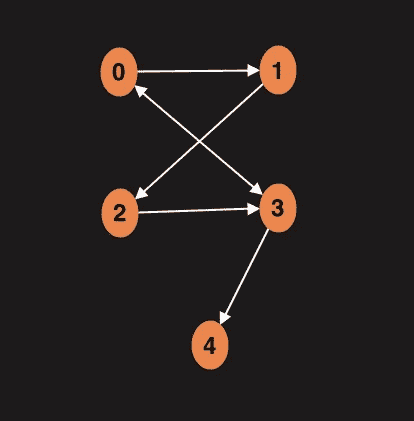
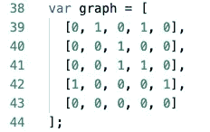
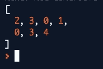

# 图形数据结构:深度优先搜索

> 原文：<https://levelup.gitconnected.com/graphs-data-structure-depth-first-search-4e71adef87b9>

在之前的[博客文章](https://medium.com/@Pavel_ilin/graphs-data-structure-breadth-first-search-ec662dc73079)中，我们讨论了如何将广度优先搜索算法应用于图形数据结构。今天，让我们弄清楚深度优先搜索(DFS)是如何工作的。

DFS 是用于在图中搜索节点和边的基本算法之一。这是一种遍历算法。

提醒一下，这是我们的图表:

这是我们的邻接矩阵(在这里阅读邻接矩阵表示):

根据这个名字，我们可以假设 BFS 关注的是图形的深度。搜索从某个根节点开始，在回溯之前尽可能地搜索每个分支。

我们的任务是编写一个算法，在回去探索其他路线之前，尽可能深入地探索路线。让我们看看我们如何能做它。

**实施**

深度优先搜索将基于堆栈中的内容。首先，我们将在堆栈中添加一个根节点，然后根据程序现在访问的节点更新这个值。我们将继续循环，直到所有的节点都被访问，堆栈变空。

此外，我们将通过将被访问的节点存储在数组中来跟踪它们。最后，我们将返回这个数组来跟踪我们算法的路线。

下面是最终代码的样子:

这是我们的溃败:

**结论**

邻接矩阵深度优先搜索的时间复杂度为 O(V*E)。

我们讨论了如何用邻接矩阵表示来实现图形数据结构的 BFS 和 DFS。我认为下一步应该是尝试邻接表，看看实现会有什么不同。

不断学习，不断成长！

可以在 [repl](https://repl.it/@PavelIlin/Graphs-Depth-First-Search) 里玩代码。

我们在 LinkedIn 上连线吧！