# 无处不在的图形—查找对阵列排序所需的最少交换

> 原文：<https://levelup.gitconnected.com/graphs-everywhere-finding-the-minimum-swaps-required-to-sort-an-array-b8dea0a3af52>

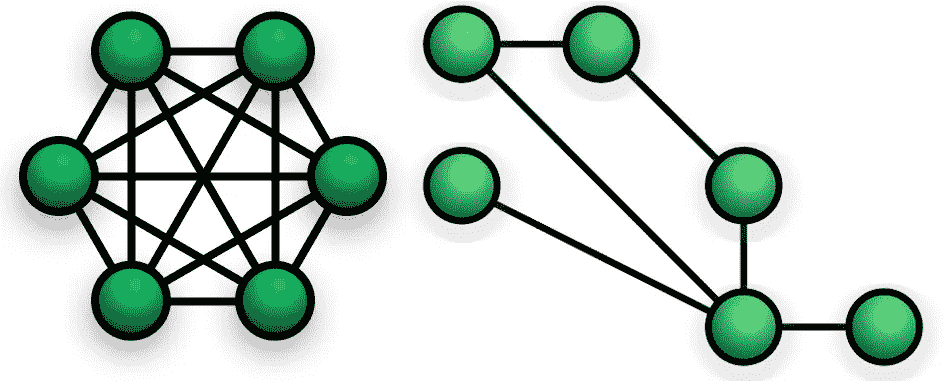

图是计算机科学中最基本的概念之一。他们完美地扮演了解决大量问题的角色。在这篇文章中，我们将揭示一个算法问题，乍看之下，人们甚至不会认为图对解决这个问题有任何用处。但首先，让我们看看我们今天的旅程。请注意，在本文中，我们不会深入探讨图的概念，而是简单介绍一下，然后重点讨论它在解决数组算法问题中的应用。

# **路线图**

1.  *图的快速介绍——结构、路径和循环*
2.  *要解决的问题——找到排序数组所需的最少交换数*
3.  *编码时间*
4.  *总是对你的算法进行单元测试*

# **图表介绍**

1.  **图的结构**

图是一种数据结构，其最紧凑的形式由单个顶点(也称为节点)组成。下面是它的一个简单表示:

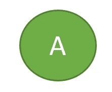

图 1 —单节点图

显然，我们可以通过添加更多的属性来扩展这个图。例如，与此连接的另一个节点，其中节点之间的方向并不重要，如下所示:

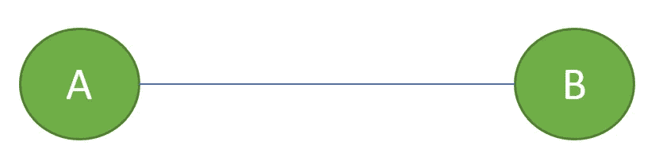

图 2 —无向图(方向无关紧要)

现在，如果我们简单地给上面两个节点之间的边添加一个方向，我们就可以把它变成一个有向图，这对我们马上要解决的问题也很重要。它看起来是这样的:

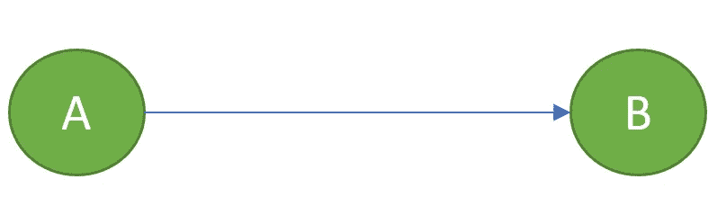

图 2 —有向图(方向很重要)

到目前为止，这听起来真的很简单，然而，我们需要覆盖图的路径和循环，所以我们准备好背包来解决我们的算法问题。

**②*。*路径**

为了从理论上理解路径，我们需要首先接触一下图中的行走。让我们看看那是什么:

**2.1。行走 *—*** 行走基本上是一系列的边，除了第一条边之外，每条边都从前一条边结束的节点(顶点)开始*。*例如，下图演示了一次行走:

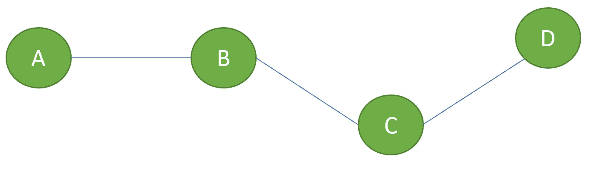

图 3——图上的行走

在这里，如果我们穿越 A > B > C，那将会给我们一次步行——如果我们穿越 A > B > C > D，或者甚至 A > B >**C**D>C 也是一样。

这里需要记住的重要一点是，一个行走可以有重复的边，这不会对行走的定义产生任何干扰。

**2.2。路径—** 路径就是一条你永远不会超过一次的路。因此，所有的边和顶点都是不同的。回到前面的例子，A > B > C 会给我们一条路径，但
A > B > C > D > C 不会

**2.3。循环—** 当路径上的第一个节点*和最后一个*节点*相同时，可以检测到循环。这将给出不同的边，但不是不同的节点，从而导致循环。下图为我们展示了一个
A > B > C > D > A 的循环。*

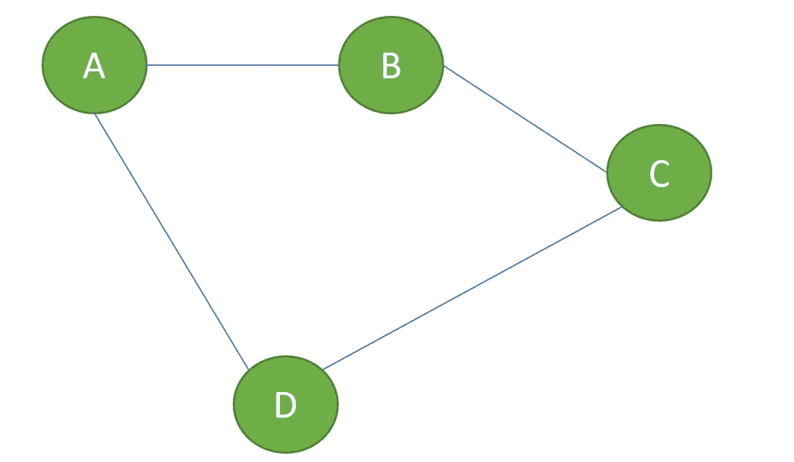

图 4-表示 A > B > C > D > A 的循环

到目前为止，我们已经涵盖了我们需要知道的所有内容，因此我们可以处理我们的算法问题。因此，没有任何进一步的细节，让我们继续阅读，找到更多关于这个问题。

# 要解决的问题—寻找最小交换来排序数组

1.  **问题陈述**

我们得到了一个由*个不同的*个整数组成的数组，这些整数*没有*排序。我们被允许交换数组的两个项目中的任何一个，最终使它按照*升序*排序。我们的任务是编写一段算法，计算出按预期排序数组所需的最少交换次数。

> 当我第一次面对这个问题时，我想不出像图表这样的东西会有什么帮助，所以我可以用它来构建解决方案的框架。但是，当我开始自己解决这个问题，并在一张纸上想象它时，我开始意识到这一点，这就是我们在文章的其余部分想要经历的。

**2。问题演练**

让我们从整数数组作为程序输入开始。这是:

图 5 —作为程序输入的整数数组

很明显我们的数字没有放在正确的位置上。所以，让我们来看看最后一个数组——排序后的数组。

图 6 —预期的最终结果—排序后的数组

现在，我们需要给我们一些时间，盯着这个数字，并尝试展示一些创造力，以便我们可以找到数字和它们的位置之间的关系。

***2.1。找到每个数字*** 的正确(最终)位置

如果你观察上图中的每个单元格，排序为的单元格，你会发现每个单元格的值等于它的最终单元格索引，如果，它减 1。例如，第一个单元格保存数字 1；如果我们将它减去 1，将得到 0，表示 1 所属的正确索引(或正确位置)。同样的规则也适用于数组中的其他单元格。

**注意**，重要的是对预期结果做到以上几点。因为我们在这里的主要意图是两件事:

1)找出数组
中每个数字的正确(最终)位置 2)将该发现应用于程序的输入，即未排序的数组，这样我们就可以设计一个算法来将项目移动到它们正确的位置。

请看下图，它形象地展示了我们刚刚取得的成果。

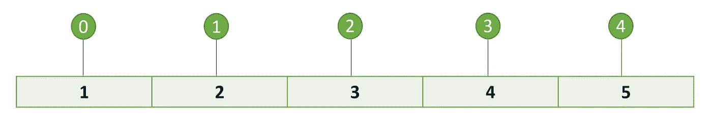

图 7 —找出数组中每个数字的正确位置(最终位置)

***2.2。考虑未排序(输入)数组*** 上的最终位置

既然我们知道谁应该在哪里；让我们再看一次我们的输入数组，看看我们如何应用我们的发现。

图 8 —输入阵列

实际上越来越有趣了——看看第一个数字:2。它必须放在索引或单元格 1 处。应用前面章节中的图形知识，我们可以表示从索引 0 到索引 1 的路径；换句话说，编号为 2 的索引 0 的值必须放在索引 1 中，因此，0 > 1 是路径。如果需要的话，给它一些时间来考虑，并确保你对这一点有信心。

这应该会给我们一些灵感来画出对我们的阵列的路径。下图显示了这些路径，直到它们到达一个循环。

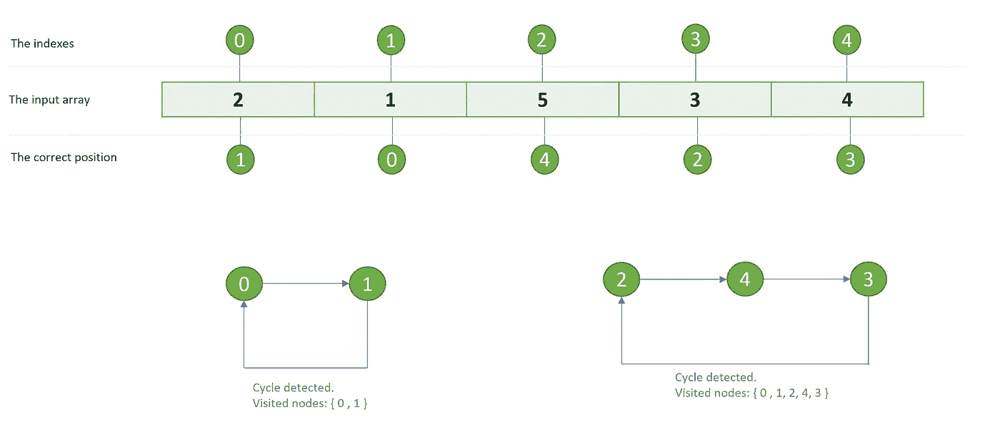

图 9 —解决方案表示；从图形的角度查看阵列并检测其中的循环

这个数字是问题的实际解决方案。考虑第一个周期:
0 > 1 > 0。也就是说，索引 0 处的元素必须放在索引 1 处，索引 1 处的元素必须放在索引 0 处，因此，交换元素将使它们按升序排序。本周期所需的总互换量为 1。这个逻辑也适用于第二个周期，
2 > 4 > 3 > 2，对于第二个周期，总交换数 3 将使其排序。因此，我们可以得出结论， *f(掉期)=数量(节点)-1* 。如果我们简单地对每个周期的交换进行求和，我们将最终得到使数组按升序排序所需的最少交换。

呜！做得好——如果你觉得有帮助，在烧代码之前，自己再做一次可能是值得的。

# 编码时间— C#

我们想要实现我们的解决方案，图 9，以一种我们可以一个单元一个单元测试的方式。因此，我们将我们的解决方案分为两个不同的主要部分:

1.  负责生成循环的方法
2.  一个针对输入数组的循环，这样对于每一项我们都会考虑循环

我们还希望跟踪我们访问过的节点，这样我们就可以避免一遍又一遍地计算相同的子问题，从而优化性能。关于这方面的更多信息，请阅读[我的关于动态编程的文章](/understanding-dynamic-programming-in-theory-and-practice-7835610ca485)。让我们看看魔术是什么样子的。

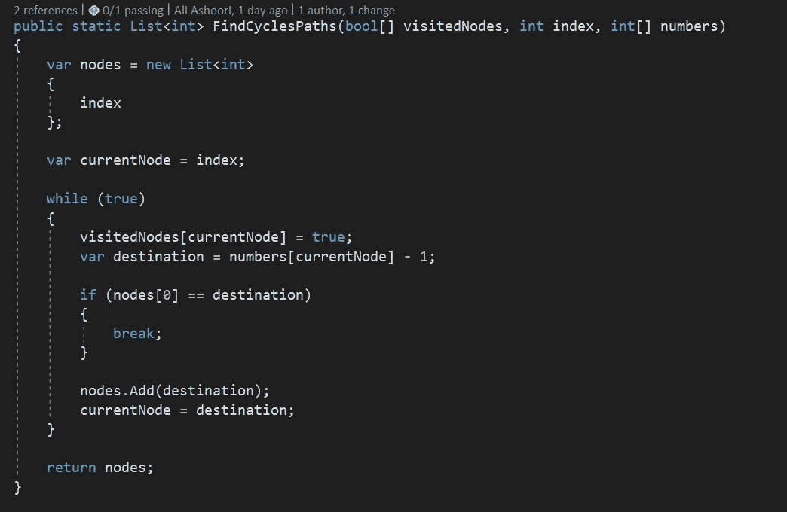

图 10——负责检测循环并返回每个循环路径的方法

*FindCyclesPaths* 方法做了一件我们可以轻松编写单元测试来证明其正确性的事情。不用说，一旦我们到达一个循环，即第一个节点等于目的节点时， *while* 循环就会中断。例如，在图 9 中，第一个索引的目标是数组的第二个单元格。这个函数返回一个表示循环路径的节点列表，如图 9 所示。交换的计算不在此方法的范围内，因此，构建可测试的代码库。

现在，我们需要设置我们的 main 方法，该方法遍历输入数组，为每个未访问的节点调用 *FindCyclesPaths* 。

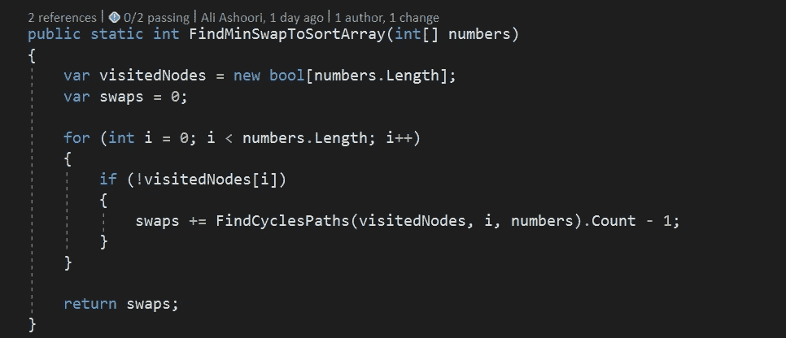

图 11——寻找最小所需互换的实际方法

如前所述，我们希望引入一种数据结构来存储被访问的节点。我们为此使用了一个布尔数组，它的长度与输入数组的长度相同，这里命名为 numbers。默认情况下，C#将为每个索引填充 *false* 值，因此无需手动操作。接下来，我们遍历我们的项目，并为我们访问的每个循环路径计算*交换*。最后，交换变量作为过程的结果返回。

干得好！我们已经实现了这一点，而且 [HackerRank](https://www.hackerrank.com/challenges/minimum-swaps-2/problem?h_r=internal-search) 也很喜欢它，因为它给这个解决方案打了满分。现在，让我们使用单元测试来确认代码的正确性。

# 总是对你的算法进行单元测试

在这一步，我们将编写几个测试用例来证明基本的场景，我想把边缘用例留给读者来深入探讨。这是我们对周期检测函数的第一个单元测试，验证了图 9 中检测到的两个周期。

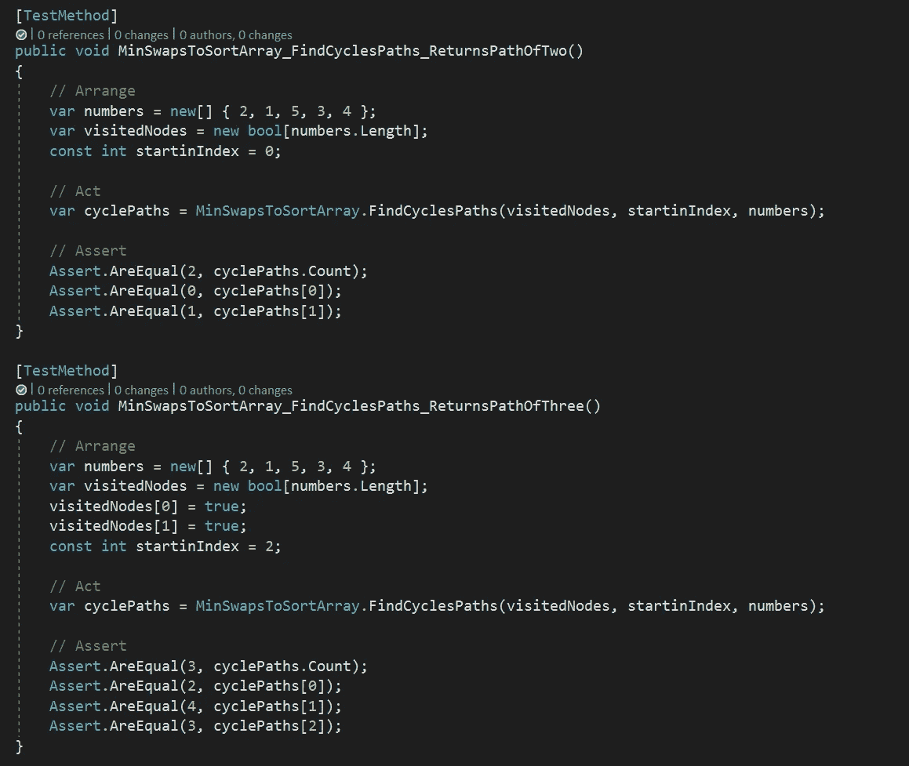

图 FindCyclesPath 方法的单元测试

最后一个是我们的主要功能:

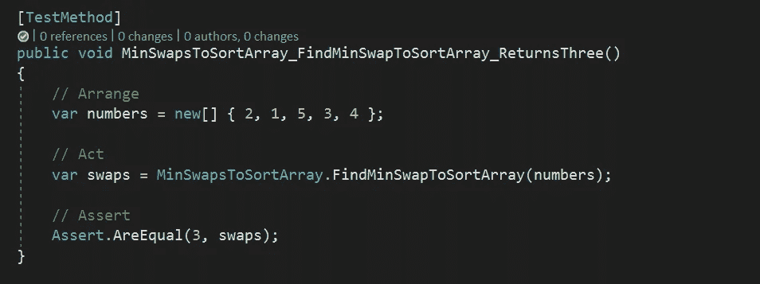

图 FindMinSwaptoSortArray 方法的单元测试

这就是全部——我们已经涉及了图论的一些概念，我们经历了一个中级算法问题，从图的角度看了一个数组排序问题，快速接触了 [DP 编程](/understanding-dynamic-programming-in-theory-and-practice-7835610ca485)，并最终通过一些单元测试证明了其正确性。

感谢你通读这篇文章，祝你编码愉快！🐱‍🏍