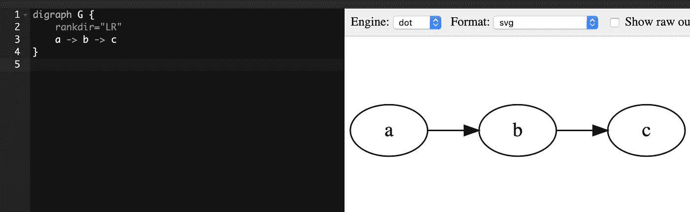
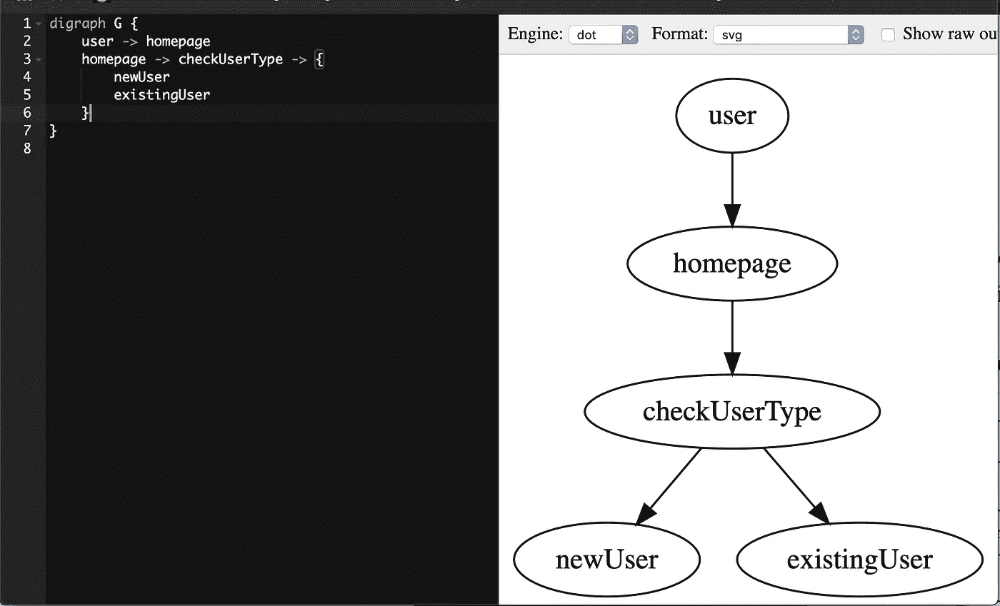
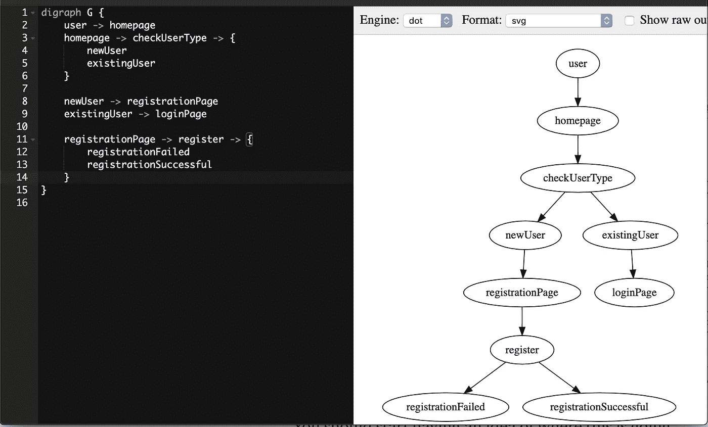
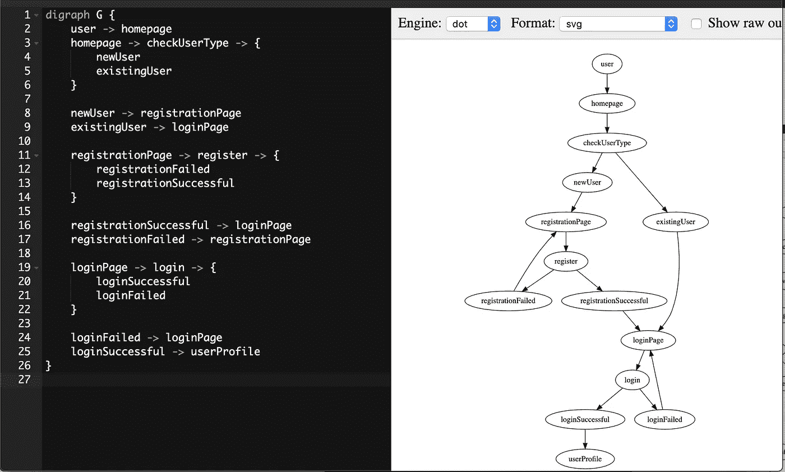
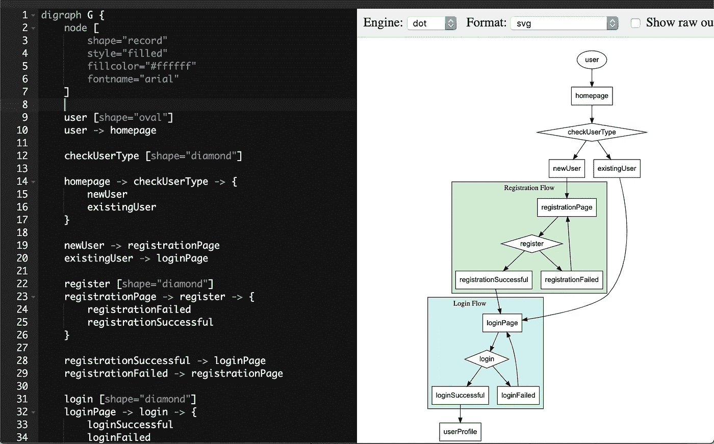

# Graphviz + Golang:加速技术头脑风暴的极客工具

> 原文：<https://levelup.gitconnected.com/graphviz-golang-the-geeky-combo-for-technical-brainstorming-76d8992d5812>

## 生产力

# 1.简单、简洁、直观

白板、便笺、笔和纸、清晰图表、draw . io……是一些当你想到技术头脑风暴时可能会想到的工具。


克里斯蒂娜@ wocintechchat.com 在 [Unsplash](/s/photos/white-board?utm_source=unsplash&utm_medium=referral&utm_content=creditCopyText) 上的照片

新冠肺炎来了。不再有办公室，也就是说，不再有你可以随意写东西或画东西的大白板。

你使用像 LucidChart、draw.io、Visio 等图表工具。这些对于**记录最终的设计**来说是令人惊讶的。然而，在头脑风暴会议期间，拖动盒子和箭头来连接那些盒子只是浪费时间，减慢了你头脑中流动的创造性思想。如果你因为一些小的改变而需要重新布线，这也是令人沮丧的。

使用好的旧笔和纸怎么样？哦，饶了我吧。

你需要的是简单、简洁、快速、直观和结构化的工具，让你能够**快速记下**

*   **流程**
*   **数据模型**
*   和**行为**

如果你甚至不用触摸鼠标/触摸板就能做到这一点，那就更好了。

在这种情况下， **Golang — Graphviz** 组合可能是一个值得考虑的选择。

*   **Graphviz** :可视化工具，允许通过代码绘制**流程**
*   **Golang** :是的，Golang，不是作为一种编程语言，而是作为一种设计**数据模型**和**行为** — **的工具，不管你实际回购**中使用的是什么语言

# 2.但是首先，让我们尝试一个头脑风暴的场景

以下是**注册和登录流程的产品要求。**

1.  用户登陆**主页**
2.  如果用户是新用户，他将在**注册**页面注册→移至**【注册流程】**
3.  如果用户是现有用户，则登录**登录**页面→移至**【登录流程】**
4.  **【注册流程】**如果注册失败，他需要重试。如果注册成功，将被重定向到**登录**页面→移至**【登录流程】**
5.  **【登录流程】**如果登录失败，需要重新登录。如果登录成功，他将被重定向到他的**个人资料**页面。

明确需求之后，就是技术头脑风暴的时候了。

# 3.graphviz——用代码绘制流程

## 3.1.什么是 Graphviz

[Graphviz](https://graphviz.org/) 是一个可以使用代码(`dot`语言)绘制图表的工具。

该工具非常简单，只需输入`a -> b -> c`即可启动。



## 3.2.如何使用

你可以尝试使用一个 [Graphviz 浏览器编辑器](https://dreampuf.github.io/GraphvizOnline/)。不过，如果你为你喜欢的 IDE 安装一个 Graphviz 预览插件会更方便。

## 3.3.适用于该场景

让我们看看上面的场景。

用户登陆主页。下一步操作取决于用户是新用户还是现有用户。



等等……什么？

如果用户是新用户，他需要注册。注册可以是**成功**或**失败**(例如网络问题、无效输入等)。



到目前为止，您应该已经开始了解事情的发展方向了。让我们把剩下的流量加进去。

我们在这里。



这只是很好的英语

如果您想更有趣，您可以将节点分组，添加颜色，调整形状和更改字体。



## 3.4.你自己试试

你可以在 [Webgraphviz](http://www.webgraphviz.com/) 中试试下面的代码。

3.5.保持您的流程版本化

使用 Graphviz 将允许我们在 Git 存储库中提交和版本化**流**。

> 酷！现在我们有了 Graphviz 作为绘制**流的新选择。**
> 
> 嘿，但这还不是全部…
> 
> 让我们看看 Golang，它不是一种编程语言，而是一种数据模型和行为的设计语言。

# 4.作为设计语言的 Golang

我用 Ruby 和 JavaScript 已经 6 年了(Golang 一年)。然而，当**起草**数据模型和行为设计时，Golang 仍然是我最喜欢的语言。让我告诉你为什么。

## **4.1。要求**

我们想要一种方法来记下

*   **型号**
*   他们的**属性**
*   **属性的数据类型**
*   **行为**
*   **行为和模型之间的引用**

## **4.2。数据模型和行为**

我们来分析一下上述场景的数据模型和行为。

**数据模型**

*   注册表单模型
*   登录表单模型
*   忘记密码表单模型
*   用户数据库模型
*   登录会话数据库模型

**行为**

*   注册
*   注册
*   忘记密码

## **4.3。通常的方式**

我与来自不同背景的人交谈过，包括后端、web、iOS、Android……关于他们如何在头脑风暴时起草数据模型和行为。有多个答案。

**a .降价清单**

这还不错。很快。但是每个人都有自己的惯例。

即**多人一起集思广益时不一致**

```
RegistrationForm
- name: string
- email: string
- password: stringRegister
- input: RegistrationForm
- output: User or error response
```

类似 JSON 的

在我看来，由于混合风格，这是一个稍微差一点的降价列表。

```
{
    RegistrationForm: {
        name: string,
        email: string,
        password: string
    }
}Register(RegistrationForm)
- return User or error response
```

**c .他们使用的语言的简化版本**

例如简化的 **Swift**

```
struct RegistrationForm {
    name: string
    email: string
    password: string
}func register(form: RegistrationForm) -> User
```

嗯，这个看起来不错，但是**还是不够迅捷**。

## **4.4。看编程语言**

Swift、Kotlin、Scala 似乎是不错的选择，因为它们的语法非常简洁。它们绝对适合现有的开发者。

然而，语法的某些部分，如显式属性声明`let`、`var`、……让他们在头脑风暴中对其余部分感到有些尴尬。

## **4.5。Golang** `**struct**` **和** `**interface**`

**Golang** 提供了两个**官方特性**，完全符合这些需求。Golang `struct`用于数据模型，Golang `interface`用于行为。

如果你是 Golang 新手，`struct`和`interface`也是**你需要拿起**开始记下你的设计**的唯一东西，不管你会用什么语言来实际实现**。

对比**以上选择**

*   **语法更加简洁**并且直奔主题。
*   支持【表示】**属性的数据类型**
*   `struct`和`interface`是 Golang 的官方概念

此外，大多数 ide 都支持对拼写错误或无效引用的 Golang 错误检测。

# 5.结论

如果您想在技术头脑风暴期间记下想法，但不喜欢使用 GUI 工具，我希望本文能给您带来一个替代选择。

你还用什么古怪的方法来加速你的技术头脑风暴？我很想听听。

感谢阅读！