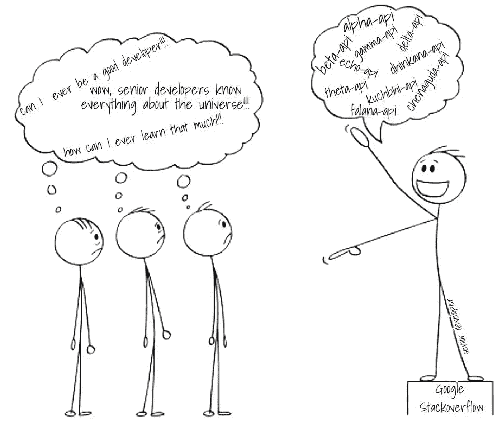
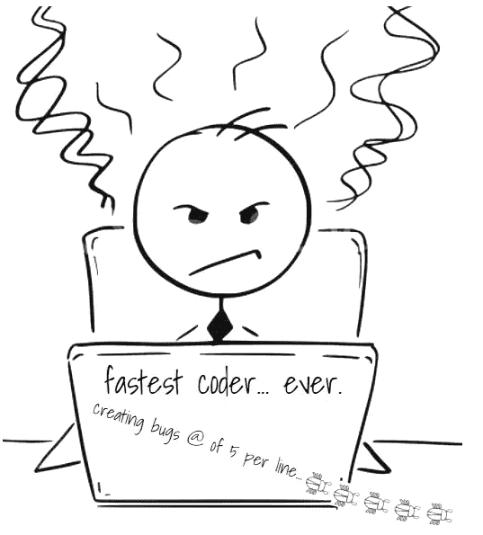
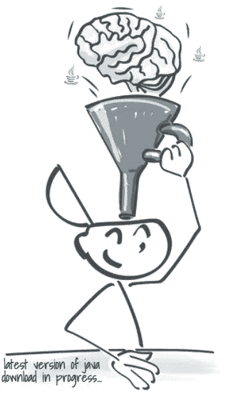
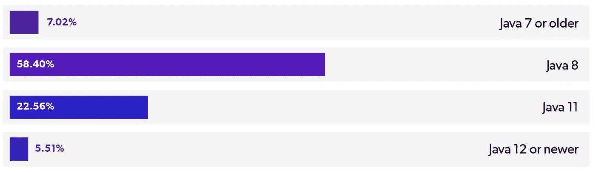
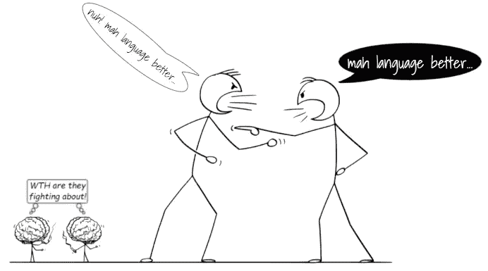

# 影响开发人员职业生涯的关于编码的最大误区

> 原文：<https://levelup.gitconnected.com/greatest-myths-about-coding-that-impact-developers-career-3ec599eee1cf>

## 流言终结者

## 摆脱这些误解，在软件开发中有一个加速的职业生涯

图片来自[皮克斯拜](https://pixabay.com/?utm_source=link-attribution&utm_medium=referral&utm_campaign=image&utm_content=3453094)

软件开发人员对他们自己的行业有许多误解。个人不正确的假设催生了这些神话，然后被相信它们的人四处传播。

一旦确立，就不总是容易摆脱神话。从一开始就对它们有清楚的了解是谨慎的。人们越了解这些神话，他们就越容易摆脱它们的负面影响。

因此，最好在职业生涯的早期就将事实与编码神话区分开来，不要让误解阻碍你的职业发展。

# 误区一。资深开发者对 API 了如指掌。

由作者使用 kapwing 创建

## 流言终结者:

资深开发人员比刚入门的软件开发人员更了解 API 及其用法。他们通过多年的工作积累知识。

> 没有人知道任何 API 的进出。除非你工作需要，否则也不要求你什么都知道。

但是，没有人知道任何 API 的进出。除非你工作需要，否则也不要求你什么都知道。

我使用谷歌来查找可能帮助我解决问题的任何特定 API 的详细信息。我所需要的是了解我在寻找什么来解决我的问题。

其余的，我把它留给那些在互联网上慷慨分享他们知识的伟大的头脑。我不担心谁知道具体哪个 API 有多好。

有了*时间*和*真诚的工作*，你将能够在你的工作领域获得很多有用的知识。

## 您可以做什么:

*   让你的*基础*在你的项目中使用的编程语言中变得强大。
*   有一个*高层次的想法*关于通过 API 什么是*可行的*什么是不可行的。
*   不要试图花太多时间去理解你的技术领域中每个可用 API 的每个复杂细节。
*   了解您在应用程序中实际使用的 API 的细节。

# 神话 2。最快的程序员是最好的程序员。

由作者使用 kapwing 创建

## 流言终结者:

这是软件开发人员最大的误区之一。它来源于数量胜于质量的理念。

如果一个开发人员更快地完成了他们的工作，然后在集成测试中发现了一堆缺陷——这只能说明他们在编码时没有注意质量。

当你第一次编码并做好它时，最好投入必要的时间。否则，即使你编码得非常快——你也将不得不花很多时间来修复缺陷。

> 在第一次尝试中产生一个高质量的代码总是好的，即使完成它需要更长的时间。

当您发现缺陷时，您开始修补代码并打破标准，因为现在您必须满足缺陷 SLA。你不能仅仅为了修复一个缺陷而删除整个代码并从头重写。

最终，快速编码者最终会有许多缺陷和不完整的代码。因此，在第一次尝试中产生一个高质量的代码总是更好的，即使它需要更长的时间来完成。

## 您可以做什么:

*   慢慢来*了解需求*。
*   为编码做*准确的工作量估算*。作为一个经验法则，*在你的最终评估中加上 20%* *的缓冲*。
*   *画出*或*在文件中写下*你的理解。与产品负责人、架构师或高级团队成员一起*审查它*。
*   编码时注意*编码标准*和*设计模式*。争取第一次尝试就写出漂亮的工作代码。

# 误区三。你需要对这门语言的最新最好的知识有深入的了解。

由作者使用 kapwing 创建

## 流言终结者:

尽可能多地了解 T21 的最新技术是有好处的。但是成为一名优秀的软件开发人员并没有绝对的要求。为了保持相关性，你需要知道足够多的知识来产生高质量的代码，并在需要时明确面试。

我们以 Java 为例。甲骨文在 2018 年 9 月发布了 Java 11。但大多数企业应用程序仍在 2014 年 3 月发布的 Java 8 中运行。Java 15 已经于 2020 年 9 月上市。

报道转载自 [jrebel](https://www.jrebel.com/blog/2020-java-technology-report)

公司和应用程序总是慢慢跟上语言的变化。他们需要确保最新的更新值得迁移。

了解市场上的最新动态供自己娱乐是件好事。但是没有必要深入了解它，直到你着手去做。

## 您可以做什么:

*   深入了解您的应用中使用的当前版本。
*   阅读科技期刊，了解市场上的最新动态。
*   如果有人问你关于最新和最棒的更新的更深入的问题，你可以*要求他们帮助你理解*那些细节——因为显然他们似乎已经经历过了。

# 误区四。程序员不需要与任何人交流。

由作者使用 kapwing 创建

## 流言终结者:

鉴于编码对程序员来说很重要。但是对于一个优秀的软件开发人员来说，交流同样重要。

构建软件需要多个工作角色一起工作来理解需求、记录它们、讨论解决方案、准备设计、实现需求并测试它们。

无论你是在团队中工作，还是作为一名自由程序员，没有沟通就无法交付高质量的产品。因此，有效的沟通技巧是开发人员成功的基础。

## 您可以做什么:

*   学习如何在相关论坛上清晰地说出*和简洁地说出*。**
*   **磨练你的*演讲技巧*。**
*   **学会通过电子邮件进行有效的沟通。在专业环境中，大部分沟通都是通过电子邮件进行的。**
*   **学会*阅读非语言交流*。**

# **神话 5。一种编程语言比另一种好。**

****

**由作者使用 kapwing 创建**

## **流言终结者:**

**这是几代人以来一直存在的经典误解。每个程序员都觉得他们正在开发的语言是最好的——所有其他语言都缺乏性能、内存管理、安全性或其他方面。**

> **我们都需要理解——没有一种编程语言是最适合所有场景的。每种语言都有它的长处和短处。**

**我们都需要理解——没有一种编程语言是最适合所有场景的。每种语言都有它的长处和短处。**

**有趣的是，程序员甚至不深入了解他们在项目中使用的语言。但是他们已经准备好花几个小时争论另一种他们没有实际经验的语言如何不如他们的语言。**

## **您可以做什么:**

*   ***深入了解你的申请中使用的语言*。**
*   **利用业余时间*学习其他类似语言的基础*。**
*   ***阅读文章*以增加您对多种编程语言之间的*比较*的了解。**
*   ***，*不要争辩，但是*如果别人对这门语言有实践经验，就倾听他们提出的论点。***

**这个想法是从所有可能的来源增强你的知识。在软件开发生涯中，知识是你的超能力(*加上正确的态度*)。**

# **拿走**

**不管你是编程新手还是已经开发软件多年的人，这些错误的想法会一直萦绕在你的脑海中，降低你的工作效率。**

**你现在知道了一些影响开发人员擅长编码能力的最大误区。你也可以 [***查看我的另一篇文章***](/greatest-myths-about-coding-among-software-developers-e578b7556171) 了解更多软件开发中的神话。**

**现在轮到你来帮助其他软件开发者了。在你的朋友和同事中做一个神话终结者，帮助他们摆脱这些误解。**

**感谢您阅读文章。我祝你在职业生涯中一切顺利。**

****你可能也想阅读我在软件工程方面的两篇受欢迎的文章:****

** [## 你会在每个团队中发现 3 种类型的软件开发人员

### 了解他们的特点以及这些特点如何影响他们的职业发展。

levelup.gitconnected.com](/3-types-of-software-developer-you-will-find-in-every-team-5cf7d4702127)  [## 你可以用表情符号编写 5 种实用的编程语言

### 找出其中有多少你以前听说过。

levelup.gitconnected.com](/5-most-amusing-programming-languages-you-can-code-using-emojis-4bfd43bc7614)**