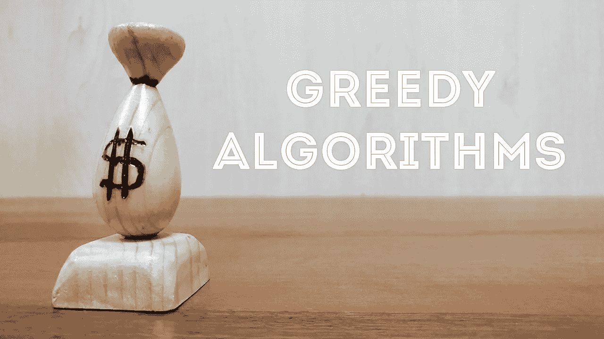
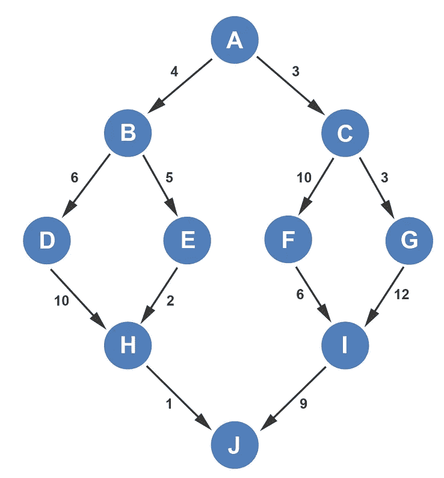
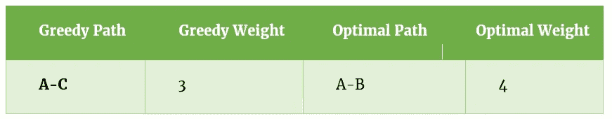
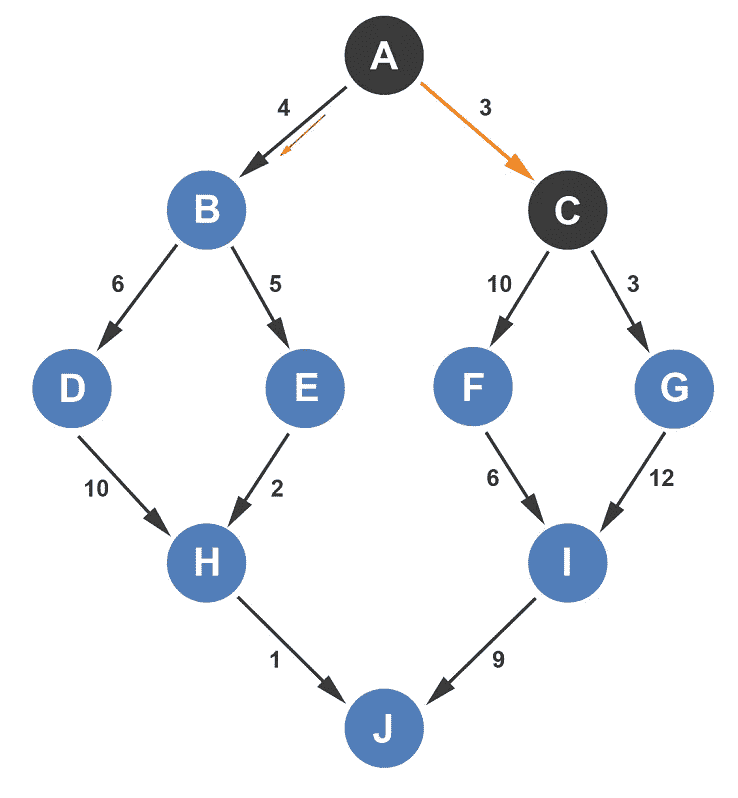
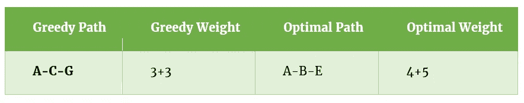
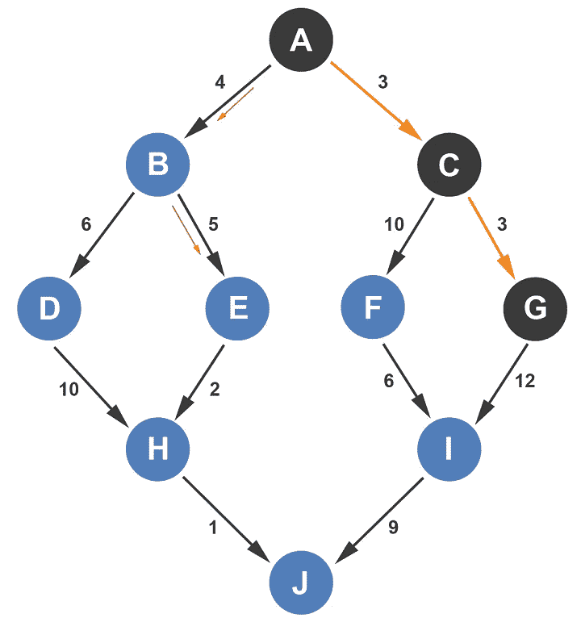
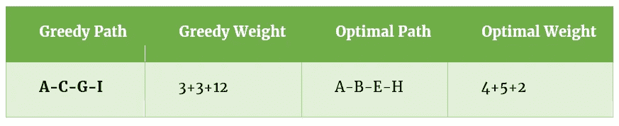
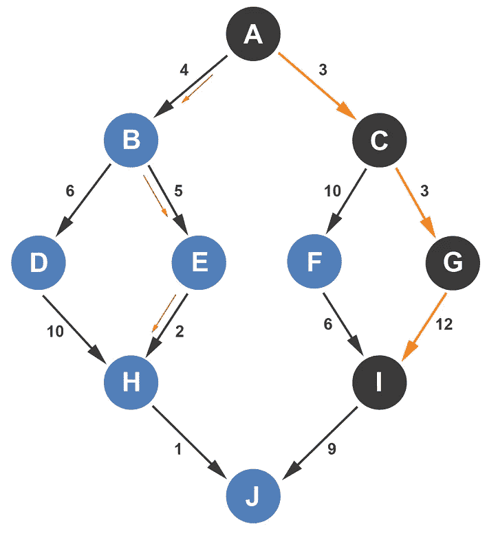
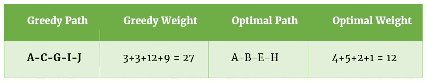
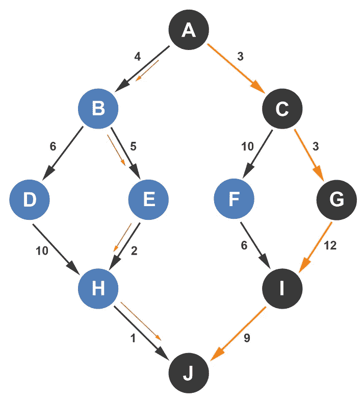

# 贪婪算法

> 原文：<https://levelup.gitconnected.com/greedy-algorithms-2999d1367828>

贪婪方法是一种解决特定类型优化问题的方法。贪婪算法在每个阶段选择最佳结果。虽然这在大多数情况下是可行的，但是有很多例子表明贪婪的方法并不是正确的方法。例如，假设你在人生的某个阶段采用贪婪算法赚钱。你高中毕业，有两个选择:

1.  找一份只需要高中文凭的工作
2.  上大学，大学毕业后再找工作

贪婪的方法会选择第一个选项。你马上就能得到钱，而不是花钱接受教育。尽管你将来有可能通过大学教育获得更多的钱，但该算法只检查你当时的选择。让我们看一个贪婪算法的例子。我们有一个带权边的有向图。

如果我们试图从 A 到 J，贪婪算法将检查所有直接连接到 A 的路径，即到 B 和 C 的边。边 A-C 的权重小于 A-B，因此算法选择 A-C。我们将保留一个表，其中包含每个点的贪婪和最佳路径。第一次决策后，贪婪算法胜出。它的当前权重是 3，而最优路径的当前权重是 4。

贪婪算法现在位于顶点 C，并且可以选择使用边 C-F 或 C-G。它选择 C-G，因为直接权重较低。

在这一点上，贪婪算法仍然是赢家。贪婪算法所利用的边的权重总计为 6，而最佳路径所利用的边的权重总计为 9。贪婪算法现在在顶点 g，它只有一条到顶点 I 的路径，所以它必须走这条路。它在现有重量的基础上增加了 12 磅，从而在重量上受到了很大的惩罚。

贪婪算法的当前权重 18 现在已经超过了最优算法的权重 11。贪婪算法还有一个优势可以利用到 j。不幸的是，它通过增加额外的权重 9 而获得了另一个巨大的损失。

贪婪算法和最优算法都是从 A 到 J，但是使用了不同的路径。最终，最优算法胜出，因为它的总权重是贪婪算法的两倍多。为什么贪婪算法会存在呢？有些情况下，我们会谈到贪婪算法是最有效的算法。利用贪婪方法的一些算法是 Kruskal 算法、Prim 算法和 Dijkstra 算法。

如果你喜欢你所读的，我的书，**【算法的说明性介绍】，涵盖了这个算法和更多。**

* [## 编写面试问题

### 一个完整的平台，在这里我会教你找到下一份工作所需的一切，以及…

技术开发](https://skilled.dev)* **

*Dino Cajic 目前是 [LSBio(寿命生物科学公司)](https://www.lsbio.com/)、[绝对抗体](https://absoluteantibody.com/)、 [Kerafast](https://www.kerafast.com/) 、 [Everest BioTech](https://everestbiotech.com/) 、 [Nordic MUbio](https://www.nordicmubio.com/) 和 [Exalpha](https://www.exalpha.com/) 的 IT 负责人。他还是我的自动系统公司的首席执行官。他有十多年的软件工程经验。他拥有计算机科学学士学位，辅修生物学。他的背景包括创建企业级电子商务应用程序、执行基于研究的软件开发，以及通过写作促进知识的传播。*

*你可以在 [LinkedIn](https://www.linkedin.com/in/dinocajic/) 上联系他，在 [Instagram](https://instagram.com/think.dino) 上关注他，或者[订阅他的媒体出版物](https://dinocajic.medium.com/subscribe)。*

*阅读 Dino Cajic(以及 Medium 上成千上万的其他作家)的每一个故事。你的会员费直接支持迪诺·卡吉克和你阅读的其他作家。你也可以在媒体上看到所有的故事。*