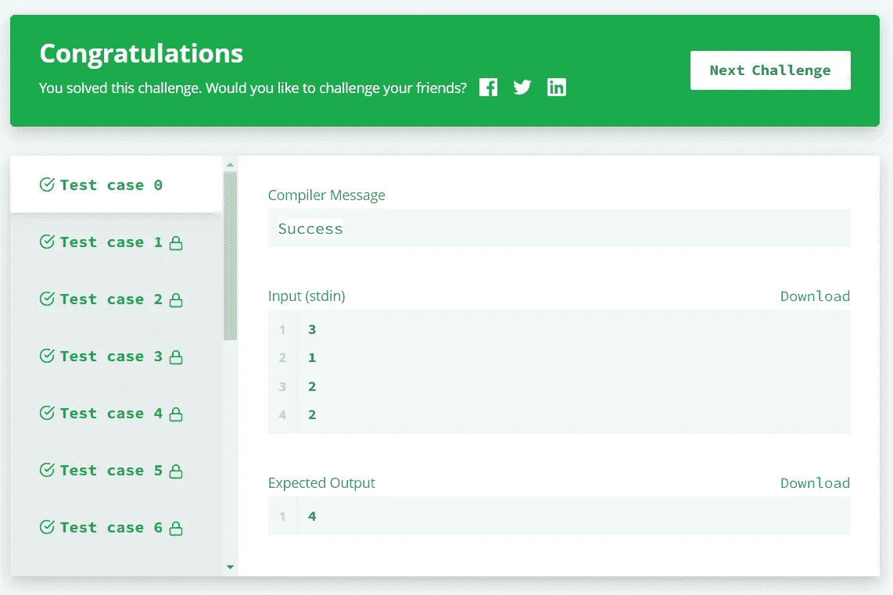

# 贪婪的算法。

> 原文：<https://levelup.gitconnected.com/greedy-algorithms-438eff5c303a>

## 它们是什么？


照片由 [Unsplash](https://unsplash.com?utm_source=medium&utm_medium=referral) 上的[延斯·勒列](https://unsplash.com/@madebyjens?utm_source=medium&utm_medium=referral)拍摄

# 简单的定义

根据[辉煌](https://brilliant.org/wiki/greedy-algorithm/)的说法，贪婪算法是:

> “一种算法，当它试图找到解决整个问题的整体最优方法时，在每一步都做出最优选择。”

现在，这可能会使贪婪算法看起来是一个复杂和错综复杂的算法，但事实并非如此！

我们来看一个例题，看看情况如何！

# 糖果

来自 [**HackerRank**](https://www.hackerrank.com/challenges/candies/problem) :

## 声明:

爱丽丝是一名幼儿园老师。她想给班上的孩子们一些糖果。所有的孩子坐成一排，根据他们在班上的表现，每个孩子都有一个评分。爱丽丝想给每个孩子至少一颗糖。如果两个孩子坐在一起，那么得分高的那个孩子肯定会得到更多的糖果。爱丽丝想尽量减少她必须买的糖果总数。

## 示例:

```
**# Input**
students = **[4, 6, 4, 5, 6, 2]****# Output** She gives the students candy in the following minimal amounts: 
**[1, 2, 1, 2, 3, 1]**. She must buy a minimum of 10 candies.
```

# 说明

因为这个问题只要求老师给两人中表现更好的学生更多的糖果，所以分配糖果的最佳方式是给表现更好的学生更多的糖果。

这使得多次查看数组这一看似复杂的搜索变成了一项简单的任务。

我们只需要从数组的两边遍历数组两次，以确保我们考虑了每一对。

因为每个学生必须从一颗糖开始，我们可以在课程开始时预先分配。

我们可以从存储一个列表来跟踪每个学生的糖果开始。

接下来，开始从前到后遍历列表，并为表现更好的学生调整糖果的数量。

执行另一个迭代，这次包括一个额外的检查，看看表现较好的学生比表现较差的学生得到的糖果少还是相等。

现在，我们完成了！



通过所有测试案例！| [来源:HackerRank](https://www.hackerrank.com/challenges/candies/problem)

时间复杂度是 O(N ),因为我们只计算两次迭代中最差的一次。

# 结论

我希望你喜欢读这篇文章，并且你学到了新的东西！如果你有任何问题，建议，或一般的反馈，请随时在评论中提出来！

编程快乐！