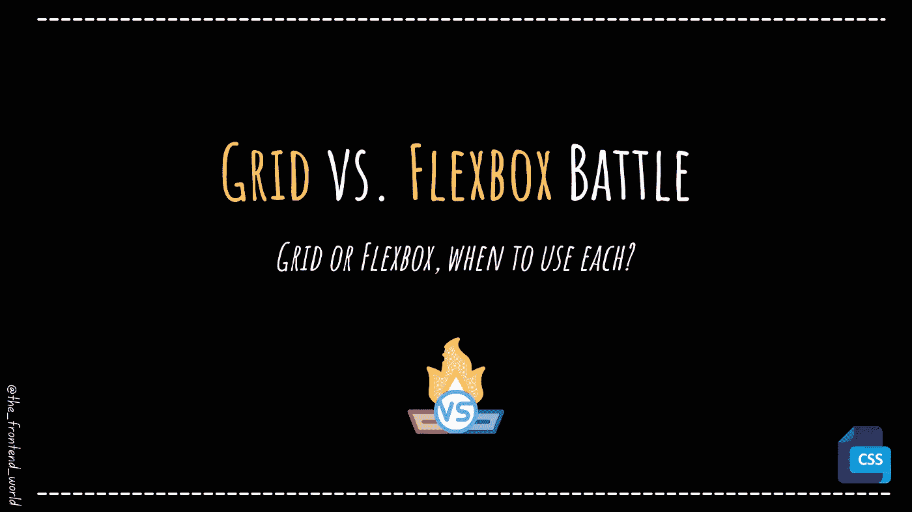
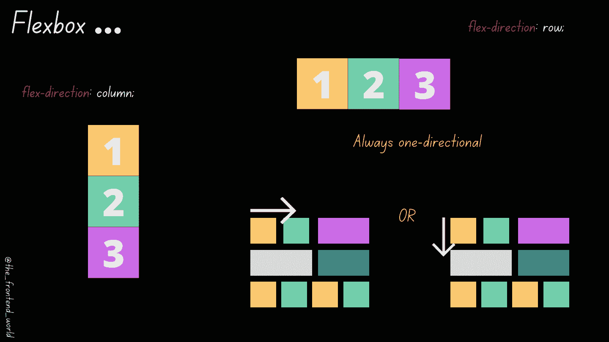
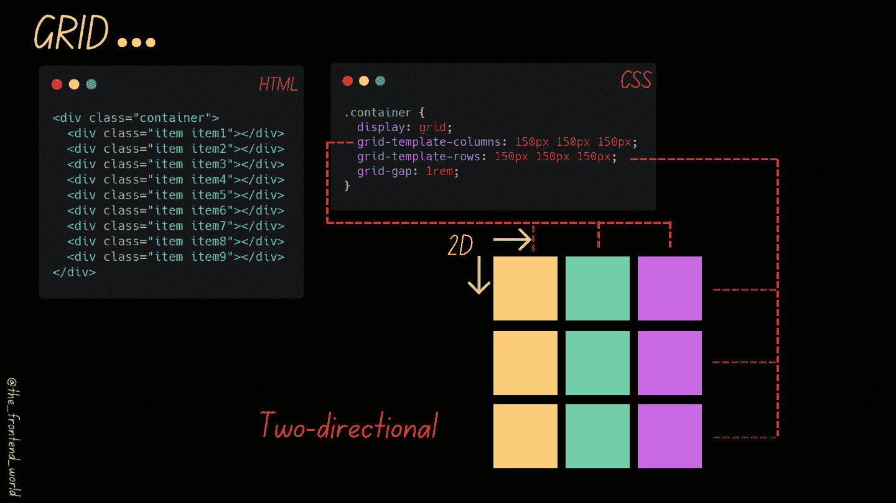

# 网格与 Flexbox 之战

> 原文：<https://levelup.gitconnected.com/grid-vs-flexbox-battle-75f9f940502a>

## Grid 或 Flexbox，何时使用？

作者:FAM

Grid 和 Flexbox 有什么区别？

自从 CSS 中的网格系统出现后，开发人员开始感到困惑。这是完全正常的，因为我们使用两者来定位容器内的项目。

本文的目标是让您快速清晰地了解这两者(Flexbox 和 Grid)之间的区别，并帮助您在想要将项目放置在容器中时做出明智的决定。

开始吧！

# #1-维度

> Flexbox 和 Grid 的核心区别在于维度方面

## - Flexbox 是一维的(1D)

Flexbox 适合以一维方式设计布局，这意味着将项目排列为行或列是好的，但不是两者都是。

作者:FAM

## -网格是二维的(2D)

相反，网格是为二维布局设计而设计的，就像一个数组。您可以在 X 轴和 Y 轴上排列项目。

作者:FAM

# # 2-Flexbox 和 Grid 的用途是什么？

## - Flexbox

*   Flexbox 是对齐物品的完美选择。
*   不太擅长重叠。它需要负边距或绝对定位来打破 flex 行为，这在 CSS 中是不干净的。
*   Flex 有自己的包装系统。我们可以告诉 flex，当 Flex 项目填充一行时，让它向下换行到另一行。

## -网格

*   网格是布局的完美选择。
*   网格给你一个更干净和完整的风格，有趣的功能，如分数单位。
*   擅长重叠。我们可以在重叠的网格线上应用项目。
*   我们可以允许 Grid 用它的自动填充选项来包装项目。

# #3-什么时候什么是好的选择？

> Flexbox 系统非常适合垂直或水平对齐物品。
> 
> Grid 是将项目定位为二维网格或数组的完美选择

因此，正如你所看到的，这完全取决于你想要创建什么，如果只是一些组件的对齐，那么 FlexBox 就足够了。如果是以 2D 方式排列组件或项目，那么网格是更明智的选择。

# #4-实际观察

## - Flexbox

## -网格

 [## CSS 网格游乐场

### 一个实验 CSS 网格布局的简单界面。

www.cssgridplayground.com](https://www.cssgridplayground.com/) 

你可以玩它，调整它的大小，检查 Flex 和 Grid 的不同属性和可能性。

如果您对关于 Flex 或 Grid 的详细文章感兴趣。请在评论区让我知道^^

我希望这篇文章是有帮助的，任何关于它的反馈都非常欢迎❤

如果你喜欢看我的文章……♥️

 [## 如果你喜欢看我的文章… ♥️

### 如果你喜欢读我的文章… ♥️，当我的文章发表时，欢迎你第一个得到通知…

famzil.medium.com](https://famzil.medium.com/subscribe) 

> 谢谢你，❤

如果你有兴趣成为付费会员，你可以使用我的介绍[链接](https://famzil.medium.com/membership)。下次见

亲爱的读者，感谢你在我生命中的存在。

**让我们在** [**上取得联系**](https://medium.com/@famzil/)**[**Linkedin**](https://www.linkedin.com/in/fatima-amzil-9031ba95/)**[**脸书**](https://www.facebook.com/The-Front-End-World)**[**insta gram**](https://www.instagram.com/the_frontend_world/)**[**YouTube**](https://www.youtube.com/channel/UCaxr-f9r6P1u7Y7SKFHi12g)**或**********

******参见我的关于网络要素和一般文化的电子书。******