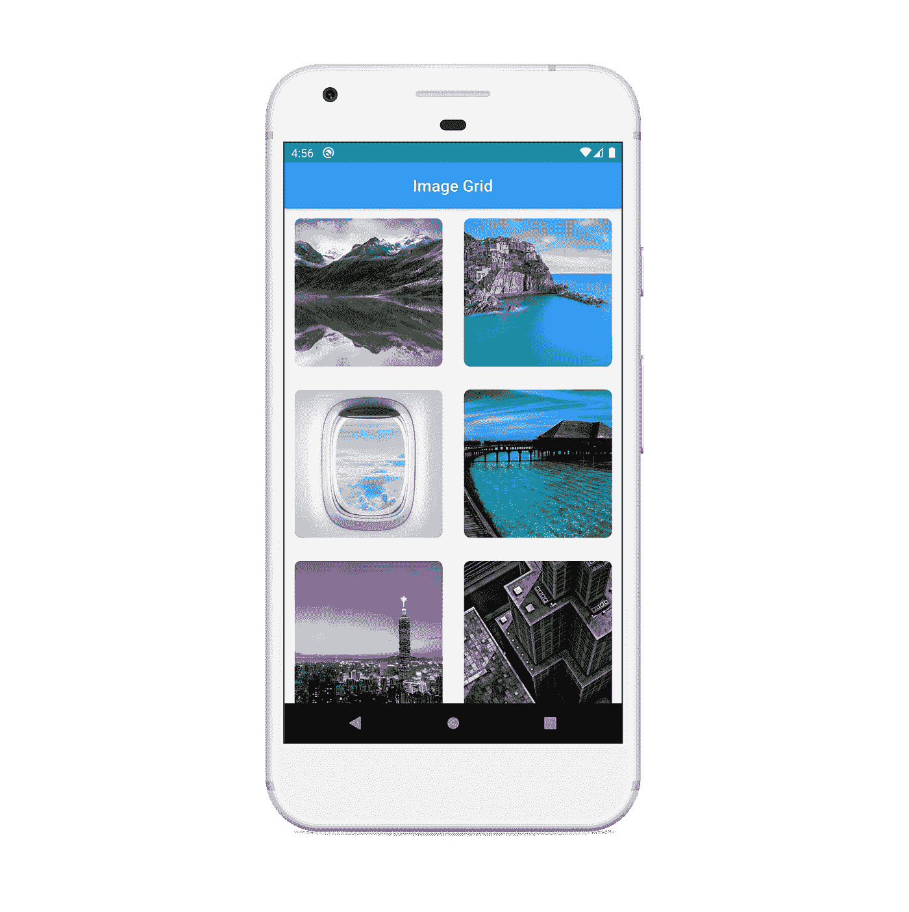

# GridView 和交错 GridView 在颤振中的应用

> 原文：<https://levelup.gitconnected.com/gridview-and-staggered-gridview-in-flutter-ef5d999fcab0>

使用示例开始了解 Flutter 中的网格布局


GridView 和交错 GridView 在颤振中的应用

在这篇文章中，我们将看看 window 中的`[GridView](https://api.flutter.dev/flutter/widgets/GridView-class.html)`小部件，为什么它不适合所有的使用情形，以及我们如何使用交错 GridView 来布局复杂的项目。让我们开始吧！

# 显示数据表格（一种控件）

从单据上看`GridView`是一个**可滚动的**、 **2D 数组**小部件。它基本上用于以表格网格的方式放置项目。

`GridView`类的构造函数如下:

*   `[GridView](https://api.flutter.dev/flutter/widgets/GridView/GridView.html)` —使用自定义`[SliverGridDelegate](https://api.flutter.dev/flutter/rendering/SliverGridDelegate-class.html).`创建 GridView
*   `[GridView.count](https://api.flutter.dev/flutter/widgets/GridView/GridView.count.html)` —创建一个 GridView，在横轴上具有固定数量的切片。它是最常用的构造函数。
*   `[GridView.extent](https://api.flutter.dev/flutter/widgets/GridView/GridView.extent.html)` —创建一个 GridView，允许我们指定最大跨轴范围，而不是每个切片的固定大小。
*   `[GridView.builder](https://api.flutter.dev/flutter/widgets/GridView/GridView.builder.html)` —创建动态或按需显示数据的 GridView。一般用于大量的孩子那里的记忆需求是巨大的。只为那些实际可见的项调用生成器。
*   `[GridView.custom](https://api.flutter.dev/flutter/widgets/GridView/GridView.custom.html)` —创建自定义 GridView，允许我们指定自定义`[SliverGridDelegate](https://api.flutter.dev/flutter/rendering/SliverGridDelegate-class.html)`和自定义`[SliverChildDelegate](https://api.flutter.dev/flutter/widgets/SliverChildDelegate-class.html)`。

理论到此为止，让我们用代码来弄脏我们的手。在这个例子中，我们将使用`GridView.count`构造函数。稍后，我们还将使用`GridView.extent`和`GridView.builder`构造函数重新创建相同的网格布局，以获得更好的想法。我们创建一个简单的`GridView`来保存一些*纵向*和*横向*方向的图像。

构造函数有各种参数，但这些是最常用的。有一个必需的参数`crossAxisCount`，它定义了横轴上的瓦片数。这里我们希望每行有 2 个图块，所以我们传递值 2。

`mainAxisSpacing`定义了两个磁贴之间的空白空间量及其滚动方向(本例中为垂直方向),而`crossAxisSpacing`定义了磁贴在滚动方向横轴上的间距(本例中为水平方向)。它需要一个要在网格中布局的小部件列表。这里，我们为参数`children`传递定制的`ImageTile`小部件列表。就这样，这里我们有一个简单的工作 GridView！

这将产生以下输出:



GridView 示例

您可以使用`GridView.extent`构造函数获得相同的结果，如下所示:

同样用`GridView.builder`构造函数可以做到:

> ***为简洁起见，本文仅包含必要的代码，您可以在文章末尾找到 GitHub 到完整源代码库的链接。***

# 交错网格视图

如果你一直在密切关注这篇文章，你一定已经注意到我提到过的我们使用的图片既有纵向的也有横向的。您可以查看`assets/images`文件夹，查看示例中使用过的所有图像。

如果您看一下输出，我们可以看到图像被裁剪以适合我们指定的尺寸。如果我们想以交错的方式显示完整的图像，包括纵向图像和横向图像，该怎么办？幸运的是，我们有一个包！

因此，让我们首先将[**flutter _ staggered _ grid _ view**](https://pub.dev/packages/flutter_staggered_grid_view)包添加到我们的`pubspec.yaml`文件:

```
dependencies:
  **flutter_staggered_grid_view: ^0.3.2**
```

让我们在终端中运行以下命令来安装它:

```
**$ flutter pub get**
```

下一步是导入包:

```
**import 'package:flutter_staggered_grid_view/flutter_staggered_grid_view.dart';**
```

类似于`GridView`，`StaggeredGridView`作为各种构造函数。我们将在这里使用的是`countBuilder`构造函数。

大多数参数与`GridView.count`和`GridView.builder`构造器的参数相同。这里我们有一个额外的`staggeredTileBuilder`参数，它是一个将整数索引作为参数并返回一个`StaggeredTile`的函数。这里我们使用`fit`构造函数，因为我们想要一个可变的范围，这个范围是由 tile 本身的内容定义的。

其他构造函数有:

*   `StaggeredTile.count` —针对固定数量的单元
*   `StaggeredTile.extent` —用于固定范围

注意，`Tile`的构造函数与`GridView`的构造函数相似。

这将产生以下输出:


交错网格视图

# 结论

在本文中，我们看到了如何在 Flutter 中使用`GridView`，以及如何在一个简单的包的帮助下创建一个交错的 GridView。

虽然这不是一个详尽的教程，但我希望它能帮助你开始在 Flutter 中使用网格布局。

完整的源代码可以在下面的链接中找到:

[](https://github.com/harshshinde07/Flutter-GridView) [## harshshinde 07/颤振-GridView

### 在 GitHub 上创建一个帐户，为 harshshinde07/Flutter-GridView 开发做出贡献。

github.com](https://github.com/harshshinde07/Flutter-GridView) 

## 感谢您阅读这篇文章。如果你喜欢这篇文章或者学到了新的东西，尽可能多地鼓掌以示支持。👏

## 这真的激励我继续写更多！:)

## 如果有错误，请随时纠正。

## 我们来连线:

*   [GitHub](https://github.com/harshshinde07/)
*   [领英](https://www.linkedin.com/in/harshshinde07/)