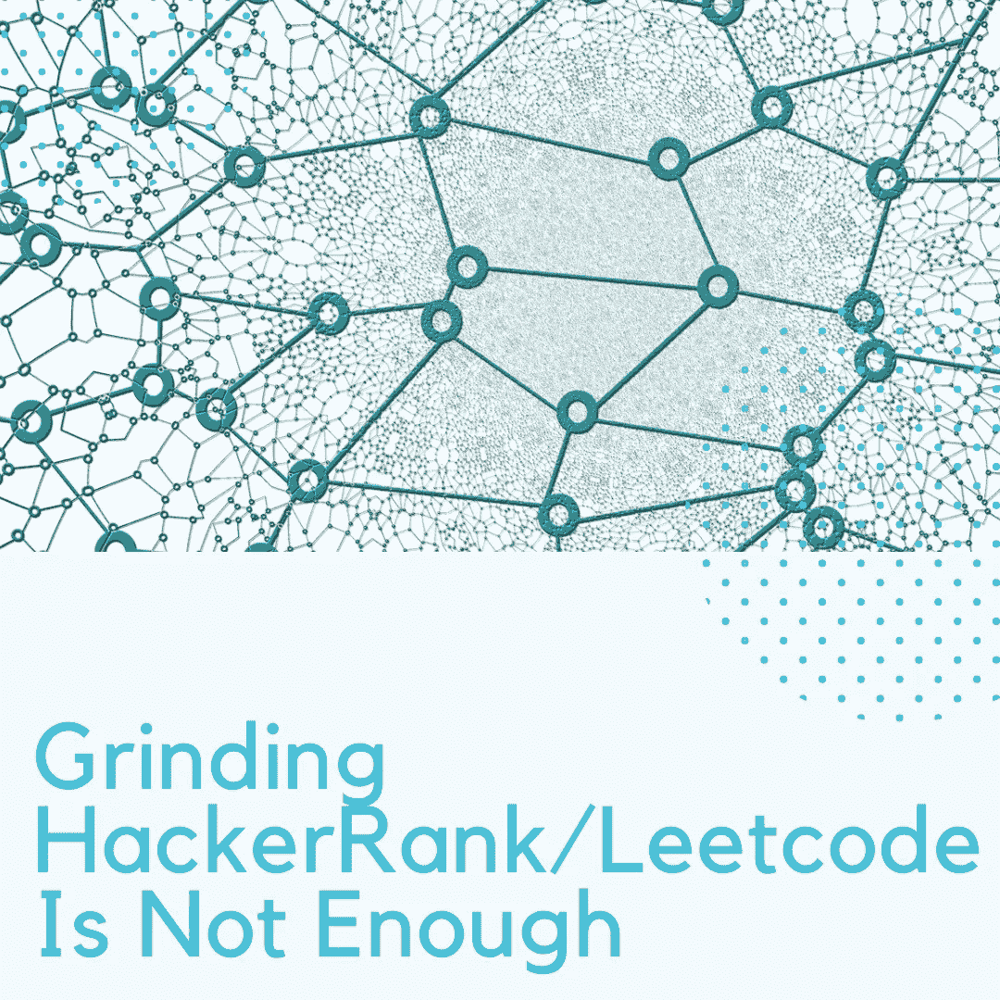

# 研磨 HackerRank/Leetcode 是不够的

> 原文：<https://levelup.gitconnected.com/grinding-hackerrank-leetcode-is-not-enough-24e02786a4ea>

## 编程不仅仅是算法和数据结构

最近，像 HackerRank/Leetcode 这样的在线竞争编程平台在开发人员和招聘人员中间越来越受欢迎。这些都是很棒的平台，提供了一种简单的方法来练习常见的算法和数据结构问题，为面试(或其他任何事情)做准备。但是基于这些结果的软件开发技能的评估(最重要的是准备)是不准确的，不具有代表性，我现在将解释这一点。

冒泡排序、插入排序、合并排序、堆排序、快速排序。深度优先搜索，广度优先搜索，Dijkstra 算法，Floyd 算法。你已经在算法和数据结构上投入了大量的时间，并且都知道了。你感到自信并通过了面试，解决了他们所有的评估。然后，第一天工作开始了，你打开任务列表，意识到你必须修复 2 个 CSS 错误，重构单元测试，并为 API 调用添加一个错误处理程序。你的任何准备工作都没有涉及到，你会因为研究一个巨大的新代码库而感到不知所措，慢慢地筋疲力尽。

这个小故事应该告诉你，编程不仅仅是算法和数据结构，但是没有人关注它们。除了算法和数据结构之外，我现在将介绍您应该注意的 5 点**。**

# 1.阅读他人的代码

这是最被低估的技能。阅读现有的(也许还有遗留代码)对于任何软件开发职业都是至关重要的。在对代码库进行修改之前，你必须完全理解它。您应该能够对您的同行进行代码审查，并乐于接受他们。

代码审查对于维护一致的代码库和确保每个人都在同一页面上是必不可少的。如果你有信心阅读代码，你就不会经常带着多余的问题去查阅文档和你的同行，从而提高生产率。

另外，通过阅读越来越多的代码，你的代码会变得越来越好。你会在遇到常见问题之前就找到解决方法。你会立刻发现代码的味道。幸运的是，这项技能很容易学会。

要学习理解不熟悉的代码，请访问 Github，查找一些您正在积极使用的开源库。阅读它的代码，尝试理解它，并最终尝试修复其中的一些现有问题。通过做这个简单的练习，你会很快变得更擅长编写高质量的代码，你在工作场所的上司也会意识到这一点。你也将回馈开源社区，那里有它的好处。

# 2.可读性

虽然与前一节密切相关，但这是一个非常重要的问题，值得单独讨论。可读性问题会随着代码库的增长而显现出来，并且您无法保持代码的一致性和易于理解。你将需要使用像封装、可重用性、KISS(保持简单，愚蠢)和 DRY(不要重复自己)这样的原则。

没有一个放之四海而皆准的解决方案来生成可读的代码。你可以通过(1)阅读不熟悉的代码，(2)一遍又一遍地重构你的代码，直到每个人都能理解它。还要记住，注释并不能补救糟糕的代码:如果你的代码为了可读性而需要注释**，那么它就有问题。**

如果你想产生持续可读和高质量的代码，我强烈推荐阅读罗伯特·塞西尔·马丁的[干净代码](https://www.oreilly.com/library/view/clean-code/9780136083238/)。它将带你走过常见的问题，介绍它们的解决方案，并让你做一些独立的阅读和重构来练习。如果由我决定，这本书将会在每个软件工程项目中被学习。

# 3.合作

独自解决有趣的计算问题很有趣，但在工作场所效率不高。它需要一种不同类型的思维，这种思维是无法教授的，只能学习。此外，你需要对像 Git、吉拉、Slack 或它们的替代品这样的工具有信心。

要成为一个更高效的队友，你需要在团队中工作，而这是像 HackerRank/Leetcode 这样的平台还不能提供的(由于他们自己没有错)。值得庆幸的是，大多数人都是通过在大学/训练营的小组项目中工作来获得这种经验的，但如果你是一名自学成才的开发人员(像我一样)，你将需要提升你的协作和交流技能。

# 4.大局思维

当你在解决小的原子问题时，一旦你开始思考，你会很快变得过于自信。但你仍将缺少一项关键技能:大局思维。

虽然学习平台上的问题(通常)仅限于一个文件，但您的实际项目不会。此外，它们将包含数千个文件，数百个类和数百万行代码。当对代码库的一部分进行更改时，您必须时刻注意这会给其他部分带来的变化。当然，干净的代码和严格的测试会有所帮助，但不会彻底根除。

作为一名开发人员，您不断地做出决策，即使是在入门/初级水平。从*如何调用这个变量*和*使用哪个 HTML 元素*到*哪个云提供商最适合我们的需求*和*哪个应用框架工作得最好*。不管其性质如何，开发者需要意识到他们行为的后果。这种类型的思维可以通过在一个项目上工作一段时间来发展，所以它可以发展到足以让你看到你最初行动的所有后果。

# 5.安全性

信息安全是一个广泛而复杂的主题，没有人期望您在开始工作时就了解它。我所说的*安全性*是每个人都应该遵循的代码级应用实践。

这些真的很简单:封装(隐藏内部特性的实现)，单一责任原则(一个实体应该做一件事，其他任何实体都不应该干涉)，单一事实点原则(你的数据来自单一来源，并且永不重复)。这些原则将保护您的代码免受最明显的攻击，并且非常容易理解。在进行单独的练习时，你并不真的需要它们，但它们仍然很重要。

# 结束语

感谢您的阅读，我希望您现在明白编程不仅仅是枯燥的练习。不过，我想重申，算法和数据结构同样重要，你至少应该知道最常见的算法和数据结构。

# 资源

*   [干净的代码:敏捷软件技术手册](https://www.oreilly.com/library/view/clean-code/9780136083238/)
*   [如何为开源做出贡献](https://opensource.guide/how-to-contribute/)

 [## 编写面试问题

### 一个完整的平台，在这里我会教你找到下一份工作所需的一切，以及…

技术开发](https://skilled.dev)