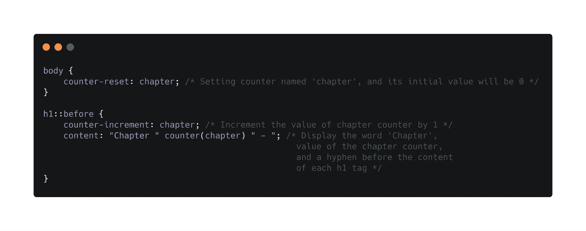
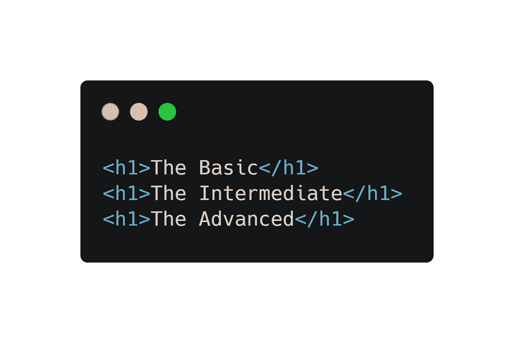
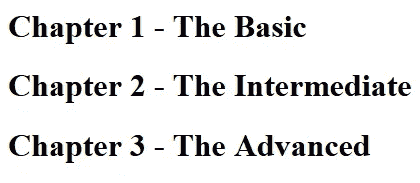
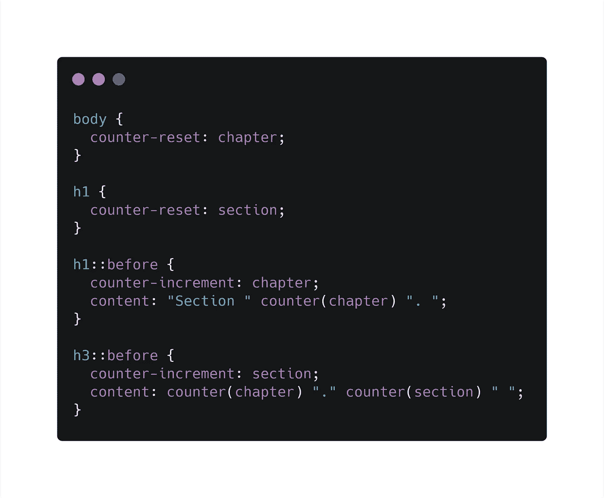
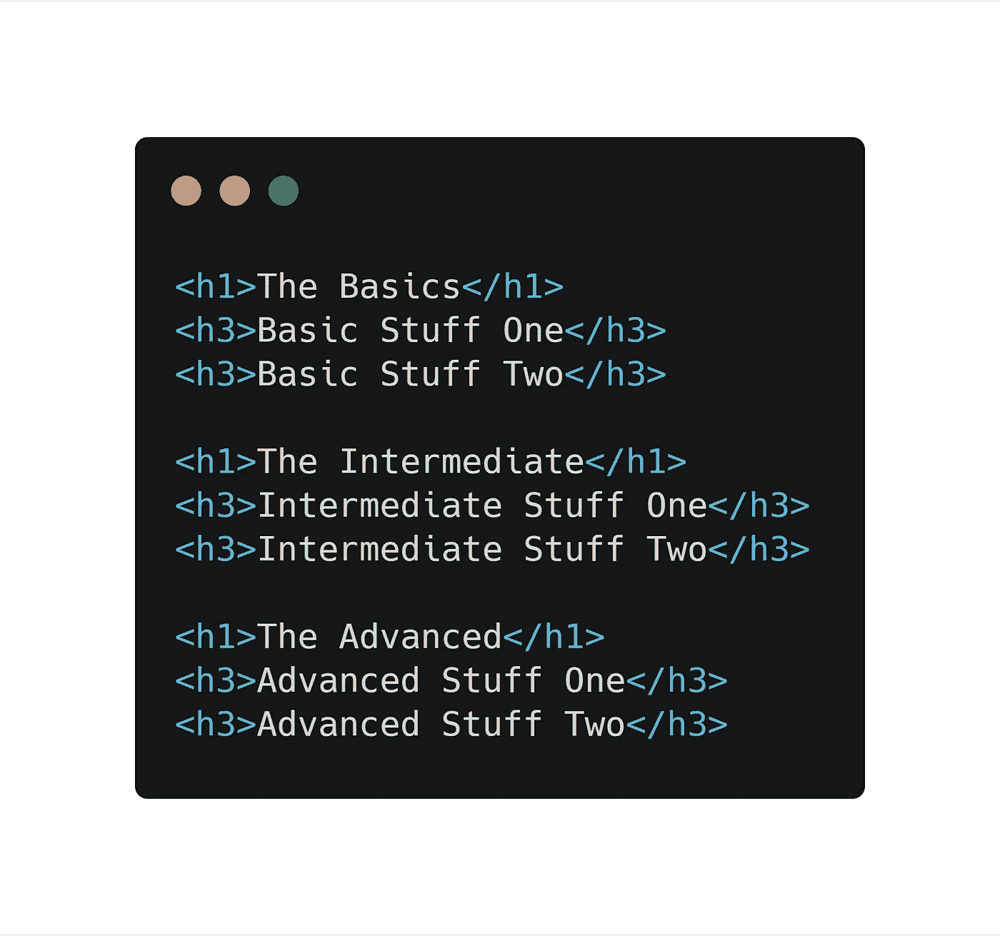
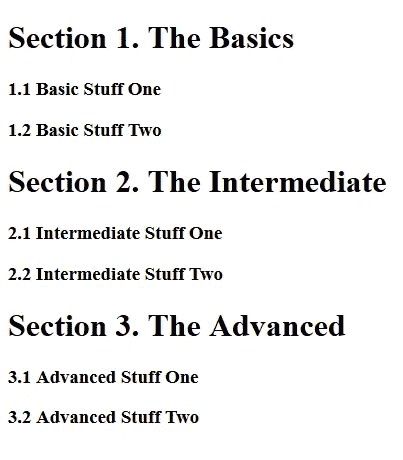

# 搜索 CSS 计数器

> 原文：<https://levelup.gitconnected.com/grokking-css-counters-a6272abcbcd3>

格伦·卡斯滕斯-彼得斯在 [Unsplash](https://unsplash.com?utm_source=medium&utm_medium=referral) 上拍摄的照片

CSS 计数器基本上是变量，其值可用于根据内容在 web 文档中的位置对内容进行编号。通常在 HTML 中，一个

CSS 计数器使用下列属性:

*   **计数器复位** —创建或复位 CSS 计数器。若要使用计数器，必须首先将其初始化为具有此属性的值。默认情况下，该值为 0。相同的属性可用于将其值更改为任何特定的数字。
*   **计数器值** —一旦初始化，计数器的值可以通过该属性增加。
*   **内容** —插入生成的内容。
*   **counter()** 或 **counters()** 函数—将计数器的值添加到元素中。计数器的值可以使用 content 属性中的 counter()或 counters()函数来显示。

**counter()** 函数有两种形式:“counter(name)”或“counter(name，style)”。生成的文本是给定伪元素范围内给定名称的最内层计数器的值。它被格式化为作为 counter()函数的参数给出的指定样式(默认为十进制)。

**counters() f** 函数也有两种形式:“counters(name，string)”或“counters(name，string，style)”。生成的文本是给定伪元素范围内具有给定名称的所有计数器的值，从最外面到最里面，由指定的字符串分隔。计数器以指示的样式呈现，该样式作为 counter()函数的参数给出(默认为十进制)。

要使用 CSS 计数器，必须使用计数器重置来创建它。计数器的名称不能是“none”、“inherit”或“initial”。如果是这样，就忽略不计。

让我们看一个例子:

# **基本计数器**

下面的例子为整个页面创建了一个计数器(因为我们已经为 body selector 中的 chapter 创建了一个计数器)，然后我们为每个

# 元素增加计数器值，并在每个

# 元素的开头添加文本“Chapter <counter value="">—”。</counter>

**CSS**

**HTML**

**输出**

# **嵌套计数器**

以下示例为页面(章)和每个

# 元素(节)创建一个计数器。“章节”计数器将对每个带有“章节<value of="" the="" chapter="" counter="">”的

# 元素进行计数，对于每个带有“<value of="" the="" chapter="" counter="">的

### 元素，将计算“区段”计数器。<value of="" the="" section="" counter=""></value></value></value> 

**CSS**

**HTML**

**输出**

几乎所有现代浏览器都支持 CSS 计数器。

 [## 我能用吗...HTML5、CSS3 等的支持表

### “我可以使用吗”提供了最新的浏览器支持表，以支持桌面和移动设备上的前端 web 技术…

caniuse.com](https://caniuse.com/#search=CSS%20Counters) 

我希望你喜欢这个关于 CSS 计数器的复习。

-阿尼基特·库代尔