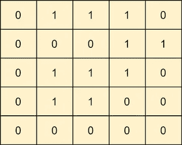
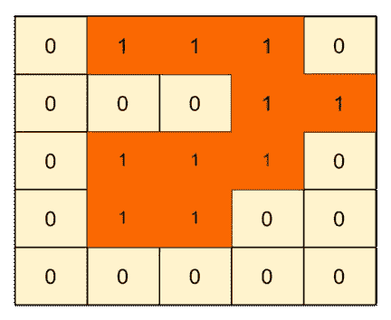
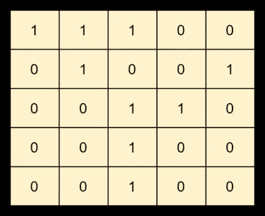
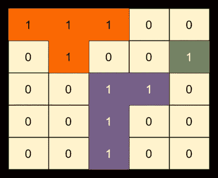
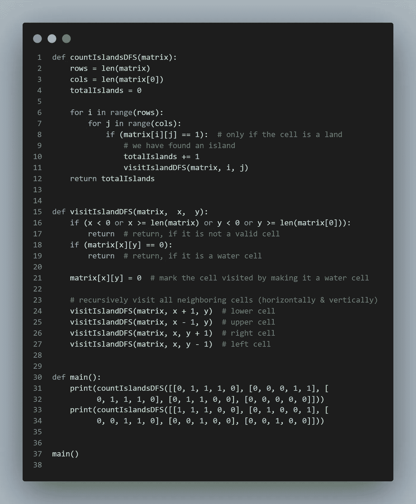
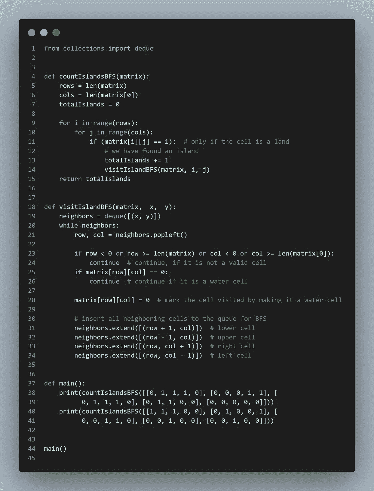
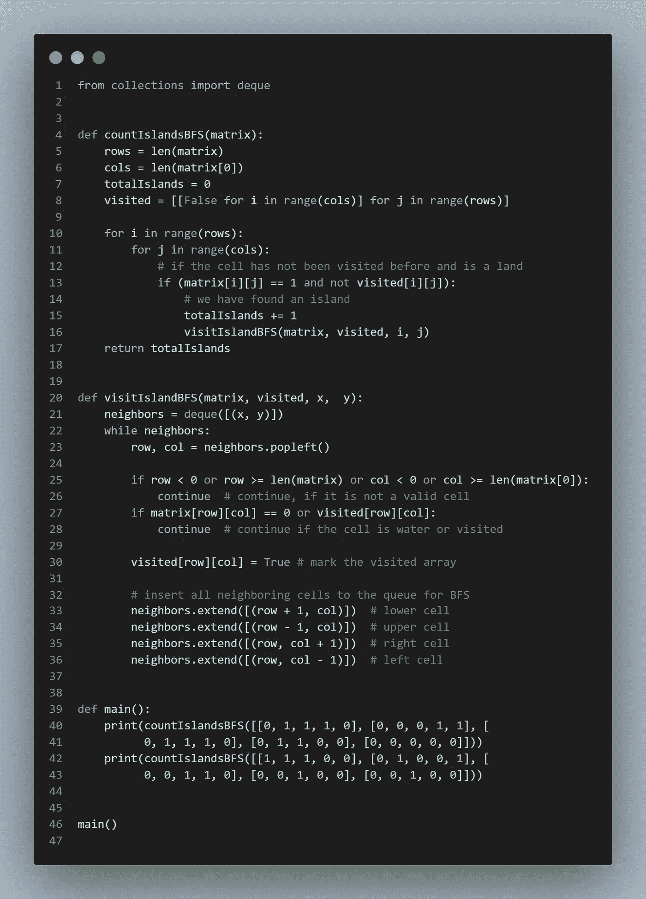

# 探索编码面试:模式岛

> 原文：<https://levelup.gitconnected.com/grokking-the-coding-interview-pattern-island-dc9c7def6b54>

编码模式增强了我们“将新问题映射到已知问题的能力”

照片由[伊山@seefromthesky](https://unsplash.com/es/@seefromthesky?utm_source=unsplash&utm_medium=referral&utm_content=creditCopyText) 在 [Unsplash](https://unsplash.com/s/photos/island?utm_source=unsplash&utm_medium=referral&utm_content=creditCopyText)

对我来说，学习使用算法模式解决问题真的是一种更安全的生活。

这些模式背后的想法是，一旦你熟悉了一个模式，你就能够用它解决许多问题。

通过这样做，我节省了大量的时间，否则我会花在准备编码面试上。

今天，我们来讨论一种最常用的算法模式，叫做**孤岛模式**。

# 背景

许多编码面试问题涉及遍历 2D 阵列(又名矩阵或网格)。**岛模式**描述了一种遍历矩阵的有效方式。该模式帮助我们理解使用**深度优先搜索(DFS)** 和**宽度优先搜索(BFS)** 方法及其变体的矩阵遍历。

让我们跳到一个问题上来理解这个模式。

# **岛屿数量(简易)**

## **问题陈述**

给定一个只包含`1` s(陆地)和`0` s(水)的 2D 数组(即矩阵)，计算其中岛屿的数量。

一个**岛**是一组`1` s(陆地)的连接，并且被一条边或者`0` s(水)包围。每个像元都被视为水平或垂直(非对角)连接到其他像元。

**例 1**

**输入**:矩阵=

**输出**:1
说明:矩阵只有一个岛。请参见下面突出显示的单元格。

**例 2**

**输入**:矩阵=

**输出** : 3
**说明**:矩阵有三个岛。请参见下面突出显示的单元格。

# 解决办法

我们可以线性遍历矩阵来寻找岛。

每当我们找到一个值为‘1’的单元(即陆地)，我们就找到了一个岛。使用该单元作为根节点，我们将执行**深度优先搜索(DFS)** 或**宽度优先搜索(BFS)** 来找到其所有连接的陆地单元。在我们的 DFS 或 BFS 遍历期间，我们将找到并标记所有水平和垂直连接的陆地单元。

我们需要一种机制来标记每个陆地单元，以确保每个陆地单元只被访问一次。要标记已访问的单元格，我们有两个选项:

1.  我们可以更新给定的输入矩阵。每当我们看到一个‘1’，我们就会把它变成‘0’。
2.  可以使用单独的布尔矩阵来记录每个单元是否被访问过。

下面是上述示例 2 的 DFS 或 BFS 遍历:

通过遵循上面的算法，每次 DFS 或 BFS 被触发时，我们确信我们已经找到了一个岛。我们将保持连续计数来计算岛屿的总数。

下面，我们将看到三种基于以下内容的解决方案:

1.  深度优先搜索
2.  BFS
3.  带访问矩阵的 BFS

> *关于这些模式的详细讨论以及相关问题的解决方案，请看一下* [***钻研编码面试***](https://www.designgurus.org/course/grokking-the-coding-interview) *。*

# 代码(DFS)

这是我们的 DFS 算法的样子。我们将更新输入矩阵以标记访问过的单元。

## 时间复杂度

上述算法的时间复杂度将为 *O* (M **N* )，其中‘M’为输入矩阵的行数，‘N’为输入矩阵的列数。这是因为我们必须遍历整个矩阵才能找到岛。

## 空间复杂性

当整个矩阵填满“1”时，DFS 递归堆栈可以达到 M*N 深度。因此，空间复杂度将是 *O* (M **N* )，其中“M”是输入矩阵的行数，“N”是输入矩阵的列数。

# 代码(BFS)

这是我们的 BFS 算法的样子。我们将更新输入矩阵以标记访问过的单元。

## 时间复杂度

上述算法的时间复杂度将为 *O* (M **N* )，其中“M”为行数，“N”为列数。

## 空间复杂性

上述算法的空间复杂度为 O(min(M，N)。在最坏的情况下，当矩阵完全被陆地单元填满时，队列的大小可以增长到 min(M，N)。

# 代码(带访问矩阵的 BFS)

这是我们的 DFS 算法的样子。我们将保留一个单独的布尔矩阵来记录每个单元格是否被访问过。

## 时间复杂度

上述算法的时间复杂度将为 *O* (M **N* )，其中“M”为行数，“N”为列数。

## 空间复杂性

由于被访问的数组和队列的最大尺寸，空间复杂度将是 O(M*N)，其中‘M’是输入矩阵的行数，而‘N’是输入矩阵的列数。

# 基于岛模式的其他问题

以下是使用孤岛模式可以解决的几个问题:

1.  [**【最大岛(易)】**](https://designgurus.org/path-player?courseid=grokking-the-coding-interview&unit=grokking-the-coding-interview_62d53be009288Unit)
2.  [**【洪水补易】**](https://designgurus.org/path-player?courseid=grokking-the-coding-interview&unit=grokking-the-coding-interview_62d52d75d7964Unit)
3.  [**【封闭岛屿数量(容易)**](https://designgurus.org/path-player?courseid=grokking-the-coding-interview&unit=grokking-the-coding-interview_62d6145eebddeUnit) [**【岛屿周长(容易)**](https://designgurus.org/path-player?courseid=grokking-the-coding-interview&unit=grokking-the-coding-interview_62d679f549f28Unit)
4.  [**不同岛屿的数量(中等)**](https://designgurus.org/path-player?courseid=grokking-the-coding-interview&unit=grokking-the-coding-interview_62d679f3bf35bUnit)
5.  [**循环矩阵(中)**](https://designgurus.org/path-player?courseid=grokking-the-coding-interview&unit=grokking-the-coding-interview_62d679f1e93e0Unit)

# 结论

不管喜欢与否，LeetCode 类型的问题几乎是每个编程面试的一部分，所以每个软件开发人员都应该在面试前练习一下。他们唯一的选择是聪明地准备，通过关注潜在的问题模式来学习解决问题。在 [**寻找编码面试**](https://www.designgurus.org/course/grokking-the-coding-interview) 和 [**寻找编码面试的动态编程**](https://designgurus.org/course/grokking-dynamic-programming) 中了解更多关于这些模式和样本问题的信息。

查看 [**设计大师**](http://www.designgurus.org/) 关于编码和系统设计面试的一些有趣课程。

 [## 不要只是 LeetCode 请遵循编码模式

### 编码面试越来越难通过了。为了准备编码面试，你需要几周甚至几个月的时间…

designgurus.org](https://designgurus.org/blog/dont-just-leetcode)  [## 探索编码面试:模式滑动窗口

### 聪明行事，学习编码模式，以便更快、更有效地准备编码面试。

levelup.gitconnected.com](/grokking-the-coding-interview-pattern-sliding-window-20ef83ae5872)  [## 系统设计面试生存指南(2023):准备策略和实用技巧

### 2023 年系统设计面试剧本。

levelup.gitconnected.com](/system-design-interview-survival-guide-2023-preparation-strategies-and-practical-tips-ba9314e6b9e3)