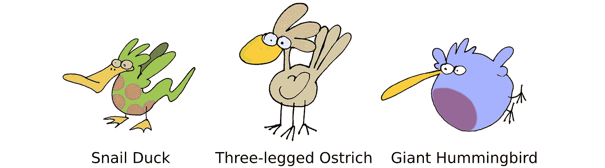
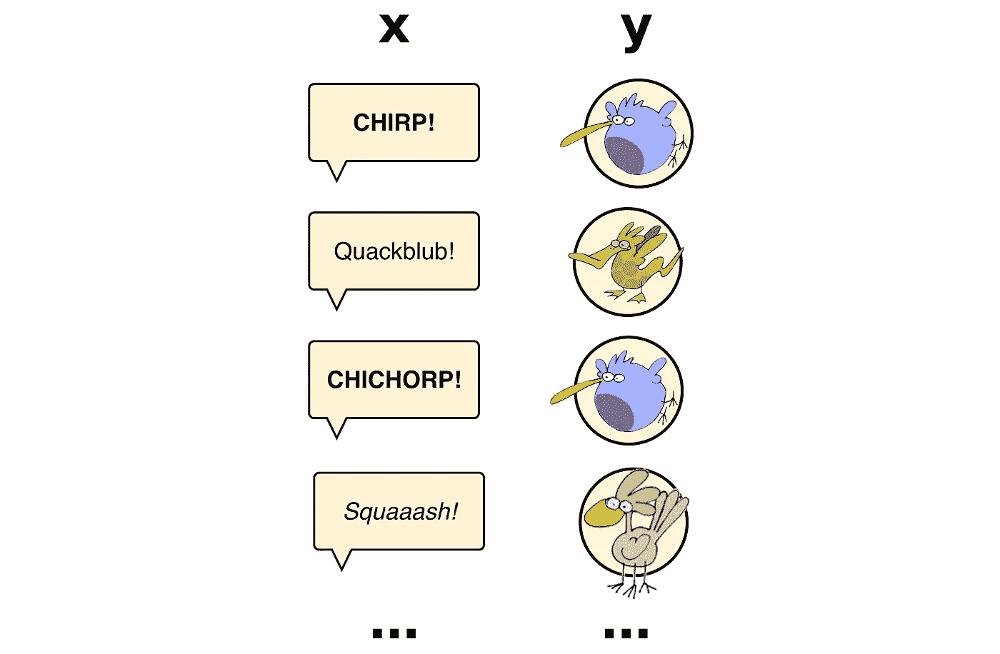
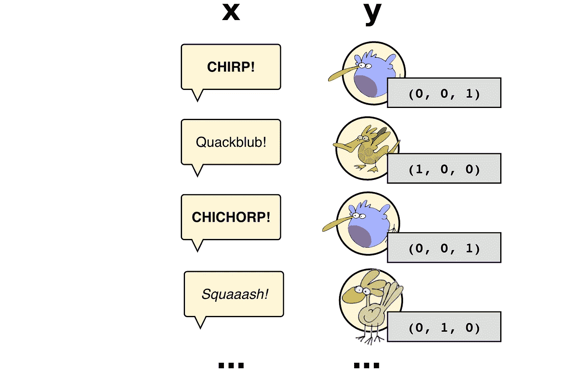
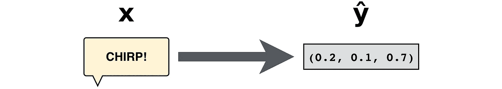
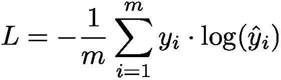
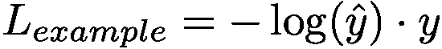
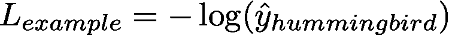
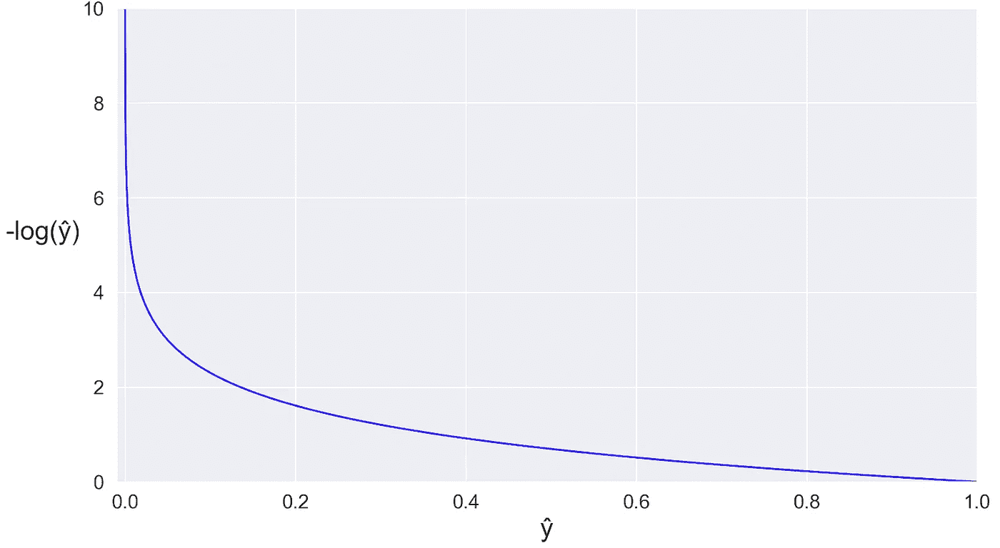
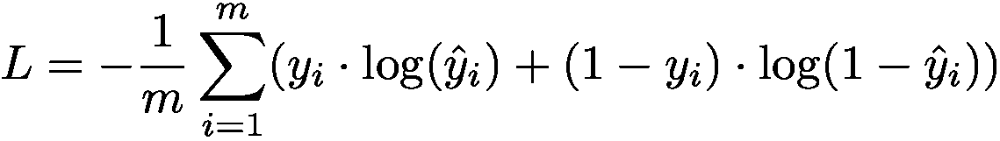

# 寻找交叉熵损失

> 原文：<https://levelup.gitconnected.com/grokking-the-cross-entropy-loss-cda6eb9ec307>

有许多方法可以计算分类器的损失。在[编程机器学习](https://pragprog.com/titles/pplearn)中，我们使用了至少三种不同的损失公式。这篇文章解释了其中一个的直观含义:*交叉熵损失*。

# 手里有三只鸟

比方说，我们正在构建一个分类器，从鸟儿的歌声中识别出它们。我们有三种鸟:

我们已经收集了数百首鸟鸣的数据集，标注了产生这些鸟鸣的鸟类:

这是一个*多类分类*问题，因为它涉及三种鸟类。你可以通过*一次热编码*标签来处理这类问题，就像这样:

每个热编码标签包含三个元素，分别代表鸭子、鸵鸟和蜂鸟。

到目前为止，我们已经打好了基础。让我们开始行动，通过分类器传递一个例子。我们得到一个由 0 到 1 之间的三个数字组成的数组:

正如我在书中所做的，我使用字母 *ŷ* 作为分类器的输出，以区别于实际的标签 *y* 。你可以将 *ŷ* 中的值解释为信心的度量。该分类器有 0.2%的信心认为它在听鸭子的叫声，0.1%的信心认为它是鸵鸟，0.7%的信心认为它是蜂鸟。

现在我们想要一个数字来告诉我们这个分类有多好。这就是交叉熵损失出现的原因。

# 交叉熵损失解释

交叉熵损失的公式如下:

概括一下: *y* 是实际的标签， *ŷ* 是分类器的输出。交叉熵损失是第一个的负值乘以第二个的对数。另外， *m* 是示例的数量，因此总损耗是所有示例的平均损耗。

让我们把这个公式简化成我们能理解的东西。首先，假设我们只有一个例子——所以我们不需要平均值，我们可以通过 m 去除总和和除法。如果我们稍微改变一下其余的项，我们最终会得到一个例子对总交叉熵损失的贡献:

要理解这个公式，请记住亏损的作用:它衡量的是预测值 *ŷ* 和实际值 *y* 之间的距离。如果 *ŷ* 接近 *y* ，损耗应该低。随着 *ŷ* 与 *y* 背离，损失应该会变高。我们来看一个具体的案例。

假设当前的例子是蜂鸟的叫声。在这种情况下，一个热编码标签是:

除了第三个元素——代表蜂鸟的元素——之外，y 的所有元素都是 0。为了这个例子，我们称它为“蜂鸟元素”。

假设我们从分类器得到这个输出:

现在来看一个例子的损失公式:

回头看看上面的 *y* 和 *ŷ* 的值，想想 *ŷ.的第一个和第二个元素会发生什么*上面的公式取它们的对数，然后将结果乘以 *y* 的匹配元素——它们都是零。长话短说，第一个和第二个元素*对ŷ* 的损失没有影响。从交叉熵损失的角度来看，它们的值是不相关的。

相比之下， *ŷ* 的蜂鸟元素确实对损失有影响:它乘以 *y* 的蜂鸟元素，即 1。综上所述，损失可以归结为:

这几乎是一个虎头蛇尾:交叉熵损失最终成为 *ŷ* 中单个元素的负对数。 *ŷ* 的元素范围在 0 和 1 之间，所以这里是该区间的负对数图:

如果 *ŷ* 的蜂鸟元素为 1，即与 *y* 的蜂鸟元素值相同，则损耗降至零。随着ŷ越来越远离 1，越来越接近 0，损失也越来越大。在我们的例子中，蜂鸟元素是 0.7，因此这种鸟叫声的损失相当低。

你可能会惊讶地发现交叉熵损失取决于ŷ的一个元素。难道我们不应该考虑其他因素吗？为了消除疑虑，请记住 *ŷ* 是 *softmax* 函数的输出——这意味着它的元素之和总是 1。换句话说，我们不需要为所有的元素费心:如果一个重要的元素接近 1，那么我们知道其他元素一定接近 0。

简而言之，这就是交叉熵损失。概括一下:

> 以分类器输出的重要元素为例，我们称之为“蜂鸟元素”。
> 
> 如果 hummingbird 元素为 1，这意味着完全正确的分类，那么该分类的交叉熵损失为零。
> 
> 随着蜂鸟元素越来越接近零，分类变得越来越不准确，损失也越来越大。
> 
> 平均整个测试集的损失，你就得到交叉熵损失。

这是交叉熵损失的直观解释。然而，在我们结束这篇文章之前，我想给你最后一个关于交叉熵的细节，以及它与另一个流行公式的关系。

# 交叉熵与对数损失

在[这本书](http://www.pragprog.com/titles/pplearn)中，我们还使用了一个叫做*对数损失*的公式:

您可能已经注意到，对数损失看起来有点类似于交叉熵损失。这种相似性不是巧合。这又是交叉熵损失:

考虑如果你只有两个类，交叉熵损失会发生什么——也就是说，如果 *y* 和 *ŷ* 都有两个元素:

1.  *y* 是一个热编码。它的一个元素是 0，另一个是 1。换句话说， *y* 的每个元素都是 1 减去另一个元素。
2.  *ŷ* 出自一个 softmax，所以它的两个元素之和是 1。同样，这意味着每个元素都是 1 减去另一个。

将这两个事实放在一起，回顾上面的公式。您将看到对数损失与交叉熵损失的公式相同，适用于两个类别的特殊情况。

现在你知道了交叉熵损失是如何工作的，另外，你也知道了它与对数损失的关系。干得好！

*本帖是* [编程机器学习](http://www.progml.com/) *的衍生，是程序员从零到英雄的入门，从基础到深度学习。去* [*这里*](http://www.pragprog.com/titles/pplearn) *找电子书，* [*这里*](https://www.amazon.com/gp/product/1680506609/ref=as_li_qf_asin_il_tl?ie=UTF8&tag=ductyp-20&creative=9325&linkCode=as2&creativeASIN=1680506609&linkId=21357a11b4a7bc9be95476540d1d3a09) *找纸质书，或者来* [*论坛*](https://forum.devtalk.com/tag/book-programming-machine-learning) *如果你有问题和评论！*