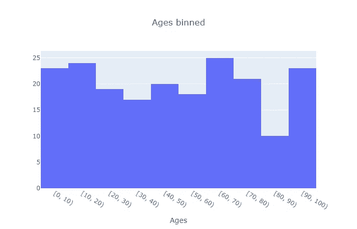
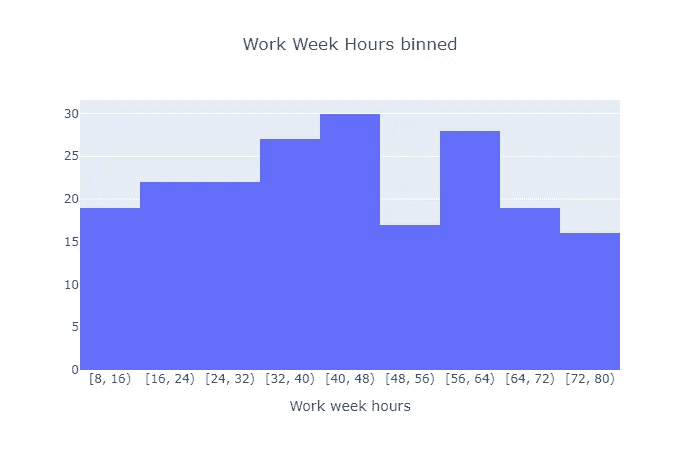
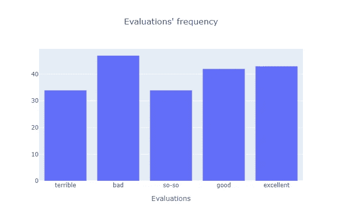

# 对熊猫使用箱和类别对数据进行分组

> 原文：<https://levelup.gitconnected.com/group-data-using-bins-and-categories-with-pandas-836c9c9bbd46>

([来源](https://www.pexels.com/photo/chart-close-up-data-desk-590022/))

今天，我将向您展示如何在 pandas 中将离散(整数)和连续(浮点)数据与自定义间隔绑定。除此之外，我还将向您展示 panda 的`Categorical`如何处理分类数据(字符串)。

这三个脚本中的每一个都定义了两个函数:一个用于对数据进行分类，另一个用于绘制柱状图或柱形图。对于每种情况，我将首先向您展示脚本用法的代码要点，解释它，只有在之后我才会展示这些函数背后的代码。但是，请考虑绘图的函数是额外的——重点是第一个对数据进行分类的函数。

# Bin 离散数据(整数)

对离散数据使用脚本

出于展示离散数据的目的，我们将使用由 NumPy 随机生成的 200 人的年龄。

在创建了包含 200 个年龄的序列后，我们将数据分箱，也就是说，我们创建了 10 个“桶”/箱，每个箱代表 10 年的时间间隔。每个年龄放在相应的“桶”中(11 岁的放在[10，20]桶中，40 岁的放在[40，50]桶中，以此类推)。

bin 表示为[下限，上限]，通过选择不包括上限。例如，一个 40 岁的人将被放在[40，50]箱中，而不是[30，40]。创建 10 个 10 年间隔的仓位的决定是定制部分。当手动创建容器时，我们精确地定义每个容器的下限和上限，而不是让 pandas 根据我们想要的容器数量自动计算它们。

处理离散数据的脚本

正如您在离散数据的第二个代码要点中所看到的，在`bin_ages`函数中，我们不仅使用列表理解(`age_bins`，第 10 行)来创建容器间隔，而且还为每个容器创建标签(`age_labels`，第 8 行)。正如您可能会从名字`IntervalIndex`中怀疑的那样，它用于创建实际的间隔来表示仓间隔。

在使用自定义 bin 间隔时，并不一定要创建标签，但是能够按照我们希望的方式来命名这些间隔是很好的。不过，在这种情况下，标签与间隔相同，但都是字符串形式。

在第 15 行，我们最后用`cut`函数绑定数据。根据参数的顺序，我们告诉它哪些数据将被分箱，使用哪些分箱以及每个分箱的名称/标签。`precision`指定将值放入箱中的舍入精度(0，因为我们处理的是整数),而`include_lowest`指定第一个箱应该包含/关闭下限。

顺便说一下，关于面元区间的方括号和圆括号的符号，前者表示封闭极限，而后者表示开放极限。[10，20]库包括 10 个但不包括 20 个，而[13，25]不包括 13 个但包括 25 个。

在`bin_ages`函数结束之前，我们按升序对现在已分箱的年龄进行排序([0，10]排在最前面，[90，100]排在最后)，并将这些分箱的数据类型从类别更改为字符串，以便可以在第二个函数中绘制它们(pandas 将分箱存储为类别)。

说到第二个功能，`plot_histogram`，很简单。它采用分格数据、分格数、图表标题和轴标题来绘制基于这些信息的直方图。下面是结果的一个例子:

分箱离散数据的直方图示例

# 绑定连续数据(浮点)

对连续数据使用脚本

宁滨连续数据背后的代码与前面显示的非常相似。最大的变化是我们现在处理浮点值而不是整数。在示例数据的上下文中，工作周小时数而不是年龄。

同样，我们走的路线是让 NumPy 为 200 人产生一周的工作时间，范围在 8 到 80 小时之间，不包括这些时间。然后，该系列被分箱并输入一个绘制直方图的函数。

处理连续数据的脚本

因为数据的范围已经改变，现在我们创建十个 8 小时间隔的条柱，第一个条柱代表[8，16]间隔，最后一个条柱代表[72，80]。

代码中的另一个区别是宁滨的`precision`(第 19 行),我们现在指定在放入 bin 之前要四舍五入到两位小数的值。

绘图功能`plot_histogram`保持不变。要绘制的数据和 bin 的数量作为参数传递，因此函数本身不需要担心它是不同类型的数据(实际上，它与之前的类型相同，因为数据已经被装箱，所以它无法区分数据是离散的还是连续的)。

现在是结果直方图的一个例子:

装箱的连续数据的直方图示例

# 处理分类序数数据(字符串)

最后一个示例不是针对宁滨数据的，而是为了展示 pandas 的`Categorical`在处理分类数据时如何有用。

对分类数据使用脚本

在这种情况下，我们有五个选项之一的评估。特别是，这是有序分类数据，因为我们可以看到，从“糟糕”到“优秀”，人们对产品/服务/任何东西的喜爱程度都在增加。`map_options`代表我们将每个名义选项映射到数字对应项时将使用的值。

然而，这一次我们没有创建通常的 200 个值的序列，然后将它传递给处理数据的函数。相反，这是函数的责任(它返回分类数据的“列表”，不是一系列，而是一次一步)。我们告诉函数可用的名义选项(注意，它们是从最低评估值到最高评估值排序的)、每个选项要映射到的值，以及最后要生成的值的数量。将代码快进到分类数据“列表”的创建，我们就可以为每个类别/选项的频率绘制柱形图了。该函数接受分类数据的“列表”, X 轴的标签，即类别的标签，以及像以前一样的图表和轴标题。

处理分类数据的脚本

现在，让我们回过头来详细检查一下这两个函数的代码。

`create_evaluations`首先从可用的评估/ `options`创建分类数据的“列表”。像以前一样，我们让 NumPy 随机挑选 200 个评估。第二个参数(第 14 行)很重要，因为如果没有它，pandas 会将可能的类别解释为 NumPy 数组中的唯一值。是的，数组中出现的唯一值与`categories`参数中出现的值相同，但是指定可用类别的巧妙之处在于保留了类别的顺序。

当对第 19 行的数据进行排序时，它不是按字母顺序排序的。相反，它根据我们在类别中指定的顺序进行排序，这意味着“糟糕”的条目排在第一，“糟糕”的条目排在第二，依此类推。

在第 22 行，我们将每个类别映射/替换到`mapping_values`参数的对应映射值(“可怕”变成 1，“坏”变成 2，以此类推)。老实说，这一步对于我们处理数据来说是不必要的，但是我想向您展示如何将多个值归入一个类别。例如，如果我们在 NumPy 数组中有“坏”和“相当坏”的值，那么我们可以将这两个值的出现映射为“坏”。也就是说，在这种情况下，我建议在一个单独的变量中创建 NumPy 数组，根据需要更改数组值，然后创建分类“列表”。

最后，`create_evaluations`返回现在映射的值，并将数据传递给`plot_column_chart`来绘制柱形图。在绘制任何东西之前，该函数“反转”类别映射，再次使用名义评估而不是数字对应。同样，这是不必要的，但不仅在图表中显示名义值更好，而且现在您知道如何更改绘图的显示标签(不使用数据框时使用[)。](https://community.plotly.com/t/plotly-express-axis-labels/25368)

`bar`函数(第 40 行)的工作方式类似于前面例子中的`histogram`。最大的区别是我们为每个轴指定数据:X 轴使用类别的唯一值/评估，而垂直轴使用各自的频率。代码的其余部分是通常的格式。

最后，下面是生成的柱形图的一个示例:

评估的柱形图示例

正如您所看到的，在开始时指定的类别顺序总是被保留下来。

# 结论

我希望这三个示例中显示的代码能够帮助您对数据进行分组和宁滨。

宁滨离散和连续数据的代码非常相似，但是分类数据由于其性质，需要不同的方法。将它转换成类别有助于保持类别的顺序(在本演示中，我们使用了顺序数据，但它不能有任何关联的顺序)。使用 pandas 的`Categorical`是许多方法中的一种，这取决于用例。

所有代码都可以在 GitHub [这里](https://github.com/Ze1598/medium-articles/tree/master/Group%20data%20using%20bins%20and%20categories%20with%C2%A0pandas)找到。