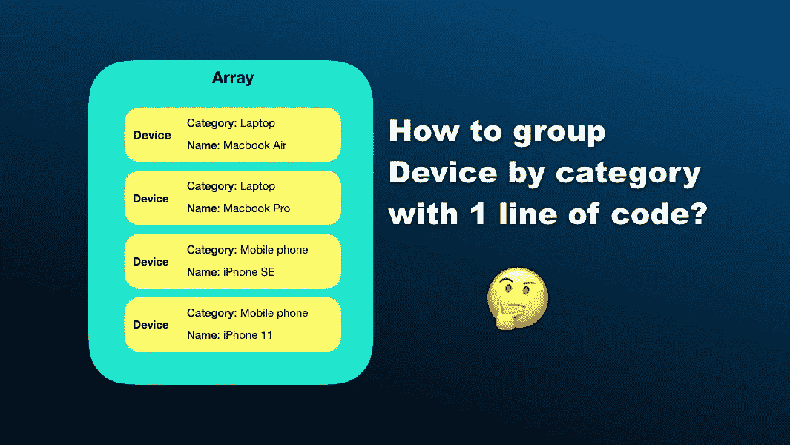
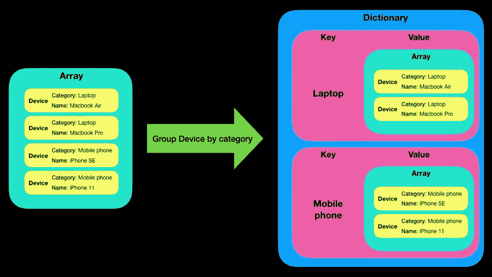
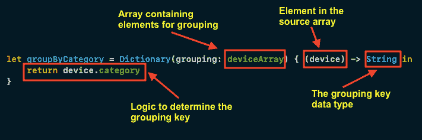

# Swift 中用字典对数组元素分组

> 原文：<https://levelup.gitconnected.com/grouping-array-elements-with-dictionary-in-swift-db2be2f0332b>

## 只有一行代码



*本文原载于 2020 年 6 月 30 日*[*https://swiftsenpai.com*](https://swiftsenpai.com/swift/group-array-elements-with-dictionary/)*。*

假设您有一个由`Device`个对象组成的数组，您想按类别对它们进行分组，如下图所示:



按类别对设备对象分组

你应该怎样着手解决这个问题？

在 Swift 5 之前，最直接的方法是遍历阵列中的每个设备，并手动将每个元素分配到其各自的类别。在 Swift 5 中，苹果公司引入了一个通用字典初始化器，帮助开发者只用一行代码就能处理这种情况。

想知道如何做到这一点？请继续阅读，了解更多信息。

# 初始化简介(分组:依据:)

在 Swift 5 中，苹果引入了“分组依据”字典初始化器。根据[文档](https://developer.apple.com/documentation/swift/dictionary/3127163-init)，初始化器具有以下定义:

> *创建一个新字典，其键是给定闭包返回的分组，其值是返回每个键的元素的数组。*

为了更好地理解这个定义，让我们重温一下在本文开头看到的例子。

假设您有一个`Device`结构和一个`Device`对象数组，如下所示:

为了按类别对所有的`Device`对象进行分组，我们可以通过给字典的初始化器一个源数组和一个返回分组键的闭包来初始化字典。看看下面的代码片段:

如你所见，我们只需要传入`Device`数组并返回类别作为分组键，初始化器会为我们处理分组。



`Dictionary.init(grouping:by:)`在行动

我们甚至可以通过使用 Swift 中的[速记参数名称](https://www.hackingwithswift.com/sixty/6/8/shorthand-parameter-names)将上述代码片段进一步简化为一行代码。

很整洁不是吗？

上面的例子展示了使用初始化器的最标准的方式。然而，因为初始化器允许我们定义一个闭包来决定分组键，所以比这灵活得多。

通过使用相同的`deviceArray`，假设我们想要将所有苹果产品分组在一起，我们实际上可以定义一个闭包来检查设备的名称，并将所有名称包含“Macbook”和“iPhone”的设备分组在一起。

# 按自定义对象分组

在这一节中，我们将看看如何使用自定义对象作为`init(grouping:by:)`初始化器的分组键。

出于演示的目的，让我们通过定义一个`Company`结构并向`Device`结构添加一个`company`变量来更新前面的例子。稍后，我们将尝试按公司对所有设备进行分组。

接下来，让我们检查一下`Dictionary`结构的定义，找出成为字典键需要满足的要求。

```
public struct Dictionary<Key, Value> where Key : Hashable
```

从上面的定义可以看出，任何符合 [Hashable](https://developer.apple.com/documentation/swift/hashable) 协议的对象都可以作为字典键使用。

> **亲提示:**
> 
> *查看这篇伟大的* [*文章*](https://medium.com/better-programming/what-is-hashable-in-swift-6a51627f904) *了解更多关于* `*Hashable*` *协议的信息。*

因此，我们可以继续让`Company`结构符合`Hashable`协议，并利用`init(grouping:by:)`初始化器按公司对所有设备进行分组。

就这样，我们成功地将所有的`Device`对象按公司分组。

# 包扎

`init(grouping:by:)`初始化器非常有用，也非常容易使用。

当我想将一组数据分组到一个字典中，以便在一个表视图或具有多个部分的集合视图中显示它们时，我发现它特别方便。

下次当您想创建一个包含多个部分的表格视图时，一定要尝试一下这种方法。

我希望这篇文章能让你清楚地知道如何正确使用`Dictionary.init(grouping:by:)`初始化器。

如果你喜欢这篇文章，可以随意查看我的其他与 Swift 相关的[文章。](https://swiftsenpai.com/category/swift/)

如果你有任何问题，请在下面的评论区留下，或者你可以在推特上联系我。

感谢阅读。🧑🏻‍💻