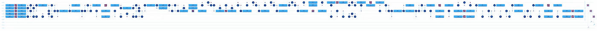

# 带火蛋白石的 Grover 算法

> 原文：<https://levelup.gitconnected.com/grovers-algorithm-with-fire-opal-59e69c97ef96>

# 在噪音中寻找答案

很明显，只要我们停留在 T1 时间内，[火蛋白石就会在挑战中茁壮成长](https://medium.com/@bsiegelwax/ibm-nairobi-vs-fire-opal-965f95800c6d)。它将小幅提升一个小电路的性能，也将大幅提升一个大电路的性能。为了更清楚地说明这一点，让我们在一篇文章中一起比较两个相似的电路，一个比另一个稍大。

较小的电路

## 较小的电路

这是一个 CCX 先知的 Grover 迭代。除了一个 CZ 甲骨文，这是小格罗夫电路得到。但是，我使用的是 CCX 甲骨文，假设它比 CZ 甲骨文对更多的人来说更直观。

模拟器上的结果

## 模拟器

是什么让 CCX 预言成真？当两个输入都为 1 时为真。这个模拟器虽然远非完美，但它显示出一个真正的预言最可能的条件是输入两个 1。

传输电路

## 传输电路

实际上，对一条[转场](https://medium.com/gitconnected/what-is-transpilation-4d12d51e2aa4)赛道来说，这还不算太糟糕。这个电路有一点深度，所以我们可以预期会有很多错误，但是量子计算机这些年来已经有了足够的改进，我们可以预期它会有一个还算不错的结果。

ibmq_belem 上的结果

## 不带火蛋白石

正确答案是 20，000 个镜头中的 9，055 个。这比正确的略多一些，但至少我们可以看到正确的答案可能是 11。

火蛋白石的结果

## 用火蛋白石

正确答案是 20，000 次射击中的 10，027 次，或者说基本上是抛硬币。尽管如此，这仍然比不使用火蛋白石提高了近 11%，我们可以更有信心认为 11 是正确答案。

并排比较

## 并排比较

将所有三个结果并列，我们可以看到 Fire Opal 对较小电路的轻微提升。是啊，是啊，是啊，没人被打动。我看评论。

但我说过火蛋白石喜欢挑战，不是吗？那么，让我们把这个实验提高一个档次，好吗？

更大的电路

## 更大的电路

相比之下，这只是另一个格罗弗电路，但这个甲骨文有一些额外的东西。这次我们有四个 ccx，一个 CX，两个 NOTs。我们增加了电路宽度和电路深度。

模拟器上的结果

## 模拟器

先知有一个控制量子位 0 和 1 的 CCX，一个控制量子位 2 的非。像较小的电路一样，我们在量子位 0 和 1 上寻找 1，以满足 CCX。因为量子位 2 上没有，我们在那里寻找一个 0。因为位串是向后的，所以我们寻找 011 来满足神谕。果然，模拟器显示 011 很可能是正确答案。

传输电路

## 传输电路

嗯，我说过我们增加了电路宽度和电路深度，现在你知道了。这看起来像一个嘈杂的电路，我们应该对真正的硬件有较低的期望。

ibm 内罗毕的结果

## 不带火蛋白石

正确答案是 20000 个镜头中只有 2449 个。这不仅可怕，甚至不是最有可能的答案。最有可能的答案是 100，这其实是最错误的答案。

火蛋白石的结果

## 用火蛋白石

正确答案是 20000 张照片中的 4794 张，提高了 94%。更重要的是，我们可以从这些噪音中看到正确的答案。我们从最错误的答案到正确的答案。

并排比较

## 并排比较

并排，我们可以看到火蛋白石拉下错误的答案，而提高正确的答案。我们还可以看到，我们离模拟结果还很远，但重要的是，我们正在不成熟的量子位上运行一个深度电路，尽管如此，我们在结果中看到了正确的答案。

## 结论

通过查看这两个并排的直方图，我们可以很容易地看到，Fire Opal 对较大电路的促进作用大于对较小电路的促进作用。事实上，增幅从仅仅 11%上升到了显著的 94%。这也是我如此推崇火蛋白石的原因:它将噪音转化为有用的结果。

## 澄清

为了记录，火蛋白石直方图中突出显示的结果是在执行后添加的，用于可视化目的。我手动强调火蛋白石提高了正确的结果。没有办法提前告诉火蛋白石要提升哪个幅度。

## 火蛋白石系列:

*   带火蛋白石的 Classiq】
*   [ibm_nairobi 对 Fire Opal](https://medium.com/@bsiegelwax/ibm-nairobi-vs-fire-opal-965f95800c6d)
*   [ibmq_belem vs 火蛋白石](https://bsiegelwax.medium.com/ibmq-belem-vs-fire-opal-84683f8f91f2)
*   [回顾:Q-CTRL 火蛋白石](https://bsiegelwax.medium.com/review-q-ctrl-fire-opal-6bcc187ae1bd)
*   [量子切片面包](https://bsiegelwax.medium.com/quantum-sliced-bread-bd3dd048f)
*   [我从火蛋白石中学到了什么…](https://bsiegelwax.medium.com/what-i-learned-from-fire-opal-50608282972b)
*   [Q-CTRL 的火猫眼石很牛逼](/fire-opal-is-awesome-c642347ec89d)

# 分级编码

感谢您成为我们社区的一员！在你离开之前:

*   👏为故事鼓掌，跟着作者走👉
*   📰查看[升级编码出版物](https://levelup.gitconnected.com/?utm_source=pub&utm_medium=post)中的更多内容
*   🔔关注我们:[Twitter](https://twitter.com/gitconnected)|[LinkedIn](https://www.linkedin.com/company/gitconnected)|[时事通讯](https://newsletter.levelup.dev)

🚀👉 [**加入升级达人集体，找到一份惊艳的工作**](https://jobs.levelup.dev/talent/welcome?referral=true)