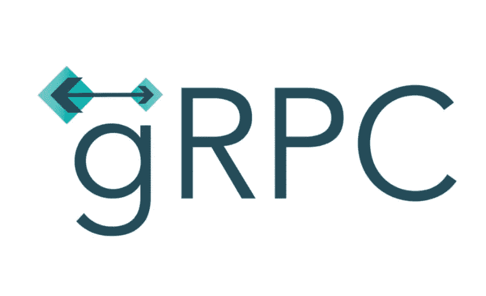
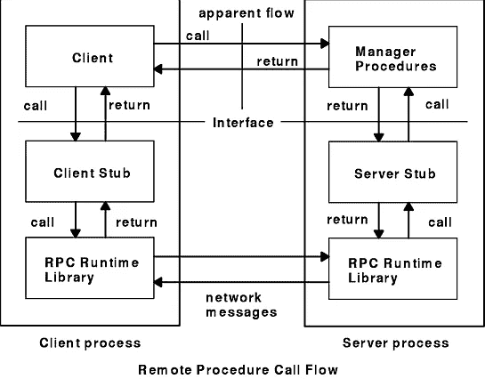
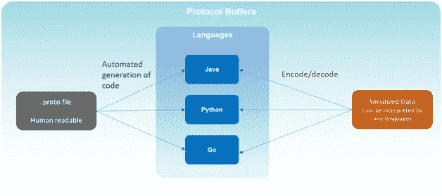
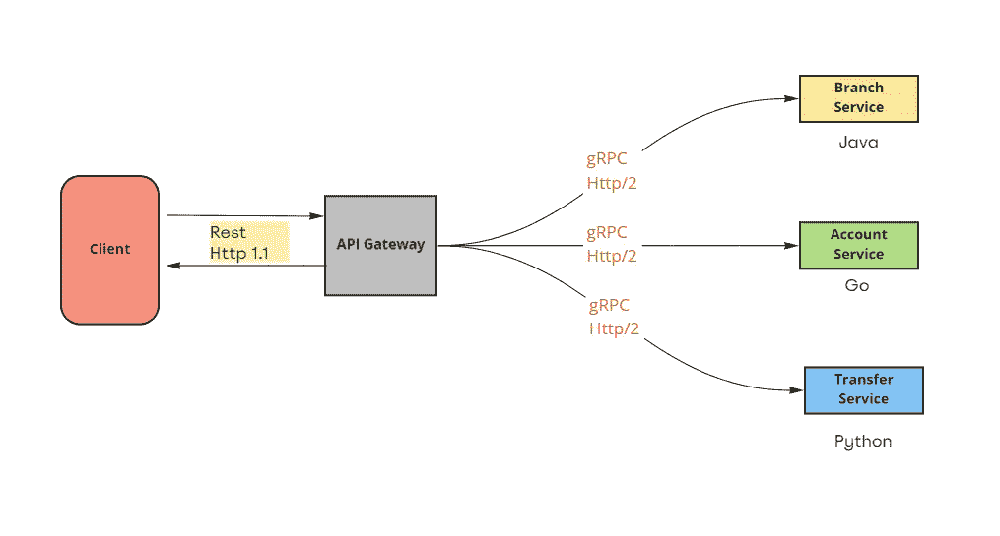

# gRPC

> 原文：<https://levelup.gitconnected.com/grpc-2c281d2837c3>

在我以前的帖子中，我写了一些异步和同步通信。如果你想全面了解沟通类型，我强烈建议你看看下面给出的。

**异步通信**

 [## 阿帕奇卡夫卡与 Java

### 我想讨论的另一种异步通信方式是消息流及其众所周知的平台 Apache…

levelup.gitconnected.com](/apache-kafka-with-java-7c3a0dafd7f5)  [## 使用 Java 的 RabbitMQ

### 有两种不同的通信方式，即同步和异步通信。今天，我想讨论一下异步…

levelup.gitconnected.com](/rabbitmq-with-java-fe4390be6e87) 

**同步通信**

 [## 用 Java 实现 RESTful

### 在之前的帖子中，我试图解释两个异步通信的例子，Rabbitmq 和 Kafka。

levelup.gitconnected.com](/restful-with-java-6ff632931d6f)  [## 带 Java 的 GraphQL

### 另一种同步方法是 GraphQL。像往常一样，我想更多地关注实现或提供代码。所以，我会提供一个…

levelup.gitconnected.com](/graphql-with-java-afee21e205ef) 

今天，我想解释另一种同步方法 gRPC(它也可以异步工作)。

它是由 Google 开发的，是一个 RPC(远程过程调用)框架。今天，我想提供一些关于 gRPC 的信息，以便更好地理解它。我会努力为 gRPC 找到一些问题的答案。然而，如果你想深入研究，在页面底部有很好的参考链接。

## 远程过程调用

为了更好地理解 gRPC，我们应该首先理解 RPC。远程过程调用是一种构建分布式系统的技术。基本上，它允许一台机器上的程序调用另一台机器上的子程序，而不知道它是远程的。RPC 不是一种传输协议:相反，它是一种以透明的方式使用现有通信特性的方法。

图片来源: [IBM](https://www.ibm.com/docs/en/aix/7.1?topic=call-rpc-model)

# gRPC 是什么？

gRPC 是一个独立于环境的现代开源高性能远程过程调用(RPC)框架。它允许客户端和服务器应用程序透明地通信，并开发连接的系统。这个框架使用 HTTP/2、协议缓冲区和其他现代技术栈来确保最大的 API 安全性、性能和可伸缩性。许多领先的科技公司都使用 gRPC，比如谷歌、网飞、Square 等等。

# gRPC 概念

gRPC 之所以大放异彩，是因为它的开发和使用领先技术的成功，这些技术比 JSON 和 XML 性能更好，并提供了更高的 API 安全性。gRPC 的一些特征如下。

## 协议缓冲区

Protobuf 是 Google 的序列化/反序列化协议。它用于客户端和远程服务之间的数据交换。gRPC 使用这个协议作为他们的接口定义语言(IDL)和序列化工具集。

图片来源:[https://www.wallarm.com](https://www.wallarm.com)

Protobuf 提供了比 JSON 和 XML 更多的好处。使用 Protobuf 进行解析需要的 CPU 资源更少，因为数据被转换为二进制格式，并且编码的消息更小。

## 流动

流是 gRPC 的另一个关键概念，许多进程可以在一个请求中发生。HTTP/2 的多路复用能力(通过一个 TCP 连接发送多个响应或接收多个请求)使之成为可能。以下是主要的流类型:

*   一元(无流)
*   客户端到服务器的流式传输
*   服务器到客户端的流式传输
*   双向流

## HTTP/2

gRPC 基于 [HTTP/2](https://www.wallarm.com/what/what-is-http-2-and-how-is-it-different-from-http-1) 开发，于 2015 年发布，克服了 HTTP/1.1 的局限性。虽然它与 HTTP/1.1 兼容，但 HTTP/2 带来了许多高级功能，例如:

*   **二进制成帧层:**与 HTTP/1.1 不同，HTTP/2 请求/响应被分成小消息，以二进制格式成帧，使得消息传输高效。通过二进制成帧，HTTP/2 协议使得请求/响应多路复用成为可能，而不会阻塞网络资源。
*   **流:**双向全双工流，客户端可以请求，服务器可以同时响应。
*   **流量控制:**HTTP/2 中使用了流量控制机制，可以对用于缓冲传输中消息的内存进行详细控制。
*   **头压缩:**HTTP/2 中的所有内容，包括头，在发送之前都进行了编码，显著提高了整体性能。使用 HPACK 压缩方法，HTTP/2 只共享与以前的 HTTP 头信息包不同的值。
*   **处理:**使用 HTTP/2，gRPC 支持同步和异步处理，可以用来执行不同类型的交互和流式 RPC。

HTTP/2 的所有这些特性使 gRPC 能够使用更少的资源，从而减少运行在云中的应用和服务之间的响应时间，并延长运行移动设备的客户端的电池寿命。‍

## gRPC 的优势

gRPC 通过在某些操作中提供许多好处，为旧的 RPC 设计方法提供了一个新的视角。gRPC 的一些优势使其越来越多地被采用，这些优势如下:

1.  **性能**

gRPC 提供了比 REST+JSON 通信快 10 倍的性能和 API 安全性，因为它使用了 Protobuf 和 HTTP/2。

**2。互操作性**

gRPC 工具和库旨在与多种平台和编程语言一起工作，包括 Java、JavaScript、Go、C#等。由于 Protobuf 二进制有线格式和几乎所有平台的高效代码生成，程序员可以开发高性能的应用程序，同时仍然使用完全的跨平台支持。

**3。安全性**

gRPC 通过 TLS 端到端加密连接使用 HTTP/2 来确保 API 安全性。gRPC 鼓励使用 SSL/TLS 来验证和加密客户端和服务器之间交换的数据。

**4。可用性和生产力**

由于 gRPC 是一个一体化的 RPC 解决方案，它可以无缝地跨各种语言和平台工作。此外，它还具有优秀的工具，自动生成许多所需的样板代码。这节省了大量时间，并使开发人员能够更多地关注业务逻辑。‍

## gRPC 的弱点

和其他技术一样，gRPC 也有以下缺点，当您选择它来开发应用程序时，需要注意这些缺点。

1.  **缺乏浏览器支持**

由于 gRPC 大量使用 HTTP/2，目前不可能直接从 web 浏览器调用 gRPC 服务。没有一种现代浏览器能够提供对 web 请求的控制，以支持 gRPC 客户端。

**2。非人类可读格式**

Protobuf 将 gRPC 消息压缩成非人类可读的格式。这个编译器需要文件中消息的接口描述来正确地反序列化。因此，开发人员需要额外的工具，比如 gRPC 命令行工具，来分析网络上的 Protobuf 有效负载，编写手动请求，并执行调试。

**3。无缓存**

虽然 HTTP 支持边缘缓存的中介，但 gRPC 调用使用 POST 方法，这对 API 安全性是一个威胁。响应不能通过中介缓存。此外，gRPC 规范没有做出任何规定，甚至指出了对服务器和客户机之间的缓存语义的期望。

**4。陡峭的学习曲线**

学习 gRPC 比休息稍微更有挑战性；熟悉 Protobuf 并寻找处理 HTTP/2 的工具需要一些时间。这是用户喜欢尽可能长时间依赖 REST 的常见原因。

## 何时使用 gRPC

用 gRPC 代替 REST 的条件是什么？

*   实时通信服务，您可以在其中处理流式通话
*   当高效沟通是一个目标时
*   在多语言环境中
*   对于内部 API，您不必将技术选择强加给客户端
*   作为转换现有 RPC API 的一部分的新构建可能不值得

## 采用 gRPC 的微服务

在我之前的一家公司，我们在内部微服务之间使用 gRPC。我们更喜欢它是因为两点:它的高性能和它的多语言特性。

微服务的最大优势之一是能够为每个独立的服务使用不同的技术。微服务必须就交换数据的 API、数据格式、错误模式、负载平衡等达成一致。gRPC 允许以二进制格式描述服务合同，程序员可以用一种标准的方式来指定这些合同，独立于任何语言，这确保了互操作性。

我们的建筑看起来如下:

在 GW 和微服务之间使用 gRPC

感谢阅读。

希望有帮助。

下一篇帖子再见…

***参考文献:***

 [## 远程过程得

### 远程过程调用(RPC)是一个协议，它提供了在操作系统中使用的高级通信范例

www.ibm.com](https://www.ibm.com/docs/en/aix/7.1?topic=concepts-remote-procedure-call) 

[https://www . w3 . org/History/1992/NFS _ dx CERN _ mirror/RPC/doc/Introduction/what is . html](https://www.w3.org/History/1992/nfs_dxcern_mirror/rpc/doc/Introduction/WhatIs.html)

 [## gRPC

### gRPC 了解更多 gRPC 是一个现代的开源高性能远程过程调用(RPC)框架，可以运行在任何…

grpc.io](https://grpc.io/)  [## 什么是 gRPC:主要概念、优缺点、用例

### 编程是为了解决问题。我们通常构建 API 来解决两个(或两个)非常具体的问题之一…

www.altexsoft.com](https://www.altexsoft.com/blog/what-is-grpc/)  [## gRPC 是什么？概念、优势和劣势、架构🔆

### gRPC 是一个健壮的开源 RPC(远程过程调用)框架，用于构建可扩展的快速 API。它允许…

www.wallarm.com](https://www.wallarm.com/what/the-concept-of-grpc)  [## 协议缓冲区基础:Java |协议缓冲区| Google 开发者

### 本教程为 Java 程序员提供了使用协议缓冲区的基本介绍。走过…

developers.google.com](https://developers.google.com/protocol-buffers/docs/javatutorial)  [## 语言指南(proto3) |协议缓冲区| Google 开发者

### 本指南描述了如何使用协议缓冲区语言来构建您的协议缓冲区数据，包括。原型…

developers.google.com](https://developers.google.com/protocol-buffers/docs/proto3)