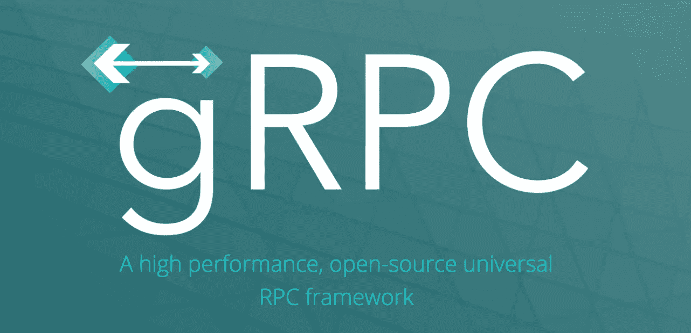

# gRPC 基础知识第 1 部分:入门

> 原文：<https://levelup.gitconnected.com/grpc-basics-part-1-getting-started-7bca84ad2478>



来源:https://grpc.io/

[gRPC](https://grpc.io/) 是一个开源的高性能 RPC 框架，可以有效地连接数据中心内和跨数据中心的服务，在我看来这是一个奇迹。几年前我第一次遇到 gRPC，并被它的优秀所折服。我的同事[斯科特·沃克](https://www.linkedin.com/in/scott-walker-38542a6a/)和[我](https://www.linkedin.com/in/andrew-hayes-belfast/)决定在 gRPC 上为[云本地计算 Belfast](https://www.meetup.com/Cloud-Native-Computing-Belfast/) Meetup 创建一个演讲，以帮助向其他人展示它有多好。然而，我们不得不为这次谈话粉饰一些东西，所以我们决定通过一系列的文章来进行更详细的讨论。

# gRPC 有什么特别之处？

远程过程调用已经存在很多年了，无论如何它都不是一个新概念。然而，gRPC 去掉了很多烦人的部分，让你专注于有趣的部分。它提供了一种以语言中立的方式定义服务的方法，使用。“原型”文件。然后，它会自动生成代码进行联网等。给你的。因此，您不必创建和测试所有样板代码来链接您的客户机和服务器。这也意味着，如果您愿意，您可以让您的客户机使用一种语言，而让服务器使用另一种语言。

# 我就不能用休息吗？

是的，你能，他们确实解决非常相似的问题。然而，gRPC 比 REST 有一些优势。首先是速度，gRPC 序列化为二进制数据，因此在发送前后不需要封送和解封 JSON(例如),这对于像短期微服务这样需要最佳吞吐量的情况特别有用。gRPC 为您处理网络和序列化，因此这意味着您要编写和测试的代码要少得多。它还使用 HTTP/2 作为传输，所以您仍然可以像使用 REST 服务一样使用 TLS 和负载平衡器。它还以您想要的语言生成代码，因此您可以像调用本地对象一样调用远程函数。

在本文和后续文章中，我们将通过几个例子来展示各种特性，并有望解释它们如此酷的原因。这个例子的完整代码可以在我们的 [Github Repo](https://github.com/scottyw/grpc-example) 中找到

# 示例 A:普通 gRPC 服务器

我们的第一个例子，一个基本的 gRPC 客户端和服务器在这里:'[gRPC-example/a . plain-gRPC-Server【T13]'](https://github.com/scottyw/grpc-example/tree/master/A.plain-grpc-server)

当创建 gRCP 服务时，我们在 a '中描述我们想要什么。“proto”文件，然后使用“proto”生成所需的代码。我们需要定义我们想要的“服务”以及这些服务将发送和接收的对象。因此，在第一个示例中，服务被称为“MakeBox ”,如下所示:

```
service BoxFactory {
    rpc MakeBox(BoxSpecification) returns (Box) {} 
}
```

然后我们需要定义对象“BoxSpecification”和“Box”。看起来像这样:

```
message BoxSpecification {
    int32 height = 1;
    int32 width = 2;
    int32 depth = 3;
}message Box {
    int32 volume = 1;
}
```

然后我们可以告诉“协议”为我们生成代码。在我们的示例 repo 中，您可以运行“make generate”来完成此操作。所做的就是运行带有几个参数的 protoc 命令，如下所示:

```
protoc \
  -I/usr/local/include \
  -I. \
  -I$(GRPC_GATEWAY_DIR)/third_party/googleapis \
  --go_out=plugins=grpc:factory \
  --grpc-gateway_out=logtostderr=true:factory \
  --proto_path proto factory.proto
```

这将为生成的 go 代码创建一个目录“工厂”。您可以忽略大部分内容，主要部分是如下几行:

```
// BoxFactoryServer is the server API for BoxFactory service.
type BoxFactoryServer interface {
    MakeBox(context.Context, *BoxSpecification) (*Box, error)
}
```

这是一个我们需要实现的“go 接口”。这正是我们在“factoryserver/factory.go”文件中所做的:

```
type factoryServer struct {
}func (*factoryServer) MakeBox(context context.Context, spec *factory.BoxSpecification) (*factory.Box, error) {
    log.Println("Making a box ...")
    return &factory.Box{Volume: spec.Depth * spec.Height * spec.Width}, nil
}
```

我们对“协议”生成的接口的实现。我们需要在启动时将它传递给 GRPC 服务器。这是我们在“factoryserver/server.go”中执行的操作:

```
func startGRPC() {
    lis, err := net.Listen("tcp", "localhost:5566")
    if err != nil {
        log.Fatalf("failed to listen: %v", err)
     } grpcServer := grpc.NewServer() factory.RegisterBoxFactoryServer(grpcServer, &factoryServer{})
     log.Println("gRPC server ready...")
     grpcServer.Serve(lis)
}func main() {
    go startGRPC() // Block forever
    var wg sync.WaitGroup
    wg.Add(1)
    wg.Wait()
}
```

这将我们的 BoxFactoryServer 实现传递给 gRCP 服务器并启动它。当客户端连接时，我们的代码就会被调用。

为了测试这一点，您需要启动一个客户端并连接它。我们在:' [factoryclient](https://github.com/scottyw/grpc-example/tree/master/A.plain-grpc-server/factoryclient) /client.go:

```
// Make a remote call
box, err := client.MakeBox(context.Background(), &factory.BoxSpecification{Height: 2, Width: 3, Depth: 4})if err != nil {
  log.Fatalf("Failed to make a box: %v", err)
}log.Printf("Got a lovely box with volume %d", box.Volume)
```

# 运行代码

要在[我们的示例 repo](https://github.com/scottyw/grpc-example/tree/master/A.plain-grpc-server) 中生成所需的二进制文件，并将它们放在‘bin’目录中，运行以下命令:

```
make all
```

要启动服务器，请运行以下命令:

```
./bin/server
```

要运行几次客户端，请运行以下命令:

```
./bin/client
```

# 摘要

在我们的。“proto”文件，我们定义了一个服务，并使用“proto”来生成 go 代码。然后我们实现了“go 接口”,将其传递给 GRPC 服务器，并在客户端做了类似的事情。所有生成的代码然后处理连接和序列化。