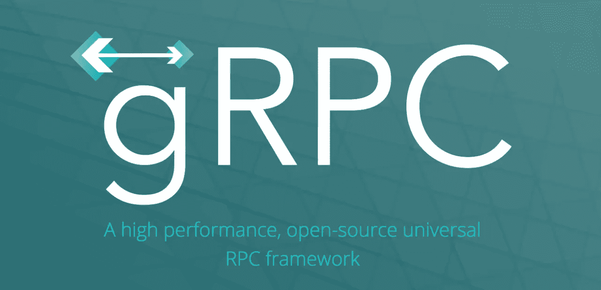

# gRPC 基础第 2 部分:休息和昂首阔步

> 原文：<https://levelup.gitconnected.com/grpc-basics-part-2-rest-and-swagger-53ec2417b3c4>



来源:https://grpc.io/

这是我的同事[斯科特·沃克](https://www.linkedin.com/in/scott-walker-38542a6a/)和[我](https://www.linkedin.com/in/andrew-hayes-belfast/)正在撰写的 gRPC 系列文章的第二部分。这是第 1 部分的继续，我们将展示一些使用 REST 公开 gRPC 服务并为其自动生成 swagger 文件的例子。我们所有示例的完整代码都可以在我们的 [repo](https://github.com/scottyw/grpc-example) 中找到。

# 第 1 部分不是说 gRPC 可以替代 REST 吗？

是的，但是有时候你必须休息。也许那是为了第三方集成到你的服务中，甚至是为了你的 UI。幸运的是，我们可以使用“协议”生成 REST 端点，放在 gRPC 服务之上。

# 示例 b .向 gRPC 服务添加 REST 端点

这个例子，一个带有 REST 的基本 gRPC 客户端和服务器在这里:'[gRPC-example/b . gRPC-with-REST](https://github.com/scottyw/grpc-example/tree/master/B.grpc-with-rest)'。当添加 REST 端点时，我们需要告诉 gRPC 将哪个 URL 映射到'中的每个函数。“原型”文件。带有 URL 映射的 MakeBox 的更新定义如下所示:

```
rpc MakeBox(BoxSpecification) returns (Box) {
    option (google.api.http) = {
        get: "/v1/make-box"
    };        
}
```

这意味着当我们调用 URI '/v1/make-box '时，它将被传递给 MakeBox 函数。为了利用我们需要再次生成代码的更改，在我们的示例 repo 中，您需要调用‘make generate’。所做的就是运行带有几个参数的“protoc”命令，如下所示:

```
protoc \
  -I/usr/local/include \
  -I. \
  -I$(GRPC_GATEWAY_DIR)/third_party/googleapis \
  --go_out=plugins=grpc:factory \
  --grpc-gateway_out=logtostderr=true:factory \
  --proto_path proto factory.proto
```

像第 1 部分中的例子一样，这将为生成的 go 代码创建一个目录“工厂”。我们已经实现了所需的“go 接口”。所以我们现在需要做的是启动一个 HTTP 服务器来接受其余的调用，并将它们传递给我们的 gRPC 服务。为此，我们将在“[factory server/server . go](https://github.com/scottyw/grpc-example/blob/master/B.grpc-with-rest/factoryserver/server.go)”文件中创建一个名为“startHTTP”的函数，如下所示:

```
func startHTTP() {
 ctx := context.Background()
 ctx, cancel := context.WithCancel(ctx)
 defer cancel()// Connect to the GRPC server
 conn, err := grpc.Dial("localhost:5566", grpc.WithInsecure())
 if err != nil {
  log.Fatalf("fail to dial: %v", err)
 }
 defer conn.Close()// Register grpc-gateway
 rmux := runtime.NewServeMux()
 client := factory.NewBoxFactoryClient(conn)
 err = factory.RegisterBoxFactoryHandlerClient(ctx, rmux, client)
 if err != nil {
  log.Fatal(err)
 }
 log.Println("REST server ready...")
 err = http.ListenAndServe("localhost:8080", rmux)
 if err != nil {
  log.Fatal(err)
 }
}
```

这创建了一个 HTTP 多路复用器，将请求路由匹配到我们的 gRPC 函数。多路复用器向 gRPC 客户机注册，并将其连接到 gRPC 服务器。然后，在启动 gRPC 服务器时，我们需要启动 HTTP 服务器。在如下所示的' [factoryserver/server.go](https://github.com/scottyw/grpc-example/blob/master/B.grpc-with-rest/factoryserver/server.go) '文件中:

```
func main() {
  go startGRPC() go startHTTP() // Block forever
  var wg sync.WaitGroup
  wg.Add(1)
  wg.Wait()
}
```

这意味着 HTTP 请求现在被映射到适当的 gRPC 函数，这意味着我们现在有了 MakeBox 函数的 REST 端点。您可以通过在[示例回购](https://github.com/scottyw/grpc-example/tree/master/B.grpc-with-rest)中调用‘make all’来测试这一点。使用以下命令启动服务器:

```
./bin/server
```

一旦服务器开始运行，您就可以使用 curl 来调用 REST 端点:

```
curl [http://localhost:8080/v1/make-box?height=1&width=2&depth=3](http://localhost:8080/v1/make-box?height=1&width=2&depth=3)
```

# 示例 c .使用 gRPC 生成 Swagger

Swagger 是一个 [OpenAPI 规范](https://swagger.io/specification/)，用于以一种语言中立和人类可读的方式描述 RESTful 服务。因此，我们可以生成一个 swagger 文件，然后任何想要与我们的服务交互的人都可以毫不费力地理解它是如何工作的。它还可以用来生成文档，当我们更新服务时，我们再次生成 swagger 文件，我们的文档也随之更新。

在我们的[示例 repo](https://github.com/scottyw/grpc-example/tree/master/C.adding-swagger) 中，我们向 Makefile 中的“protoc”调用添加了一个'— swagger_out '参数，现在看起来像这样:

```
protoc \
  -I/usr/local/include \
  -I. \
  -I$(GRPC_GATEWAY_DIR)/third_party/googleapis \
  --go_out=plugins=grpc:factory \
  --swagger_out=logtostderr=true:factory \
  --grpc-gateway_out=logtostderr=true:factory \
  --proto_path proto factory.proto
```

当我们调用“make generate”时，这将把一个“factory.swagger.json”文件和 generate go 代码一起添加到“factory”目录中。然后，您可以使用它来生成文档，并帮助其他团队/用户了解如何与服务进行交互。

# 额外收获:添加 Swagger UI

我们在生成 swagger 文件时可以做的另一件事是添加 Swagger UI。Swagger UI 是一个开源工具，允许您使用其 Swagger 文件可视化服务并与之交互。您可以在这里下载它[，但是我们已经将它添加到了我们的 repo 中的'](https://swagger.io/tools/swagger-ui/download/) [C.grpc-with-rest/www](https://github.com/scottyw/grpc-example/tree/master/C.adding-swagger/www) '目录中。为了使用它，我们将我们的 swagger 文件复制到同一个目录中:

```
cp factory/factory.swagger.json www/swagger.json
```

然后我们需要告诉我们的 HTTP 服务器为这些文件以及 gRPC 端点提供服务。我们更新了 server.go 以包含一个服务于 swagger 文件的函数，并更新了 startHTTP 函数以服务于 swagger-ui。看起来像这样:

```
func serveSwagger(w http.ResponseWriter, r *http.Request) {
 http.ServeFile(w, r, "www/swagger.json")
}func startHTTP() {
 ctx := context.Background()
 ctx, cancel := context.WithCancel(ctx)
 defer cancel() // Connect to the GRPC server
 conn, err := grpc.Dial("localhost:5566", grpc.WithInsecure())
 if err != nil {
   log.Fatalf("fail to dial: %v", err)
 }
 defer conn.Close() // Register grpc-gateway
 rmux := runtime.NewServeMux()
 client := factory.NewBoxFactoryClient(conn)
 err = factory.RegisterBoxFactoryHandlerClient(ctx, rmux, client)
 if err != nil {
   log.Fatal(err)
 } // Serve the swagger-ui and swagger file
 mux := http.NewServeMux()
 mux.Handle("/", rmux) mux.HandleFunc("/swagger.json", serveSwagger)
 fs := http.FileServer(http.Dir("www/swagger-ui"))
 mux.Handle("/swagger-ui/", http.StripPrefix("/swagger-ui", fs)) log.Println("REST server ready...")
 err = http.ListenAndServe("localhost:8080", mux)
 if err != nil {
   log.Fatal(err)
 }
}
```

# 运行代码

要在我们的示例 repo 中构建二进制文件，只需运行:

```
make all
```

要启动服务器，我们需要运行:

```
./bin/server
```

这将启动 gRPC 服务器，但也会启动 REST 服务器。为了测试它，我们现在有几个选项。如果需要，我们可以运行 gRPC 客户端:

```
./bin/client
```

我们现在还可以使用 curl 与服务进行交互。为此，我们将运行:

```
curl localhost:8080/v1/make-box?height=2&width=2&depth=3
```

或者如果你更喜欢 UI，你可以使用“swagger-ui”。只需在浏览器中打开网址，就可以使用“swagger-ui”与服务进行交互。

```
localhost:8080/swagger-ui/
```