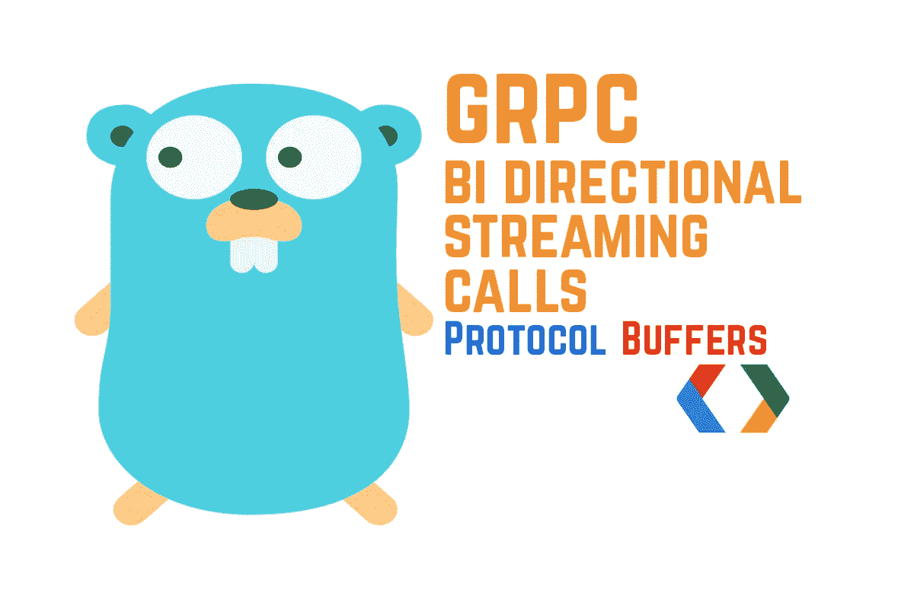
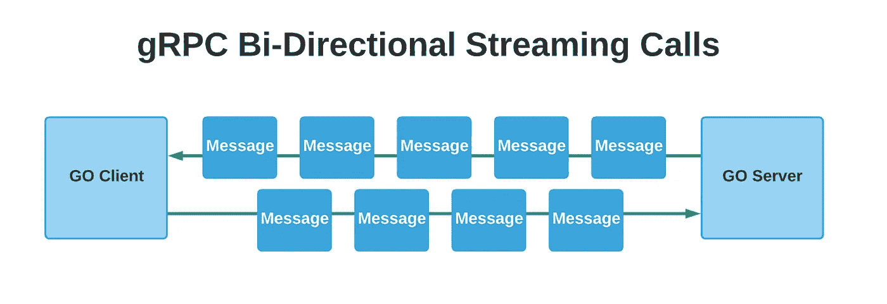
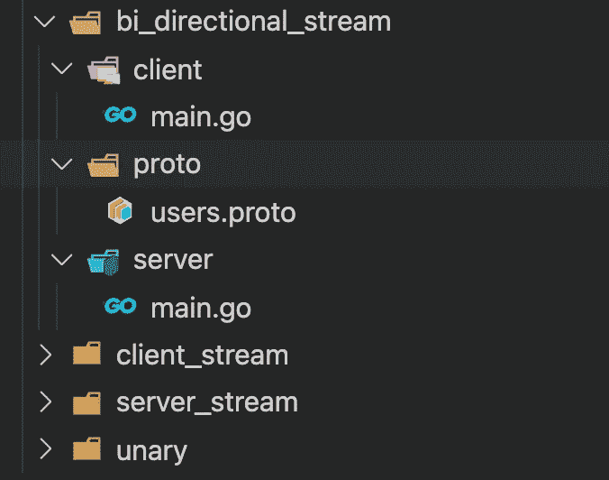
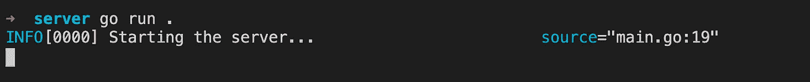
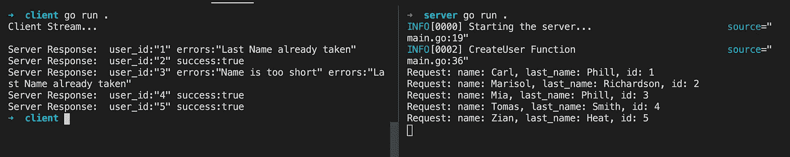

# gRPC:如何进行双向流媒体通话

> 原文：<https://levelup.gitconnected.com/grpc-how-to-make-bi-directional-streaming-calls-70b4a0569b5b>



在本文中，我将讨论使用双向流的 gRPC 调用——实现一个发送流请求的客户机和一个用流消息响应的服务器。

这是该系列的最后一篇文章，如果你还没有看完，下面是列表:

1.  [如何进行有效的一元调用](/grpc-how-to-make-effective-unary-calls-4c9fa68cd9d5)
2.  [如何进行客户端流媒体通话](/grpc-how-to-make-client-streaming-calls-5c731197585)
3.  [如何进行服务器流调用](/grpc-how-to-make-server-streaming-calls-763b42895481)
4.  如何进行双向流媒体通话

在双向流 rpc 调用中，客户端和服务器互相发送多条消息。使用这种类型的 rpc 调用会稍微复杂一点，因为您必须从服务器端和客户端处理错误，而且在某些情况下会增加更多的延迟。也许使用一元调用是一个更好的选择。



双向流

## 项目描述

对于这个项目，我们将创建一个带有一个 gRPC 端点的用户服务，它将允许客户机和服务器发送和接收流消息。

端点将需要一个用户对象作为请求消息，服务器将用一条消息来响应，这条消息将让客户端知道用户是否被成功处理。

在这种情况下，客户端和服务器都可以在任何时间点停止接收或发送消息，要么是因为发生了一些错误，要么是因为发生了其他一些业务逻辑。

让我们在 grpc_calls 中创建另一个文件夹，并将其命名为双向流。

在这个文件夹中创建以下结构。



双向流文件夹结构

users.proto 文件的定义如下:

在这个原型文件中，我为这个请求定义了服务用户、端点和相应的消息。

对于这个端点，客户端将发送一个用户对象，服务器将发送一个 CreateUserRes 消息来指示用户是如何被处理的。

## 原型文件定义:

1.  **CreateUser:** 这是 rcp 端点定义，它接受请求中的流用户消息，并返回流响应。
2.  **用户:**这是请求的用户表示消息。
3.  **CreateUserRes:** 这是响应消息。

现在，和前面的文章一样，我们需要为这个原型文件生成 go 代码。

在 proto 文件夹中运行以下命令:

```
protoc --go_out=. --go_opt=paths=source_relative --go-grpc_out=. --go-grpc_opt=paths=source_relative users.proto
```

现在我们可以继续并实现服务器了。这是 server go 应用程序的代码。

同样，对于这个文件，我们首先创建一个新的 grpc 服务器，它将监听端口 3000，然后我们注册用户服务并开始监听连接。

现在，如你所见，我正在导入 proto_bi_directional_stream 包。因为有本地进口的 Go 会投诉。

**要解决这个问题，您可以执行以下操作:**

1.  将 proto 文件夹的内容推送到 Github，然后从那里导入。
2.  将 proto 文件夹的内容放在**包/src** 文件夹中，作为 go 版本路径。在我的情况下，这是路径:

```
golang/1.15.5/packages/src
```

在这个文件夹中，我创建了一个 proto_bi_directional_stream 文件夹，并粘贴了包含生成代码和 users.proto 文件的 proto 文件夹中的文件。

这样我就可以导入这个包，而不用把它推到 Github。采取你认为更方便的方法。

在 **CreateUsers** 函数中，我们首先创建一个 for 循环，从流中获取请求和一个可能的错误，然后我们检查是否已经接收完请求，如果是，我们返回。然后，我们从请求中提取姓名、姓氏和用户 id，并执行一些验证来帮助我们构建响应对象。最后，我们从流中使用 Send 方法并传递响应消息，我们还在函数的末尾打印一些可能的错误，以防在向客户端发送响应消息时出现错误。

为了能够接收和发送流消息，这就是我们在服务器中所要做的一切。

让我们实现客户端代码。

对于客户机代码，我们使用 users 包提供的 NewUsersClient 方法在端口 3000 上创建一个新的客户机-服务器。

现在，我创建了一个 bulkUsers 函数，它负责迭代一部分用户对象并将它们发送到服务器，然后从服务器接收流响应并打印出来。

那么，让我们仔细看看这个函数。它首先从 CreateUser 函数获取流，然后构建一个包含一些用户对象的请求片。然后，它创建一个通道，并使用 go 例程来发送和接收消息。

第一个 go 例程遍历切片并将每条消息发送到服务器，它还使用 Sleep 函数来模拟一些延迟。当 for 循环结束时，它关闭流。

对于第二个 go 例程，它开始接收流响应，然后使用 EOF(文件结束)函数检查服务器是否完成了流。最后，它打印每个响应消息，并关闭通道。

这就是我们在客户端代码上所要做的一切，正如你所看到的，它需要更多的代码，并且增加了客户端和服务器应用程序的复杂性。

如果我们进入控制台，在服务器文件夹中，我们可以运行以下命令来启动服务器。

```
go run .
```



服务器 Go 应用程序日志

然后使用相同的命令启动客户端，但是在客户端文件夹下，如果一切都正确，您应该会看到预期的结果。



太棒了，我们刚刚实现了一个双向流 rpc 调用。

至此，我希望您能更好地理解如何进行所有四个 rpc 调用，以及何时在您的个人项目中使用它们是个好主意。

如果你已经阅读了整个系列，恭喜你！！。

如果您认为该系列有用，请单击💚下面和其他媒体成员分享一下。

再次感谢您的阅读，敬请关注。