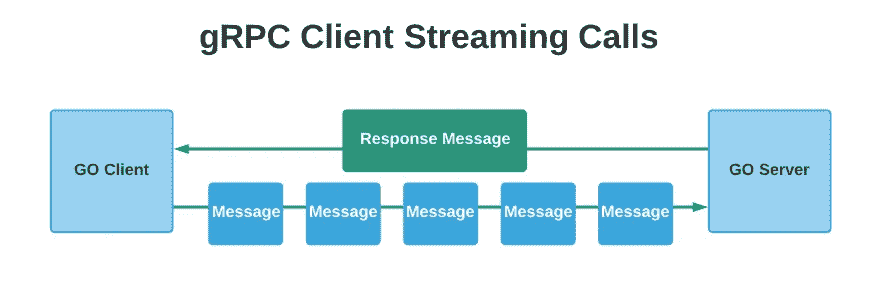
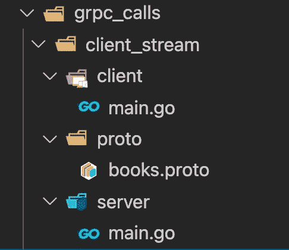
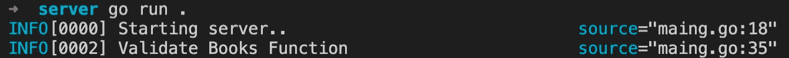
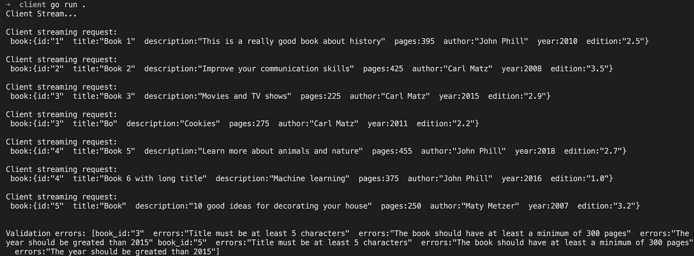

# gRPC:如何进行客户端流调用

> 原文：<https://levelup.gitconnected.com/grpc-how-to-make-client-streaming-calls-5c731197585>


在本文中，我将介绍客户机流 gRPC 调用——实现客户机和服务器 Go 应用程序。

这是该系列的第二篇文章:

1.  [如何进行有效的一元调用](/grpc-how-to-make-effective-unary-calls-4c9fa68cd9d5)
2.  如何进行客户端流呼叫
3.  [如何进行服务器流调用](/grpc-how-to-make-server-streaming-calls-763b42895481)
4.  [如何进行双向流媒体通话](/grpc-how-to-make-bi-directional-streaming-calls-70b4a0569b5b)

在客户端流 rpc 调用中，客户端发送一堆请求，一旦完成流，服务器将返回一条消息。



客户端流请求

## 项目描述

对于这个项目，我们将创建一个带有一个 gRPC 端点的 Books 服务，它将允许客户端发送一个流请求。

端点将接收一个 Book 对象，它将在其上运行一些验证，并返回一组验证错误作为响应。

由于这是一个客户端流调用，服务器将首先从客户端接收流，一旦客户端完成流，服务器将返回响应。

好了，我们可以开始在 grpc_calls 中创建另一个文件夹，并将其命名为 client_stream。

在这个文件夹中创建以下结构。



gRPC 客户端流文件夹结构

books.proto 文件的定义如下:

对于这个原型文件，我为这个请求定义了 books 服务、端点和相应的消息。

## 原型文件定义:

1.  **ValidateBooks:** 这是 rpc 端点定义，它接受流 ValidationReq 消息并返回 ValidationRes 消息。
2.  **ValidationReq:** 这是 rpc 端点的请求消息，它有一个名为 book 的字段，类型为 Book(它反过来表示另一个消息)。
3.  **Book:** 该消息表示并包含 Book 对象的公共字段。
4.  **ValidationRes:** 这是 rpc 端点的响应消息，它有一个名为 errors 的重复字段，类型为 ValidationError(它反过来表示另一个消息)。
5.  **ValidationError:** 该消息表示一个错误，包含两个字段，book_id 和一个字符串类型的错误数组。

正如我前面提到的，这个端点允许客户机发送一个流请求，然后服务器在其上运行一些验证，最后向客户机返回验证错误消息。

当客户端需要将资源一个接一个地发送到服务器时，发出客户端流请求非常有用，这样就可以立即处理这些资源，一旦流调用完成，客户端就会得到响应。

现在我们可以为这个原型文件生成 go 代码了。

在 proto 文件夹中运行以下命令:

```
protoc --go_out=. --go_opt=paths=source_relative --go-grpc_out=. --go-grpc_opt=paths=source_relative books.proto
```

很好，现在我们已经为这个原型文件生成了 go 代码，我们可以继续实现服务器了。

以下是 server go 应用程序的代码:

和前一篇文章一样，我们首先创建一个新的 grpc 服务器，它将监听端口 3000，然后我们注册图书的服务，并开始监听连接。

现在，如你所见，我正在导入 proto_client_stream 包。因为有本地进口的 Go 会投诉。

**要解决这个问题，您可以执行以下操作:**

1.  将 proto 文件夹的内容推送到 Github，然后从那里导入。
2.  将 proto 文件夹的内容放在**包/src** 文件夹中，作为 go 版本路径。在我的情况下，这是路径:

```
golang/1.15.5/packages/src
```

在这个文件夹中，我创建了一个 proto_client_stream 文件夹，并粘贴了包含生成的代码和 users.proto 文件的 proto 文件夹中的文件。

这样我就可以导入这个包，而不用把它推到 Github。采取你认为更方便的方法。

在 **ValidateBooks** 函数中，我们接收流对象作为函数参数，然后在函数体中，我们初始化一个新的 **ValidationError** 消息，我们将使用它来捕获错误。然后在 for 循环中，我们通过调用 **Recv** 函数开始从客户端接收流消息，然后我们检查客户端是否已经完成流，我们这样做的方法是调用 [io。EOF](https://golang.org/pkg/io/#pkg-index) 函数，它允许我们知道流何时结束，并且没有更多输入可供处理。就在我们将错误消息返回给客户端之后。

如果流还没有完成，我们获取书的标题、页数和年份，并运行一些验证，如果验证失败，我们创建一个新的 ValidationError 消息，并将其附加到错误数组中。

服务器现在准备好接受来自客户端的流请求。让我们实现客户端代码。

对于客户机代码，我们在端口 3000 上创建一个新的客户机-服务器，使用该书的包提供的 **NewBooksClient** 方法。

然后，validateBooks 函数处理流请求。它首先通过初始化一个容器结构并在其上调用 initBooks 函数来构建请求消息，以获得一些虚拟的 book 对象。然后，它从 ValidateBooks 函数获取流对象和一个错误，如果没有错误，它将迭代请求消息，并开始对每个 book 对象进行流调用。

在 for 循环完成后，我们关闭了流，并打印来自服务器的响应。

好了，这就是客户端和服务器端 go 应用程序的所有代码，这次代码稍微复杂一点，因为我们必须从客户端代码发出流请求，从服务器端我们必须允许函数接收流对象。

我们现在准备尝试一下。如果我们转到控制台，在服务器文件夹中，我们可以用下面的命令启动服务器。

```
go run .
```



服务器 Go 应用程序日志

然后使用相同的命令启动客户端，但是在客户端文件夹下，如果一切都正确，您应该会看到预期的结果。



客户端 Go 应用程序日志

太好了，我们已经实现了一个客户端流 rpc 调用。

希望你觉得有用，学到新东西。在下一篇文章中，我们将使用服务器流响应来处理 gRPC 调用。

感谢您花时间阅读该系列！！