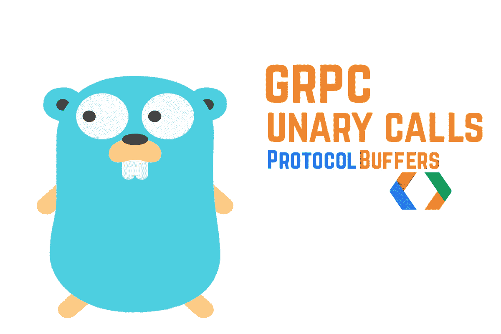
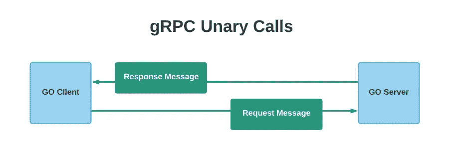
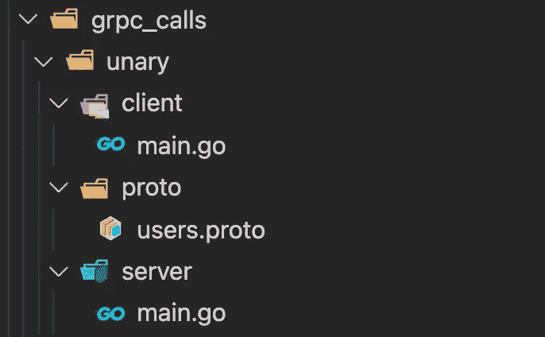
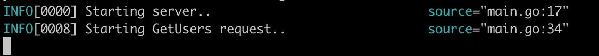
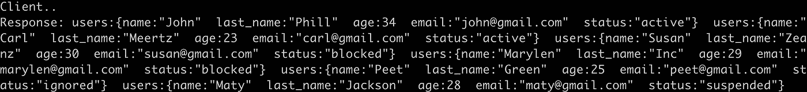

# gRPC:如何进行有效的一元调用

> 原文：<https://levelup.gitconnected.com/grpc-how-to-make-effective-unary-calls-4c9fa68cd9d5>



在本文中，我将解释如何进行一元 gRPC 调用——实现客户机和服务器 Go 应用程序。

这是该系列的第一篇文章:

1.  如何进行有效的一元调用
2.  [如何进行客户端流媒体通话](/grpc-how-to-make-client-streaming-calls-5c731197585)
3.  [如何进行服务器流调用](/grpc-how-to-make-server-streaming-calls-763b42895481)
4.  [如何进行双向流媒体通话](/grpc-how-to-make-bi-directional-streaming-calls-70b4a0569b5b)

首先，在开始实现之前，让我们定义一些核心概念。

## gRPC

> 代表**远程过程调用，**它是一个开源框架，由 Google 开发，旨在创建一个更快、更有效的协议来通过网络发送和接收数据。

这是一个建立在 HTTP/2 之上的协议，它有一些方便的特性。这些包括从客户端和服务器端进行流调用的能力，或者双向流。它使用协议缓冲区序列化和反序列化数据，还通过 gRPC 编译器为当前 11 种不同的语言提供代码生成。

gRPC 正变得越来越流行，因为它比 REST 有更多的优势。

## 协议缓冲区

> 这是一种序列化数据的方法，可以通过网络传输或存储在文件中。

协议缓冲区使数据的序列化和反序列化比 JSON 格式更快。[协议缓冲区](https://developers.google.com/protocol-buffers/docs/overview)比 JSON 更快的原因是它专注于将数据转换为二进制格式并压缩，允许使用更少的空间和 CPU 内存传输数据。它使用。原型文件来编写每个消息和服务请求的定义。使用协议缓冲区序列化数据的缺点是它不是人类可读的。

## 一元 gRPC 调用

在一元 rpc 调用中，客户端发送一个请求，服务器用一条消息响应。



一元请求

## 项目描述

对于这个例子，客户机将发送一个请求来获取所有用户。rpc 调用将允许客户端在请求消息中发送一个过滤器，根据用户的当前状态检索用户。

让我们首先创建一个新文件夹，并将其命名为 grpc_calls。在整个系列中，我们将在这个文件夹下工作。

在这个文件夹中创建以下结构。



gRPC 一元文件夹结构

users.proto 文件的定义如下:

在这个文件中，我为这个请求定义了服务用户、端点和相应的消息。

正如您所看到的，端点允许客户端在请求消息中发送状态，这样它就可以过滤结果。我还为状态使用了一个 enum，只接受特定的用户状态。如果没有设置，或者客户端发送了一个无效的，那么它将被默认设置为 unknown。

现在我们可以为这个原型文件生成 go 代码了。

要从这个文件生成代码，你必须安装 protoc compiler，如果你还没有安装它，查看这个[文档](https://developers.google.com/protocol-buffers/docs/reference/go-generated)。

在 proto 文件夹中运行以下命令:

```
protoc --go_out=. --go_opt=paths=source_relative --go-grpc_out=. --go-grpc_opt=paths=source_relative users.proto
```

这个命令将在 proto 文件夹中创建两个文件。这些文件包含我们实现服务器和客户端所需的 go 代码。不要编辑这些文件，否则您的代码无法按预期运行。

让我们继续实现服务器。

以下是 server go 应用程序的代码:

对于服务器文件，我们首先创建一个新的 grpc 服务器，它将监听端口 3000，然后我们注册用户服务并开始监听连接。

现在，如你所见，我正在导入一元包。因为有本地进口的 Go 会投诉。

**要解决这个问题，您可以执行以下操作:**

1.  将 proto 文件夹的内容推送到 github，然后从那里导入。
2.  将 proto 文件夹的内容放在**包/src** 文件夹中，作为 go 版本路径。在我的情况下，这是路径:

```
golang/1.15.5/packages/src
```

在这个文件夹中，我创建了一个 proto_unary 文件夹，并粘贴了包含生成的代码和 users.proto 文件的 proto 文件夹中的文件。

这样我就可以导入这个包，而不用把它推到 Github。采取你认为更方便的方法。

在 GetUsers 函数中，我们根据在请求消息中获得的状态来过滤用户。除此之外，我们使用两个额外的函数 getUserList 来加载一些虚拟数据，因为我们没有使用真正的数据库，以及 filterBy 来过滤用户列表。

这是进行一元 rpc 调用的所有必要逻辑。服务器只是接收请求，处理一些数据，并向客户端返回一个响应消息。

让我们实现客户端代码。

对于客户机代码，我们在端口 3000 上创建一个新的客户机服务器，使用用户包提供的 **NewUsersClient** 方法。然后 getUsers 函数向服务器发送一个请求，在请求消息中提供用户状态。最后，我们从服务器打印结果。

这就是我们用服务器和客户端 go 应用程序建立一元 gRPC 调用所要做的全部工作。如您所见，一元调用的语法非常简单。我们只需在 users.proto 文件中声明一个 rpc 端点，然后生成代码并从服务器端和客户端实现该方法。

如果我们进入控制台，在服务器文件夹中，我们可以运行以下命令来启动服务器。

```
go run .
```



服务器 Go 应用程序日志

然后使用相同的命令启动客户端，但是在客户端文件夹下，如果一切设置正确，您应该会看到预期的结果。



客户端 Go 应用程序日志

希望你觉得有用，学到新东西。如果你有任何问题或想法，请在下面留下评论。在下一篇文章中，我们将处理带有客户端流请求的 gRPC 调用。

感谢您的阅读！！

## 参考

[](https://grpc.io/) [## gRPC

### gRPC 是一个现代的开源高性能 RPC 框架，可以在任何环境中运行。它可以高效地连接…

grpc.io](https://grpc.io/) [](https://developers.google.com/protocol-buffers/docs/overview) [## 语言指南|协议缓冲区| Google 开发者

### 本指南描述了如何使用协议缓冲区语言来构建您的协议缓冲区数据，包括。原型…

developers.google.com](https://developers.google.com/protocol-buffers/docs/overview)