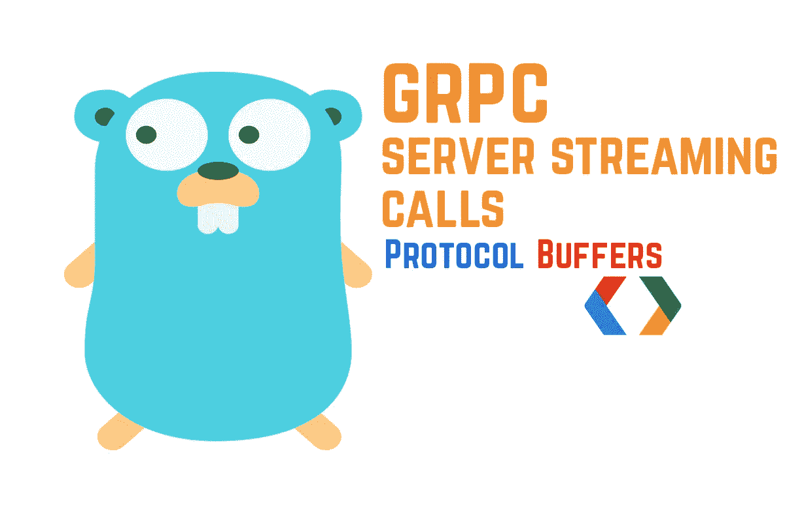
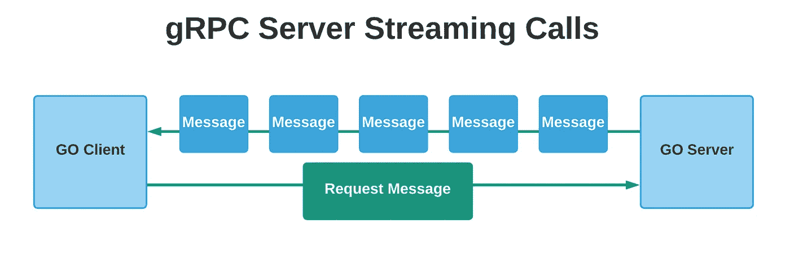
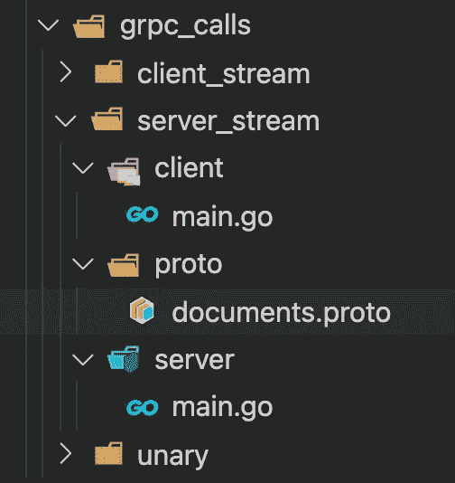
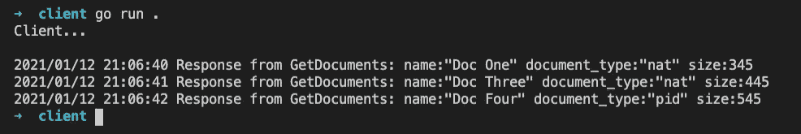

# gRPC:如何进行服务器流调用

> 原文：<https://levelup.gitconnected.com/grpc-how-to-make-server-streaming-calls-763b42895481>



在本文中，我将介绍使用服务器流响应的 gRPC 调用——实现客户机和服务器 Go 应用程序。

这是本系列的第三篇文章:

1.  [如何进行有效的一元调用](/grpc-how-to-make-effective-unary-calls-4c9fa68cd9d5)
2.  [如何进行客户端流媒体通话](/grpc-how-to-make-client-streaming-calls-5c731197585)
3.  如何进行服务器流调用
4.  [如何进行双向流媒体通话](/grpc-how-to-make-bi-directional-streaming-calls-70b4a0569b5b)

在服务器流 rpc 调用中，客户端发送一个请求，服务器用一个消息流进行响应。当服务器需要进行批量操作时，这很有用，服务器可以使用流一个接一个地发送对象，而不是等到服务器处理完数据。



服务器流响应

## 项目描述

对于这个项目，我们将创建一个带有一个 gRPC 端点的 Documents 服务，它将允许客户机发送一个获取文档的请求。

端点不需要任何请求消息，所以我们将发送一个空散列。

然后，服务器将处理一些文档，并开始向客户机发送流响应。

客户端也可以在任何时候停止接受来自服务器的消息，要么是因为它已经得到了它想要的，要么是因为服务器发送消息的时间太长。

让我们在 grpc_calls 中创建另一个文件夹，并将其命名为 server_stream。

在这个文件夹中创建以下结构。



gRPC 服务器流文件夹结构

documents.proto 文件的定义如下:

在这个原型文件中，我为这个请求定义了服务文档、端点和相应的消息。

对于这个端点，客户端不需要在请求消息中发送任何数据，所以我们将其声明为空请求。

对于响应，服务器将发送 Document 类型的消息。

## 原型文件定义:

1.  **GetDocuments:** 这是 rpc 端点定义，它接受请求中的空消息，并返回一个 GetDocumentsRes 流。
2.  **EmptyReq:** 这是请求消息。
3.  **GetdocumentsRes:** 这是响应消息，它有一个名为 Document 的字段，类型为 Document。
4.  **文档:**该消息代表一个文档对象，具有名称、文档类型和大小字段。

现在让我们为这个原型文件生成 go 代码。

在 proto 文件夹中运行以下命令:

```
protoc --go_out=. --go_opt=paths=source_relative --go-grpc_out=. --go-grpc_opt=paths=source_relative documents.proto
```

现在我们可以继续并实现服务器了。这是 server go 应用程序的代码。

同样，对于这个文件，我们首先创建一个新的 grpc 服务器，它将监听端口 3000，然后我们注册 documents 服务并开始监听连接。

现在，如你所见，我正在导入 proto_server_stream 包。因为有本地进口的 Go 会投诉。

**要解决这个问题，您可以执行以下操作:**

1.  将 proto 文件夹的内容推送到 Github，然后从那里导入。
2.  将 proto 文件夹的内容放在**包/src** 文件夹中，作为 go 版本路径。在我的情况下，这是路径:

```
golang/1.15.5/packages/src
```

在这个文件夹中，我创建了一个 proto_server_stream 文件夹，并粘贴了包含生成代码的 proto 文件夹中的文件和 documents.proto 文件。

这样我就可以导入这个包，而不用把它推到 Github。采取你认为更方便的方法。

对于 **GetDocuments** 函数，我们首先初始化一些虚拟数据，然后遍历文档，执行一些验证，并使用流对象开始向客户端发送流响应。

我们还使用睡眠功能来模拟服务器中的一些延迟。

让我们实现客户端代码。

对于客户机代码，我们使用 documents 包提供的 **NewDocumentsClient** 方法在端口 3000 上创建一个新的客户机-服务器。

对于 **fetchDocuments** 函数，我们首先初始化请求消息，在本例中，是一个空消息。然后，它获取流对象，并开始从服务器接收流消息。

如前所述，客户端也可以决定何时停止接收来自服务器的消息，在这种情况下，客户端会一直等到服务器完成消息流传输。

这是客户机和服务器 go 应用程序的必要代码，如果你读了上一篇关于客户机流请求的文章，你会发现 proto 文件的定义差别很小。以及客户端和服务器的实现。

我们现在可以尝试一下。转到控制台，在服务器文件夹中，使用以下命令启动服务器。

```
go run .
```


服务器 Go 应用程序日志

然后使用相同的命令启动客户机，但是是在客户机文件夹下。



客户端 Go 应用程序日志

太棒了，我们已经实现了服务器流 rpc 响应。

希望你觉得有用。在本系列的下一篇文章中，我们将处理双向流。

感谢您花时间阅读该系列！