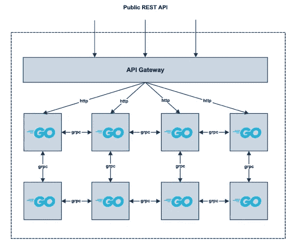

# 微服务中的 gRPC

> 原文：<https://levelup.gitconnected.com/grpc-in-microservices-5887caef195>

原发表[此处](https://milad.dev/posts/grpc-in-microservices)。

近一年来，我一直在使用 [gRPC](https://grpc.io/) 作为主要的服务对服务通信机制来开发微服务应用程序。因此，我决定写一篇博文，分享我在微服务世界中如何正确完成 gRPC 的经验！所以，让我们开始吧！

# TL；速度三角形定位法(dead reckoning)

*   干！为您的常用信息准备一个包。
*   为您的 gRPC 包选择唯一的名称。
*   为您的 gRPC 包选择单数名称。
*   用*前缀*或*后缀*来区分你的 gRPC 包名。
*   将健康检查探测器实现为 HTTP 端点。
*   使用服务网格对 gRPC 请求进行负载平衡。
*   将您的 gRPC 服务定义集中在一个存储库中。
*   自动更新您的 gRPC 工具和依赖项。
*   自动生成源代码和其他工件。

# 微服务

定义什么是*微服务*架构以及你是否需要采用它超出了这篇文章的范围。不幸的是，微服务这个术语已经成为这些天的热门词汇之一。微服务既不是微服务的数量，不同的编程语言，也不是你的 API 范式！本质上，微服务架构是正确的*软件即服务*！

正确使用微服务最重要的是**服务合同**的概念。*服务契约*是给定服务通过 API 范式(REST、RPC、GraphQL 等)公开的 API。).在微服务世界中，微服务通信和共享数据的唯一方式是通过它们的 API。微服务是其拥有的有限上下文或资源的唯一真实来源。一个服务不应该破坏它的 API(契约),因为其他服务依赖于它。对 API 当前主要版本的任何更改都应该是向后兼容的。突破性的改变应该被引入到服务的新的主要版本中(技术上是一个新的服务)。

微服务架构的一个重要含义是它所要求和引入的组织变革！就像微服务是小型的、独立的、自给自足的，就像它们可以使用不同的技术，遵循不同的开发工作流和发布周期。每个微服务可以归一个非常小的团队所有。不同的团队(微服务)可以采用稍微不同的实践(编码风格、依赖管理等)。)只要他们不违背对其他团队(其他微服务)的承诺(服务合同或 API)。

# gRPC

gRPC 是用于服务到服务通信的 RPC API 范例。您可以使用 gRPC 实现和公开您的服务 API(契约)。多亏了 [grpc-web](https://github.com/grpc/grpc-web) 项目，你现在也可以从你的 web 应用程序进行 grpc 调用了。gRPC 和 REST 之间的比较或者您是否需要将您的服务 API 实现为 gRPC 之类的主题再次超出了本文的范围。

gRPC 本身很大程度上基于[协议缓冲区](https://developers.google.com/protocol-buffers)。协议缓冲区是一个跨平台的语言无关的标准，用于序列化和反序列化结构化数据。因此，您将发送和接收高度优化和压缩的数据字节，而不是通过网络发送明文 JSON 或 XML 数据。协议缓冲区的第 1 版已经在 Google 内部使用了很多年。从版本 2 开始，协议缓冲区是公开可用的。协议缓冲区的最新和推荐版本是版本 3。

gRPC 使用协议缓冲区来定义服务合同。每个服务定义都指定了许多具有预期输入和输出消息的方法。使用主要编程语言可用的 gRPC 库，这些 gRPC 协议缓冲区可以作为服务器或客户机来实现。对于像 [Go](https://golang.org/) 这样的编译编程语言，需要提前使用协议缓冲编译器(Protocol)生成源代码。

# 体系结构

我一直从事的微服务架构由大约 40 个微服务组成，所有微服务都用 [Go](https://golang.org/) 编写，并用 [Docker](https://www.docker.com/) 封装。由于 Go 是编译型静态类型语言，所以所有的 gRPC/protobuf 定义都要编译，并且要提前生成源代码。API 网关接收 HTTP RESTful 请求，后端通信通过不同微服务之间的 gRPC 调用来完成。

# 挑战

# 健康检查

对于只讨论 gRPC 的服务，一个直接的问题是我们如何实现健康检查？或者，如果您使用 Kubernetes 作为您的容器平台，我们如何实现**活跃度**和**就绪度**探测？

为此，我们有两个选择:

*   将健康检查探测器定义和实现为 gRPC 调用。
*   在不同的端口上启动 HTTP 服务器，并将运行状况检查探测器作为 HTTP 端点来实现。

将健康检查实现为 HTTP 非常简单。所有外部系统都可以轻松地使用 HTTP 健康检查。但是，设置一个单独的 HTTP 服务器需要与 gRPC 服务器进行一些协调，以确保 gRPC 服务器能够成功地为请求提供服务。

将健康检查作为另一种 gRPC 方法来实现本身并不是一个挑战，而是获得外部系统(AWS 负载平衡器、Kubernetes 等)。)与它交谈是具有挑战性的部分。这种方法具有更好的语义，因为每个 gRPC 服务都带有健康检查，而健康检查本身就是一个 gRPC 请求。

这里有一些关于这个主题的有用资源:

*   [GRPC 健康检查协议](https://github.com/grpc/grpc/blob/master/doc/health-checking.md)
*   [Kubernetes 上的健康检查 gRPC 服务器](https://kubernetes.io/blog/2018/10/01/health-checking-grpc-servers-on-kubernetes)

# 负载平衡

这是另一个有趣的挑战！我们如何为服务进行负载平衡？要回答这个问题，我们需要记住 gRPC 是如何工作的。

gRPC 构建在 *HTTP/2* 之上，HTTP/2 使用长期的 TCP 连接。对于 gRPC 来说，这意味着 gRPC 客户机的一个实例将打开一个到 gRPC 服务器的一个实例的 TCP 连接，向同一个连接发送请求和从同一个连接接收响应，并保持连接打开，直到连接关闭。请求在同一连接上被多路复用。这是一个很大的性能改进，因为我们不需要为每个请求建立一个 tcp 连接。然而，这也意味着请求不能在传输层(L3/L4)中进行负载平衡。相反，我们需要在应用层(L7)对 gRPC 请求进行负载平衡。

为此，负载平衡器组件需要为每个实例打开一个长期连接，从正在传输的协议缓冲区数据中检索足够的信息，然后它可以对 gRPC 请求进行负载平衡。

不用说，您不应该为 gRPC 请求实现专门的负载平衡器。您应该使用一个适用于受支持的编程语言和平台的解决方案，并解决其他需求，比如可观察性。

一些值得一读的资源:

*   [gRPC 负载均衡](https://grpc.io/blog/loadbalancing)
*   [Kubernetes 上的 gRPC 负载均衡无泪](https://kubernetes.io/blog/2018/11/07/grpc-load-balancing-on-kubernetes-without-tears)

# 依赖性管理

依赖性管理是维护微服务的另一个重要主题。gRPC 社区在维护不同版本协议缓冲编译器(Protocol)之间的向后兼容性方面做了大量工作。这是 gRPC 成为成功的 RPC 协议的关键因素之一。用于生成 Go 源代码的插件也很好地维护了不同版本的`protoc`和`go`之间的向后兼容性。

然而，我们不时会看到一些突破性的变化被引入(当然是有原因的)。我能想到的一个例子是在 Go 中为生成的结构引入`XXX_`字段( [#276](https://github.com/golang/protobuf/issues/276) ， [#607](https://github.com/golang/protobuf/issues/607) )。

因此，如果您不定期更新您的 gRPC 工具链，在未来更新它们以获得新的特性和性能改进将会变得更加困难。在最坏的情况下，您可能会坚持使用特定的旧版本的 gRPC 编译器和插件。

# 集中还是分散协议缓冲区管理？

这是另一个有趣的话题，因为它可能看起来不是一个重要的决定。在管理 gRPC 协议缓冲区和生成的文件时，您有两种选择:

*   将协议缓冲区和生成的文件保存在与所有者微服务相同的存储库中(分散)
*   将所有协议缓冲区和生成的文件集中在一个 mono repo 中。

如果您考虑基于 HTTP 的 API，比如 REST，那么您可以为每个 repo 定义 HTTP 端点。基本上，每个 repo 拥有关于其 HTTP APIs 的所有定义。这绝对是最佳实践(自给自足的回购)，符合微服务理念(自给自足)。

同样，gRPC 服务定义存在于自己的回购协议中也是有意义的。为给定 gRPC 服务实现 gRPC 服务器的 repo 拥有 gRPC 服务定义以及相应的生成源代码(如果需要)。想要使用给定 grpc 服务的其他回购，从所有者(服务器)回购导入 gRPC 包。

到目前为止一切顺利，对吧？但是，有一个重要的区别，特别是对于编译编程语言。HTTP 协议已经非常成熟，很难想象 HTTP 会突然发生变化。为了让 gRPC 和协议缓冲区工作，需要一个用于*编组*和*解组*的中间件层。此外，编译的编程语言需要使用协议缓冲编译器和语言特定的插件来生成源代码。

为此，我们需要确保 gRPC 源代码在管道中生成，作为使用相同版本的协议、协议插件和其他工具构建的工件。如果您有一个中央管道，那么您只需要在一个地方实现该功能，并且更新该功能只需要在一个地方进行更改。如果您对每个微服务都有一个 repo，并且您的管道是每个 repo 中的一个`yaml`文件，那么您需要实现一个模块化管道，在其中导入从单一真实来源生成 gRPC 源代码的功能。

如果构建模块化管道不是一项简单的任务，您可以将所有 gRPC 服务及其生成的代码集中在一个 mono repo 中。在这个 repo 的管道或构建作业中，您可以使用生成 gRPC 源代码和其他文件所需的所有工具的相同版本。至少，您可以在构建工作中重新生成 gRPC 源代码和其他文件，并确保这些文件和开发人员签入的文件没有区别。

# 吸取的教训

# 1.干燥的

不要重复自己！如果您有一个公共消息，表明您需要在多个服务定义中使用它，那么您可以在一个单独的包中定义它，并在您的服务定义中导入它。

例如，如果将健康检查作为 gRPC 请求来实现，则可以在一个公共包中为健康检查方法定义请求和响应消息。

# 2.使用唯一且一致的包名

包的名称是 gRPC 服务定义的一部分。这意味着更改包的名称会破坏 gRPC 服务定义。

根据目标编程语言的不同，为 gRPC 服务定义选择包名可能会有所不同。您需要确保您的包名遵循您的编程语言的约定，并且与您的其他 gRPC 包名一致。

*   为 gRPC 包选择唯一的名称
*   为您的 gRPC 包选择单数名称
*   用*前缀*或*后缀*来区分你的 gRPC 包名(例如，在 Go 中，你可以使用`PB`后缀)

# 3.将健康检查探测器实现为 HTTP

HTTP 健康检查(包括 Kubernetes *活跃度*和*就绪度*探测)可以被所有外部系统轻松使用。因此，通过这种方式，您不需要让 gRPC 客户机来检查您的服务健康状况，并且您的服务实现更加面向未来(您仍然可以在 gRPC 服务上拥有一个健康检查方法，并且您的 http 健康检查处理程序会调用它)。

# 4.使用服务网格进行负载平衡

对于负载平衡 gRPC 请求，使用一个*服务网格*。所有主要的服务网格(Linkerd、Istio 和 Consul)都支持 gRPC 的 L7 负载平衡。服务网格还为您的 gRPC 调用提供了可观察性功能，例如度量和跟踪。

# 5.集中 gRPC 协议缓冲区

根据我们的经验，将所有 gRPC 服务定义集中在一个 repo 中比在每个 repo 中保留服务定义效果更好。您可以使用相同版本(最好总是最新版本)的协议、协议插件和其他工具来为您的所有服务定义生成源代码。您还可以确保所有 gRPC 服务定义在命名、格式、文档和其他约定方面保持一致。

值得一提的是，所有这些品质也可以通过采用足够的自动化和工具来实现。

理想情况下，您的 gRPC 服务定义中不应该有任何重大更改。但是，如果出于某种原因您需要这样做，将您的服务定义集中在一个 repo 中允许您将所有的服务定义一起进行语义版本化。因此，您不需要知道给定包的哪个版本与另一个包的哪个版本一起工作。

# 6.gRPC 的自动化代码生成

不要相信您的开发人员会为您的 gRPC 服务定义生成源代码！您不希望每个开发人员每次进行更改时都使用本地安装的 gRPC 工具生成源代码。记住！一切可以自动化的东西，都必须自动化。

在您的管道中，您应该 *lint* 您的服务定义，并为您的服务定义生成源代码和其他工件，作为您构建过程的一部分。

# 7.自动化您的依赖性管理

自动化依赖关系管理是一种最佳实践，并不特定于 gRPC。根据目标编程语言的不同，gRPC 需要其他库才能工作。确保自动更新生成源代码和运行时的工具和依赖项。

 [## 学习围棋-最佳围棋教程(2019) | gitconnected

### 22 大围棋教程-免费学习围棋。课程由开发者提交和投票，使您能够找到…

gitconnected.com](https://gitconnected.com/learn/golang)