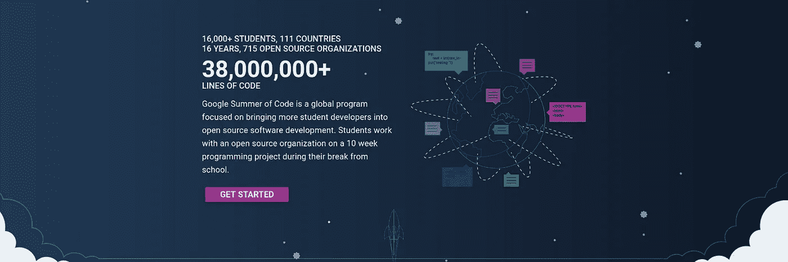
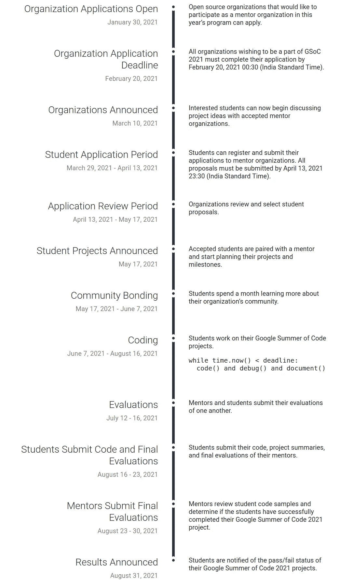
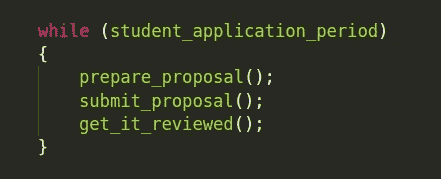

# 简而言之 GSoC

> 原文：<https://levelup.gitconnected.com/gsoc-in-a-nutshell-acc152432571>

对于那些不知道 *GSoC* 是什么 的人来说，GSoC 代表谷歌代码之夏。这基本上是一个开源组织和大学生(是的！你猜对了，就跟你一样)一起来编码开发项目。

**你是业余的？那么你应该继续读下去还是更好地利用这段时间来玩一场 Valorant 的比赛呢？好吧，如果你准备好体验新的东西，如果你准备好努力工作(是的，没有别的！是的，真的没有别的了)那么你应该继续读下去。**

> “利用暑假写代码，学习开源开发，同时赚取津贴！被录取的学生和导师一起工作，成为开源社区的一员。许多人成为终身开源开发者！”

# 为什么要参加？

首先，确保你不会因为认为不阅读“ ***你能“破解”GSoC*** ”部分就无法完成这件事而离开。

*   与团队合作的经验
*   开发一个将被全球人民实际使用的项目
*   在一个大的代码库上工作(如果你是新手，这真的非常大——但是不要害怕，这是整个过程的一部分😉)
*   丰厚的津贴
*   是的，我们怎么能忘记最重要的额外福利——免费赠品(是的，这包括一件 t 恤)

除此之外，你会学到很多东西。

# 流程是怎样的？

谷歌代码之夏**不是竞赛**。不是实习。不，你不会为谷歌工作(叹气)。

开源组织申请参加 GSoC。一旦列表出来，学生可以开始查看组织和他们提出的想法。这些想法是学生们将独立完成的项目。一旦学生确定了一个组织，他们就可以开始与社区交流，通常是在 IRC(互联网中继聊天)上。学生可以与潜在的导师讨论项目想法，阅读指南并解决 bug，同时熟悉工作流(git workflow)和代码库。

*迷茫？*

组织通常会得到固定数量的职位(他们将指导的项目数量)。他们准备了一份理想主义者清单(一份他们想在今年夏天着手的潜在项目清单)。学生既可以从理想主义者那里选择一个项目，也可以提出自己的想法。一旦学生完成一个项目和一个组织，他们就可以开始写和提交他们的建议(学生申请期)。每个学生最多可以提交三个提案(针对三个不同的项目)，但只有一个会被选中。

> 请记住，没有必要选择所有提议的项目。每个组织都被分配了一定数量的位置(每个组织不同)。

一旦学生项目被宣布，学生们将与他们的导师一起工作大约两到三个月(1 个月作为社区结合期，2 个月用于编码和记录)。

南京青奥会时间表([https://summerofcode.withgoogle.com/how-it-works/#timeline](https://summerofcode.withgoogle.com/how-it-works/#timeline))

# 你能“破解”GSoC 吗？

> 长话短说，如果你准备努力工作，那么是的，你可以。

GSoC 的目的是向大学生介绍开源世界。如果你只是在这里给你的简历贴上标签，那么你很可能不会被选中。所以“破解”这个词并不恰当。

现在，要被选中，你需要注意一些事情。

*   你必须记住的第一件事是，你不需要 100%了解你将要从事的项目。你是来学习的。**即使你只理解了项目的 50%,也要努力去做。**你将会学到项目不同阶段所需的知识。这完全没问题，导师并不指望我们什么都知道。
*   交流。如果你只是在导师们都不认识你的情况下直接提交你的提案，很有可能你就不会被选中。所以和社区沟通很重要。(很明显不是吗？为什么导师会信任一个他们不认识的人去做一个他们要花三个月时间的项目
*   早点开始。你开始得越早，被选中的机会就越大。这不仅有助于社区了解你，也让你有机会了解工作流程和代码库。尽早开始并做出贡献(解决问题解决问题)。你解决的错误越多，你就越能理解这个过程。它们不一定是大规模的代码更改。

> 我解决的第一个 bug(在提交提案之前)是一个简单的 2 行修改。我花了大约 2 周的时间来解决并合并它(在导师们的大量帮助下)。

*   不管你选择哪个组织，你都会用到的一个东西就是 [git](https://git-scm.com/) 。所以你对 git 越熟悉，(对你来说)就越容易。还有*，我个人*认为熟悉 Linux 是加分项。大多数组织(**不是所有的**)使用 Linux 进行开发，如果你已经熟悉它，它会节省你很多精力。LINUX 是❤(为什么不呢！).
*   除了技术技能，你的软技能也同样重要。几个月来，你将不得不与来自不同时区的人交流和合作。甚至，在被选中之前，导师了解你和你的敬业程度也很重要。
*   提案是被选中的最重要的部分。提案必须*尽可能详细*。它通常包括你未来三个月每周的工作分配。你会找到各种各样的资源来写一份好的提案。但是最后，你必须用你自己的方式来写你的提议，而且要独一无二。确保尽早提交提案，这样你就可以得到导师的审核，并做出必要的修改。

你还在等什么？前往[谷歌代码之夏](https://summerofcode.withgoogle.com/)，开始探索。

> 不，做 GSoC 没有必要，也绝对不是唯一要做的事情。有数百万伟大的开发人员从未做过 GSoC，也有许多人做过。所以做出你的选择，继续努力👍
> 
> 愿源头与你同在！

# 常见问题解答

1.  我会在谷歌工作吗？不，谷歌只是主持这个项目并提供津贴。你不会在谷歌工作/实习。
2.  ***GSoC 是实习吗？*** 不，不是。
3.  ***如果是一年级的话可以申请吗？*** 可以，可以。我的建议是——在第一/第二年申请，这样你就可以尽早了解真实世界的项目是如何运作的，并为以后的实习和实习做准备。
4.  我需要了解项目的一切吗？ 没有。你会边工作边学习。你不需要事先知道所有的事情。
5.  如果我不确定在那两三个月里我要做什么，我怎么能写出一个详细的时间表呢？ 对于这一点，你需要稍微下点功夫。你不会确切地知道你将要做什么，但是你必须对项目和你将要遵循的方法有一个很好的理解。与你的导师讨论将在这方面帮助你(但他们不会填鸭式地喂你)。当你进行项目时，只要你的导师允许，可以对提案做一些小的修改。
6.  ***可以在 GSoC 旁边实习吗？是的，有学生在 GSoC 项目中实习。此外，今年的工作时间也减少了。***
7.  ***我不是计算机专业的。我还能申请吗？*** 是的。有很多非计算机专业的学生是计算机专业的学生。
8.  ***我的简历不好。我还有机会吗？*** 我申请的时候，没有简历。你的导师可能不会问你要。不管你是来自一级学院还是三级学院(只要你向他们展示你能努力工作)
9.  ***我试着理解代码库。我不能理解它。/代码库远远超出了我的能力范围。*** 完全没问题。几乎每个人都会这样。随着时间的推移你会明白的。所以继续工作吧。并且您不需要理解整个代码库。只是你要做的部分。
10.  ***我是不是应该直接加入 IRC，问他们我该怎么办？不，记住，导师不会填鸭式地教你。这里有一些链接可以回答你的问题- [最佳实践-沟通，](https://google.github.io/gsocguides/student/communication-best-practices.html) [如何以巧妙的方式提问？](http://catb.org/~esr/faqs/smart-questions.html)***

我不是一个好作家。这基本上是我写的第一件事。所以如果我犯了什么错误或者让它变得无聊，请原谅我。如果你想谈论一些有趣的事情或关于地缘政治的话题，可以上 ping me- [Linkedin](https://www.linkedin.com/in/parth-kapadia14/)